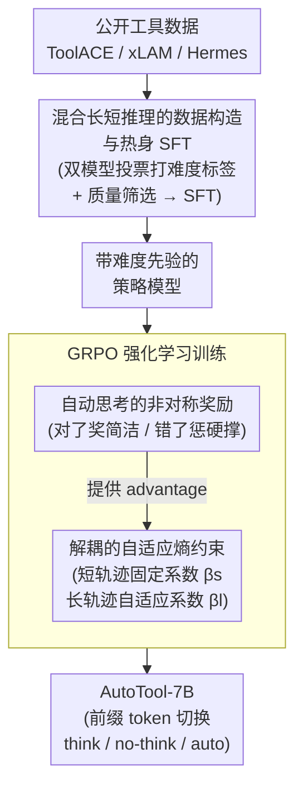

# AutoTool: Automatic Scaling of Tool-Use Capabilities in RL via Decoupled Entropy Constraints

**会议**: ICLR 2026  
**arXiv**: [2603.13348](https://arxiv.org/abs/2603.13348)  
**代码**: 无  
**领域**: 强化学习  
**关键词**: 工具使用, 强化学习, 测试时缩放, entropy constraint, GRPO, agentic LLM

## 一句话总结

提出解耦自适应熵约束 (Decoupled Adaptive Entropy Constraints) 的强化学习策略，使 LLM 在工具调用任务中根据问题难度自动切换长/短推理模式，在提升 9.8% 准确率的同时减少约 81% 的推理 token 开销。

## 研究动机

将大语言模型与外部工具集成是迈向 AGI 的关键路径。当前通过强化学习 (RL) 实现测试时缩放 (Test-time Scaling, TTS) 在数学推理中已取得显著成功——RL 训练能让模型的响应长度随准确率同步增长。然而，作者发现在工具调用任务中存在两个核心挑战：

1. **推理模式坍塌 (Reasoning Collapse)**：直接用 GRPO 等 RL 算法训练工具调用模型时，模型的响应长度不升反降——随着训练步数增加，准确率提升但响应长度急剧缩短。模型"懒"于展开长链推理，导致在复杂多轮工具调用场景中性能下降。
2. **过度思考 (Overthinking)**：通过蒸馏获得的长推理模型会对所有问题生成冗长推理轨迹，即使简单问题也如此，造成约 10 倍的 token 开销浪费。

作者进一步分析发现，推理坍塌与信息熵高度正相关——训练中策略模型的熵迅速下降，模型失去探索能力，默认使用短推理。而直接加 length penalty 无法缓解低熵问题，静态熵约束又对系数 $\beta$ 高度敏感。

## 方法详解

### 整体框架

AutoTool 把"按难度自适应推理"拆成两段来训：先用混合了长/短推理标签的数据做一轮热身 SFT（warm-up SFT），让模型初步感知哪些问题该多想、哪些该直接答；再在 GRPO 上施加一套解耦的自适应熵约束，并配一张非对称奖励表，把"简单题走短推理、难题走长推理"的策略真正稳定下来。整套设计的支点是一个观察：推理坍塌的根因不是数据分布而是训练中信息熵的塌缩，因此控制熵就成了核心抓手。推理时只需在输入前缀放一个控制 token，就能在 think / no-think / auto 之间切换模式。

### 关键设计

**1. 混合长短推理的数据构造与热身 SFT：让模型先学会"分辨难度"**

若直接拿统一标签训练，模型要么对所有题都长篇大论，要么集体退化成短答。作者先用公开的 ToolACE、xLAM、Hermes Function-Calling 整合出 PubTool 数据集，下采样并质量筛选后得到 SFT 8.2k 条、RL 7k 条。难度标签的关键在于双模型投票：对每条数据分别用 no-thinking 模型（Qwen2.5-7B-Instruct）和 thinking 模型（Qwen3-32B）做 pass@8 推理——只要 no-thinking 模型答得对，就用真值短推理当标签，说明这题不必多想；否则改用 thinking 模型的长推理标签。RL 数据还会移除一半过简/过难样本来平衡分布，并按多轮 GRPO 训练中的 reward 方差（方差越低越对齐）从 21k 筛到 7k 条与模型学习轨迹对齐的高质量样本。这样热身 SFT 之后，模型已经带着"这题需要展开 / 这题可以速答"的先验进入 RL 阶段。

**2. 解耦的自适应熵约束：把长短推理的熵分开管，避免目标互相打架**

直接加 length penalty 压不住低熵，单一静态熵约束又对系数 $\beta$ 极度敏感——长推理需要探索（高熵），短推理需要收敛（低熵），用同一个 $\beta$ 必然顾此失彼。AutoTool 在 GRPO 策略损失里按轨迹类型拆出两套熵正则系数：

$$\beta_i = \beta_s \cdot m_i \cdot \mathbb{I}\{H_i \leq H_s\} + \beta_l \cdot (1-m_i) \cdot \mathbb{I}\{H_i \leq H_l\}$$

其中 $m_i \in \{0,1\}$ 标识第 $i$ 条轨迹是短推理（$m_i=1$）还是长推理（$m_i=0$），$H_s$、$H_l$ 分别是短/长推理的目标熵，且熵正则只在 $H_i$ 低于对应目标时才激活（守住熵的下界）。短推理用固定的 $\beta_s$，防止过度探索、保持响应简洁；长推理用可学习的 $\beta_l$，并通过一条单独的损失动态调节：

$$\mathcal{L}_{\beta}^l = \frac{1}{\sum_j(1-m_j)} \sum_{i=1}^{N} (1-m_i) \cdot \beta_l \cdot (H_i - H_l)$$

当长推理轨迹的熵 $H_i$ 低于目标 $H_l$ 时 $\beta_l$ 自动增大、鼓励更多探索，反之 $H_i$ 偏高时 $\beta_l$ 减小、抑制过度随机。这样既守住了短推理的简洁，又让长推理始终保有足够的探索余量，从根上缓解推理坍塌，同时免去了手动调 $\beta$ 的麻烦。

**3. 自动思考的非对称奖励：用奖励差把"按难度选模式"的倾向刻进策略**

光控制熵还不够，还得让模型在"想多 vs 想少"之间有明确的收益导向，这套奖励算出的 advantage 正是上面策略损失里 $\hat{A}_i$ 的来源。作者设计了一张非对称的答案奖励表（先过一道格式奖励校验 think / no-think 模板是否合法，再按是否答对结算）：

| 情形 | 奖励 |
|------|------|
| 正确 + no-think | +1.0 |
| 正确 + think | +0.5 |
| 错误 + think | -0.5 |
| 错误 + no-think | -1.0 |

同样答对，短推理（+1.0）比长推理（+0.5）拿得更多，于是简单题会被推向速答省 token；同样答错，长推理（-0.5）的惩罚比短推理（-1.0）轻，于是难题答不出时模型更愿意切到长推理去碰运气。这种"对了奖简洁、错了惩硬撑"的非对称结构，让效率与准确之间的权衡自然落到合理位置。

## 实验结果

### 基准与设置

- 基座模型：Qwen2.5-7B-Instruct
- 评测基准：BFCL（Non-Live / Live / Multi-Turn）、API-Bank（L-1 / L-2）、ACEBench

### 主要结果（BFCL）

| 模型 | Non-Live | Live | Multi-Turn | Overall |
|------|----------|------|------------|---------|
| Qwen2.5-7B-Instruct | 86.46 | 67.44 | 7.62 | 53.69 |
| PubTool-SFT | 88.98 | 77.28 | 9.68 | 58.17 |
| PubTool-Distilled | 87.73 | 78.64 | 15.65 | 60.30 |
| Qwen3-8B | 88.81 | 78.54 | 33.00 | 66.34 |
| **AutoTool-7B (auto)** | **89.76** | **80.22** | **38.18** | **70.12** |

- 相比 PubTool-SFT 提升 +11.95%，相比 Base 提升 +16.43%
- Multi-Turn 复杂场景提升最为显著（+28.5% vs SFT）
- 性能与 GPT-4o（70.42）、o3（70.32）等前沿模型相当

### 推理效率分析

- AutoTool 平均仅需约 183 tokens，蒸馏模型约 966 tokens，**token 成本降低 81%**
- Multi-Turn 场景 thinking rate 45%，Non-Live 简单场景 thinking rate 0%——模型真正学会按难度自适应
- 强制 no-think 模式下 ACU（Accuracy per Computation Unit）达到最优 0.97

### 消融实验

| 变体 | Overall 变化 |
|------|-------------|
| 完整模型 | 70.12 |
| w/o data refine | -6.43 |
| w/o decouple | -5.89 |
| w/o adapt coeff | -2.34 |

数据质量筛选影响最大，解耦设计次之，自适应系数对 Multi-Turn 稳定性贡献显著（移除后 Multi-Turn 下降 10.53%）。

## 优点

1. **问题分析深入**：系统性地分析了推理坍塌现象与熵的关系，揭示了数据分布并非根因，信息熵才是关键
2. **方法设计合理**：解耦长短推理的熵约束避免目标干扰，自适应系数免去敏感的手动调参
3. **实用价值高**：7B 模型达到 GPT-4o 级别工具调用性能，同时大幅降低推理成本
4. **可控推理模式**：推理时可通过前缀灵活切换 think / no-think / auto 模式
5. **奖励设计精巧**：非对称奖励自然引导模型对简单问题用短推理、复杂问题用长推理

## 局限性

1. 仅在 7B 规模验证，更大模型上推理坍塌现象是否同样存在、方法是否仍然有效未探讨
2. PubTool 数据集规模有限（7k RL 数据），更大规模训练的 scalability 未验证
3. 热身 SFT 依赖 Qwen3-32B 的蒸馏数据，需要强大的 teacher 模型
4. 长短推理的划分依赖是否包含 think 标记，对更细粒度的推理深度控制有限
5. 评测主要面向函数调用类工具，对代码执行、网页浏览等更广泛工具场景的泛化能力未测试

<!-- RELATED:START -->

## 相关论文

- [\[ICLR 2026\] Entropy-Preserving Reinforcement Learning (REPO / ADAPO)](entropy-preserving_reinforcement_learning.md)
- [\[ICLR 2026\] AutoQD: Automatic Discovery of Diverse Behaviors with Quality-Diversity Optimization](autoqd_automatic_discovery_of_diverse_behaviors_with_quality-diversity_optimizat.md)
- [\[CVPR 2026\] Reading or Reasoning? Format Decoupled Reinforcement Learning for Document OCR](../../CVPR2026/reinforcement_learning/reading_or_reasoning_format_decoupled_reinforcement_learning_for_document_ocr.md)
- [\[ICLR 2026\] Exploration vs Exploitation: Rethinking RLVR through Clipping, Entropy, and Spurious Reward](exploration_vs_exploitation_rethinking_rlvr_through_clipping_entropy_and_spuriou.md)
- [\[ACL 2026\] Deliberative Searcher: Improving LLM Reliability via Reinforcement Learning with Constraints](../../ACL2026/reinforcement_learning/deliberative_searcher_improving_llm_reliability_via_reinforcement_learning_with_.md)

<!-- RELATED:END -->
