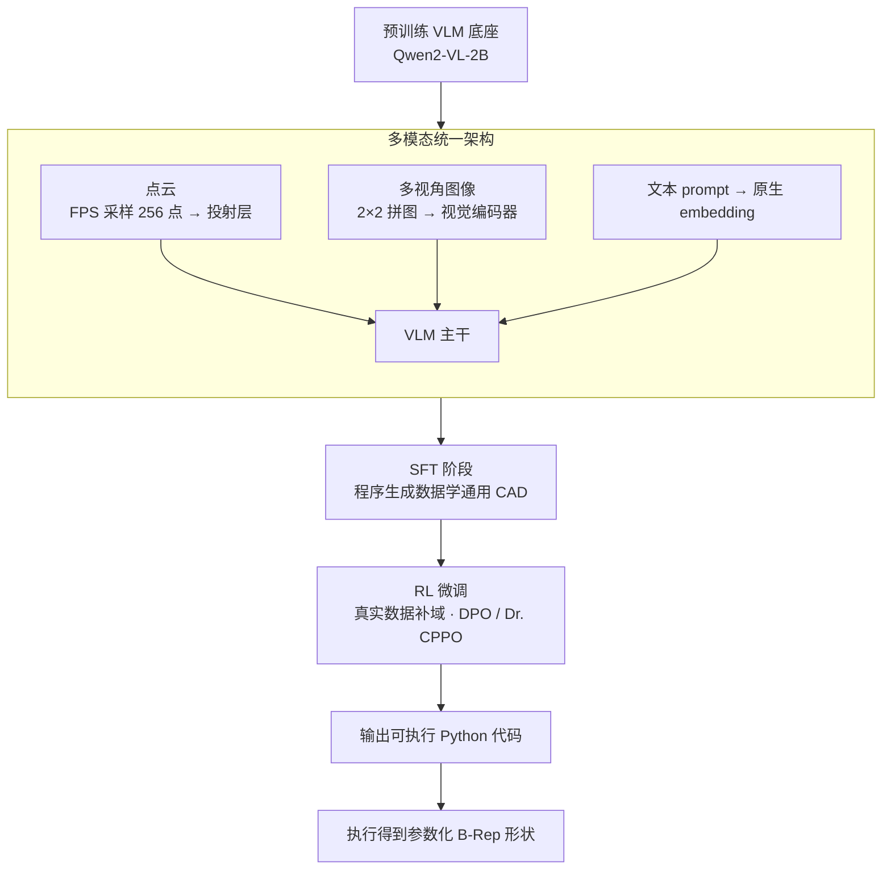

# cadrille: Multi-modal CAD Reconstruction with Reinforcement Learning

**会议**: ICLR 2026 Oral  
**arXiv**: [2505.22914](https://arxiv.org/abs/2505.22914)  
**代码**: [https://github.com/col14m/cadrille](https://github.com/col14m/cadrille)  
**领域**: 其他  
**关键词**: CAD重建, 多模态, 强化学习, VLM, 代码生成

## 一句话总结
cadrille 是首个同时处理点云、多视角图像和文本输入的多模态 CAD 重建模型，通过 VLM 基础架构 + SFT + RL 微调的三阶段训练范式，在 10 个 CAD 重建基准上达到 SOTA，尤其是 RL 微调将无效率降至接近 0%。

## 研究背景与动机

**领域现状**：CAD 模型在工程制造中至关重要，现有 CAD 重建方法主要从点云、图像或文本单一模态输入恢复 CAD 模型。最新方法 CAD-Recode 将 CAD 模型表示为可执行 Python 代码，取代了传统的特殊 token 表示。

**现有痛点**：
   - 单模态方法局限性大——点云需要专业设备，图像和文本方法各有不足
   - 现有多模态方法（CAD-GPT、CAD-MLLM）质量远落后于单模态 SOTA
   - SFT 训练的模型在跨域场景（如真实世界扫描数据）泛化能力差，CC3D IoU 仅 60%，无效率近 10%

**核心矛盾**：手工标注 CAD 数据集小且多样性有限；程序生成数据量大但与真实数据有 domain gap；简单混合两种数据进行 SFT 反而会降低性能（因 CAD 操作不一致）

**本文目标**
   - 如何在统一框架中同时处理点云/图像/文本三种模态？
   - 如何在不需要大规模手工标注数据的前提下提升跨域泛化能力？
   - 如何将生成的 Python 代码无效率降到最低？

**切入角度**：借鉴 LLM 训练范式（预训练→SFT→RLHF），将 RL 微调引入 CAD 重建。RL 阶段不需要 CAD 序列标注，只需 3D mesh 即可计算奖励（IoU），因此可以利用更容易获取的非标注数据集。

**核心 idea**：用大规模程序生成数据做 SFT 学通用 CAD 能力，用稀缺的手工/真实数据做 RL 微调来弥补 domain gap，从而一个模型在三种模态下全面超越所有单模态 SOTA。

## 方法详解

### 整体框架
cadrille 要解决的是「一个模型吃三种输入、还要跨域不掉链子」的 CAD 重建问题。它把点云、多视角图像、文本任意一种输入交给一个 VLM（Qwen2-VL-2B）编码，让模型直接吐出一段可执行的 Python 代码，代码跑起来就得到参数化的 B-Rep 三维形状——用代码而非特殊 token 表示 CAD，正是沿用 CAD-Recode 的思路。训练分三阶段：先直接拿预训练好的 VLM 当底座，再在大规模程序生成数据上做 SFT 学通用重建能力，最后在稀缺的手工/真实数据上做 RL 微调来弥合 domain gap。

### 关键设计

**1. 多模态统一架构：一个 VLM 同时吃点云、图像、文本**

三种模态各自需要专门网络一直是多模态 CAD 的负担，而 cadrille 直接复用 VLM 的现成能力把它绕开。文本和图像走 Qwen2-VL-2B 原生的 embedding 与视觉编码器，点云则先用 furthest point sampling 采样到固定点数，再过一层 projection layer 投射进 VLM 的表示空间，三路最终汇成同一段 token 序列，输出统一是 Python 代码。之所以可行，是因为 VLM 本就懂文本和图像、也已具备 Python 代码生成能力，扩展到三模态只差点云这一个投射层——比为每个模态各设计一套专用架构省事得多，也让三模态天然共享同一套解码参数。

**2. 分阶段数据使用策略：SFT 学通用、RL 补真实域**

手工 CAD 数据集小而真实，程序生成数据大而多样，但两者的 CAD 操作并不一致（DeepCAD 有 symmetric extrusion、extruded cut，CAD-Recode 没有），直接把它们混在一起做 SFT 会互相干扰、反而掉点。cadrille 的做法是分工：SFT 只吃大规模程序生成数据（CAD-Recode ~100 万）专心学通用 CAD 重建，RL 微调再用小规模手工数据（DeepCAD + Fusion360）专门去适配真实域。这一拆分的关键前提是 RL 阶段算奖励只需要 3D mesh、不需要 CAD 序列标注，于是那些本来没法喂给 SFT 的数据集（如 Fusion360 的 train set）也能被利用起来，恰好把「合成数据丰富、真实标注稀缺」的矛盾化解掉。

**3. RL 微调方法：offline DPO 与 online Dr. CPPO 两条路**

RL 这一步针对的是 SFT 模型跨域泛化差、还会生成无效代码的问题，论文给出两种策略。DPO 是 offline 路线：对每个输入 $q$ 从 SFT 模型采样 $K=5$ 段 Python 代码，随机取两段按奖励高低组成偏好对 $(\tau_w, \tau_l)$，用标准 DPO loss 训练，并每 10 个 epoch 把参考模型替换成当前模型，让策略逐步偏离原始 SFT。但 DPO 的天花板被采样质量锁死——它再好也好不过那 $K$ 个候选里最强的那个。Dr. CPPO 则走 online 路线打破这个上界：它结合 Dr. GRPO（不需要参考模型）和 CPPO（只用信号最强的样本），对每个输入采样 $G$ 个序列，按 $A_g = r_g - \text{mean}(\{r_i\})$ 算 advantage，挑 $|A_g|$ 最大的 $N$ 个样本组批，再用 PPO 的 clipped objective 更新。因为能持续生成新样本，它不受固定候选集限制，实验里也确实比 DPO 全面更好。

### 损失函数 / 训练策略
- **SFT 阶段**：标准交叉熵 $\mathbb{E}_{(q,\tau)\sim\mathcal{D}}[\log \pi_\theta(\tau|q)]$
- **RL 奖励函数**：$R(\tau) = r_{\text{IoU}}(\tau) + r_{\text{invalid}}(\tau)$，其中 IoU 奖励乘以 10 倍放大，无效代码惩罚 -10
- **硬样本挖掘**：只使用 SFT 模型三次采样平均奖励 $< R_{th}=7.5$ 的样本进行 RL 训练，加速收敛
- **单模态 RL 提升多模态**：仅对图像模态做 RL 微调，点云和文本模态也同步提升（共享参数）

## 实验关键数据

### 主实验（DeepCAD 测试集，SFT 阶段）

| 方法 | 训练数据 | 点云 CD↓ | 点云 IoU↑ | 点云 IR↓ | 图像 CD↓ | 图像 IoU↑ | 图像 IR↓ |
|------|---------|---------|----------|---------|---------|----------|---------|
| CAD-SIGNet | Dp | 0.29 | 77.3 | 5.0 | - | - | - |
| CADCrafter | Di | - | - | - | 0.26 | - | 3.6 |
| CAD-Recode | Rp | 0.18 | 87.1 | 3.1 | - | - | - |
| **cadrille** | Dpit | 0.25 | 79.4 | **0.4** | 0.25 | 78.2 | **0.5** |
| **cadrille** | Rpi+Dt | **0.18** | **87.1** | 2.1 | **0.18** | **86.1** | 1.5 |

### RL 微调效果（跨数据集 - 图像模态）

| 配置 | DeepCAD IoU↑ | Fusion360 IoU↑ | CC3D IoU↑ | CC3D IR↓ |
|------|-------------|---------------|----------|---------|
| SFT only (Rpi) | 86.1 | 77.6 | 56.1 | 7.7% |
| SFT + 混合数据 (Rpi+Dpi) | 85.6 | 75.2 | 53.1 | 6.0% |
| + DPO | 86.9 | 78.5 | 56.0 | 3.9% |
| + **Dr. CPPO** | **92.2** | **84.6** | **65.0** | **0.1%** |

### 关键发现
- **RL 微调效果惊人**：Dr. CPPO 将 CC3D 上 IoU 从 56.1% 提升到 65.0%（+9%），IR 从 7.7% 降至 0.1%
- **单模态 RL 提升多模态**：只对图像做 RL 微调，点云重建也同步提升（CC3D point cloud IoU 从 61.8% 到 67.9%）
- **混合数据 SFT 反而降低性能**：简单混合 CAD-Recode 和 DeepCAD 做 SFT，在 Fusion360 和 CC3D 上反而比只用 CAD-Recode 差
- **Online RL >> Offline RL**：DPO 主要降低 IR 但不显著提升精度；Dr. CPPO 在所有指标上全面提升
- **硬样本挖掘有效**：只在 SFT 模型表现不好的样本上做 RL，加速收敛

## 亮点与洞察
- **SFT→RL 分治策略极其巧妙**：大规模合成数据做 SFT 学通用能力，少量真实数据做 RL 适配域差异。这避免了传统混合训练中的数据不一致问题，同时 RL 阶段不需要 CAD 序列标注（只需 mesh 计算 IoU），大幅降低数据要求。这个策略可以迁移到任何"合成数据丰富但真实数据稀缺"的场景。
- **单模态 RL 提升多模态**是一个非常有趣的发现——意味着 RL 改善的是模型内部"如何生成好的 CAD 代码"的能力，而不只是"如何从某种模态理解输入"。这暗示 RL 主要作用在解码端/生成端的能力提升。
- **可编程奖励的天然优势**：CAD 重建任务的奖励（IoU、代码有效性）可以精确自动计算，天然适合 RL 训练，这与 LLM 推理任务（如 DeepSeek-R1）中的可验证奖励异曲同工。

## 局限与展望
- 目前每次只接受单一模态输入，未探索同一 prompt 中混合多模态以互补（如图像+部分文本描述）
- RL 微调未直接在点云模态上做实验（目前仅用图像模态做 RL，点云的提升是间接的）
- 程序生成数据的复杂度有限，难以覆盖真实世界的所有 CAD 操作类型
- 基础模型仅 2B 参数，更大的 VLM 可能进一步提升效果
- 仅在 CAD 重建的封闭集合上评估，未探索开放世界的零样本泛化

## 相关工作与启发
- **vs CAD-Recode**: 同样用 Python 代码表示 CAD，但 CAD-Recode 是单模态（点云）+ SFT；cadrille 扩展到三模态并加入 RL 微调，IoU 提升 3-7%
- **vs CAD-MLLM**: 同为多模态 CAD 方法，但 CAD-MLLM 用特殊 token 表示 CAD 序列且效果远差于单模态 SOTA；cadrille 用 Python 代码 + RL 全面超越
- **vs CADCrafter**: 同为图像到 CAD，CADCrafter 用 DPO 但在同一数据集上做 SFT 和 RL；cadrille 分离 SFT 和 RL 数据源，效果更好

## 评分
- 新颖性: ⭐⭐⭐⭐ 多模态统一+RL微调的思路在CAD重建领域是首创，但核心技术（VLM+RL）并非全新
- 实验充分度: ⭐⭐⭐⭐⭐ 10个基准全面评测，包含真实数据CC3D，消融实验丰富
- 写作质量: ⭐⭐⭐⭐ 结构清晰，动机阐述有说服力，表格设计信息密度高
- 价值: ⭐⭐⭐⭐ 实用性强，代码开源，SFT→RL分治策略对其他任务有启示

<!-- RELATED:START -->

## 相关论文

- [\[CVPR 2026\] CME-CAD: Heterogeneous Collaborative Multi-Expert Reinforcement Learning for CAD Code Generation](../../CVPR2026/reinforcement_learning/cme-cad_heterogeneous_collaborative_multi-expert_reinforcement_learning_for_cad_code_gen.md)
- [\[ICLR 2026\] Controllable Exploration in Hybrid-Policy RLVR for Multi-Modal Reasoning](controllable_exploration_in_hybrid-policy_rlvr_for_multi-modal_reasoning.md)
- [\[ICLR 2026\] MergeMix: A Unified Augmentation Paradigm for Visual and Multi-Modal Understanding](mergemix_a_unified_augmentation_paradigm_for_visual_and_multi-modal_understandin.md)
- [\[ICLR 2026\] SPIRAL: Self-Play on Zero-Sum Games Incentivizes Reasoning via Multi-Agent Multi-Turn Reinforcement Learning](spiral_self-play_on_zero-sum_games_incentivizes_reasoning_via_multi-agent_multi-.md)
- [\[CVPR 2026\] BuildingGPT: Auto-Regressive Building Wireframe Reconstruction Model with Reinforcement Learning](../../CVPR2026/reinforcement_learning/buildinggpt_auto-regressive_building_wireframe_reconstruction_model_with_reinfor.md)

<!-- RELATED:END -->
