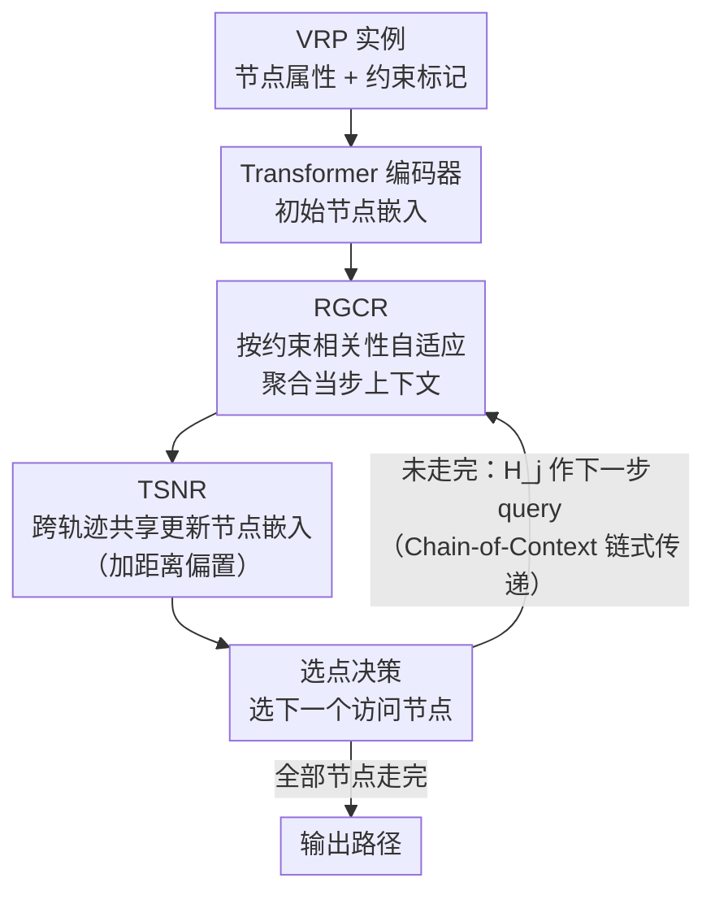

# Chain-of-Context Learning: Dynamic Constraint Understanding for Multi-Task VRPs

**会议**: ICLR2026  
**arXiv**: [2603.01667](https://arxiv.org/abs/2603.01667)  
**代码**: 待确认  
**领域**: 强化学习  
**关键词**: vehicle routing problem, multi-task learning, reinforcement-learning, constraint-aware decoding, neural combinatorial optimization

## 一句话总结
提出 Chain-of-Context Learning (CCL)，通过 Relevance-Guided Context Reformulation（RGCR，自适应聚合约束信息构建上下文）和 Trajectory-Shared Node Re-embedding（TSNR，跨轨迹共享节点更新避免冗余计算）实现逐步动态的约束感知解码，在 48 种 VRP 变体（16 分布内 + 32 分布外）上全面超越现有方法。

## 研究背景与动机

**领域现状**：车辆路径问题（VRP）是物流优化的核心任务。神经网络求解器用 RL + encoder-decoder 架构自回归生成路径，效率高但通常只针对单一 VRP 变体训练。多任务 VRP 需要统一框架处理多种约束组合（容量、回程、开放路线、时间窗、多仓库等）。

**现有痛点**：现有多任务 VRP 求解器（MTPOMO、MVMoE、CaDA 等）将约束和节点信息编码为**静态嵌入**——编码完成后在整个解码过程中不更新节点表示。但解码是sequential的，随着路线推进，不同约束的重要性在变化（如快回仓时距离限制更关键），静态嵌入无法反映这种动态。

**核心矛盾**：虽然上下文（context，如当前时间、剩余容量）每步更新，但节点嵌入不更新——导致**上下文-节点不对齐**，状态估计不准确，影响决策质量。这违反了 MDP 中"状态应包含足够信息做出最优决策"的 Markov 性质。

**本文目标** 在多任务 VRP 的解码过程中，让约束信息和节点表示都逐步动态更新，实现精确的状态表征。

**切入角度**：将约束信息显式融入每一步的上下文构建（RGCR），再用更新后的上下文反过来更新节点嵌入（TSNR），形成"上下文链"——每一步的节点嵌入携带了历史信息。

**核心 idea**：在 VRP 的 RL 解码中同步更新上下文和节点嵌入，让每步决策都基于当前最精确的状态而非过时的静态嵌入。

## 方法详解

### 整体框架
CCL 要解决的核心问题是：多任务 VRP 求解器在自回归解码时，上下文（剩余容量、当前时间）每步都在变，但节点嵌入却是编码完一次就固定，导致状态表征逐步失真。它的做法是把"动态"贯穿到底——仍是 encoder-decoder 范式，encoder 用 Transformer 把约束标记和节点属性编码成初始嵌入；解码每一步则做三件事：先由 RGCR 根据各约束与当前节点的相关性重新聚合出当步上下文，再由 TSNR 用这份上下文跨轨迹更新节点嵌入，最后用更新后的上下文与节点嵌入做选点决策。更新后的节点嵌入还会传给下一步，形成"上下文链"。训练时混合 16 种 VRP 任务（4 个约束的组合）联合训练，推理时零样本泛化到 32 种额外变体。

### 关键设计

**1. RGCR（Relevance-Guided Context Reformulation）：让每步的上下文按约束重要性自适应聚合**

针对的痛点是"上下文里所有约束一视同仁"——可车辆快满时容量约束最该被关注，接近关闭时间窗时 TW 约束才是瓶颈，固定权重的上下文抓不住这种切换。RGCR 分三步重组上下文：先把每类约束属性各自过一个线性层生成约束嵌入 $\mathbf{C}^k$（如 B 约束取剩余容量与需求，TW 约束取时间窗与当前时间）；再算每个约束嵌入与当前节点嵌入的点积相关性 $s^k = \mathbf{H}_{\tau} \cdot \mathbf{C}^k$；最后按相关性加权求和这些约束嵌入，并拼接上原始约束，得到当步统一上下文。相当于用"当前节点和谁更像"来自动决定该注意哪个约束，省去了人工设定约束优先级。

**2. TSNR（Trajectory-Shared Node Re-embedding）：用多轨迹上下文高效地更新共享节点嵌入**

要让节点嵌入"动起来"，最直接的办法是每条探索轨迹各自更新一份节点嵌入，但多轨迹并行时这会带来巨大的计算开销。TSNR 的折中是所有轨迹共享同一组节点嵌入：以节点嵌入作 query，把"节点嵌入 + 所有轨迹的上下文"拼起来作 key/value，过 multi-head attention 汇聚各轨迹的信息来更新节点表示。其中还加了距离偏置项 $\mathbf{B}_j$（节点间距离，以及各轨迹当前位置到节点的距离），用来防止模型过度依赖时间窗信号而过拟合。这样既保留了多轨迹的信息，又把更新成本从"逐轨迹"压回到"一组共享嵌入"。

**3. Chain-of-Context 链式传递：让节点嵌入跨步携带历史，捕捉序列依赖**

以往方法每一步都拿初始（step-0）嵌入再叠当前上下文做决策，丢掉了中间步骤累积下来的信息。CCL 让 TSNR 在第 $j$ 步输出的 $\mathbf{H}_j$ 直接作为第 $j+1$ 步的输入 query，于是每一步的节点嵌入都"记得"前面走过的决策上下文，整条解码路径串成一条上下文链。更新的频率由概率 $P_{tr}$（训练）与 $P_{ts}$（测试）控制，可在表征新鲜度和计算量之间取舍。

### 损失函数 / 训练策略
使用 REINFORCE 算法，多轨迹并行探索（不同起始点），奖励为负的路线总长度。训练时混合 16 种 VRP 变体（B/L/O/TW 四个约束的组合）联合训练，每种等概率采样；推理时直接零样本泛化到含 MB/MD 约束的 32 种新变体。

## 实验关键数据

### 主实验（16 种 In-distribution 任务，N=50）

| 方法 | CVRP Gap | OVRP Gap | VRPTW Gap | OVRPTW Gap | 平均 Gap |
|------|---------|---------|----------|-----------|---------|
| HGS-PyVRP | 0%* | 0%* | 0%* | 0%* | 基准 |
| MTPOMO | 1.42% | 3.19% | 2.42% | 1.56% | ~2.1% |
| CaDA | 1.29% | 2.59% | 1.75% | 1.12% | ~1.7% |
| CaDA† | 0.96% | 2.21% | 1.67% | 1.03% | ~1.5% |
| **CCL** | **0.98%** | **1.96%** | **0.98%** | **0.54%** | **~1.1%** |
| **CCL†** | **0.88%** | **1.57%** | **0.91%** | **0.51%** | **~1.0%** |

### 消融实验

| 配置 | 平均 Gap (N=50) | 说明 |
|------|---------------|------|
| CCL（完整） | 1.0% | 全部组件 |
| w/o RGCR | ~1.5% | 不做约束自适应聚合，性能下降 |
| w/o TSNR | ~1.4% | 不更新节点嵌入，退化到静态嵌入 |
| w/o 距离偏置 | ~1.2% | attention 中无距离偏置 |
| w/o 链式传递 | ~1.3% | 每步用初始嵌入而非上一步嵌入 |

### 关键发现
- **在全部 16 种分布内任务上 CCL 均为最佳**：尤其在含时间窗约束的任务上（VRPTW、OVRPTW）优势最大，说明动态上下文对时间敏感约束最有价值
- **在 32 种分布外任务的大多数上也领先**：零样本泛化到训练时未见的 MB/MD 约束组合，CCL 的动态约束感知机制有泛化能力
- **RGCR 和 TSNR 都有显著贡献**：去掉任一模块 gap 都增加 0.3-0.5%，说明上下文动态构建和节点动态更新缺一不可
- **计算开销合理**：CCL 推理时间约 5-7s（N=50），虽比 CaDA（1-3s）稍慢，但远快于 HGS-PyVRP（10分钟+），且质量差距（~1% gap）远小于其他神经方法

## 亮点与洞察
- **上下文-节点对齐的核心洞察**：将"静态节点嵌入+动态上下文"的不对齐问题明确为 MDP 状态表征的缺陷，这是对组合优化 RL 方法的一个通用改进——任何自回归解码+环境状态变化的场景都可能受益于这种动态更新
- **轨迹共享节点嵌入的效率设计**：在多轨迹并行探索中用共享嵌入+attention 聚合避免逐轨迹更新的 O(N) 开销，是实用的工程优化
- **距离偏置防过拟合**：发现不加距离偏置时模型会过度依赖时间窗信息，加入简单的欧氏距离偏置即可缓解——这个 trick 可能对其他带多约束的组合优化问题也有用

## 局限与展望
- **只测试了 VRP 家族**：虽然 VRP 有很多变体，但组合优化远不止 VRP。CCL 对 TSP、JSP、BPP 等其他问题的适用性未验证
- **训练约束数量有限**：仅用 4 种约束（B/L/O/TW）组合训练，零样本泛化到 2 种新约束。更大规模的约束空间（如动态需求、随机旅行时间）需要验证
- **与 LKH/HGS 仍有 ~1% gap**：虽然推理快 100×+，但绝对质量仍不如传统求解器。对精度要求极高的场景可能需要额外的搜索增强
- **TSNR 更新频率需要调优**：$P_{tr}$ 和 $P_{ts}$ 作为超参数，最优值可能因问题规模和约束类型而异

## 相关工作与启发
- **vs CaDA**：CaDA 也做多任务 VRP 但节点嵌入静态。CCL 通过动态更新节点一致性优于 CaDA，尤其在有时间窗的复杂约束上差距明显
- **vs MTPOMO**：MTPOMO 的多轨迹探索思路被 CCL 继承，但 CCL 增加了约束感知的上下文构建和跨轨迹共享的节点更新
- **vs 传统 Attention Model**：原始 AM (Kool et al., 2019) 用静态编码，CCL 的 TSNR 可以看作对 AM 解码器的增强——让节点嵌入不再是"一次编码终身使用"

## 评分
- 新颖性: ⭐⭐⭐⭐ 上下文-节点动态对齐是清晰且重要的贡献，RGCR+TSNR 设计合理
- 实验充分度: ⭐⭐⭐⭐⭐ 48 种 VRP 变体（16 in-dist + 32 OOD），多个规模，消融完整
- 写作质量: ⭐⭐⭐⭐ 问题定义清楚，三个挑战+三个解决方案的对应结构清晰
- 价值: ⭐⭐⭐⭐ 对组合优化 RL 的解码过程有通用启发

<!-- RELATED:START -->

## 相关论文

- [\[ICLR 2026\] MergeMix: A Unified Augmentation Paradigm for Visual and Multi-Modal Understanding](mergemix_a_unified_augmentation_paradigm_for_visual_and_multi-modal_understandin.md)
- [\[ICLR 2026\] Scalable In-Context Q-Learning](scalable_in-context_q-learning.md)
- [\[ICLR 2026\] LongRLVR: Long-Context Reinforcement Learning Requires Verifiable Context Rewards](longrlvr_long-context_reinforcement_learning_requires_verifiable_context_rewards.md)
- [\[CVPR 2026\] TaskForce: Cooperative Multi-agent Reinforcement Learning for Multi-task Optimization](../../CVPR2026/reinforcement_learning/taskforce_cooperative_multi-agent_reinforcement_learning_for_multi-task_optimiza.md)
- [\[AAAI 2026\] Where and What Matters: Sensitivity-Aware Task Vectors for Many-Shot Multimodal In-Context Learning](../../AAAI2026/reinforcement_learning/where_and_what_matters_sensitivity-aware_task_vectors_for_many-shot_multimodal_i.md)

<!-- RELATED:END -->
