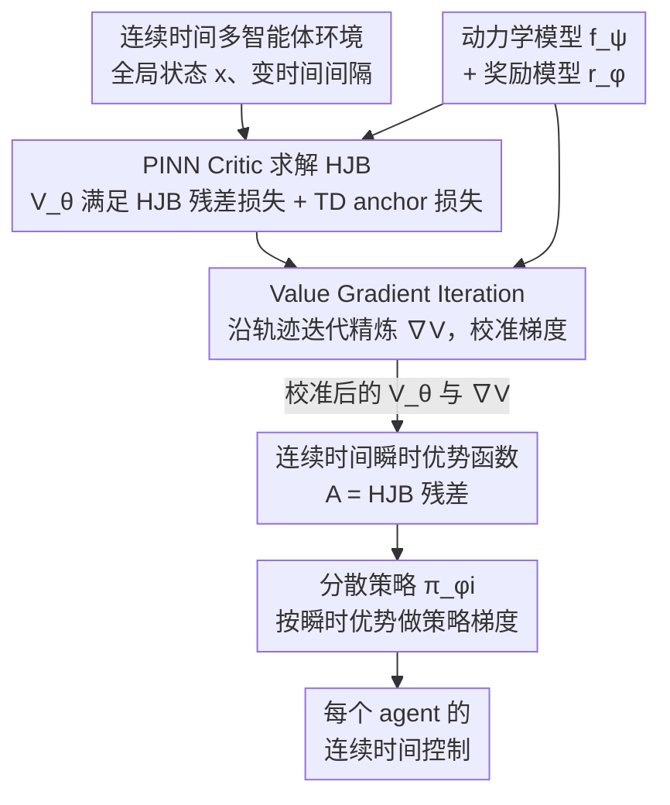

# Continuous-Time Value Iteration for Multi-Agent Reinforcement Learning

**会议**: ICLR 2026  \n  
**arXiv**: [2509.09135](https://arxiv.org/abs/2509.09135)  
**代码**: 有（GitHub 链接）  
**领域**: 强化学习  
**关键词**: continuous-time RL, MARL, HJB equation, PINN, value gradient iteration  

## 一句话总结
提出 VIP（Value Iteration via PINN）框架，首次将物理信息神经网络（PINN）用于求解连续时间多智能体强化学习中的 HJB 偏微分方程，并引入 Value Gradient Iteration（VGI）模块迭代精炼价值梯度，在连续时间 MPE 和 MuJoCo 多智能体任务上始终优于离散时间和连续时间基线。

## 研究背景与动机
**领域现状**：多数 RL 方法在离散时间框架下工作（固定时间步 Bellman 更新），但许多真实场景（自动驾驶、机器人控制、交易）本质上是连续时间的，具有高频或不规则决策间隔。

**现有痛点**：离散时间 RL 近似连续过程时有两个固有问题——(1) 时间步粗糙导致控制器不平滑、行为次优；(2) 时间步精细则状态数和迭代步骤暴增。当 $\Delta t \to 0$ 时 Bellman 算子可能病态，TD 目标被近似噪声主导。

**核心矛盾**：连续时间 RL（CTRL）通过 HJB PDE 替代 Bellman 递归可以避免时间离散化问题，但现有 CTRL 几乎只有单智能体工作。多智能体场景因维度灾难（状态维度随智能体数指数增长）和非平稳性（其他智能体同时学习）使得 HJB 求解极其困难。

**本文目标** 如何将 HJB-based 的连续时间 RL 扩展到多智能体协同场景？

**切入角度**：用 PINN 近似 HJB 的 viscosity solution（克服维度灾难），并引入 VGI 模块确保价值梯度的准确性（解决 PINN 残差损失无法保证梯度精度的问题）。

**核心 idea**：PINN + VGI 双管齐下，在连续时间多智能体系统中精确学习价值函数及其梯度。

## 方法详解

### 整体框架
VIP 想解决的是「连续时间下的多智能体协同控制」：不再按固定时间步做 Bellman 递归，而是直接让 critic 去满足连续时间最优控制的 HJB 偏微分方程。整体沿用 CTDE（集中训练、分散执行）范式——训练时有一个共享的 critic 把全局状态看全，执行时每个 agent 只用自己的分散策略网络。

数据流上，critic 是一个物理信息神经网络（PINN）$V_\theta(x)$，同时用三个损失驱动：HJB 残差损失让它满足 PDE、TD anchor 损失锚定价值量级、VGI 一致性损失专门校准价值梯度。actor 端，每个 agent 的策略 $\pi_{\phi_i}$ 用从 HJB 残差直接读出来的瞬时优势函数更新。为了让 VGI 能算出梯度目标，框架还顺带学了动力学模型 $f_\psi$ 和奖励模型 $r_\phi$。

### 关键设计

**1. PINN Critic 求解 HJB：用神经网络逃离维度灾难**

连续时间最优控制的价值函数满足 HJB 方程，但传统数值解法（动态规划、level set）一旦状态维度超过 6 维就彻底失效——网格点数随维度指数爆炸，而多智能体场景的状态维度恰恰随 agent 数飞涨。VIP 把价值函数换成神经网络 $V_\theta(x)$，并把 HJB 残差

$$\mathcal{R}_\theta(x_t) = -\rho V_\theta + \nabla_x V_\theta^\top f(x,u) + r(x,u)$$

当作 PINN 的物理约束，通过最小化 $\|\mathcal{R}_\theta\|_1$ 让网络去逼近满足 PDE 的解。神经网络靠采样点（Monte Carlo 式）而非稠密网格来约束 PDE，所以能在高维状态空间里继续工作；再叠一个 TD-style anchor 损失给价值的绝对量级提供监督，避免 PINN 只满足残差却漂移到错误尺度。

**2. Value Gradient Iteration（VGI）：单独把价值梯度校准准**

光让 HJB 残差变小并不能保证 $\nabla_x V(x)$ 准——而策略更新恰恰吃的是这个梯度。在高维多智能体里这个隐患被放大：一点点梯度误差会被耦合的动力学一路传播放大，最后策略学歪。VGI 的做法是给梯度本身再做一步「梯度空间的 Bellman 展开」，构造目标

$$\hat{g}_t = \nabla_{x_t} r \cdot \Delta t + e^{-\rho\Delta t}\, \nabla_{x_t} f^\top\, \nabla_{x_{t+\Delta t}} V_\theta(x_{t+\Delta t})$$

然后用一致性损失 $\mathcal{L}_{vgi} = \|\nabla_x V_\theta - \hat{g}_t\|^2$ 强迫 PINN 自动微分得到的梯度去对齐这个目标。论文进一步证明了 VGI 更新是一个收缩映射（Theorem 3.4），所以这套迭代精炼能收敛，而不是和 PINN 残差互相打架。

**3. 连续时间瞬时优势函数：让残差直接当 actor 的信号**

策略更新需要一个优势函数，VIP 不另起炉灶，而是发现连续时间下的瞬时优势恰好就等于 HJB 残差本身：

$$A(x_t, u_t) = -\rho V(x_t) + \nabla_x V^\top f(x_t, u_t) + r(x_t, u_t)$$

于是 critic 算 HJB 残差的同一份计算，直接喂给每个 agent 的策略损失 $\mathcal{L}_{p_i} = -A_\theta \log \pi_{\phi_i}$ 做分散更新，省掉了离散时间方法里单独估优势的环节。论文还给出 Policy Improvement Lemma，证明按这个优势做一步梯度更新后 Q 值单调不减，把策略改进的正确性也补上了。

### 损失函数 / 训练策略
Critic 的总损失把三项合在一起：$\mathcal{L}_{total} = \mathcal{L}_{res} + \lambda_{anchor}\mathcal{L}_{anchor} + \lambda_g\mathcal{L}_{vgi}$，并与动力学模型、奖励模型联合训练。一个关键实现细节是激活函数必须用 Tanh 而非 ReLU——PINN 要对网络求 PDE 残差（含一阶梯度），需要光滑可微性，ReLU 的分段线性会严重拖垮效果。三个损失权重还得调平衡，权重失配会触发 PINN 训练特有的刚性（stiffness）问题。

## 实验关键数据

### 主实验（连续时间 MuJoCo + MPE）

| 环境 | VIP (w/ VGI) | VIP (w/o VGI) | HJBPPO | DPI | 离散 MADDPG |
|------|-------------|--------------|--------|-----|------------|
| Ant 2×4 | **最高** | 显著下降 | 较低 | 较低 | 大幅降低 |
| HalfCheetah 6×1 | **最高** | 下降 | 较低 | 较低 | 大幅降低 |
| Cooperative Nav | **最高** | 下降 | 较低 | - | 可比 |
| Predator Prey | **最高** | 下降 | 较低 | - | 可比 |

### 消融实验

| 配置 | 效果 | 说明 |
|------|------|------|
| 去掉 VGI | 所有任务显著下降 | VGI 对价值梯度精度至关重要 |
| ReLU vs Tanh | ReLU 始终更差 | 光滑激活对 PINN 求 PDE 必要 |
| 不平衡损失权重 | 性能下降 | PINN 训练刚性问题 |
| 变时间间隔测试 | VIP 稳定，MADDPG 退化 | 连续时间方法对时间步变化鲁棒 |

### 关键发现
- VGI 是核心贡献：去掉 VGI 后价值函数等高线图与 ground truth（耦合振荡器 LQR 解析解）严重偏离
- 所有离散时间基线（MATD3, MAPPO, MADDPG）在连续时间设置下大幅退化，尤其在 Ant 和 HalfCheetah 上
- VIP 在不同时间间隔下性能几乎恒定，而 MADDPG 随间隔增大急剧下降
- 实验覆盖最高 113 维状态空间（Ant 4×2, 6 agents），证明了 PINN 在高维系统上的可扩展性

## 亮点与洞察
- **首个系统性的连续时间 MARL 框架**：填补了 CTRL 从单智能体到多智能体的空白，提供了完整的理论和实验验证
- **VGI 的梯度空间 Bellman 展开**：将轨迹上的梯度传播与全局 PDE 约束结合，是一个优雅的设计。收缩映射收敛证明提供了理论保障
- **对离散时间方法局限性的清晰诊断**：通过变时间间隔实验和解析 LQR 对比，直观展示了离散化引入的偏差

## 局限与展望
- 当前仅处理协作（cooperative）场景（基于 HJB），竞争或混合动机场景需要 HJI 方程，留作未来工作
- 确定性系统假设——随机动力学需要引入随机 HJB（SHJB）
- PINN 的训练稳定性仍需仔细调参（激活函数、损失权重平衡）
- 需要学习动力学模型和奖励模型（model-based），增加了方法复杂度

## 相关工作与启发
- **vs HJBPPO (单智能体)**: VIP 将 PINN-HJB 扩展到多智能体，并通过 VGI 解决了多智能体中价值梯度不准确的问题
- **vs DPI/IPI (连续时间单智能体)**: 这些方法在多智能体高维场景下无法扩展，VIP 通过 PINN 克服了维度灾难
- **vs MADDPG (离散时间 MARL)**: 在连续时间设置下 MADDPG 严重退化，VIP 保持稳定

## 评分
- 新颖性: ⭐⭐⭐⭐ 首个连续时间 MARL + PINN + VGI 的完整框架
- 实验充分度: ⭐⭐⭐⭐⭐ 两大 benchmark、解析验证、多维消融、与离散方法对比
- 写作质量: ⭐⭐⭐⭐ 理论推导完整，实验丰富
- 价值: ⭐⭐⭐⭐ 为连续时间多智能体控制开辟了新方向

<!-- RELATED:START -->

## 相关论文

- [\[ICLR 2026\] Safe Continuous-time Multi-Agent Reinforcement Learning via Epigraph Form](safe_continuous-time_multi-agent_reinforcement_learning_via_epigraph_form.md)
- [\[ICLR 2026\] Sample-efficient and Scalable Exploration in Continuous-Time RL](sample-efficient_and_scalable_exploration_in_continuous-time_rl.md)
- [\[ICML 2026\] Multi-Agent Decision-Focused Learning via Value-Aware Sequential Communication](../../ICML2026/reinforcement_learning/multi-agent_decision-focused_learning_via_value-aware_sequential_communication.md)
- [\[ICLR 2026\] SPIRAL: Self-Play on Zero-Sum Games Incentivizes Reasoning via Multi-Agent Multi-Turn Reinforcement Learning](spiral_self-play_on_zero-sum_games_incentivizes_reasoning_via_multi-agent_multi-.md)
- [\[ICLR 2026\] Value Flows](value_flows.md)

<!-- RELATED:END -->
