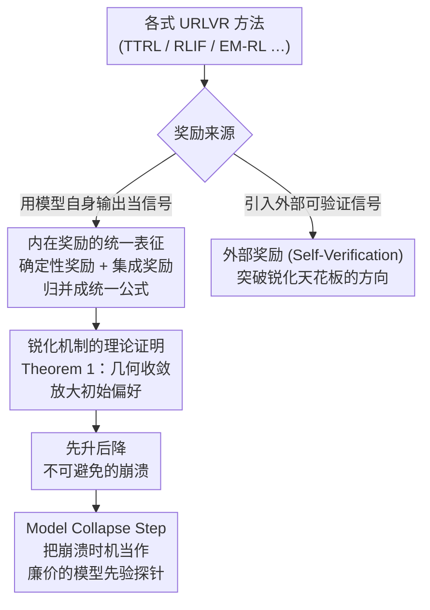

# How Far Can Unsupervised RLVR Scale LLM Training?

**会议**: ICLR 2026  
**arXiv**: [2603.08660](https://arxiv.org/abs/2603.08660)  
**代码**: [PRIME-RL/TTRL](https://github.com/PRIME-RL/TTRL)  
**领域**: Reinforcement Learning  
**关键词**: unsupervised RLVR, model collapse, intrinsic rewards, sharpening mechanism, test-time training

## 一句话总结

对无监督可验证奖励强化学习（URLVR）进行全面分析，揭示所有内在奖励方法本质上都是在"锐化"模型初始分布，导致先升后降的不可避免崩溃模式；提出Model Collapse Step作为模型先验指标，并指出外部奖励方法是突破可扩展性瓶颈的方向。

## 研究背景与动机

RLVR（基于可验证奖励的强化学习）是近年LLM推理能力突破（如DeepSeek-R1、Gemini 2.5、Qwen3）的核心驱动力。然而，监督式RLVR依赖高质量标注数据集，随着模型能力接近或超越人类水平，获取可靠的ground truth越来越困难和昂贵——这就是**监督瓶颈**。

**无监督RLVR（URLVR）**应运而生，旨在不依赖ground truth标签的情况下为模型提供奖励信号。类似预训练的scaling law将大量无标注数据转化为智能，URLVR希望将此范式扩展到后训练阶段。

然而，现有URLVR方法（如TTRL、RLIF、EM-RL等）虽然报告了初期增长，但也暴露出reward hacking和model collapse等问题。不同方法在不同设置下缺乏系统性比较，一个根本性问题浮出水面：**内在奖励真的能scale LLM训练吗？**

## 方法详解

### 整体框架

本文不提新算法，而是回答一个判断题：不依赖标注的内在奖励，到底能不能像预训练那样持续 scale 后训练？为此作者搭了一条层层递进的分析链——先把名目繁多的无监督 RLVR（URLVR）方法按奖励来源分成「内在奖励」和「外部奖励」两类；对内在奖励这一支，证明它们表面各异、本质都在做同一件事：**锐化（sharpening）模型自己的初始分布**，并用一条定理推出由此必然导致的「先升后降」崩溃；既然崩溃无法避免，就把「何时崩溃」提炼成一个廉价指标 Model Collapse Step，用来在无标注场景下预判模型还值不值得继续 RL；最后指出真正能突破天花板的是引入外部信息的「外部奖励」（以 Self-Verification 为例）。下面三个关键设计依次对应这条链上的「统一表征 → 锐化定理 → 崩溃指标」三块，外部奖励作为收尾的方向性结论。

### 关键设计

**1. 内在奖励的统一表征：先归类再合并成一个公式**

URLVR 方法表面五花八门，但若不先理清它们的共性，"能否 scale"就无从谈起。作者先把内在奖励分成两支：**确定性奖励（deterministic reward）**直接读模型 logits 给分，包括 Self-Certainty（用 KL 散度衡量偏离均匀分布的程度）、Token-Level Entropy（负熵）、Trajectory-Level Entropy（序列对数概率）和 Probability（概率乘积）；**集成奖励（ensemble reward）**则靠多次 rollout 的一致性给分，代表是 TTRL 的 Majority Voting。关键在于，这五种奖励都能写成同一个式子

$$r_{uni}(x,y) = \psi\!\left(\frac{\sigma}{|\mathcal{I}|} \sum_{i \in \mathcal{I}} \mathbb{H}(q_i, \pi_\theta^i)\right)$$

其中 $\mathcal{I}$ 决定聚合粒度（token 级还是序列级）、$q$ 是参考的锚分布、$\sigma \in \{+1,-1\}$ 控制是鼓励还是惩罚交叉熵、$\psi$ 是单调变换。换言之，所有方法只是这四个组件的不同实例化，它们都在操纵模型自身的交叉熵 $\mathbb{H}$——这一统一视角直接为后面的理论奠定了"它们本质等价"的基础。

**2. 锐化机制的理论证明：奖励为何只会放大已有偏好**

既然内在奖励都在用模型自己的输出当信号，训练就没有引入任何外部新信息，唯一能做的就是让模型对原本就倾向的答案更确信。作者以 TTRL 为例把这一直觉证成定理。带 KL 正则的 RL 目标有闭式最优策略 $\pi_\theta^*(y|x) \propto \pi_{ref}(y|x) \exp\!\left(\frac{1}{\beta} r(x,y)\right)$；对二元的 Majority Voting 奖励，多数答案的概率质量会被乘上放大因子 $e^{1/\beta}$。在此基础上的 **Theorem 1（几何收敛到确定性策略）**给出：在"多数稳定"与"有效学习"两个假设下，多数答案概率 $p_{maj}^{(k)}$ 会以几何速率 $\rho = e^{-1/\beta}$ 收敛到 1，策略最终塌缩成只在初始多数答案上取值的确定性分布。这就解释了实验中观察到的崩溃为何是结构性的——它不是调参没调好，而是锐化机制的必然终点：confidence 与 correctness 对齐时锐化有益，不对齐时则把错误偏好越放越大。

**3. Model Collapse Step：把崩溃时机变成廉价的先验探针**

既然崩溃不可避免，真正有用的信息就变成"何时崩溃"，而这恰好反映了模型先验的强弱：先验越强、越接近正确分布的模型，能被无害锐化的步数越多。作者据此把模型从开始训练到性能由升转降所经历的步数定义为 Model Collapse Step，用作衡量模型 RL 可训练性的指标。它与真正的 GT Gain（用 ground truth 奖励训练所能取得的提升）在多个模型家族上呈强正相关，却只需约 $1/5.6$ 的计算量，且完全不依赖 ground truth 标签，因而可以在没有标注的场景下提前预判一个模型值不值得继续 RL。

### 损失函数 / 训练策略

实验统一在veRL框架下用GRPO算法跑，默认配置为温度1.0、batch size 64、每问题8个rollout、不加KL正则化；主实验基础模型为Qwen3-1.7B-Base，训练集为DAPO-17k。

## 实验关键数据

### 主实验：先升后降模式

在5种内在奖励方法×4种超参数组合的系统实验中：

| 方法 | 退化模式 | 特征 |
|------|---------|------|
| Self-Certainty | 渐进退化 | 最稳定，退化最慢，Label Accuracy维持较高 |
| Majority Voting | 渐进退化 | 在答案级别操作，避免token级别artifact |
| Probability | 长度坍缩 | 奖励偏好短序列，模型输出急剧缩短 |
| Token-Level Entropy | 重复坍缩 | 通过重复高概率token最小化熵 |
| Trajectory-Level Entropy | 重复坍缩 | 同上，序列中填充重复文本 |

### 消融实验

| 配置 | 关键发现 |
|------|---------|
| 超参调优 | 所有设置最终都退化，差异仅在"何时"而非"是否"崩溃 |
| 单问题训练 | 25个问题中仅3个(12%)翻转了正确性，其余只是锐化原有偏好 |
| 数据集大小(32→16384) | ≤128样本可防止崩溃，≥512必然崩溃 |
| Test-time vs Train-time | 小数据集测试时训练安全有效，大数据集train-time必然崩溃 |
| 即使初始多数投票全错的32样本 | 仍能提升OOD性能（AIME24/AMC23） |

### Model Collapse Step

| 模型 | Collapse Step | GT Gain | 相关性 |
|------|--------------|---------|--------|
| OLMo系列(弱先验) | ~14-22步 | 低 | 强正相关 |
| LLaMA系列(中等) | ~19-128步 | 中 | 强正相关 |
| Qwen系列(强先验) | ~172-195步 | 高 | 强正相关 |

计算成本对比：Model Collapse Step仅需GT Gain的**1/5.6**计算量，且不需要ground truth标签。

### 外部奖励：Self-Verification实验

| 方法 | Qwen3-1.7B验证准确率 | 特点 |
|------|---------------------|------|
| Trajectory-Level Entropy | ~40%后崩溃 | 固有scalability限制 |
| Self-Verification | ~65%且持续上升 | Reward Accuracy初降后恢复 |
| Oracle Supervision | ~70% | 上限 |

### 关键发现

- **所有内在奖励方法的锐化本质**：无论设计多么不同，都在向模型初始分布收敛
- **先升后降是内在而非工程问题**：即使用最优超参组合，~1000步（约4个epoch）后仍然崩溃
- **小数据集的独特价值**：≤128样本通过局部过拟合而非全局策略偏移来避免崩溃（KL偏离仅0.057 vs 大数据集的2倍以上）
- **OOD泛化的反直觉现象**：训练集上全部答错的模型仍能提升测试集性能
- **模型先验决定一切**：Qwen > LLaMA，SFT > Base，且更小模型反而更稳定
- **指令对齐是Self-Verification的关键**：指令对齐模型起点60%+，对两种prompt均鲁棒；基础模型仅对一种prompt有效

## 亮点与洞察

- **统一理论框架**：将看似多样的内在奖励方法统一为交叉熵操纵的不同实例化，揭示其本质等价性
- **"锐化"作为核心机制**的理论证明，重新定义了对URLVR的理解——不是学习新知识，而是放大已有偏好
- **Model Collapse Step**：一个简单、廉价、不需要GT标签的RL可训练性预测指标，对模型选择有直接实用价值
- **bridging理论与实践**：从Theorem 1到实验中先升后降模式的完美对应

## 局限与展望

- 实验主要基于数学推理任务，其他领域（代码、通用对话等）的结论是否成立待验证
- Self-Verification实验仅在Countdown这一简单任务上验证，更复杂场景待探索
- 外部奖励方法的系统性研究相对薄弱，仅为"初步证据"
- 理论假设（多数稳定性、有效学习）在实际中不总是满足
- 未探索如何将内在和外部奖励有效结合

## 相关工作与启发

本文横跨RLVR（DeepSeek-R1、Qwen3等）、无监督/自监督学习、test-time training等多个研究方向。TTRL、RLIF、EM-RL等具体方法被统一在锐化框架下分析。Self-Verification的探索暗示了一条从内在奖励的confidence-correctness天花板到external reward的突破路径，特别是利用generation-verification不对称性（如形式化验证、代码执行等）的方向极具潜力。

## 评分

- 新颖性: ⭐⭐⭐⭐⭐ （统一理论框架+Model Collapse Step+系统性实验分析）
- 实验充分度: ⭐⭐⭐⭐⭐ （5种方法×4种超参×多模型家族×多数据集）
- 写作质量: ⭐⭐⭐⭐⭐ （结构清晰，理论-实验-实践的逻辑链完整）
- 价值: ⭐⭐⭐⭐⭐ （为URLVR领域提供了清晰的路线图和实用工具）

<!-- RELATED:START -->

## 相关论文

- [\[ICLR 2026\] Unsupervised Learning of Efficient Exploration: Pre-training Adaptive Policies via Self-Imposed Goals](unsupervised_learning_of_efficient_exploration_pre-training_adaptive_policies_vi.md)
- [\[ICML 2026\] How Reasoning Evolves from Post-Training Data: An Empirical Study Using Chess](../../ICML2026/reinforcement_learning/how_reasoning_evolves_from_post-training_data_an_empirical_study_using_chess.md)
- [\[ACL 2026\] Semantic-Space Exploration and Exploitation in RLVR for LLM Reasoning](../../ACL2026/reinforcement_learning/semantic-space_exploration_and_exploitation_in_rlvr_for_llm_reasoning.md)
- [\[ICLR 2026\] How LLMs Learn to Reason: A Complex Network Perspective](how_llms_learn_to_reason_a_complex_network_perspective.md)
- [\[ICLR 2026\] SUSD: Structured Unsupervised Skill Discovery through State Factorization](susd_structured_unsupervised_skill_discovery_through_state_factorization.md)

<!-- RELATED:END -->
