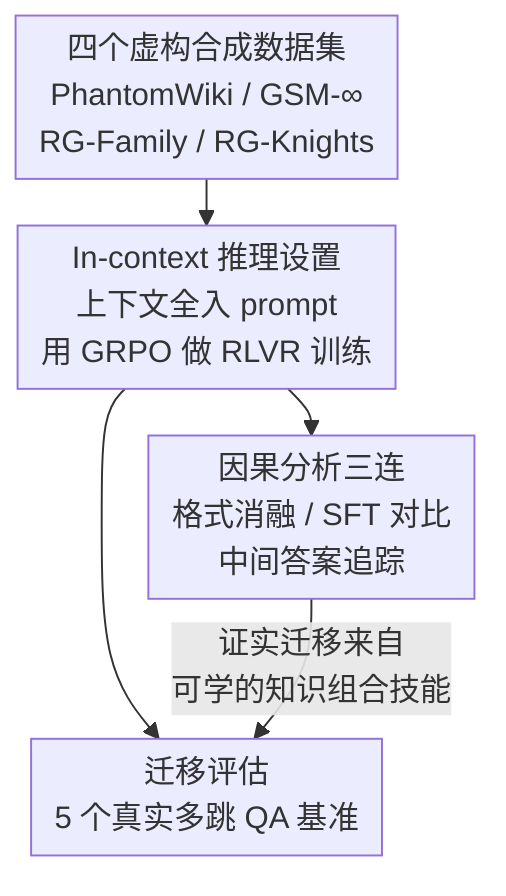

# Learning from Synthetic Data Improves Multi-hop Reasoning

**会议**: ICLR 2026  
**arXiv**: [2603.02091](https://arxiv.org/abs/2603.02091)  
**代码**: [GitHub](https://github.com/kilian-group/phantom-reasoning)  
**领域**: LLM推理/强化学习  
**关键词**: 合成数据, 多跳推理, RLVR, 知识组合, 虚拟世界

## 一句话总结
发现在完全虚构的规则生成合成数据上做RLVR训练，能显著提升LLM在真实多跳推理任务上的表现（Qwen3-0.6B提升56%-131%），因为模型学到了知识组合这一通用推理技能而非记忆事实知识。

## 研究背景与动机

**领域现状**：RLVR通过可验证奖励训练LLM推理能力，在数学、编程等领域取得显著进展。但RLVR依赖大量高质量可验证数据——人工标注昂贵、LLM生成的合成数据有幻觉且成本高。

**现有痛点**：(1) 高质量训练数据稀缺且昂贵；(2) LLM生成的合成数据继承验证困难和预训练知识污染；(3) 规则生成的合成数据语义简单、完全虚构，能否教会有用技能存疑。

**核心矛盾**：PhantomWiki的问题如"Who is the nephew of the friend of the person whose hobby is birdwatching?"与HotpotQA的"Aside from Yodobashi, what other towns were merged into..."差距巨大——虚构简单模板 vs 真实复杂语言。从前者到后者的迁移并非显而易见。

**切入角度**：假设多跳推理的核心是"知识组合"——将多步信息链接的能力，这是一种领域无关的技能。虚构世界中零知识重叠意味着模型无法靠记忆走捷径，必须学会组合操作本身。

**核心 idea**：规则生成的虚构合成数据通过RLVR教会LLM知识组合这一通用技能，可免费、无限扩展地迁移到真实多跳推理。

## 方法详解

### 整体框架
论文要回答的问题很直接：如果只拿完全虚构、由规则模板生成的合成题去做 RLVR，模型能不能把本事迁移到真实的多跳推理任务上？为此它的流程是「合成域训练 → 真实域评估」两段式——先在 4 个规则生成的合成数据集（PhantomWiki / GSM-∞ / RG-Family / RG-Knights）上用 GRPO 做 RLVR 训练，再把训练后的模型直接拿到 5 个真实多跳 QA 基准上测迁移效果。训练覆盖 Qwen3 与 Phi-4 两个家族、0.6B 到 4B 共 4 个模型，全程不接触任何真实标注数据。最后用一组对照实验把「迁移来自可学的知识组合技能、而非别的廉价原因」这条因果链钉牢。

### 关键设计

**1. 多风格虚构合成数据集：用零知识重叠堵死「记忆走捷径」**

合成数据要能教推理而不是教记忆，关键在于让模型无法靠预训练里背过的事实蒙混过关。论文挑了 4 个推理风格各异、但都建立在虚构世界上的规则生成数据集：PhantomWiki 是虚构人物的多跳问答，靠模板加上下文无关文法生成，难度 1–9 跳；GSM-∞ 是无限数学应用题，从随机计算图反向生成自然语言，2–20 步；RG-Family 要在家族树里推断两人关系，属逻辑推理；RG-Knights 是骑士与说谎者逻辑谜题。这四者覆盖了关系链、算术链、逻辑链等不同推理范式，但共同点是世界完全虚构、与真实知识零重叠——模型既背不到答案、也背不到中间事实，只能去学「把多步信息串起来」这个操作本身。

**2. In-context 推理设置：把知识检索从变量里剔除**

要证明迁移来的是「会组合」而不是「碰巧检索得准」，就得把知识检索这一项控制掉。论文一律采用 in-context 设置：所有相关上下文直接塞进 prompt——PhantomWiki 把全部 25 篇文章都放进去，GSM-∞ 把完整题目描述放进去，模型用 `<answer>` 标签把最终答案框出来供抽取。这样所有事实都摆在眼前，模型不需要回忆任何东西，评测衡量的就只剩「能不能在给定信息上做多跳组合」这一项纯推理能力。

**3. 因果分析三连：把「为什么会迁移」证死**

正迁移现象本身容易，难的是排除掉它来自别的廉价原因。论文用三组对照把因果链钉牢：其一是格式消融，只用 `<answer>` 输出格式去做 RLVR，结果 Qwen3 和 Phi 都毫无提升——说明它们本来就会这个格式，迁移并非来自学会了输出格式；其二是 SFT 对比，同样的合成数据换成 SFT，在合成任务上照样涨、却完全迁移不到真实任务——说明 SFT 只拟合了合成题的表面模式，而 RL 学到的是可迁移的技能；其三是中间答案分析，训练过程中模型生成的正确中间答案频率单调递增——直接观测到「知识组合」这一能力在训练中逐步长出来，而非一开始就有。

### 损失函数 / 训练策略
- GRPO（无 KL 惩罚），基于 Hugging Face TRL v0.21.0
- PhantomWiki 用 F1 奖励（应对多答案场景），其余数据集用精确匹配的二值奖励
- 10K 训练样本，混合多种难度

## 实验关键数据

### 主实验
Qwen3-0.6B + PhantomWiki训练 → 真实基准：

| 基准 | Base F1 | +PhantomWiki | 相对提升 |
|------|---------|-------------|---------|
| HotpotQA | 0.36 | 0.73 | +103% |
| 2WikiMQA | 0.37 | 0.86 | +132% |
| MuSiQue | 0.14 | 0.28 | +100% |
| CofCA | 低 | 显著↑ | +56-131% |
| SynthWorlds | 低 | 显著↑ | +大幅 |

### 关键消融

| 配置 | 合成任务 | 真实任务 | 说明 |
|------|---------|---------|------|
| RLVR on PhantomWiki | ✓提升 | ✓迁移 | 完整方案 |
| SFT on PhantomWiki | ✓提升 | ✗不迁移 | SFT过拟合模式 |
| 格式only RLVR | ✗无帮助 | ✗无帮助 | Qwen3/Phi已会格式 |
| 更多合成数据 | 持续↑ | 持续↑ | 无过拟合迹象 |

### 关键发现
- 所有4种合成数据都产生正迁移，PhantomWiki（与目标任务最对齐）效果最好
- SFT在合成任务上提升但不迁移→RL确实教了通用技能，SFT只教了模式
- 模型在虚构的held-out世界和OOD难度上也能泛化→证明学到了可迁移的组合技能
- 性能随合成样本数单调增长，无过拟合→合成数据是可扩展的资源
- 训练过程中模型生成的正确中间答案数量增加→emergent grounded reasoning

## 亮点与洞察
- **"免费午餐"的极致**：完全不需要真实数据、不需要LLM标注、不需要GPU生成——普通电脑上用模板就能生成无限训练数据，且能大幅提升真实推理能力。
- **SFT vs RL的分水岭**：同样的合成数据，SFT会过拟合到合成任务的表面模式，RL教会了深层的组合技能。这是RL的independent价值的有力证据。
- **知识组合作为独立技能**：论文清晰分离了"知道事实"和"会组合事实"两种能力，证明后者可以独立学习。这挑战了"RL只是激活预训练知识"的观点。

## 局限与展望
- 真实任务vs合成任务的差距仍存在——真实数据RLVR效果更好
- 仅验证了0.6B-4B模型，更大模型的迁移模式可能不同
- 多跳推理是相对简单的推理类型，更复杂推理（如数学证明）的迁移待验证
- 合成数据的最优难度分布和混合策略未深入探索

## 相关工作与启发
- **vs 真实数据RLVR**: 真实数据效果更好但昂贵，合成数据免费且无限可扩展，两者互补
- **vs LLM蒸馏合成**: LLM生成的数据贵且有污染风险，规则生成的数据干净且免费
- **vs STILL/ART等**: 之前工作用合成数据评估RL，本文首次系统证明合成→真实的迁移

## 评分
- 新颖性: ⭐⭐⭐⭐⭐ 虚构合成数据→真实推理的迁移发现具有重要意义
- 实验充分度: ⭐⭐⭐⭐⭐ 4模型×4合成数据×5真实基准×多种消融，极其充分
- 写作质量: ⭐⭐⭐⭐⭐ 逻辑链条清晰，因果分析严谨
- 价值: ⭐⭐⭐⭐⭐ 开辟了用免费合成数据提升LLM推理的新范式

<!-- RELATED:START -->

## 相关论文

- [\[AAAI 2026\] MMhops-R1: Multimodal Multi-hop Reasoning](../../AAAI2026/reinforcement_learning/mmhops-r1_multimodal_multi-hop_reasoning.md)
- [\[ICLR 2026\] Controllable Exploration in Hybrid-Policy RLVR for Multi-Modal Reasoning](controllable_exploration_in_hybrid-policy_rlvr_for_multi-modal_reasoning.md)
- [\[ICLR 2026\] RM-R1: Reward Modeling as Reasoning](rm-r1_reward_modeling_as_reasoning.md)
- [\[ICLR 2026\] SPIRAL: Self-Play on Zero-Sum Games Incentivizes Reasoning via Multi-Agent Multi-Turn Reinforcement Learning](spiral_self-play_on_zero-sum_games_incentivizes_reasoning_via_multi-agent_multi-.md)
- [\[ICLR 2026\] RewardMap: Tackling Sparse Rewards in Fine-grained Visual Reasoning via Multi-Stage Reinforcement Learning](rewardmap_tackling_sparse_rewards_in_fine-grained_visual_reasoning_via_multi-sta.md)

<!-- RELATED:END -->
