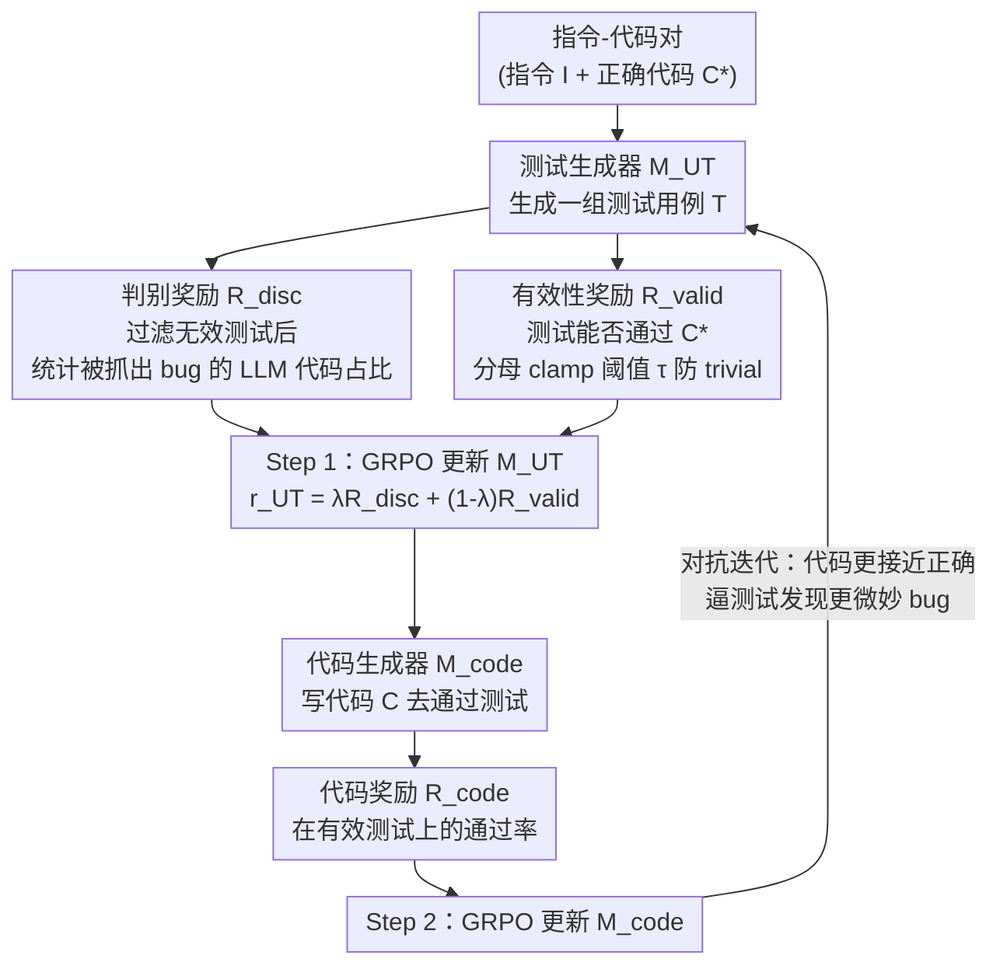

# Learning to Generate Unit Test via Adversarial Reinforcement Learning

**会议**: ICLR 2026  
**arXiv**: [2508.21107](https://arxiv.org/abs/2508.21107)  
**代码**: [项目页面](https://dgjun32.github.io/UTRL)  
**领域**: 代码生成/强化学习  
**关键词**: 单元测试生成, 对抗训练, RLVR, 自博弈, 判别奖励

## 一句话总结
提出UTRL框架，通过对抗RL迭代训练单元测试生成器和代码生成器——测试生成器学习生成能区分LLM代码与正确代码的判别性测试用例，代码生成器学习通过这些测试——Qwen3-4B训练后超越GPT-4.1的测试生成质量。

## 研究背景与动机

**领域现状**：单元测试是编程核心实践，高质量测试用于best-of-N采样和RLVR奖励函数。LLM已被用于自动化测试生成，但训练LLM生成高质量测试的方法仍不充分。

**现有痛点**：(1) SFT需要指令-测试对标注，昂贵且难以跨领域扩展；(2) 测试质量评估本身是开放性问题，没有唯一正确答案；(3) 为测试生成定义可验证奖励是非平凡的——不像代码生成有明确的通过/不通过。

**核心矛盾**：需要无需测试标注就能训练测试生成器的方法，但定义"好测试"的奖励信号需要某种参考标准。

**切入角度**：既然有指令-代码对数据集，可以用"能否区分LLM生成代码与正确代码"作为测试质量的代理指标——好的测试应该能发现LLM代码中的bug。

**核心 idea**：测试生成器被奖励"抓到"代码生成器的bug，代码生成器被奖励通过测试，两者对抗式共同进化。

## 方法详解

### 整体框架
UTRL 想解决的是「怎么在没有测试标注的情况下训练出能生成高质量单元测试的模型」。它把测试生成器 $\mathcal{M}_{\text{UT}}$ 和代码生成器 $\mathcal{M}_{\text{code}}$ 摆成一对对手：给定一批指令-代码对，测试生成器先针对某条指令产出一组测试用例，代码生成器则尝试写出能通过这些测试的代码。每一轮训练分两步交替进行——Step 1 只更新测试生成器，奖励它「抓住」代码生成器的 bug、同时保持测试本身有效；Step 2 只更新代码生成器，奖励它通过越来越刁钻的测试。两者共享同一个 Qwen3-4B 基座、都用 GRPO 优化，在对抗中螺旋上升。关键的巧思在于：测试好不好这件事本身没有标准答案，但「这组测试能不能区分出 LLM 写的有 bug 的代码和正确代码」却是可以直接度量的，这就把开放性的测试评估问题转成了一个可计算的奖励信号。

### 关键设计

**1. 判别奖励：把"好测试"重定义为"能抓出 bug 的测试"**

测试质量没有金标准，但对抗框架给了一个代理指标——一组测试能区分出多少份 LLM 生成代码与正确代码 $C^*$。判别奖励先把不通过正确代码的无效测试过滤掉（用 $\text{Pass}(C^*,T)$ 当指数，无效测试对应的因子被置 1、不参与判别），再统计有多少份 LLM 代码 $C$ 至少被一个有效测试「抓到」：

$$R_{\text{disc}}(\mathcal{T}, \mathcal{C}, C^*) = \frac{1}{|\mathcal{C}|}\sum_{C \in \mathcal{C}}\Big[1 - \prod_{T \in \mathcal{T}}(1-\text{Pass}(C,T))^{\text{Pass}(C^*,T)}\Big]$$

判别率越高，说明这组测试越有区分力。这样测试生成器不必去定义抽象的「什么是好测试」，只要往「能发现 LLM 代码里的 bug」这个明确目标上走即可。

**2. 有效性奖励：堵住"少出 trivial 测试骗高分"的捷径**

只奖励判别力会有漏洞：模型可以只生成极少数恰好能通过正确代码的简单用例来刷分。有效性奖励衡量测试用例的功能正确性（输入-输出 mapping 是否对），并在分母上 clamp 一个阈值 $\tau$：

$$R_{\text{valid}}(\mathcal{T}, C^*, \tau) = \frac{\sum_{T} \text{Pass}(C^*, T)}{\max(|\mathcal{T}|, \tau)}$$

当测试数量少于 $\tau$ 时分母被强制抬到 $\tau$，少量 trivial 测试拿不到满分，从而逼迫模型生成足够数量且都对的测试。测试生成器最终的奖励是两者的加权 $r_{\text{UT}} = \lambda R_{\text{disc}} + (1-\lambda) R_{\text{valid}}$，在「抓 bug」和「自身正确」之间取平衡。

**3. 代码生成器训练：用对手不断升级的测试当作课程**

代码生成器这一侧的奖励是它在「有效测试」上的通过率——只把那些能通过正确代码 $C^*$ 的测试计入分母，避免被无效测试干扰：

$$R_{\text{code}} = \frac{\sum_T \text{Pass}(C,T) \cdot \text{Pass}(C^*,T)}{\sum_T \text{Pass}(C^*,T)}$$

随着测试生成器越练越强、产出的测试越来越能戳中边缘情况，代码生成器要拿到高分就得写出越来越接近正确的代码；反过来代码变好又逼测试生成器去发现更微妙的 bug。这种相互施压让两者在迭代中共同进化，无需人工设计由易到难的训练课程。

### 损失函数 / 训练策略
两个模型都用 GRPO 优化：测试生成器的目标是 $r_{\text{UT}} = \lambda R_{\text{disc}} + (1-\lambda) R_{\text{valid}}$，代码生成器的目标是 $R_{\text{code}}$。训练按 Step 1（更新测试生成器）→ Step 2（更新代码生成器）交替进行，多轮迭代，两者共享 Qwen3-4B 基座。

## 实验关键数据

### 主实验
TACO评估集（竞赛编程），Best-of-N提升：

| 方法 | 模型 | Best-of-N代码精度增益 | 测试保真度 |
|------|------|-------------------|----------|
| Base Qwen3-4B | 4B | 1× | 基线 |
| SFT (带GT测试) | 4B | 中 | 中 |
| SFT (带推理) | 4B | 中+ | 中+ |
| **UTRL** | **4B** | **3.1×** | **最高** |
| GPT-4o | ~万亿 | 中 | 中 |
| **GPT-4.1** | ~万亿 | 高 | 高 |
| **UTRL (Qwen3-4B)** | **4B** | **超越GPT-4.1** | **超越** |

### 消融/迭代分析

| 迭代次数 | 判别率 | 有效率 | 说明 |
|---------|--------|--------|------|
| 0轮 | 基线 | 基线 | 未训练 |
| 1轮 | 提升 | 提升 | 初步对抗 |
| 2轮 | 继续↑ | 继续↑ | 持续改进 |
| 3轮 | 继续↑ | 继续↑ | 无饱和迹象 |

### 关键发现
- 4B模型通过UTRL超越GPT-4.1在测试生成上的表现——证明对抗RL比模型规模更重要
- UTRL不需要测试标注，仅需指令-代码对——比SFT方法便宜得多且效果更好
- 对抗式代码生成器的代码质量接近用GT测试训练的版本——测试生成器提供了有效的奖励代理
- 迭代训练持续改善两者——代码生成器生成更接近正确的代码→迫使测试生成器发现更微妙的bug

## 亮点与洞察
- **判别奖励的精巧设计**：不需要知道什么是"好测试"，只需要测试能区分LLM代码与正确代码。这将测试评估从开放问题转化为可度量的判别问题。
- **自然的课程学习**：随着代码生成器进步，其代码更接近正确→错误更微妙→测试生成器必须学会覆盖更难的边缘情况。对抗训练自动产生由易到难的课程。
- **4B超越GPT-4.1**：测试生成是一个UTRL的利基场景——4B通过对抗训练在这个特定任务上碾压万亿参数模型，展示了targeted RL的威力。

## 局限与展望
- 仅在竞赛编程(TACO)上验证，其他编程领域（Web/系统）的泛化待测
- 代码生成器和测试生成器共享同一基座——独立模型可能效果更好
- 判别奖励依赖代码生成器的分布——如果代码生成器太弱，判别太容易无学习信号
- 缺少与CURE的直接公平对比（不同基座模型）

## 相关工作与启发
- **vs SFT方法(CodeRM/UTGEN)**: SFT需要测试标注，UTRL只需代码标注，且效果更好
- **vs CURE**: CURE也用RL但需要测试标注数据集，UTRL完全不需要
- **vs AZR自博弈**: AZR让模型出题+解题，UTRL让模型出测试+写代码，异同清晰

## 评分
- 新颖性: ⭐⭐⭐⭐⭐ 判别奖励+对抗训练用于测试生成，想法新颖且有效
- 实验充分度: ⭐⭐⭐⭐ 多baseline、多评估指标、迭代分析充分
- 写作质量: ⭐⭐⭐⭐ 方法描述清晰，伪代码完整
- 价值: ⭐⭐⭐⭐⭐ 对代码评估和自动化测试有直接工程价值

<!-- RELATED:START -->

## 相关论文

- [\[ICLR 2026\] Latent Wasserstein Adversarial Imitation Learning](latent_wasserstein_adversarial_imitation_learning.md)
- [\[ICLR 2026\] On Discovering Algorithms for Adversarial Imitation Learning](on_discovering_algorithms_for_adversarial_imitation_learning.md)
- [\[ICLR 2026\] Robust Deep Reinforcement Learning against Adversarial Behavior Manipulation](robust_deep_reinforcement_learning_against_adversarial_behavior_manipulation.md)
- [\[ICLR 2026\] Self-Harmony: Learning to Harmonize Self-Supervision and Self-Play in Test-Time Reinforcement Learning](self-harmony_learning_to_harmonize_self-supervision_and_self-play_in_test-time_r.md)
- [\[ICLR 2026\] Model Predictive Adversarial Imitation Learning for Planning from Observation](model_predictive_adversarial_imitation_learning_for_planning_from_observation.md)

<!-- RELATED:END -->
