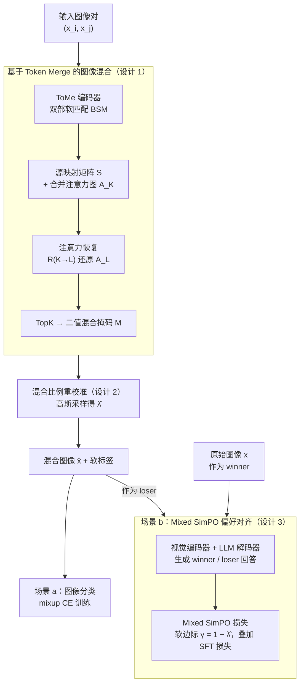

# MergeMix: A Unified Augmentation Paradigm for Visual and Multi-Modal Understanding

**会议**: ICLR 2026  
**arXiv**: [2510.23479](https://arxiv.org/abs/2510.23479)  
**代码**: [https://github.com/JinXins/MergeMix](https://github.com/JinXins/MergeMix)  
**领域**: 强化学习  
**关键词**: Mixup, Token Merging, Preference Alignment, MLLM, Data Augmentation

## 一句话总结

MergeMix 提出了一种基于 token merging 的 mixup 数据增强方法，通过双部软匹配在注意力空间生成混合图像，并将混合比例作为偏好优化中的软边际，在图像分类和多模态大模型两个场景下统一了 SFT 和 RL 训练范式。

## 研究背景与动机

**领域现状**：多模态大语言模型（MLLMs）的后训练阶段主要依赖两种范式：监督微调（SFT）稳定但需要高质量标注、缺乏任务泛化能力；基于强化学习（RL）的偏好优化可以从奖励信号中搜索更好的答案，但计算开销大且训练不稳定。近期一些工作（如 SeVa、SIMA）尝试通过构建偏好对来弥合两者的差距。

**现有痛点**：构建偏好对的核心问题在于如何可控地生成高质量的"loser"样本。SeVa 等方法使用 RandomCrop 等经典增强来构造 loser，但增强方式高度随机，无法控制 loser 的质量。此外，DPO 损失与数据本身无关，导致只能"选择"有用训练数据而非"生成"有效的偏好对。在图像分类领域，自适应 mixup 方法（如 PuzzleMix、AutoMix）虽然效果好，但依赖额外前向传播来计算显著性或梯度信息，效率低下。

**核心矛盾**：在 mixup 增强中，效率与性能之间存在矛盾——静态方法快但效果差，自适应方法效果好但慢。在 MLLM 对齐中，SFT 稳定但缺乏偏好建模，RL 有偏好但不稳定。需要一种方法同时在两个维度上取得平衡。

**本文目标** (1) 如何设计一种既高效又有效的 mixup 策略？(2) 如何将 mixup 增强自然地扩展到 MLLM 偏好对齐？(3) 如何让损失函数与增强数据之间建立直接联系？

**切入角度**：作者观察到 token merging（ToMe）中的合并比例与 mixup 的混合比例可以建立自然联系——合并操作本身就是一种信息选择，而合并后恢复的注意力图可以直接指导混合掩码生成。同时，混合比例可以作为 SimPO 偏好损失中的软边际，数据越相似（$\lambda$ 越大），判别越难，边际越小。

**核心 idea**：利用 token merging 的双部软匹配来生成注意力引导的混合图像，并将混合比例作为偏好损失的动态边际，统一了分类增强和 MLLM 对齐训练。

## 方法详解

### 整体框架

MergeMix 的底层只有一套"混图引擎"：输入图像经 ToMeAttention 编码器做双部软匹配（BSM），借源映射矩阵恢复出注意力图、用 TopK 生成混合掩码（设计 1），再把混合比例重校准成 $\hat{\lambda}$（设计 2），产出混合图像 $\hat{x}$ 和软标签。这套引擎接两个下游场景：(a) 图像分类直接拿混合图像做标准 mixup 训练；(b) MLLM 场景把原始图像当 winner、混合图像当 loser 组成偏好对，用 mixed SimPO 损失（软边际 $\gamma = 1-\hat{\lambda}$，设计 3）配合 SFT 损失训练。同一个 $\hat{\lambda}$ 串起三个设计，是统一 SFT 增强与 RL 对齐的枢纽。

### 关键设计

**1. 基于 Token Merge 的图像混合策略：用注意力图而非额外前向计算来决定混合哪些区域**

以往自适应 mixup（PuzzleMix、AutoMix）要靠额外的前向-反向传播去算显著性，慢就慢在这里。MergeMix 换了个思路：既然 token merging 本身就在做"信息选择"，那就直接复用它的副产品。给定初始 token 序列 $Z_L = f_\theta(\hat{x})$，ToMeAttention 执行双部软匹配（BSM），以 $O(N)$ 复杂度把 $r$ 个相似 token 两两合并，得到压缩序列 $Z_K$ 和一个源映射矩阵 $S$——$S$ 记录了哪些原始位置被合并到了一起，天然编码了 token 之间的空间相似关系。

关键的一步是注意力恢复函数 $\hat{A_L} = \mathcal{R}_{K \to L}(A_K, S)$：它借助 $S$ 把合并后短序列上的注意力图 $A_K$ 反向扩展回原始长度 $A_L$。拿到恢复后的注意力图，再用 TopK 选出 $p = \lfloor \lambda \times L \rfloor$ 个高注意力位置，生成二值混合掩码 $\mathcal{M}$。和 vanilla TopK 直接丢掉低注意力 token 不同，BSM 是全局配对匹配，保留了空间拓扑和上下文连续性；注意力恢复又补回了硬选择会丢掉的信息——所以混出来的图既省算力又不破坏语义结构。

**2. 混合比例重校准（Re-scaling Policy）：让 $\hat{\lambda}$ 不只反映空间占比，还反映 token 合并的聚合程度**

掩码确定了"混多大面积"，但简单的线性映射 $\lambda$ 抓不住 token 合并后信息究竟聚合了多少。MergeMix 改用基于高斯分布的采样来细化比例：均值 $\mu = K/L$（合并后 token 占比），标准差 $\sigma = p / \sum_i^L \mathcal{M}$（选中位置数与掩码总值之比），先采样再裁剪归一化：

$$\hat{\lambda} \sim \mathcal{N}(\mu, \sigma), \quad \hat{\lambda} = \text{clip}\left(\frac{\hat{\lambda} - \min(\hat{\lambda})}{\max(\hat{\lambda}) - \min(\hat{\lambda}) + \tau}, 0, 1\right)$$

高斯平滑避免了比例的突变，让增强更鲁棒；归一化后的 $\hat{\lambda}$ 既携带空间比例信息、又隐含了模型内部的特征聚合程度。

**3. Mixed SimPO 偏好损失：把混合比例当成偏好优化的"软边际"，让损失第一次和增强数据直接挂钩**

前两个设计解决了"怎么混图"，这一步把它接进 MLLM 偏好对齐。做法很直接：原始图像的回答当 winner，混合图像的回答当 loser，组成一个偏好对。关键创新是边际不再是固定超参——把混合比例映射成动态边际 $\gamma = 1 - \hat{\lambda}$。直觉是：$\lambda$ 大说明混合图与原图很像、loser 难判别，此时缩小 $\gamma$ 避免模型过度优化一个本就模糊的对子；$\lambda$ 小说明差异大、loser 易判别，就放大 $\gamma$ 加强约束。代入 SimPO 后得到：

$$\mathcal{L}_{\text{SimPO}}^{\text{Mix}} = -\mathbb{E}\left[\log \sigma\left(\frac{\beta}{|y|}\log \pi_\theta(y|x) - \frac{\beta}{|y|}\log \pi_\theta(y|\hat{x}) - (1-\hat{\lambda})\right)\right]$$

标准 DPO 的边际和数据无关，只能"挑选"有用样本却不能"生成"偏好对；MergeMix 让边际随增强程度自适应，模型据样本难度自动调节优化力度——这正是它能统一 SFT 增强与 RL 对齐的关键。

### 损失函数 / 训练策略

图像分类总损失：$\mathcal{L}_{\text{Total}} = \underbrace{\mathcal{L}_{\text{CE}}(f_\theta(\hat{x}), y_i) \cdot \hat{\lambda} + \mathcal{L}_{\text{CE}}(f_\theta(\hat{x}), y_j) \cdot (1-\hat{\lambda})}_{\text{mixup CE}} + \underbrace{\mathcal{L}_{\text{CE}}(f_\theta(x), y)}_{\text{one-hot CE}}$

MLLM 总损失：$\mathcal{L}_{\text{Total}} = \mathcal{L}_{\text{SFT}} + \mathcal{L}_{\text{SimPO}}^{\text{Mix}}$

## 实验关键数据

### 图像分类主实验

| 方法 | DeiT-T | DeiT-S | ViT-S | ViT-B | ViT-L |
|------|--------|--------|-------|-------|-------|
| Vanilla | 64.70 | 65.81 | 62.64 | 63.33 | 61.83 |
| CutMix | 75.98 | 74.21 | 69.67 | 72.18 | 68.97 |
| PuzzleMix | 73.40 | 73.60 | 70.92 | 71.13 | 69.77 |
| TransMix | 75.31 | 76.17 | 74.15 | 72.87 | 71.40 |
| MixPro | 74.78 | 75.26 | 73.49 | 73.18 | 72.28 |
| **MergeMix** | **77.46** | **78.68** | **77.02** | **75.75** | **76.19** |

CIFAR-100 200 epochs。MergeMix 在所有模型规模上都大幅领先，DeiT-S 上比最强 baseline TransMix 高 2.5%。

### MLLM 基准对比

| 模型 | VQAv2 | GQA | SciVQA | TextVQA | MMBench | POPE | AVG | Gain |
|------|-------|-----|--------|---------|---------|------|-----|------|
| LLaVA-7B | 78.5 | 62.0 | 66.8 | 58.2 | 64.3 | 85.87 | 65.57 | - |
| + CutMix | 79.18 | 62.40 | 70.60 | 57.06 | 66.32 | 86.47 | 65.84 | +0.27 |
| + **MergeMix** | **79.24** | **62.44** | **69.86** | **57.56** | **66.58** | **86.10** | **66.40** | **+0.83** |
| LLaVA-NeXT-7B | 81.8 | 64.2 | 70.1 | 64.9 | 67.4 | 86.5 | 69.3 | - |

### 关键发现

- **效率优势显著**：MergeMix 使用 ToMe 后 FLOPs 降低 16%（4.24G → 3.56G），吞吐量提升 16%（1375 → 1592 img/s），同时精度更高
- **ImageNet-1K 上的效率-性能权衡**：在 DeiT-Small 上 MergeMix 达到 80.71% top-1 精度，超过所有不用动态前向的方法，且是唯一实现了动态加速的 mixup 方法
- **MLLM 场景中的稳定增益**：与随机增强（CutMix、ResizeMix）相比，MergeMix 在所有 benchmark 上更一致，ResizeMix 甚至导致负增益（-2.24%），说明可控增强的重要性
- **混合比例与偏好边际的关联**：$\gamma = 1 - \hat{\lambda}$ 的设计使得容易判别的样本获得更大约束、难判别的获得温和约束，提升了校准能力

## 亮点与洞察

- **Token Merge 与 Mixup 的巧妙桥接**：token 合并本身是一种信息压缩操作，而合并过程中产生的源映射矩阵 $S$ 天然编码了 token 间的相似性关系，可以直接用来生成语义感知的混合掩码，省去了额外的显著性计算
- **统一范式的设计美感**：一个混合比例 $\hat{\lambda}$ 同时承担三重角色——控制掩码大小、校准标签比例、调节偏好边际——三者通过单一变量有机联系
- **SFT 与 RL 的桥接思路可迁移**：用数据增强构造偏好对的思路可推广到其他模态（如音频、视频多模态模型）

## 局限与展望

- **MLLM 实验规模有限**：主要在 LLaVA-7B/13B 和 Qwen2.5-VL-7B 上验证，未见更大规模（如 70B）模型的结果
- **仅限于视觉 token 的 mixup**：MLLM 中的文本 token 未参与混合，纯视觉增强能否充分建模多模态偏好有待探讨
- **偏好对质量的理论保证**：虽然实验有效，但为什么混合图像的回答就是合理的 loser 缺乏理论分析
- **与生成式增强的对比缺失**：未与 DiffuseMix 等基于扩散模型的增强方法进行对比

## 相关工作与启发

- **vs SeVa (Zhu et al., 2024)**：SeVa 用 RandomCrop 构造 loser，增强不可控且 DPO 损失与数据无关。MergeMix 通过注意力引导的混合生成可控 loser，并将混合比例嵌入偏好损失
- **vs PuzzleMix (Kim et al., 2020)**：PuzzleMix 基于梯度信息生成掩码，需要额外前向-反向传播。MergeMix 利用 ToMe 的 BSM 在编码过程中"免费"获得注意力图
- **vs TransMix (Chen et al., 2022)**：TransMix 用原始注意力图重新计算标签比例，但不改变混合掩码生成方式。MergeMix 从 token 合并层面出发，同时优化掩码和标签

## 评分

- 新颖性: ⭐⭐⭐⭐ 将 token merging 与 mixup、偏好优化三者统一的思路新颖，但各个组件并非全新
- 实验充分度: ⭐⭐⭐⭐ 涵盖 5 个分类数据集和 16 个 MLLM benchmark，实验全面
- 写作质量: ⭐⭐⭐⭐ 逻辑清晰，两个场景的描述连贯，公式推导详细
- 价值: ⭐⭐⭐⭐ 图像分类和 MLLM 两个场景都有实际意义，统一范式的想法有启发性

<!-- RELATED:START -->

## 相关论文

- [\[ICLR 2026\] Controllable Exploration in Hybrid-Policy RLVR for Multi-Modal Reasoning](controllable_exploration_in_hybrid-policy_rlvr_for_multi-modal_reasoning.md)
- [\[NeurIPS 2025\] NoisyRollout: Reinforcing Visual Reasoning with Data Augmentation](../../NeurIPS2025/reinforcement_learning/noisyrollout_reinforcing_visual_reasoning_with_data_augmenta.md)
- [\[ICLR 2026\] cadrille: Multi-modal CAD Reconstruction with Reinforcement Learning](cadrille_multi-modal_cad_reconstruction_with_reinforcement_learning.md)
- [\[ICLR 2026\] Chain-of-Context Learning: Dynamic Constraint Understanding for Multi-Task VRPs](chain-of-context_learning_dynamic_constraint_understanding_for_multi-task_vrps.md)
- [\[ICLR 2026\] Understanding and Improving Hyperbolic Deep Reinforcement Learning](understanding_and_improving_hyperbolic_deep_reinforcement_learning.md)

<!-- RELATED:END -->
