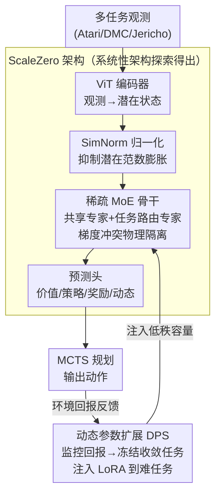

# One Model for All Tasks: Leveraging Efficient World Models in Multi-Task Planning

**会议**: ICLR 2026  
**arXiv**: [2509.07945](https://arxiv.org/abs/2509.07945)  
**代码**: [https://github.com/opendilab/LightZero](https://github.com/opendilab/LightZero)  
**领域**: 多任务强化学习 / 世界模型  
**关键词**: multitask RL, world model, MoE, MCTS, plasticity collapse, dynamic parameter scaling

## 一句话总结
提出 ScaleZero，通过在统一世界模型中引入 MoE 架构解决多任务学习中的梯度冲突和可塑性崩塌问题，结合动态参数扩展（DPS）策略自适应分配模型容量，单个多任务模型在 Atari/DMC/Jericho 三个基准上达到与单任务专家模型相当的性能，同时减少约 28.5% 的环境交互。

## 研究背景与动机
**领域现状**：统一世界模型（如 UniZero）将表示学习、动态预测、策略学习统一在单个 Transformer 中，配合 MCTS 规划在单任务上取得了 SOTA。将其扩展到异构多任务学习（不同观测/动作空间、不同复杂度）是通向通用智能体的关键一步。

**现有痛点**：UniZero 在多任务训练中出现严重的**可塑性崩塌**（plasticity collapse）——简单任务（如 Pong）快速收敛，其梯度主导共享参数更新，导致复杂任务（如 Seaquest）先学后崩。具体表现为休眠神经元比例飙升、潜在状态范数失控膨胀。

**核心矛盾**：共享主干网络在异构任务间的**梯度冲突**——对任务 $i$ 有益的梯度方向可能对任务 $j$ 有害（$\cos(g_i, g_j) < 0$）。同时，静态的资源分配策略对所有任务一视同仁，不考虑任务复杂度差异，造成计算浪费。

**本文目标** (1) 如何在共享世界模型中缓解梯度冲突和可塑性崩塌？(2) 如何根据任务学习进度动态分配模型容量？

**切入角度**：从两个互补视角入手——**架构层面**用 MoE 替换密集 FFN，让不同任务走不同专家路径减少干扰；**过程层面**用 DPS 根据学习进度逐步注入 LoRA 适配器扩展容量。

**核心 idea**：MoE 缓解单次迭代中的梯度冲突 + DPS 优化整个训练过程的资源分配 = 高效多任务世界模型。

## 方法详解

### 整体框架
ScaleZero 要解决的是：让**一个**世界模型同时学好观测/动作空间各异、难度悬殊的多个任务，而不像 UniZero 那样被简单任务的梯度带崩。它的做法是在 UniZero 的基础上从两个角度同时下手——架构上把共享主干改成稀疏专家网络，让不同任务走不同参数路径；训练过程上按任务学习进度逐步注入容量，把算力集中到还没学会的难任务。

整条 pipeline 的数据流是：观测先经 ViT 编码器（替换原来的 ResNet）映射到潜在状态，潜在表示用 SimNorm 归一化以抑制范数膨胀；潜在序列送入 Transformer 骨干，但骨干里的密集 FFN 被换成稀疏 MoE 层（共享专家 + 任务路由专家）；骨干输出再经价值/策略/奖励/动态四个预测头，配合 MCTS 做规划。整个模型用统一损失 $\mathcal{L} = \sum_{t}(\mathcal{L}_{\text{value}} + \mathcal{L}_{\text{policy}} + \mathcal{L}_{\text{reward}} + \mathcal{L}_{\text{dynamics}})$ 端到端训练，DPS 则在训练中根据各任务回报的变化率决定何时冻结、何时注入新的 LoRA 容量。

整套架构（ViT 编码器 + SimNorm + MoE 骨干 + 预测头）并非拍脑袋拼出来的，而是下面「系统性架构探索」沿 5 个维度对照后定下的；MoE 骨干是其中收益最大的一环，DPS 则是叠在训练过程上的一条正交的容量调度回路：

### 关键设计

**1. 稀疏 MoE 骨干：从架构上物理隔离梯度冲突**

这一条直接针对「共享主干在异构任务间梯度互相打架、简单任务梯度主导导致复杂任务崩塌」的痛点。做法是把 Transformer 骨干里的密集 FFN 换成含 $N$ 个并行专家的 MoE 层，每个输入只激活 top-k 个专家，输出为门控加权和 $\text{MoE}(x) = \sum_{i=1}^{N} G_i(x) \cdot \text{Expert}_i(x)$，其中门控网络 $G(x)$ 按输入自动挑选专家子集。专家采用混合设计：1 个共享专家捕获跨任务通用知识，其余路由专家各自处理任务特定的动态。

这样一来不同任务的输入被路由到不同的参数子集，梯度冲突在物理上就被隔开了，而不是靠优化阶段事后修正。实验也印证了这一点——MoE 是所有架构探索里增益最大、最一致的改动，它直接把休眠神经元比例和潜在状态范数维持在健康水平，让原本会崩的多任务训练稳住。

**2. 动态参数扩展（DPS）：按学习进度把算力调度给难任务**

静态资源分配对所有任务一视同仁，但 Atari 里 Pong 和 Seaquest 的难度天差地别，统一分配既浪费又拖累难任务。DPS 的思路是监控每个任务的回报曲线，当某任务收敛（进度停滞）就冻结它的参数，再把新的 LoRA 适配器注入到尚未收敛任务的路径上，权重更新写成 $(W_0 + \alpha BA)x$，只训练低秩矩阵 $(A, B)$ 这一小部分。

这等于自动生成了一套「任务课程」——先把简单任务学会并冻住，再把腾出来的容量集中到困难任务上，而不需要人手预先排难度。好处直接体现在效率上：保持性能的同时减少约 28.5% 的环境交互。

**3. 系统性架构探索：用对照实验找出哪些改动真正有效**

ScaleZero 并非把一堆 trick 一股脑堆上去，而是沿 5 个维度逐个做对照：任务条件化方式、编码器（ResNet vs ViT）、潜在归一化（LayerNorm vs SimNorm）、骨干（密集 vs MoE）、优化策略（梯度修正 MoCo vs 标准）。结论很明确——MoE 骨干收益最大且最一致，SimNorm 有部分帮助，其余改动效果不明显。这条探索本身回答了「多任务世界模型该往哪改」，也解释了为什么优化层面的梯度修正（MoCo 一类）不如架构层面的 MoE 直接有效。

### 训练策略
纯在线 RL 训练，不依赖专家数据或离线数据集；用一个共享逆动力学控制器辅助 MCTS 规划；DPS 中 LoRA 的注入层和秩会根据任务集规模自适应配置。

## 实验关键数据

### 主实验（Atari 100k，26 个游戏，HNS）

| 方法 | 类型 | 归一化均分 | 归一化中位数 |
|------|------|-----------|-------------|
| UniZero | 26 个单任务模型 | 0.38 | 0.21 |
| UniZero | 1 个多任务模型 | 0.31 | 0.16 |
| **ScaleZero** | **1 个多任务模型** | **0.39** | 0.16 |

### DMC Suite（18 个连续控制任务）

| 方法 | 类型 | 平均回报 | 中位回报 |
|------|------|---------|---------|
| UniZero (ST) | 18 个单任务 | 787.2 | 875.1 |
| **ScaleZero (MT)** | **1 个多任务** | 769.7 | **887.3** |

### DPS 效率提升

| 配置 | 环境交互 | 性能 | 说明 |
|------|---------|------|------|
| ScaleZero (full) | 100% | baseline | 完整训练 |
| ScaleZero + DPS | **71.5%** | 近似 baseline | 减少 28.5% 交互量 |

### 关键发现
- ScaleZero 单个多任务模型超过了 26 个单任务专家模型的平均归一化分数（0.39 vs 0.38），证明正向知识迁移成立
- MoE 是所有架构改动中增益最大的：直接将 UniZero MT 从严重崩塌提升到与单任务持平
- 在 Seaquest 等之前崩塌的困难任务上，ScaleZero 实现了稳定学习，休眠神经元比例维持在健康水平
- DPS 策略在保持性能的同时减少约 28.5% 的环境交互，实现了更好的性能-效率权衡
- 中位数分数在 DMC 上反超单任务（887.3 vs 875.1），说明大部分任务都从多任务学习中受益

## 亮点与洞察
- **可塑性崩塌的定量诊断**：不只是"多任务学习难"的模糊陈述，而是用休眠神经元比例和潜在范数具体量化了失败模式，并将其归因到梯度竞争和表示干扰。这套诊断方法可迁移到其他多任务学习场景
- **MoE 在 RL 世界模型中的首次成功应用**：之前 MoE 主要在 LLM 和监督学习中使用，本文证明了其在在线 RL 的世界模型中同样有效，提供了理论（梯度方向分离）和实证（可塑性指标改善）的双重验证
- **DPS 的"任务课程"思想**：不是预定义课程，而是根据实时回报反馈自动发现任务的难度排序 → 自适应调度计算资源。这个思路可以推广到任何多任务学习设置

## 局限与展望
- Atari 100k 的 100k 步限制可能不足以充分展示 DPS 的收益——更长训练下效果可能更明显
- MoE 引入了额外的门控网络和专家参数，虽然计算成本受稀疏性控制，但总参数量增加
- 跨模态（视觉 vs 文本 vs 状态输入）仍需不同编码器，未能真正统一输入处理
- DPS 的任务收敛检测基于回报曲线的启发式规则，可能对回报噪声敏感
- 仅在 RL 环境验证，向更复杂的真实机器人任务的扩展未做探索

## 相关工作与启发
- **vs UniZero**：UniZero 用单体 Transformer 统一表示/动态/预测，但在多任务中因梯度冲突崩塌；ScaleZero 用 MoE 替换密集层，从根源上缓解冲突
- **vs L2M**：L2M 也做多任务 RL，但依赖离线专家数据的监督学习；ScaleZero 纯在线 RL，不需要专家数据
- **vs 梯度修正方法（PCGrad/NashMTL）**：优化层面的修正在本文实验中效果有限，不如架构层面（MoE）的改进直接有效

## 评分
- 新颖性: ⭐⭐⭐⭐ MoE + 世界模型结合新颖，DPS 动态扩展有创意，但各组件并非全新
- 实验充分度: ⭐⭐⭐⭐⭐ 三个不同模态基准（Atari/DMC/Jericho），系统性架构消融，可塑性指标分析
- 写作质量: ⭐⭐⭐⭐ 问题诊断→方案设计→实验验证的逻辑链清晰完整
- 价值: ⭐⭐⭐⭐ 为多任务世界模型提供了实用的架构蓝图，代码开源

<!-- RELATED:START -->

## 相关论文

- [\[ICLR 2026\] Efficient Estimation of Kernel Surrogate Models for Task Attribution](efficient_estimation_of_kernel_surrogate_models_for_task_attribution.md)
- [\[ICLR 2026\] Deep SPI: Safe Policy Improvement via World Models](deep_spi_safe_policy_improvement_via_world_models.md)
- [\[ICLR 2026\] WIMLE: Uncertainty-Aware World Models with IMLE for Sample-Efficient Continuous Control](wimle_uncertainty-aware_world_models_with_imle_for_sample-efficient_continuous_c.md)
- [\[ICLR 2026\] Model Predictive Adversarial Imitation Learning for Planning from Observation](model_predictive_adversarial_imitation_learning_for_planning_from_observation.md)
- [\[ICLR 2026\] From Observations to Events: Event-Aware World Model for Reinforcement Learning](from_observations_to_events_event-aware_world_model_for_reinforcement_learning.md)

<!-- RELATED:END -->
