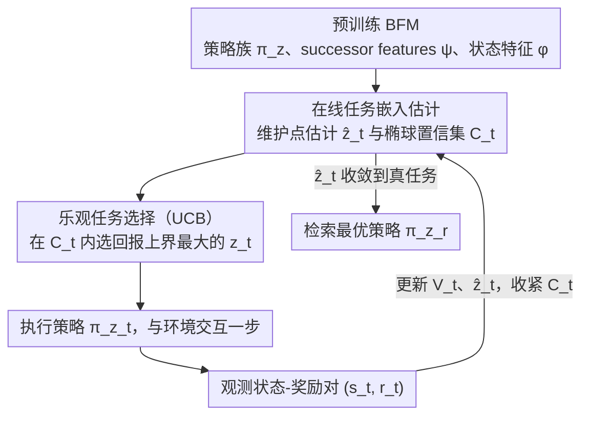

# Optimistic Task Inference for Behavior Foundation Models

**会议**: ICLR 2026 Oral  
**arXiv**: [2510.20264](https://arxiv.org/abs/2510.20264)  
**代码**: [GitHub](https://github.com/ThomasRupf/opti-bfm)  
**领域**: 强化学习 / 基础模型 / Zero-shot RL  
**关键词**: behavior foundation models, task inference, zero-shot RL, successor features, UCB, linear bandits

## 一句话总结
提出 OpTI-BFM——在 Behavior Foundation Model 测试时，不需要完整奖励函数或标注数据集，而是通过与环境交互仅 5 个 episode 即可推断任务并恢复 Oracle 性能，核心是利用 successor features 的线性结构将任务推断归约为线性 bandit 问题并用 UCB 策略乐观探索，提供正式的 regret bound。

## 研究背景与动机
**领域现状**：Behavior Foundation Models (BFMs) 基于 Universal Successor Features (USFs) 实现 zero-shot RL——预训练阶段学习一组策略族 $(\pi_z)_{z \in \mathcal{Z}}$，测试时给定奖励函数 $r$ 即可立即检索最优策略 $\pi_{z_r}$。

**现有痛点**：
   - 标准任务推断（Eq. 4）需要在推断数据集 $\mathcal{D}$ 上计算 $z_r = \text{Cov}(\phi)^{-1} \mathbb{E}[\phi(s) r(s)]$，要求 (i) 访问推断数据集和 (ii) 对每个状态提供奖励标签
   - 预训练数据可能不可用或为私有数据；从像素标注奖励成本高昂
   - 现有方法（如 FB）默认用 50K 标注样本做任务推断

**核心矛盾**：BFM 的 zero-shot 策略检索在计算上高效（只需一次线性回归），但在数据标注上低效（需要大量标注数据做任务推断）

**核心 idea**：将任务推断从离线回归转为在线交互——利用 successor features 的线性结构 $V^{\pi_z}(s) = z^\top \psi^{\pi_z}(s)$，将策略选择归约为线性 bandit，用 UCB 策略在任务嵌入空间做乐观探索

## 方法详解

### 整体框架
OpTI-BFM 要解决的是：拿到一个预训练好的 BFM（它提供策略族 $\pi_z$、successor features $\psi$、状态特征 $\phi$），在不给奖励函数、也不给标注数据集的前提下，只靠在环境里跑几个 episode 就把当前任务对应的嵌入 $z_r$ 找出来，从而检索到最优策略。整个测试时流程是一个闭环：算法维护一个对 $z_r$ 的后验估计 $\hat{z}_t$ 和一个椭球形置信集 $\mathcal{C}_t$；每一步在置信集内挑出"乐观"的任务嵌入 $z_t$（即在不确定性上界下看起来回报最高的那个），执行对应策略 $\pi_{z_t}$，把实际观测到的状态和奖励 $(s_t, r_t)$ 收进来更新估计，如此往复直到 $\hat{z}_t$ 收敛到真任务。关键在于，successor features 让 value 在任务嵌入上保持线性 $V^{\pi_z}(s) = z^\top \psi^{\pi_z}(s)$，这把"选哪个策略"的问题精确地变成了一个线性 bandit。

### 关键设计

**1. 在线任务嵌入估计：把"标注数据集回归"换成边交互边累积的最小二乘**

标准 BFM 推断要在离线数据集 $\mathcal{D}$ 上一次性算出 $z_r$，前提是手里有数据集且每个状态都有奖励标签——这正是前面说的实用瓶颈。OpTI-BFM 改成增量式：每跑一步拿到一对新的 $(s_t, r_t)$，就更新一个正则化最小二乘估计 $\hat{z}_t = V_t^{-1} \sum_{i=0}^t \phi(s_i) r_i$，其中协方差矩阵 $V_t = \lambda I_d + \sum_{i=0}^t \phi(s_i) \phi(s_i)^\top$ 随着特征不断累加。围绕这个点估计，算法同时维护一个椭球置信集 $\mathcal{C}_t = \{z : \|z - \hat{z}_t\|_{V_t} \leq \beta_t\}$，用 $V_t$ 诱导的马氏距离刻画"在哪些方向上还不确定"——交互过的方向椭球收得紧，没探索过的方向留得宽。这样任务推断不再依赖预存数据，而是随交互在线收敛。

**2. 乐观任务选择（UCB）：用置信上界驱动探索，自然平衡探索与利用**

有了置信集，下一步要决定当前状态下执行哪个策略。OpTI-BFM 采取乐观原则，选 $z_t = \arg\max_{z \in \mathcal{C}_t} \psi^{\pi_z}(s_t)^\top z$——在置信集内部找那个让预测回报最大的任务嵌入。当某个方向不确定性高时，置信集在该方向更宽，乐观选择会主动去试探它（探索）；当估计已经收紧，乐观值就贴近真实最优，算法转为利用预估最优策略。这里和经典线性 bandit 有个微妙但关键的区别：有两个不同的"上下文"在起作用——$\phi$ 用于回归和构造置信区间，$\psi$ 用于这个 acquisition function。用更原始的 $\phi$ 做回归能得到比直接用 $\psi$ 更紧的估计，这是把 BFM 结构吃透后才能用上的细节。

**3. Regret Bound：借 LinUCB 的形式化联系，给在线推断一个 $\tilde{O}(\sqrt{nd})$ 的理论保证**

因为整个推断被归约成线性 bandit，OpTI-BFM 可以直接继承这一族的理论工具。论文证明：对一个完美训练的 BFM（successor features 准确、策略最优，且奖励落在特征的线性 span 内），跑 $n$ 个 episode 后的累积 regret 满足 $R_n = \tilde{O}(\sqrt{n \cdot d})$，其中 $d$ 是任务嵌入维度。换句话说，找对任务所付的代价随交互次数次线性增长、并只随嵌入维度的平方根放大。这个 bound 的价值不只是"有保证"，而是它把 BFM 的任务推断和椭球置信集、elliptical potential lemma 这些成熟结果接上了线，让乐观探索的样本效率有了可分析的依据。

**4. Thompson Sampling 变体（OpTI-BFM-TS）：用后验采样绕开每步的优化问题**

UCB 版每步都要解一个置信集上的 $\arg\max$，OpTI-BFM-TS 提供一个更省事的替代：直接从后验分布采样 $z_t \sim \mathcal{N}(\hat{z}_t, \beta_t V_t^{-1})$，用采样出的嵌入去执行策略。它实现更简单，省掉了显式优化，但代价是性能略逊——在 Cheetah 上与 UCB 版有明显差距，因此作为可选的轻量变体而非主方案。

### 损失函数 / 训练策略
- 预训练：标准 Forward-Backward (FB) 框架
- 测试时推断：纯在线，无需额外训练。每步只需更新 $V_t$ 和 $\hat{z}_t$（矩阵-向量运算）
- 计算开销：相比纯策略推理约 5× 慢（Table 1），但绝对时间很小

## 实验关键数据

### 主实验（DMC Walker/Cheetah/Quadruped，每个 4 个任务）

| 方法 | 恢复 Oracle 性能所需 episodes | 标注需求 |
|------|---------------------------|---------|
| Oracle（离线推断） | — | 50K 标注样本 |
| **OpTI-BFM** | **~5 episodes（5K 步）** | **5K 在线奖励** |
| OpTI-BFM-TS | ~8 episodes | 8K 在线奖励 |
| LoLA（黑盒策略搜索） | ~30+ episodes | 30K+ |
| Random | 不收敛 | — |

OpTI-BFM 用 10x 更少的标注就能匹配需要 50K 标注样本的离线推断。

### 消融实验

| 配置 | 效果 | 说明 |
|------|------|------|
| 每步更新 vs 每 episode 更新 | 每步更新收敛更快 | 但每 episode 更新有理论保证 |
| OpTI-BFM vs RND（任务无关探索） | OpTI-BFM 更数据高效 | 任务感知探索的价值 |
| OpTI-BFM vs Random baseline | 主动数据远优于被动数据 | 验证主动收集的重要性 |
| 非平稳奖励（decay $\rho < 1$） | 可追踪变化的奖励 | 需要适当的遗忘因子 |
| Warm-start（$n$ 个离线标注样本） | 初始性能随 $n$ 快速提升 | 兼容离线数据 |

### 关键发现
- 5 个 episode 即可在所有环境和任务上恢复 Oracle 性能——这是 BFM 线性结构被充分利用的结果
- LoLA（黑盒搜索）忽略了线性结构因此收敛更慢——说明 structure-aware 探索的价值
- OpTI-BFM 可自然扩展到非平稳奖励（通过遗忘因子 $\rho$）和 warm-start（通过离线数据预初始化）
- 计算开销可控（~5×），主要瓶颈不在于推断本身而在于环境交互

## 亮点与洞察
- **消除 BFM 最大实用瓶颈**：BFM 此前的"zero-shot"需要 50K 标注数据做任务推断——这个大数据需求严重限制了实际部署。OpTI-BFM 将数据需求从 50K 降到 ~5K（在线、无需预存数据集）
- **优雅的理论联系**：将 BFM 的任务推断问题精确归约为经典线性 bandit，继承了丰富的理论工具（regret bound、椭球置信集、elliptical potential lemma）
- **实用的"渐进式"接口**：OpTI-BFM 兼容三种模式——（1）纯在线无先验知识，（2）warm-start 有少量离线数据，（3）非平稳奖励追踪。这使它成为 BFM 部署的统一框架

## 局限与展望
- 依赖 BFM 的线性 SF 结构——非线性奖励函数不在理论保证范围内
- 理论分析假设完美训练的 BFM（SF 准确、策略最优），实际中近似误差如何传播需要更多分析
- regret bound 仅覆盖 episode-level 更新，但实验表明 step-level 更新更好——理论-实践 gap
- 仅在 DMC 环境验证（Walker/Cheetah/Quadruped），更复杂的高维视觉场景未测试
- 任务嵌入空间 $\mathcal{Z}$ 的维度 $d$ 影响 regret——高维嵌入场景可能需要更多探索

## 相关工作与启发
- **vs 标准 BFM 任务推断（FB）**：需要 50K 标注样本 + 预存数据集；OpTI-BFM 只需 5 episode 在线交互
- **vs LoLA (Sikchi 2025)**：黑盒策略搜索，忽略线性结构，收敛慢 6×+
- **vs LinUCB (Abbasi-Yadkori 2011)**：OpTI-BFM 的理论基础，但扩展到 BFM 中回归和 acquisition 使用不同上下文的新设定

## 评分
- 新颖性: ⭐⭐⭐⭐⭐ BFM 任务推断与线性 bandit 的联系极其优雅，且直接解决了 BFM 的核心实用瓶颈
- 实验充分度: ⭐⭐⭐⭐ 标准基准 + 多种消融（非平稳、warm-start、数据效率对比）
- 写作质量: ⭐⭐⭐⭐⭐ 理论动机清晰，从直觉到形式化推导流畅
- 价值: ⭐⭐⭐⭐⭐ ICLR Oral 实至名归，对 BFM 的实际部署有重大推动

<!-- RELATED:START -->

## 相关论文

- [\[ICLR 2026\] ARM-FM: Automated Reward Machines via Foundation Models for Compositional Reinforcement Learning](arm-fm_automated_reward_machines_via_foundation_models_for_compositional_reinfor.md)
- [\[ICLR 2026\] Efficient Estimation of Kernel Surrogate Models for Task Attribution](efficient_estimation_of_kernel_surrogate_models_for_task_attribution.md)
- [\[NeurIPS 2025\] Foundation Models as World Models: A Foundational Study in Text-Based GridWorlds](../../NeurIPS2025/reinforcement_learning/foundation_models_as_world_models_a_foundational_study_in_text-based_gridworlds.md)
- [\[NeurIPS 2025\] Exploration with Foundation Models: Capabilities, Limitations, and Hybrid Approaches](../../NeurIPS2025/reinforcement_learning/exploration_with_foundation_models_capabilities_limitations_and_hybrid_approache.md)
- [\[ICLR 2026\] One Model for All Tasks: Leveraging Efficient World Models in Multi-Task Planning](one_model_for_all_tasks_leveraging_efficient_world_models_in_multi-task_planning.md)

<!-- RELATED:END -->
