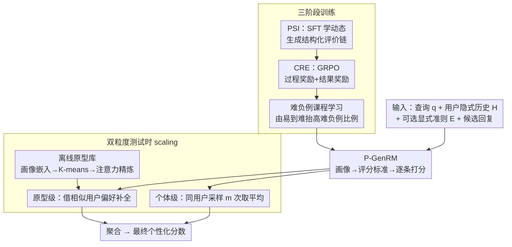

# P-GenRM: Personalized Generative Reward Model with Test-time User-based Scaling

**会议**: ICLR 2026 Oral  
**arXiv**: [2602.12116](https://arxiv.org/abs/2602.12116)  
**代码**: [GitHub](https://github.com/Tongyi-ConvAI/Qwen-Character/tree/main/Character-GenRM)  
**领域**: 强化学习  
**关键词**: 个性化奖励模型, 生成式评判, 结构化评价链, 测试时scaling, 协同过滤

## 一句话总结

提出 P-GenRM，首个个性化生成式奖励模型：通过三阶段训练（PSI 监督微调构建结构化评价链→CRE 强化学习增强缺失偏好下的推理→难负例课程学习提升鲁棒性）将混合偏好信号转化为场景自适应的用户画像与评分标准，再引入双粒度测试时 scaling（个体级多次采样聚合 + 原型级协同过滤借用相似用户偏好），在 PersonalRewardBench 上超越前 SOTA 2.31%、测试时 scaling 额外提升 3%，且能泛化到未见用户。

## 研究背景与动机

**领域现状**：RLHF 是 LLM 对齐的主流范式，奖励模型是其核心——它为策略模型提供评分信号来引导输出。随着应用场景从"通用价值观对齐"走向"个性化对齐"，奖励模型需要捕捉每个用户独有的偏好标准，而非仅学一组全局人类偏好。

**现有痛点**：现有个性化奖励方法面临两个根本问题。第一，**静态偏好建模**——将用户的动态、场景依赖的偏好简化为一组固定规则。但同一个用户在不同场景下偏好完全不同（开车时想要简短回答、闲聊时想要详尽讨论），固定规则无法覆盖这种变化。SynthesizeMe 虽然从历史偏好中推断合成画像，但其画像是静态的，生成后不再随场景调整。第二，**新用户泛化困难**——冷启动场景下历史交互极少，现有方法难以从有限反馈中构建可靠的奖励信号。GPO、VPL、PAL 等方法都需要足够的用户数据才能工作。

**核心矛盾**：个性化奖励需要精细理解用户偏好，但偏好信号天然稀疏且含噪——显式偏好（"我喜欢简洁风格"）很少被用户主动提供，隐式偏好（交互历史）虽然丰富但充满噪声。如何从这种混合信号中可靠地推断出场景自适应的评估标准？如何在用户信息极少时仍能给出合理评分？

**切入角度**：生成式奖励模型（GenRM）不只输出一个分数，而是生成完整的评价链（evaluation chain）——包括用户画像推断、评分标准制定、逐条打分过程。这带来三个优势：(1) 生成过程本身就在做推理，可以动态适应不同场景；(2) 评价链是文本，天然可解释；(3) 可以在测试时多次采样并聚合，类似 LLM 的 test-time compute scaling。作者进一步借鉴推荐系统中的协同过滤思想——相似用户有相似偏好——将用户聚类为原型（prototype），让新用户可以通过原型迁移获得可靠评分。

**核心 idea**：用生成式奖励模型将混合偏好信号转化为场景自适应的评价链，并通过个体级 + 原型级双粒度测试时 scaling 来减少噪声和增强泛化。

## 方法详解

### 整体框架

P-GenRM 要解决的问题是：怎么让奖励模型读懂"这个具体用户在这个具体场景下想要什么"，并且在用户信息很少时也能给出靠谱评分。它的输入包括当前查询 $q_t$、用户的隐式偏好历史 $H_t^{(u)}$（若干轮交互里的 chosen/rejected 回复对）、可选的显式偏好准则 $E^{(u)}$，以及待评分的候选回复。和传统奖励模型直接吐一个标量不同，P-GenRM 输出一条完整的结构化评价链（Structured Evaluation Chain, SEC）：先推断用户在当前场景下的画像（persona），再从画像导出带权重的评分标准（rubric），最后逐条给候选回复打分并汇总成最终分。

整条流水线分两截。**训练侧**三阶段递进地把模型练出来：PSI 用监督微调让模型学会按场景动态生成评价链，CRE 用强化学习把"会写格式"逼成"会真推理"，难负例课程学习再把它磨到能区分质量相近、却不合该用户口味的回复。**推理侧**叠加双粒度测试时 scaling 进一步降噪、补冷启动——既对同一用户多采样几次取平均（个体级），又借相似用户的偏好填补信息缺口（原型级），后者依赖一套离线聚好的用户原型库。

### 关键设计

前三点是三阶段训练里各自啃下一块硬骨头，第四点是推理时的双粒度 scaling。

**1. PSI：把"画像推断"嵌进生成过程，让评价标准随场景动态变化**

监督微调阶段（Persona-guided Scoring Induction）解决的是"模型一开始根本不会生成结构化评价链"的问题。作者先用 o3 等强模型构造 SEC 数据集：给定用户的隐式历史和显式准则，让强模型推断出场景感知的画像，再导出该场景下的偏好维度和权重，逐条评分后给出结果，并用拒绝采样过滤掉低质量样本，再拿去做 SFT。关键不在于"生成画像"，而在于画像是**动态生成**的——同一个用户在不同查询下会被推断出不同的画像和评分标准，而不是像 SynthesizeMe 那样一次性生成一份静态画像挂在 prompt 里。这个选择有依据：前置实验（Table 6）显示，用户画像作为偏好先验对评分准确率的提升最大（+1.6%），超过自我描述、人口统计等其他信号；把画像推断做成生成过程的一部分，才能让模型按当前场景灵活调整。

**2. CRE：用过程奖励 + 结果奖励的双重信号，逼模型在缺显式偏好时也学会推理**

只靠 SFT 模仿，模型容易学到"模板化"的评价链——格式对了但推理是空的。强化学习阶段（Criteria-based Reasoning Enhancement）基于 GRPO，给评价链同时套两个奖励：过程奖励 $PR_t$ 由 LLM judge 评估生成的评价链有没有覆盖到用户真实的偏好维度，取 0-1 连续值；结果奖励 $OR_t$ 看最终评分有没有把 chosen/rejected 排对，对了给 1、错了给 0、格式坏了罚 $-0.1$。总奖励为

$$R_t = \alpha \cdot PR_t + \beta \cdot OR_t,\quad \alpha=0.5,\ \beta=1.0$$

训练时故意只喂有限的历史交互、不给显式偏好，把模型推到"从稀疏信号里自己推断偏好"的处境。过程奖励保证评价链覆盖对的维度，结果奖励保证最终排序对——消融实验里去掉任一个都明显掉点，证明两者缺一不可。

**3. 难负例课程学习：从易到难地喂"质量相近但不合该用户口味"的回复对**

个性化评分本质很主观，难点常常不是"哪个回复质量高"，而是"两个质量差不多的回复里，哪个更合这个用户的独特偏好"。课程学习阶段逐步抬高训练里"难负例"的比例——这些难负例就是质量相近、但不符合特定用户偏好的回复。为了给难样本留出更大的探索空间，这一阶段去掉过程奖励 $PR_t$，只留结果奖励 $OR_t$。让模型从简单区分逐步过渡到困难区分，鲁棒性才提得上来。

**4. 双粒度测试时 scaling：个体多采样 + 原型借相似用户，同时降噪和补冷启动**

训练好的模型单次推断仍有两个软肋：一次采样的画像/评分难免带噪声，冷启动用户的历史又太少。推理阶段用两个粒度一起补。**个体级**对当前查询并行采样 $m$ 次，每次推断出略有差异的画像和评分标准，多套方案取平均——本质是在偏好推断空间里做多假设探索，把单次噪声压下去。**原型级**则把协同过滤"相似用户偏好相似"的假设落到 RLHF 上：先离线把每个用户在各场景下的画像 $P_t^{(u)}$ 用 Qwen3-Embedding-0.6B 向量化、拼成跨场景偏好嵌入矩阵 $\mathbf{P}$，K-means 聚出 $k$ 个原型，再经一轮 prototype-augmented attention 精炼（注意力加权聚合历史 + 辨别式损失让原型能分 chosen/rejected + 两个正则项防偏移过大，PCA 显示 50 个原型即可覆盖大部分偏好变异）；评分时按用户偏好嵌入找最近原型，从中挑 $n$ 个最相似用户，借他们的历史让模型额外生成 $n$ 套评分，最后与个体级结果一起聚合。这里"质比量重要"——Ind-16+Pro-8 优于纯堆个体采样的 Ind-32，但 Pro 开太大（Pro-16）反而引入不一致的噪声偏好、掉点；冷启动用户从原型迁移获益最大。

### 损失函数 / 训练策略

三阶段依次为：(1) PSI 阶段用标准 SFT 交叉熵损失；(2) CRE 阶段用 GRPO 目标，总奖励 $R_t = 0.5 \cdot PR_t + 1.0 \cdot OR_t$，带 KL 正则防止偏离参考策略过远；(3) 课程学习阶段沿用 GRPO 框架但去掉 $PR_t$、只留 $OR_t$，逐步增加难负例比例。离线原型优化阶段用辨别式 pairwise 损失

$$\mathcal{L}_{\text{pair}} = -\log\sigma(z_t^\top y_t^+ - z_t^\top y_t^-)$$

外加中心正则和时序平滑正则。

## 实验关键数据

### 主实验——PersonalRewardBench 上的对比

| 方法 | 模型 | Chatbot Arena | PRISM |
|------|------|:---:|:---:|
| Default (LLM-as-Judge) | 8B | 56.37% | 52.04% |
| + Preference History | 8B | 58.53% | 56.24% |
| + SynthesizeMe | 8B | 61.07% | 54.70% |
| GPO | 8B | 57.87% | 57.29% |
| VPL | 8B | 58.12% | 58.25% |
| FT RM + SynthesizeMe | 8B | 69.78% | 62.84% |
| **P-GenRM** | **8B** | **72.68%** | **65.32%** |
| **P-GenRM + Ind-16,Pro-8** | **8B** | **75.92%** | **68.06%** |
| FT RM + SynthesizeMe | 70B | 72.05% | 63.74% |
| P-GenRM | 70B | 73.42% | 66.21% |
| o3 + PSI | — | 69.14% | 63.87% |

P-GenRM-8B 超越前 SOTA（FT RM + SynthesizeMe-70B）平均 1.04%，加上测试时 scaling 后再提升约 3%。8B 模型甚至超过 70B 级别的 SynthesizeMe。

### 消融实验

| 配置 | Chatbot Arena | PRISM | 说明 |
|------|:---:|:---:|------|
| P-GenRM (Full) | 72.68% | 65.32% | 完整模型 |
| w/o CL | 71.07% | 63.82% | 去掉课程学习，掉 1.5-1.6% |
| w/o CL, PR | 70.22% | 62.70% | 再去掉过程奖励，掉 0.8-1.1% |
| w/o CL, OR | 69.05% | 60.94% | 去掉结果奖励比去过程奖励掉更多 |
| w/o CL, RL | 66.76% | 57.08% | 去掉整个 RL 阶段掉 6-8% |
| w/o CL, RL, SFT | 56.37% | 52.04% | 退化为基线 LLM-as-Judge |

### 测试时 Scaling 详细分析

| Scaling 配置 | Chatbot Arena | PRISM |
|------|:---:|:---:|
| P-GenRM (无 scaling) | 72.68% | 65.32% |
| + Ind-8 | 73.61% | 65.79% |
| + Ind-16 | 73.87% | 66.66% |
| + Ind-32 | 75.59% | 67.65% |
| + Ind-8, Pro-4 | 74.30% | 67.54% |
| **+ Ind-16, Pro-8** | **75.92%** | **68.06%** |
| + Ind-0, Pro-8 | 66.90% | 57.65% |
| + Ind-16, Pro-16 | 72.59% | 64.61% |

### OOD 泛化（LaMP-QA 冷启动）

| 方法 | Arts | Personal | Society | Avg |
|------|:---:|:---:|:---:|:---:|
| Qwen3-235B-A22B | 0.600 | 0.657 | 0.600 | 0.619 |
| SynthesizeMe-8B | 0.486 | 0.657 | 0.600 | 0.581 |
| LLaMA3.1-70B | 0.543 | 0.657 | 0.600 | 0.600 |
| **P-GenRM-8B + Ind-8,Pro-4** | **0.543** | **0.714** | **0.657** | **0.638** |

### 关键发现

- **RL 是最大贡献者**：去掉全部 RL 阶段掉 6-8%，说明仅靠 SFT 模仿评价链远远不够；结果奖励比过程奖励更关键（去 OR 掉更多）
- **原型级 scaling 对新用户帮助最大但不是越多越好**：Ind-16+Pro-8 是最佳配置（总 24 次推理），但 Pro-16 反而比 Pro-8 差——过多相似用户引入了与目标用户不一致的噪声偏好
- **纯原型 scaling 不行**：Ind-0+Pro-8 掉到 66.90%/57.65%，远低于无 scaling 的基线，说明个体自身偏好必须是评分的主体
- **动态画像 vs 静态画像**：在 LLM-as-Judge 设定下，PSI 比 SynthesizeMe 在所有 base model 上一致更优（Qwen3-8B: +1.65/+1.68, o3: +1.41/+5.38），验证了场景自适应画像的必要性
- **跨分布泛化强**：在 LaMP-QA 冷启动场景中，8B 的 P-GenRM 超越 235B 的 Qwen3，说明原型迁移机制对新用户确实有效
- **不偏向多数群体**：原型级 macro 准确率 65.21% 与样本级 65.32% 几乎一致（差 0.11%），长尾分布下少数群体不被忽视

## 亮点与洞察

- **评价链 = 可调试的奖励信号**：传统奖励模型输出一个标量，无法解释"为什么这个回答得分高"。P-GenRM 输出完整的推理过程（画像→标准→逐条评分），用户和开发者可以直接检查每一步是否合理，这对主观性极强的个性化评分尤其重要
- **协同过滤思想跨界到 RLHF**：推荐系统中"相似用户有相似偏好"的核心假设一直只在推荐领域使用。这篇论文首次把它引入奖励模型——通过用户原型聚类和 prototype-based transfer 解决冷启动问题。这个思路可以迁移到任何需要个性化评估的场景（如个性化摘要、个性化教育反馈）
- **测试时 scaling 的"质"比"量"重要**：单纯增加个体采样次数（Ind-32）不如混合使用个体+原型 scaling（Ind-16+Pro-8），后者用更少的总推理次数获得更好结果。这说明多样性（引入不同用户的视角）比重复性（同一用户多次采样）更有价值
- **三阶段训练的递进逻辑清晰**：SFT 学格式和基本能力→RL 学深度推理能力→课程学习学区分困难样本。每一阶段都在前一阶段的基础上解决具体瓶颈，而非简单堆叠

## 局限与展望

- **原型数量需手动选取**：目前通过 PCA 保留方差比分析确定 50 个原型，缺乏自适应机制。不同数据分布下最优原型数可能差异很大
- **推理成本仍然较高**：最佳配置 Ind-16+Pro-8 需要对每个样本做 24 次完整生成。虽然作者声称延迟低于前 SOTA，但在实时对话场景中仍然偏重
- **偏好漂移未建模**：用户偏好随时间演变（短期偏好 vs 长期偏好），当前框架对历史交互做随机采样而不区分时效性，无法捕捉偏好变化趋势
- **评估基准有限**：主要在 PersonalRewardBench（Chatbot Arena + PRISM）和 LaMP-QA 上测试，缺乏在真实产品级个性化对话系统中的验证
- **原型精炼的嵌入模型固定**：用 Qwen3-Embedding-0.6B 做用户嵌入，但这个嵌入是否真正捕捉了"偏好相似性"而非"文本相似性"值得探究

## 相关工作与启发

- **vs SynthesizeMe**：SynthesizeMe 从历史偏好中合成静态画像作为 prompt，本文的 PSI 则在每次评分时动态生成场景自适应画像。本文在所有 base model 上一致优于 SynthesizeMe，且差距在小模型上更明显
- **vs PAL/VPL/GPO**：这些方法用隐变量或原型混合来建模用户偏好，但都基于传统判别式奖励模型（输出标量）。P-GenRM 用生成式方法输出评价链，天然支持测试时 scaling 和可解释性，这是判别式方法无法实现的
- **vs GenRM 系列（Self-Principled Critique 等）**：现有 GenRM 工作聚焦于通用评估质量提升，未考虑个性化。P-GenRM 是首个将 GenRM 与个性化对齐结合的工作，填补了这个空白

## 评分
- 新颖性: ⭐⭐⭐⭐⭐ 首个个性化 GenRM + 协同过滤与 RLHF 的有机结合，双粒度测试时 scaling 设计优雅
- 实验充分度: ⭐⭐⭐⭐⭐ 两个基准 + OOD 泛化 + 详细消融 + scaling 配置分析 + macro accuracy 公平性验证
- 写作质量: ⭐⭐⭐⭐ 整体结构清晰，但公式符号稍多，部分表述可以更简洁
- 价值: ⭐⭐⭐⭐⭐ 个性化对齐是 LLM 落地的核心需求，P-GenRM 提供了一个可解释、可扩展的范式
- 写作质量: ⭐⭐⭐⭐ 框架描述清晰
- 价值: ⭐⭐⭐⭐⭐ 对LLM个性化对齐有重要推动

<!-- RELATED:START -->

## 相关论文

- [\[NeurIPS 2025\] Reinforcement Learning Teachers of Test Time Scaling](../../NeurIPS2025/reinforcement_learning/reinforcement_learning_teachers_of_test_time_scaling.md)
- [\[CVPR 2026\] MSRL: Scaling Generative Multimodal Reward Modeling via Multi-Stage Reinforcement Learning](../../CVPR2026/reinforcement_learning/msrl_scaling_generative_multimodal_reward_modeling.md)
- [\[ICLR 2026\] Thinking on the Fly: Test-Time Reasoning Enhancement via Latent Thought Policy Optimization](thinking_on_the_fly_test-time_reasoning_enhancement_via_latent_thought_policy_op.md)
- [\[ACL 2026\] Beyond Majority Voting: Towards Fine-grained and More Reliable Reward Signal for Test-Time Reinforcement Learning](../../ACL2026/reinforcement_learning/beyond_majority_voting_towards_fine-grained_and_more_reliable_reward_signal_for_.md)
- [\[ICLR 2026\] Self-Harmony: Learning to Harmonize Self-Supervision and Self-Play in Test-Time Reinforcement Learning](self-harmony_learning_to_harmonize_self-supervision_and_self-play_in_test-time_r.md)

<!-- RELATED:END -->
