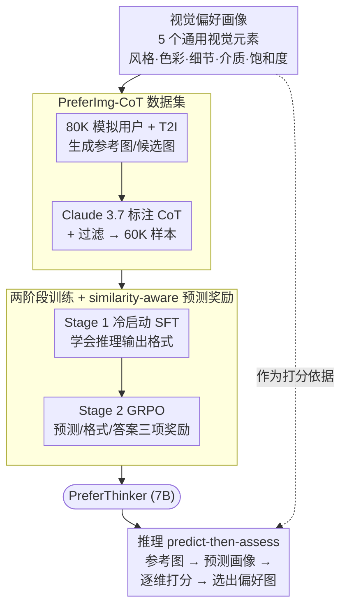

# PreferThinker: Reasoning-based Personalized Image Preference Assessment

**会议**: ICLR2026  
**arXiv**: [2511.00609](https://arxiv.org/abs/2511.00609)  
**代码**: [项目页面](https://preferthinker.github.io/)  
**领域**: 强化学习  
**关键词**: personalized preference assessment, reasoning, GRPO, predict-then-assess, visual preference profile, CoT  

## 一句话总结
提出 PreferThinker，通过引入通用视觉偏好画像（preference profile）连接不同用户，采用 predict-then-assess 的 CoT 推理范式进行可解释的个性化图像偏好评估，结合冷启动 SFT + GRPO 强化学习及 similarity-aware 预测奖励，7B 模型超越 GPT-4o（+5.2%）和 Claude 3.7（+5.1%）。

## 背景与动机
- **个性化偏好评估面临两大难题**：
  1. 每个用户的个性化数据极为稀少且不可大规模扩展，不同于可共享评价标准的通用偏好数据
  2. 个性化偏好跨越多个维度（艺术风格、色彩、介质等），复杂且多样
- **CLIP-based 方法**（PickScore、ImageReward 等）：依赖大规模通用偏好数据训练，无法处理个性化场景，且仅输出数值分数缺乏可解释性
- **MLLM-based 方法**（UnifiedReward 等）：需要大量 VQA pairs 微调，个性化图像数量不足以支撑
- **ViPer**：现有唯一的个性化方法，但仅隐式利用参考图像做分数回归，缺乏可解释推理步骤
- **核心 insight**：虽然每个用户偏好独特，但构成偏好的基本视觉元素（art style、color、detail、art medium、saturation）是通用的，可作为跨用户的桥梁

## 方法详解

### 整体框架
PreferThinker 把个性化偏好评估拆成 predict-then-assess 两步 CoT 推理：先根据用户的喜欢/不喜欢参考图像预测出一份「视觉偏好画像」与对应的非偏好画像，再以这份画像为依据对两张候选图像逐维度打分并给出可解释结论。整套方法围绕一个观察展开——用户偏好千人千面，但构成偏好的视觉元素是通用的，因此用画像作中介既补足了稀缺的个性化数据，又让黑盒打分变成了有据可循的多维推理。为让一个 7B 模型学会这套推理，作者先用通用视觉元素定义画像，再以画像批量合成带推理链的训练数据，最后用两阶段训练把这套 predict-then-assess 的能力灌进模型。

### 关键设计

**1. 视觉偏好画像：用通用视觉元素桥接稀缺的个性化数据**

个性化偏好评估最大的痛点是每个用户的数据极少且无法共享，而不同用户之间又看似毫无交集。PreferThinker 的破局点是把偏好分解到一组通用的视觉元素上：先从 Lexica 平台的文本提示词中识别出 15 个最常见的视觉元素，再经 100 人用户研究投票筛出 top-5——art style、color、detail、art medium、saturation，并收集 288 个相关词汇保证画像表达的多样性。这样一来，每个用户的独特偏好都被表述为这五个维度上的取值组合（同时还预测一份「非偏好画像」描述用户不喜欢什么），复杂偏好得以被结构化描述，不同用户的知识可以在维度层面互相迁移，下游评估也能逐维展开而非整体黑盒打分。

**2. PreferImg-CoT 数据集：用模拟用户批量造出带推理链的训练数据**

既然真实个性化数据无法扩展，作者干脆合成。PreferImg 构造了 80K 模拟用户（其中 20K 为同时含多个偏好的多偏好用户）和 1.36M 图像：为每个用户随机采样 5 个视觉偏好元素组成画像，用覆盖 Lexica、DiffusionDB、COCO 的 190K 初始 prompt 驱动 T2I 模型生成参考图像与候选图像。在此之上，用 Claude 3.7 把每个样本标注成 predict-then-assess 格式的推理链——先从参考图预测画像、再逐维打分给出候选图结论，并配上系统提示与正确范例引导格式；最后过滤掉逻辑不一致或答案与推理不匹配的样本，留下 60K 高质量 CoT 样本，为冷启动训练提供了既有画像监督又有推理过程的范例。

**3. 两阶段训练与 similarity-aware 预测奖励：先学会推理格式再优化预测质量**

直接 RL 难以稳定收敛，作者沿用 DeepSeek-R1 式的先 SFT 后 GRPO 两阶段策略。Stage 1 以 Qwen2.5-VL-7B 为基座，在 60K CoT 样本上做标准自回归交叉熵的冷启动，$\mathcal{L}_{SFT}(\theta) = -\mathbb{E}_{(x,y)\sim\mathcal{D}_{CoT}}\sum_{t=1}^{T}\log P(y_t|x,y_{<t};\theta)$，让模型先掌握 predict-then-assess 的输出结构。Stage 2 用 GRPO 强化：对每个输入采样 $G$ 个 CoT 输出，以组内归一化的优势 $A_i$ 配合 PPO-clip 目标和 KL 正则更新策略。关键在于奖励如何衡量「画像预测得准不准」——单看最终二选一的对错无法反映中间画像的质量。为此作者设计了 similarity-aware 预测奖励：用 SBERT 计算预测画像与真值画像的语义相似度 $s_{text}$，再分别用预测画像和真值画像生成图像、用 DreamSim 计算视觉相似度 $s_{img}$，合成预测奖励 $r_{predict} = w_{img}s_{img} + w_{text}s_{text}$，同时从文本和图像两个空间约束画像质量。最终奖励混合预测、格式、答案三项

$$r = w_p\, r_{predict} + w_f\, r_{format} + w_a\, r_{accuracy}$$

（权重分别取 0.7、0.3、1.0）。消融显示，去掉预测奖励后画像预测准确性下降会直接拖累后续评估，印证了「画像预测越准、评估越合理」这条因果链。

## 实验

### 主实验结果（评估准确率，%）

| 方法 | 参数量 | PreferImg Seen-SP | Seen-MP | Unseen-SP | Unseen-MP | PickaPic | 平均 |
|------|--------|----------|---------|-----------|-----------|---------|------|
| PickScore | 986M | 49.6 | 48.4 | 51.2 | 56.4 | 67.9 | 54.7 |
| ViPer | 8B | 92.4 | 78.0 | 93.4 | 80.0 | 62.2 | 81.2 |
| GPT-4o | - | 94.2 | 80.4 | 92.2 | 85.2 | 65.7 | 83.5 |
| Claude 3.7 | - | 93.8 | 83.2 | 90.2 | 86.0 | 64.9 | 83.6 |
| **PreferThinker** | **7B** | **96.6** | **92.0** | **96.4** | **92.8** | 65.7 | **88.7** |

### 消融实验

| 配置 | Seen-SP Acc | Seen-SP Pred | Unseen-MP Acc | Unseen-MP Pred |
|------|-------------|---------|------------|---------|
| Base (Qwen2.5-VL-7B) | 75.4 | 70.4 | 64.8 | 71.1 |
| + SFT | 92.0 | 84.2 | 81.6 | 74.2 |
| + SFT + RL | 93.8 | 85.0 | 88.4 | 79.5 |
| + SFT + RL + PR (完整) | **96.6** | **87.5** | **92.8** | **83.1** |

### 关键发现
1. **7B 模型超越所有闭源模型**：PreferThinker 在 PreferImg 上全面超越 GPT-4o 和 Claude 3.7
2. **多偏好（MP）场景改进最显著**：相比 SOTA 提升 +8.8%（Seen-MP），说明 profile 机制有效应对复杂偏好
3. **RL 阶段显著增强泛化性**：RL 在 unseen 用户上的提升（+6.8%）大于 seen 用户（+4.6%）
4. **预测奖励是关键**：画像预测越准确，后续评估越合理（无 PR 时预测准确性下降→评估错误）
5. **个性化画像可迁移到图像生成**：预测的偏好画像可引导个性化图像生成

## 亮点
- 提出了连接不同用户的偏好画像（preference profile）概念，优雅地解决个性化数据稀缺问题
- Predict-then-assess 范式实现了可解释的多维评估，不再是黑盒打分
- Similarity-aware prediction reward 设计巧妙，同时利用文本和图像空间的相似度信号
- 7B 开源模型超越 GPT-4o 和 Claude 3.7 等商业模型

## 局限性
- PreferImg 数据集基于模拟用户（T2I 生成），与真实用户偏好分布可能存在差异
- 在 PickaPic 真实用户数据集上表现一般（65.7%），因为 PickaPic 标注的是通用偏好而非个性化偏好
- 画像的 5 个视觉元素固定，可能不覆盖所有个性化维度（如构图、情感）
- 训练需要 T2I 模型生成图像来计算图像相似度奖励，训练成本较高

## 相关工作
- **图像偏好评估**：CLIP-based（PickScore、ImageReward、HPSv2）→ MLLM-based（UnifiedReward、LLaVA-Reward）
- **个性化偏好**：ViPer（ECCV2024）首次尝试，但缺乏可解释性
- **推理型 MLLM**：DeepSeek-R1 启发的 GRPO 后训练范式
- **偏好数据集**：ImageRewardDB、PickaPic、HPD_v2 主要面向通用偏好

## 评分
⭐⭐⭐⭐ (4/5)

方法设计完整，从数据构建到训练都有创新点。偏好画像桥接概念简洁有效。主要的担忧是模拟数据与真实个性化偏好之间的 gap，PickaPic 上的表现也证实了这一点。

<!-- RELATED:START -->

## 相关论文

- [\[ICLR 2026\] Reasoning as Representation: Rethinking Visual Reinforcement Learning in Image Quality Assessment](reasoning_as_representation_rethinking_visual_reinforcement_learning_in_image_qu.md)
- [\[ICLR 2026\] DiVE-k: Differential Visual Reasoning for Fine-grained Image Recognition](dive-k_differential_visual_reasoning_for_fine-grained_image_recognition.md)
- [\[ICLR 2026\] FAPO: Flawed-Aware Policy Optimization for Efficient and Reliable Reasoning](fapo_flawed-aware_policy_optimization_for_efficient_and_reliable_reasoning.md)
- [\[ICLR 2026\] P-GenRM: Personalized Generative Reward Model with Test-time User-based Scaling](p-genrm_personalized_generative_reward_model_with_test-time_user-based_scaling.md)
- [\[CVPR 2026\] JoPPO: Hierarchical Photography Assessment via Contrastive Joint Conditional Probabilistic Reinforcement Learning](../../CVPR2026/reinforcement_learning/joppo_hierarchical_photography_assessment_via_contrastive_joint_conditional_prob.md)

<!-- RELATED:END -->
