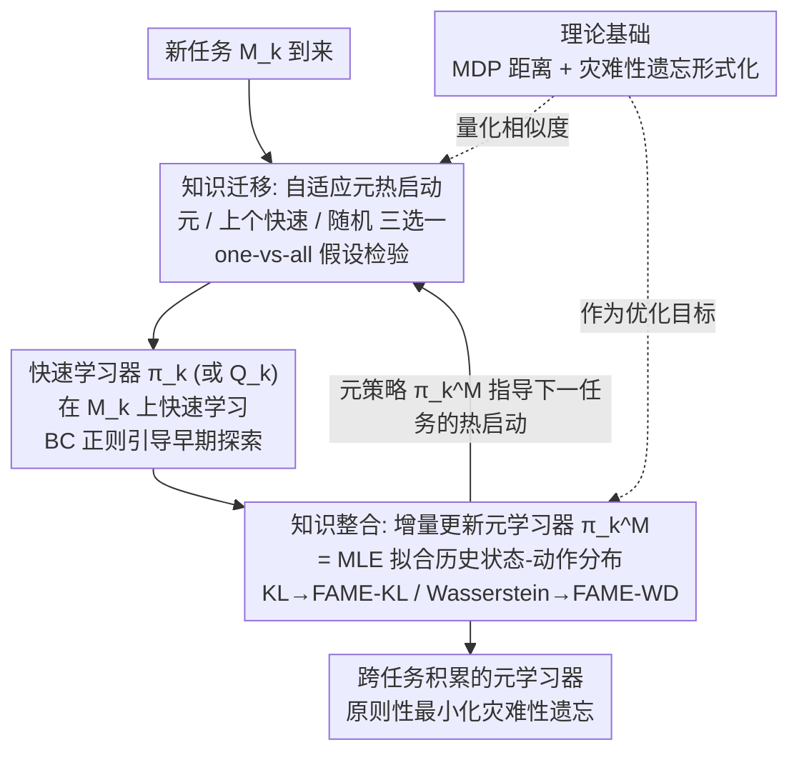

# Principled Fast and Meta Knowledge Learners for Continual Reinforcement Learning

**会议**: ICLR 2026  
**arXiv**: [2603.00903](https://arxiv.org/abs/2603.00903)  
**代码**: [GitHub](https://github.com/datake/FAME)  
**领域**: 强化学习  
**关键词**: continual RL, catastrophic forgetting, knowledge transfer, dual-learner, meta learning

## 一句话总结

受人脑海马体-大脑皮层交互机制启发，提出 FAME 双学习器框架，通过快速学习器进行知识迁移、元学习器进行知识整合，在原则性地最小化灾难性遗忘的前提下实现高效的持续强化学习。

## 研究背景与动机

**持续学习的核心挑战**：传统深度 RL 算法针对单任务设计，面对连续到来的任务序列时，需要在可塑性（快速适应新任务）和稳定性（保留旧知识）之间取得平衡。

**现有方法缺乏理论基础**：现有持续 RL 方法多基于启发式或不同角度的独立设计，缺乏统一的理论框架来分析知识迁移何时有效、如何量化遗忘。

**负迁移问题**：直接 finetune 在任务差异大时会导致性能下降（负迁移），而从头训练（reset）又无法利用先前积累的知识。

**脑科学启发**：人脑中海马体负责快速编码新经验，大脑皮层负责渐进式知识整合，这种分工协作机制为算法设计提供了生物学基础。

**多任务 RL 的局限**：传统多任务 RL 通过最大化平均回报来共享知识，无法显式控制灾难性遗忘。

**缺乏 MDP 距离度量**：此前没有原则性的方法来量化不同环境之间的相似度，难以判断知识迁移是否有益。

## 方法详解

### 整体框架

持续 RL 面对的是一连串任务 $\mathcal{M}_1,\dots,\mathcal{M}_K$（状态、动作空间相同，任务边界已知），既要快速学会新任务，又不能把旧任务忘掉。FAME（FAst and MEta knowledge learner）借鉴人脑海马体-皮层的分工，把这件事拆成两个耦合的学习器：类比海马体的**快速学习器**只负责在当前任务上快速学好一个策略 $\pi_k$（或 $Q_k$），类比大脑皮层的**元学习器** $\pi_k^M$ 负责把历次任务的知识渐进式整合在一起。两者在一个回环里互相喂养——新任务到来时，元学习器先用"自适应元热启动"为快速学习器挑一个最靠谱的初始化、把先验知识迁移过去（**知识迁移**）；快速学习器在该任务上训练完后，它学到的策略又被增量整合回元学习器，并在这一步显式最小化灾难性遗忘（**知识整合**）。整个回环的两块基石，是论文先建立的两个可量化定义：环境之间有多像（MDP 距离）、旧知识被改动了多少（灾难性遗忘）。

### 关键设计

**1. 两块理论基础：把"环境多像""遗忘多少"变成可量化的目标**

以往持续 RL 的方法多是启发式拼凑，说不清知识迁移何时有益、遗忘到底有多严重——因为缺两个能算的量。FAME 先补上：**MDP 距离**用两个环境各自最优解的差异来刻画相似度，既可取最优 $Q$ 函数的 $\ell_2$ 距离 $d_Q(Q_1^*,Q_2^*)$，也可取最优策略的 KL 散度 $d_\pi(\pi_1^*,\pi_2^*)$，于是"两个任务像不像"有了统一的几何标尺。**灾难性遗忘**则定义为在**旧任务的状态访问分布**下、新旧策略（或 $Q$）的加权差异，例如策略级的

$$\mathrm{CF}(\pi_{k-1},\pi_k)=\sum_s \mu_{k-1}^{\pi_{k-1}}(s)\,d_\pi\!\big(\pi_k(\cdot|s),\pi_{k-1}(\cdot|s)\big).$$

关键在于权重用**旧策略** $\pi_{k-1}$ 的访问分布而非新策略——它让度量聚焦于旧任务里真正高频、重要的状态，若改用新策略，那些它已不再访问、却被悄悄改坏的状态就会被漏掉。有了这两个定义，后面整个双学习器才有可优化的目标，而不只是直觉。

**2. 知识迁移——自适应元热启动：用假设检验回避负迁移**

新任务一来该怎么初始化快速学习器？直接 finetune 旧参数在任务相似时很好，但任务差异大时会负迁移、拖慢甚至损坏学习；从头 reset 又白白浪费了积累的先验。FAME 不写死规则，而是在新任务早期的交互阶段，对三种候选初始化——元学习器 $\pi_{k-1}^M$、上一个快速学习器 $Q_{k-1}$（finetune）、随机初始化 $Q^0$（reset）——分别做策略评估得到 $V_k^M,V_k^f,V_k^r$，再用 one-vs-all 假设检验

$$H_0:V_k^M\le\max\{V_k^f,V_k^r\}\quad\text{vs.}\quad H_1:V_k^M>\max\{V_k^f,V_k^r\}$$

挑统计上最好的那个；拒绝 $H_0$、确实该用元热启动时，由于元学习器此时是策略形式、无法直接拷给 $Q$ 函数，便改用行为克隆（BC）正则在早期把元策略当专家来引导探索。这套统计框架取代了启发式：实验中对已知环境约 95.1% 选择元热启动，对全新环境则更多回退到随机初始化。

**3. 知识整合——增量元学习器更新：遗忘最小化等价于最大似然**

任务训练完后要把新知识并入元学习器，但直接保存所有历史 $Q_i$ 做加权平均会随任务数线性膨胀、不可扩展。FAME 给出可增量的整合规则（Proposition 1）：在 KL 散度下最小化策略级遗忘目标，等价于对元学习器做**最大似然估计**——让元学习器去拟合所有已遇环境状态-动作分布的混合：

$$Q_k^M=\arg\max_{\widetilde Q_k^M}\sum_{i=1}^{k}\mathbb{E}_{w_i^Q}\big[\log\widetilde\pi_k^M\big].$$

这把持续 RL 与多任务 RL 直接连了起来，且只需维护单个元策略、逐任务更新。论文特意采用策略级而非 $Q$ 值级定义，是因为 $Q$ 值在陌生环境里尺度不定、高奖励任务会盖过低奖励任务，而策略对奖励尺度更鲁棒、方差也更低。在连续控制里高斯策略下 KL 对几何结构不敏感，FAME 进一步给出 **FAME-WD**：改用有闭式解的 2-Wasserstein 距离衡量策略差异，既能高效增量更新又利用了数据空间几何，实验中略优于用 KL 的 FAME-KL。

### 一个完整示例：第 $k$ 个任务到来时发生了什么

假设前 $k-1$ 个任务已学完，元学习器 $\pi_{k-1}^M$ 里攒着它们的混合知识。新任务 $\mathcal{M}_k$ 到来后，FAME 先花 $L$ 步分别试用元学习器、上个快速学习器、随机初始化三种热启动并评估回报，假设检验判出 $\mathcal{M}_k$ 与旧任务相似（约 95% 的已知环境会落在这一档），于是选元热启动、用 BC 正则把 $\pi_{k-1}^M$ 当专家引导探索；快速学习器据此在 $\mathcal{M}_k$ 上快速训出 $\pi_k$；任务最后 $N$ 步（约占数据 1–2%）把状态-动作对存进元缓冲区，用来估计整合权重，再按 Proposition 1 把 $\pi_k$ 增量并入、得到 $\pi_k^M$——这一步显式压低对旧任务的遗忘。$\pi_k^M$ 随即成为下一个任务热启动的候选，回环继续。若来的是与旧任务差异很大的全新环境，假设检验则更可能选随机初始化，从而避开负迁移。

### 损失函数 / 训练策略

知识整合阶段最小化策略级灾难性遗忘目标（Eq. 4），等价于最大化元学习器对所有历史状态-动作分布的对数似然。在值函数方法中，元热启动以行为克隆正则化的形式引导早期探索，目标写作 $L(Q_k)=L_0(Q_k)+\lambda\,\mathbb{E}_s[\mathrm{KL}(\pi_{k-1}^M\,\|\,\pi^{Q_k})]$，把元策略当作专家约束新 $Q$ 函数。为估计整合目标中旧任务的状态访问权重 $w_i^Q$，FAME 维护一个**元缓冲区** $\mathcal{M}$，仅在每个任务最后 $N$ 步收集状态-动作对（约占训练数据 1–2%），开销很小。

## 实验关键数据

### 主实验

**MinAtar 结果（10 sequences × 3 seeds）**：

| 方法 | Avg. Perf ↑ | FT ↑ | Forgetting ↓ |
|------|------------|------|-------------|
| Reset | 6.51 ± 1.67 | 0.74 ± 0.38 | 1.31 ± 0.23 |
| Finetune | 10.62 ± 2.75 | 0.89 ± 0.49 | 1.26 ± 0.32 |
| LargeBuffer | 10.71 ± 2.84 | 1.16 ± 0.59 | 1.65 ± 0.33 |
| **FAME** | **14.54 ± 0.58** | **1.69 ± 0.17** | **0.72 ± 0.13** |

**Meta-World 结果（3 sequences × 10 seeds）**：

| 方法 | Avg. Perf ↑ | FT ↑ | Forgetting ↓ |
|------|------------|------|-------------|
| Reset | 0.093 ± 0.017 | 0.000 | 0.710 ± 0.030 |
| PackNet | 0.491 ± 0.025 | -0.194 | 0.000 |
| FAME-KL | 0.733 ± 0.026 | 0.022 | 0.073 ± 0.019 |
| **FAME-WD** | **0.767 ± 0.024** | -0.003 | **0.023 ± 0.015** |

### 消融实验

**自适应元热启动的选择比例**：

| 到达环境类型 | Meta Warm-up | Reset | Finetune |
|-------------|-------------|-------|----------|
| 已知环境 | 95.1% | 低 | 低 |
| 未知环境 | 低 | 较高 | 低 |

**Atari 游戏结果**：

| 方法 | Freeway Avg. Perf | SpaceInvader Avg. Perf |
|------|------------------|----------------------|
| Reset | 0.16 | 0.10 |
| PackNet | 0.41 | 0.47 |
| ProgressiveNet | 0.39 | 0.61 |
| **FAME** | **0.90** | **0.96** |

### 关键发现

1. FAME 在所有基准上都显著优于基线方法，平均性能最高且方差最小，表现最为稳定。
2. 自适应元热启动能够正确识别已知/未知环境：对已知环境 95.1% 的概率选择元热启动，对新环境更多选择随机初始化。
3. FAME-WD 在连续动作空间中略优于 FAME-KL，验证了 Wasserstein 距离在复杂策略分布上的优势。
4. 虽然 PackNet 通过存储模型参数可以实现零遗忘，但它需要预知任务数量和 task ID，实用性受限。

## 亮点与洞察

1. **理论贡献扎实**：首次为持续 RL 提供了 MDP 距离和灾难性遗忘的形式化定义，将算法设计建立在坚实的理论基础上。
2. **生物学启发自然且有效**：海马体-皮层的双系统类比不是简单的比喻，而是直接映射到了算法的两个组件及其交互方式。
3. **知识整合 = MLE**：最小化策略级灾难性遗忘等价于最大似然估计，建立了持续 RL 与多任务 RL 之间的深刻联系。
4. **假设检验选择热启动**：用统计学的严格框架解决负迁移问题，而非依赖启发式规则。
5. **同时适用于值函数和策略方法**：框架的通用性强，不局限于特定的 RL 算法。

## 局限与展望

1. **假设限制**：要求相同的状态和动作空间、已知任务边界，这在实际应用中不一定成立。
2. **元缓冲区大小**：虽然只存储少量数据，但随任务数增加仍会线性增长。
3. **可扩展性**：假设检验在任务切换频率高时可能增加计算开销。
4. **未来方向**：学习潜在表示替代直接的策略/值函数存储；在线假设检验处理未知任务边界；上下文嵌入增强知识迁移。

## 相关工作与启发

- 与 **PackNet** 和 **ProgressiveNet** 相比：这些方法通过存储参数/网络结构避免遗忘，但不灵活且不具备知识迁移能力；FAME 通过原则性的知识整合同时解决遗忘和迁移。
- 与 **PT-DQN** 的差异：PT-DQN 的永久值函数知识保留能力有限；FAME 的元学习器通过显式优化灾难性遗忘目标更有效。
- **启发**：将理论驱动的方法与脑科学启发结合，可以为 RL 算法设计提供更有原则的指导。灾难性遗忘的形式化可以推广到其他持续学习场景。

## 评分

- **新颖性**: ⭐⭐⭐⭐ 理论贡献（MDP 距离、遗忘度量）有创新性，双学习器框架虽受启发于 CLS 理论但在 RL 中的形式化新颖
- **实验充分度**: ⭐⭐⭐⭐⭐ 涵盖像素级和连续控制两类基准、值函数和策略梯度两类算法，统计结果充分（30 seeds）
- **写作质量**: ⭐⭐⭐⭐ 结构清晰，理论推导严谨，从基础定义到算法设计的逻辑链条完整
- **价值**: ⭐⭐⭐⭐ 为持续 RL 提供了理论基础和实用算法，弥合了理论与实践的差距

<!-- RELATED:START -->

## 相关论文

- [\[NeurIPS 2025\] Continual Knowledge Adaptation for Reinforcement Learning](../../NeurIPS2025/reinforcement_learning/continual_knowledge_adaptation_for_reinforcement_learning.md)
- [\[ICLR 2026\] Self-Improving Skill Learning for Robust Skill-based Meta-Reinforcement Learning](self-improving_skill_learning_for_robust_skill-based_meta-reinforcement_learning.md)
- [\[ICML 2026\] Position: Deployed Reinforcement Learning should be Continual](../../ICML2026/reinforcement_learning/position_deployed_reinforcement_learning_should_be_continual.md)
- [\[ICML 2025\] Position: Lifetime Tuning is Incompatible with Continual Reinforcement Learning](../../ICML2025/reinforcement_learning/position_lifetime_tuning_is_incompatible_with_continual_reinforcement_learning.md)
- [\[CVPR 2026\] Masked Auto-Regressive Variational Acceleration: Fast Inference Makes Practical Reinforcement Learning](../../CVPR2026/reinforcement_learning/masked_auto-regressive_variational_acceleration_fast_inference_makes_practical_r.md)

<!-- RELATED:END -->
