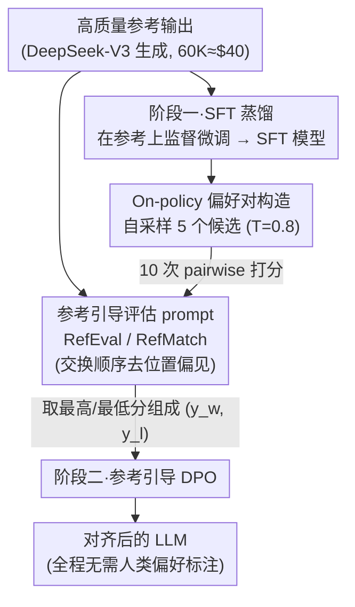

# References Improve LLM Alignment in Non-Verifiable Domains

**会议**: ICLR 2026  
**arXiv**: [2602.16802](https://arxiv.org/abs/2602.16802)

**代码**: [GitHub](https://github.com/yale-nlp/RLRR)

**领域**: 强化学习  
**关键词**: 参考引导评估, 非可验证域, LLM-as-Judge, 自改进, DPO

## 一句话总结

提出参考引导的LLM-as-Judge方法(RefEval)，用高质量参考输出作为"软验证器"，使LLM-judge准确率提升6.8%；进而构建两阶段自改进流程(SFT蒸馏+参考引导DPO)，在AlpacaEval/Arena-Hard上分别超过SFT蒸馏+19.2/+16.5，匹配微调奖励模型ArmoRM的性能，证明无需人类偏好标注即可实现非可验证域的高效LLM对齐。

## 研究背景与动机

**RLVR的局限**：强化学习+可验证奖励(RLVR)在推理任务(数学/代码)上效果显著，但对齐任务(指令跟随/摘要/创意写作)缺少ground-truth验证器，无法直接应用RLVR。

**RLHF/RLAIF的代价**：当前对齐后训练依赖RLHF或RLAIF，需要训练专门的奖励模型(RM)或使用LLM-as-Judge，前者需要大量人类偏好标注，后者存在位置偏见和冗长偏见，准确度有限。

**参考输出的可获得性**：虽然偏好标注成本高，但高质量参考输出往往可以廉价获取——例如用前沿LLM生成(60K条DeepSeek-V3参考仅需约40美元)，这是一个未被充分利用的信号源。

**Naive使用参考效果差**：已有工作(LLMBar、HREF)尝试将参考拼入prompt，但未明确指导judge如何使用参考，仅带来微弱改善——说明需要精心设计的prompting策略。

**自改进的潜力**：如果能用参考引导LLM自己做judge提供偏好信号，就无需外部人类/AI反馈，实现"半自改进"——这将显著降低对齐训练的数据和标注需求。

**核心研究问题**：*参考引导的LLM评估器能否作为软验证器，支持无外部监督的LLM对齐RL？* 论文从评估和训练两个维度系统回答。

## 方法详解

### 整体框架

论文把"高质量参考输出"当作非可验证域里的**软验证器**：对齐任务（指令跟随、摘要、创意写作）没有数学/代码那样的 ground-truth 验证器，但前沿模型生成的参考答案往往廉价可得，于是用它来替代验证器。整条思路分两层：先解决"怎么让 judge 正确用参考"——设计专门的 pairwise 评估 prompt（RefEval / RefMatch），把一个普通 LLM 变成更准的评判器；再把这个参考引导的 judge 当成偏好信号源，串成"SFT 蒸馏 → 参考引导 DPO"的两阶段自改进流程，其中 DPO 所需的偏好对由模型 on-policy 自采样、再用 RefEval judge 全配对打分得到。整个过程不需要任何人类偏好标注，只需一批参考输出。

### 关键设计

**1. 参考引导的评估 prompt：把"是否给参考"变成"怎么用参考"**

已有工作（LLMBar、HREF）只是把参考拼进 prompt，却没告诉 judge 该拿参考做什么，因此收益微弱——这说明信号一直在、缺的只是用法。论文据此设计了两档指令。RefEval 让 judge 评估哪个候选输出在质量和内容上与参考更一致，但同时仍要回应原始指令，参考充当质量标杆而非唯一答案；RefMatch 更激进，直接把 judge 定位成"语义和风格匹配器"，明确要求判断哪个候选与参考更相似。作为对照的 Ref-Free 不给参考，仅沿指令跟随质量、事实性、冗长度等维度打分。pairwise 评估时还把两个候选的呈现顺序交换两遍取平均，以压住 LLM-judge 已知的位置偏见。这种"明确指导用法 + 去偏"的设计相比简单拼接参考能多拿 4–5 个百分点，并让不同 judge 之间的一致率从 76.6% 升到 81.4%——参考给了大家一个共享的决策锚点。

**2. 两阶段自改进：先用参考蒸馏，再用参考引导 DPO 精修**

直接在基座上做偏好优化并不稳，论文改成两阶段。第一阶段在高质量参考输出上做监督微调（SFT 蒸馏），先把前沿模型的能力迁移进基座；实验显示这一步本身就比直接套用现成奖励模型做 DPO 更强（53.9 vs 49.2 AlpacaEval），因为好参考就是强监督信号。第二阶段在 SFT 模型上做参考引导 DPO，优化标准 DPO 损失

$$\mathcal{L}_{\text{DPO}}(\pi_\theta; \pi_{\text{ref}}) = -\mathbb{E}_{(x, y_w, y_l) \sim D}\left[\log\sigma\left(\beta\log\frac{\pi_\theta(y_w|x)}{\pi_{\text{ref}}(y_w|x)} - \beta\log\frac{\pi_\theta(y_l|x)}{\pi_{\text{ref}}(y_l|x)}\right)\right]$$

关键差别在于偏好对 $(y_w, y_l)$ 不靠人标，而由设计 1 的参考引导 judge 自动产出——这样"评估上的改善"就直接转化成了"训练信号"。

**3. On-policy 偏好对构造：自采样 + 全配对打分**

DPO 用的偏好数据全部由待微调模型自己在线生成，而非借用外部模型——已有研究表明 on-policy 数据比静态偏好标注更利于 DPO。具体做法是对每条指令以温度 0.8 采样 5 个候选，用 RefEval judge 对全部 $\binom{5}{2}=10$ 对做 pairwise 比较，按胜负累计出每个候选的平均质量分，再取分数最高与最低的两条组成一个训练对 $(y_w, y_l)$。这样 60K 条指令累计约 600K 次 judge 判断；参考由 DeepSeek-V3 生成、60K 条仅约 40 美元，使整条流程在成本上也可行。

## 实验结果

### 表1: LLM-Judge评估准确率(11个开源模型×5个数据集平均)

| 方法 | Natural | Adversarial | MTBench | InstruSum | HREF | **平均** |
|------|---------|-------------|---------|-----------|------|---------|
| LLMBar-Base | 83.1 | 61.7 | 74.6 | 70.2 | 72.0 | 72.3 |
| CoT | 82.0 | 60.1 | 75.4 | 69.1 | 69.6 | 71.2 |
| HREF-Ref | 85.3 | 62.3 | 76.5 | 70.8 | 79.2 | 74.8 |
| RefMatch | 84.6 | 74.1 | 76.3 | 72.9 | 80.4 | 77.7 |
| **RefEval** | **86.8** | **74.9** | **76.7** | **74.5** | **82.7** | **79.1** |

→ RefEval比无参考基线LLMBar-Base高+6.8%，比已有参考方法HREF-Ref高+4.3%。

### 表2: 自改进训练结果(AlpacaEval / Arena-Hard)

| 方法 | Llama-3 AE | Llama-3 AH | Qwen2.5 AE | Qwen2.5 AH |
|------|-----------|-----------|------------|------------|
| Base | 25.0 | 27.1 | 14.4 | 23.4 |
| DSV3-Distill (SFT) | 53.9 | 42.2 | 48.8 | 56.5 |
| ROUGE | 56.4 | 52.1 | 50.9 | 67.4 |
| BERTScore | 58.8 | 53.0 | 55.3 | 64.5 |
| RefFree | 67.5 | 53.8 | 65.1 | 71.8 |
| ArmoRM (微调RM) | 73.9 | 58.6 | 66.8 | 72.2 |
| **RefEval** | **73.1** | **58.7** | **70.0** | **74.1** |

→ RefEval匹配甚至超越ArmoRM，但无需训练单独奖励模型。

### 表3: 参考质量消融(Llama-3-8B)

| 参考来源 | Distill AE | RefFree AE | RefEval AE | RefEval AH |
|---------|-----------|-----------|-----------|-----------|
| DeepSeek-V3 (强) | 53.9 | 67.5 | 73.1 | 58.7 |
| GPT-4o-mini (弱) | 28.7 | 42.6 | 44.4 | 58.3 |

→ 弱参考下RefEval仍优于RefFree(+1.8/+16.6)，参考引导机制本身有结构性优势。

## 关键发现

1. **小模型受益最大**：Llama-3-8b用RefEval比LLMBar-Base提升+17.4%，强模型qwen-2.5-72b提升+5.2%——参考弥补了小模型的知识不足。

2. **Inter-judge一致性提高**：RefEval使不同judge之间的平均一致率从76.6%提升至81.4%——参考提供了共享的决策锚点，减少了判断方差。

3. **SFT蒸馏>直接DPO**：在高质量参考上SFT优于直接用ArmoRM的DPO(53.9 vs 49.2 AlpacaEval)——说明好参考本身就是强信号。

4. **Coding&Math受益最大**：按任务类别分析，参考引导在Coding&Math上改善最显著；创意任务上改善因模型而异——结构化任务更容易被参考锚定。

5. **前沿judge也可增强**：GPT-4o用人类编辑的Oracle参考在LLMBar-Adversarial上仍有提升——说明人类参考的信息量大于最强LLM。

## 亮点与创新

- **"参考=软验证器"的概念迁移**：将RLVR的核心优势(有参考答案做验证)巧妙迁移到非可验证域，概念简洁但意义深远。

- **系统性大规模实验**：11个judge × 5个数据集 × 2个基座模型 × 多种消融——实验覆盖度远超同类工作，可信度高。

- **prompt设计的工程洞察**：证明"如何告诉judge使用参考"比"是否提供参考"更关键——简单拼接 vs 精心指导差距达4-5个百分点。

- **实用性强**：60K参考仅需$40(DeepSeek-V3)→自改进无需人类标注→性能匹配微调RM→大幅降低对齐训练门槛。

## 局限性

1. **参考质量依赖**：方法效果与参考来源的质量强相关；弱参考(GPT-4o-mini)虽仍有收益，但显著低于强参考(DeepSeek-V3)——在缺乏前沿模型生成参考的场景下效果存疑。

2. **仅验证了通用对齐任务**：评估限于AlpacaEval/Arena-Hard等通用指令跟随基准，未测试医学/法律等需要领域专业知识的专业场景。

3. **pairwise比较计算成本高**：每条指令需要 $\binom{5}{2}=10$ 次pairwise比较，60K条指令共600K次judge调用——虽然用自身模型做judge，但推理成本不可忽视。

4. **半自改进而非完全自改进**：仍依赖外部前沿模型提供参考输出——不是真正的"自力更生"，更准确地说是"带外部参考的自评估"。

5. **单轮训练**：仅实验了一轮SFT+DPO，未探索迭代自改进(多轮SFT→DPO循环)是否能进一步提升。

## 相关工作对比

- **vs HREF (Lyu et al., 2024)**：HREF也使用人类参考增强LLM-judge，但评估规模小(少量LLM/数据集)，且未将参考引导扩展到训练。本文在5个数据集×11个judge上系统验证，并首次将参考引导judge用于自改进DPO训练，从评估工具升级为训练信号源。

- **vs RevisEval (Zhang et al., 2025)**：RevisEval生成"响应适应性参考"来改善评估准确度，聚焦于静态评估场景。本文使用固定的外部参考(前沿模型生成)，并将其延伸到动态训练流程，证明评估改善可以转化为训练效果——从方法论上更完整。

- **vs BLEUBERI (Chang et al., 2025)**：BLEUBERI用传统指标(BLEU)作为参考基准奖励做RL对齐。本文用LLM-judge替代BLEU/BERTScore等固定指标→在对齐训练中RefEval显著优于ROUGE和BERTScore(73.1 vs 56.4/58.8)，表明LLM-judge作为软验证器比硬指标更灵活有效。

## 评分

- **新颖性**: ⭐⭐⭐⭐ 参考引导评估→自改进训练的系统链路是新的，但单个组件(LLM-judge/DPO/蒸馏)均为已有技术。
- **实验充分度**: ⭐⭐⭐⭐⭐ 11个judge×5基准+两个基座模型+参考质量消融+任务类别分析+统计显著性检验——非常全面。
- **写作质量**: ⭐⭐⭐⭐⭐ 动机链条清晰(RLVR→gap→参考引导→评估→训练)，实验逻辑层层递进，结论不过度外推。
- **实用价值**: ⭐⭐⭐⭐⭐ $40参考+自改进=匹配微调RM——对资源有限的团队做LLM对齐具有直接指导意义。

<!-- RELATED:START -->

## 相关论文

- [\[ICLR 2026\] From Verifiable Dot to Reward Chain: Harnessing Verifiable Reference-based Rewards for RL of Open-ended Generation](from_verifiable_dot_to_reward_chain_harnessing_verifiable_reference-based_reward.md)
- [\[ICLR 2026\] TROLL: Trust Regions improve Reinforcement Learning for Large Language Models](troll_trust_regions_improve_reinforcement_learning_for_large_language_models.md)
- [\[ACL 2026\] LearnAlign: Data Selection for LLM Reinforcement Learning with Improved Gradient Alignment](../../ACL2026/reinforcement_learning/learnalign_data_selection_for_llm_reinforcement_learning_with_improved_gradient_.md)
- [\[ICLR 2026\] Reasoning Boosts Opinion Alignment in LLMs](reasoning_boosts_opinion_alignment_in_llms.md)
- [\[ICLR 2026\] LongRLVR: Long-Context Reinforcement Learning Requires Verifiable Context Rewards](longrlvr_long-context_reinforcement_learning_requires_verifiable_context_rewards.md)

<!-- RELATED:END -->
