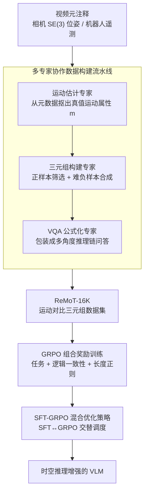

# ReMoT: Reinforcement Learning with Motion Contrast Triplets

**会议**: ICLR 2026  
**arXiv**: [2603.00461](https://arxiv.org/abs/2603.00461)  
**代码**: 无  
**领域**: 强化学习  
**关键词**: 视觉语言模型, 时空推理, 运动对比三元组, GRPO, 强化学习

## 一句话总结
ReMoT 提出一个统一的训练范式，通过规则驱动的运动对比三元组数据集（ReMoT-16K）和 Group Relative Policy Optimization（GRPO）组合奖励优化，系统性地提升 VLM 在时空一致性推理上的能力，在时空推理任务上实现 25.1% 的性能跃升。

## 研究背景与动机
1. **领域现状**：视觉语言模型（VLM）已发展为通用感知系统，在 AIGC、具身智能和自动驾驶等领域广泛应用。这些任务本质上要求模型能够在空间和时间维度上理解物理场景的演变。
2. **现有痛点**：当前主流 VLM（包括 GPT-4o、Claude-Sonnet-4.5、Gemini-2.5-Pro 等）在时空一致性推理上存在根本缺陷——会混淆相机旋转与物体运动、误判机械臂状态、错误推断角色运动方向等。
3. **核心矛盾**：现有改进方法（架构修改、数据增强）都只是零散修补，缺乏从数据、训练、评估三个维度系统性解决问题的统一框架。训练数据以静态图文对为主，缺少对细粒度运动属性的显式建模。
4. **本文要解决什么**：系统性地解决 VLM 在时空一致性推理上的根本短板，涵盖数据构建、训练优化和评估基准三个层面。
5. **切入角度**：通过运动对比三元组（anchor-positive-negative）显式建模帧间运动属性，迫使模型学习细粒度运动判别而非依赖表面视觉模式。
6. **核心 idea**：利用视频元注释（相机位姿矩阵、机器人动作日志等）通过多专家协作流水线自动生成大规模运动对比三元组，结合 GRPO 强化学习和组合奖励进行训练。

## 方法详解

### 整体框架
ReMoT 把"提升 VLM 时空推理"拆成数据与训练两条线：先用一条多专家流水线把视频自带的元注释（相机位姿、机器人遥测）自动转成大规模运动对比三元组（ReMoT-16K），再以 Qwen3-VL-4B-Thinking 为底座，用 GRPO 组合奖励在这批三元组上做强化学习，并辅以 SFT 与 GRPO 的混合调度稳定训练。整套设计的核心是用"锚-正-负"三元组逼模型学会细粒度运动判别，而不是靠表面视觉模式蒙答案。

### 关键设计

**1. 多专家协作数据构建流水线：把视频元注释自动炼成运动对比三元组**

直接拿 VLM 生成训练数据会产生约 55% 的格式错误且 API 成本高昂，因此 ReMoT 改用三类专家串联、各司其职。运动估计专家 $g:(I_t, I_{t'}, \mathcal{A}) \to m$ 负责从元数据里抠出精确运动属性——导航专家从 SE(3) 位姿矩阵计算刚体变换，操作专家从机器人遥测数据提取末端执行器轨迹，得到的 $m$ 是带物理意义的真值而非模型猜测。三元组构建专家 $(\phi, \mathcal{N})$ 再据此组装样本：当运动幅度落在属性特定阈值内即 $\|m\| \in \mathcal{T}_m$ 时，$\phi(I_t, I_{t'}, m) = (I_{\text{anchor}}, I_{\text{pos}}, m)$ 筛出显著的正样本对；负样本则由属性条件合成而来，几何合成 $\mathcal{T}_{\text{geo}}$ 模拟反向运动、检索 $\mathcal{R}$ 找视觉相似但属性不匹配的帧，从而构造出"看起来像、动得不一样"的难负例。最后由 VQA 公式化专家把每个三元组包装成多角度推理链问答（多选、判断、填空、比较推理等），覆盖不同推理形式。整条流水线既绕开了人工标注的高成本，又靠真值元数据保证了三元组的物理正确性，可规模化产出高质量数据。

**2. GRPO 组合奖励训练：把"答案对不对"和"推理通不通"解耦成可优化信号**

训练用 GRPO 优化，目标函数 $J(\theta) = \mathbb{E}_{q,\{o_i\}}\left[\frac{1}{G}\sum_{i=1}^{G}\min(r_i\hat{A}_i, \text{clip}(r_i, 1-\varepsilon, 1+\varepsilon)\hat{A}_i) - \beta D_{\text{KL}}(\pi_\theta \| \pi_{\text{ref}})\right]$ 在一组 $G$ 个采样输出上做组内相对优势估计并带 KL 约束。关键在奖励的拆解：作者观察到约 31.4% 的基线错误并非答错而是推理链自相矛盾，于是引入逻辑一致性奖励 $R_{\text{logic}}(o) \in \{+1, 0, -1\}$，通过传递性检查抓出诸如 $L_1 < L_2$、$L_2 < L_3$ 却又 $L_3 < L_1$ 的矛盾；同时用 CoT 长度正则 $R_{\text{length}}(o_i) = -\max(0, |o_i^{\text{think}}| - L_{\text{target}})$ 压制冗长跑题的思维链。三者按 $R_i = R_{\text{task}} + \lambda_1 R_{\text{logic}} + \lambda_2 R_{\text{length}}$ 组合（任务、逻辑、长度权重约为 3.5:3.5:1.7）。这样逻辑奖励能直接对准"推理与答案脱钩"这一痛点，消融里加上它把操作子集的逻辑一致性拉到 99.3%、Overall 提升 10.6%。

**3. SFT-GRPO 混合优化策略：让语言对齐和奖励对齐联合演化**

纯 SFT 会让模型逐渐丧失 CoT 推理能力甚至训练崩溃，纯 GRPO 又缺一个稳定起点，ReMoT 因此把两者混合。顺序混合（SFT→GRPO）先用 SFT 提供稳定初始化再切到 GRPO 精调；交替混合（SFT↔GRPO）每隔几步在 SFT 和 GRPO 间来回切换，让语言流畅性与奖励对齐在同一进程里交替强化。实验表明交替方案最优，既保住了推理链的可读性，又拿到了 RL 带来的判别增益。

### 损失函数 / 训练策略
SFT 阶段只在 `<answer>` 标签内的 token 上计算交叉熵，避免梯度污染推理段；GRPO 用 4 个 rollout、batch size 16、KL 正则系数 0.01。交替混合策略训练 2 个 epoch 后达到最佳（Overall 39.9%、Partial 67.7%），全程在 8× A800 GPU 上以混合精度完成。

## 实验关键数据

### 主实验

| 模型 | Overall Acc.(%) | Partial Acc.(%) | 备注 |
|------|----------------|-----------------|------|
| Qwen3-VL-CoT-4B (基线) | 20.7 | 38.9 | 基础模型 |
| GRPO | 33.6 | 61.6 | 纯 RL |
| SFT→GRPO | 35.0 | 63.3 | 顺序混合 |
| **SFT↔GRPO** | **38.0** | **64.0** | 交替混合，最佳 |
| SFT↔GRPO (2 epochs) | 39.9 | 67.7 | 更长训练 |
| GPT-5-Chat | 10.4 | 33.3 | 闭源 |
| Gemini-2.5-Pro | 26.4 | 49.1 | 闭源 |

### 消融实验

| 配置 | Overall Acc.(%) | Partial Acc.(%) | 说明 |
|------|----------------|-----------------|------|
| 无训练（基线） | 20.7 | 38.9 | Qwen3-VL-CoT-4B |
| 仅操作数据 | 23.9 | 46.7 | +3.2% |
| + 导航数据 | 32.4 | 57.6 | +8.4%，空间关系推理关键 |
| + 仿真数据 | 38.0 | 64.0 | +5.6% |
| Binary 对比 vs Triplet 对比 | 19.4 vs 38.0 | 39.4 vs 64.0 | 三元组设计提升 +18.6% |
| GRPO w/o 逻辑奖励 | 68.6 (Ov.) | 77.3 (Par.) | 操作子集 |
| GRPO w/ 逻辑奖励 | 78.0 (Ov.) | 81.3 (Par.) | +10.6%，逻辑一致性 99.3% |

### 关键发现
- 交替 SFT-GRPO 训练比纯 SFT 或纯 GRPO 更优，结合了语言流畅性和奖励对齐的联合优化
- 三元组对比比二元对比提升 18.6%（Overall），联合对比监督是细粒度运动判别的关键
- 多专家流水线数据质量远优于 VLM 生成数据，后者在扩展时波动大且上限约 0.49
- 4B 模型即可在时空推理基准上超越 7.5× 大的 Qwen3-VL-30B-CoT
- 纯 SFT 训练会导致训练崩溃，模型丧失 CoT 推理能力

## 亮点与洞察
- 系统性地从数据、训练、评估三个维度解决 VLM 时空推理能力的不足，是一个完整框架
- 多专家协作流水线巧妙利用视频元注释避免了昂贵的人工标注和不可靠的模型标注
- 组合奖励设计（特别是逻辑一致性奖励）针对性强，直接解决推理链与答案脱钩的问题
- 用 4B 模型匹配甚至超越 GPT-4o 级别的时空推理能力，性价比极高

## 局限性 / 可改进方向
- ReMoT-16K 数据集规模相对有限（16.5K 三元组），扩大规模可能进一步提升
- 闭源模型仅在约 40 个样本的 mini-benchmark 上评估，受 API 成本限制
- 当前仅在 4B/8B 模型上验证，更大规模模型的效果有待探索
- 运动对比三元组主要来自导航、操作和仿真，可扩展到更多领域（如体育、医疗）
- 推理链忠实度虽从 60% 降到 12% 的错误率，但仍有提升空间

## 相关工作与启发
- GeoNLF、BARF 等 pose-free NeRF 方法启发了从元数据提取运动信息的思路
- GRPO 在视觉推理中的成功应用表明 RL 方法在多模态场景中的潜力
- 运动对比三元组的设计方式可推广到视频理解、机器人动作识别等下游任务
- 逻辑一致性奖励的设计思想可迁移到其他需要多步推理一致性的任务

## 评分
- 新颖性: ⭐⭐⭐⭐
- 实验充分度: ⭐⭐⭐⭐⭐
- 写作质量: ⭐⭐⭐⭐
- 价值: ⭐⭐⭐⭐

<!-- RELATED:START -->

## 相关论文

- [\[CVPR 2026\] Local Motion Matters: A Deconstruct-Recompose Paradigm for Reinforcement Learning Pre-training from Videos](../../CVPR2026/reinforcement_learning/local_motion_matters_a_deconstruct-recompose_paradigm_for_reinforcement_learning.md)
- [\[ICLR 2026\] Entropy-Preserving Reinforcement Learning (REPO / ADAPO)](entropy-preserving_reinforcement_learning.md)
- [\[ICLR 2026\] QuRL: Efficient Reinforcement Learning with Quantized Rollout](qurl_efficient_reinforcement_learning_with_quantized_rollout.md)
- [\[ICLR 2026\] Helix: Evolutionary Reinforcement Learning for Open-Ended Scientific Problem Solving](helix_evolutionary_reinforcement_learning_for_open-ended_scientific_problem_solv.md)
- [\[ICLR 2026\] REA-RL: Reflection-Aware Online Reinforcement Learning for Efficient Reasoning](rea-rl_reflection-aware_online_reinforcement_learning_for_efficient_reasoning.md)

<!-- RELATED:END -->
