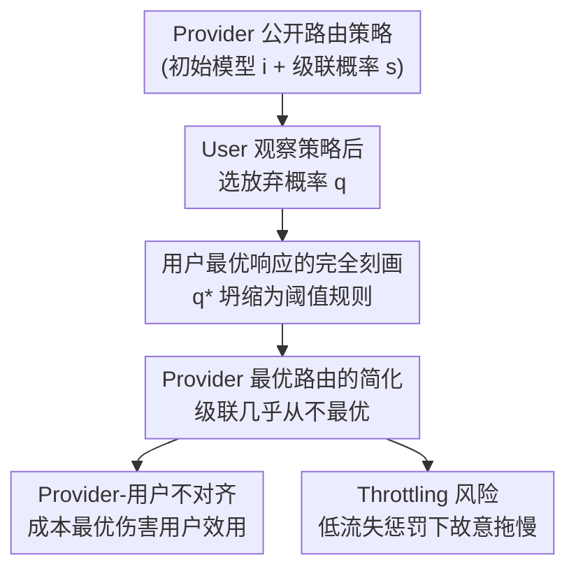

# Routing, Cascades, and User Choice for LLMs

**会议**: ICLR 2026  
**arXiv**: [2602.09902](https://arxiv.org/abs/2602.09902)  
**代码**: 无  
**领域**: 强化学习  
**关键词**: LLM routing, cascading, Stackelberg game, user-provider misalignment, throttling

## 一句话总结

将LLM路由建模为provider-user Stackelberg博弈，证明最优路由几乎总是静态无级联的阈值规则，揭示质量/成本排序不一致时的用户-提供商不对齐，以及低流失惩罚下provider被激励通过throttling延迟来降低成本但损害用户效用。

## 研究背景与动机

**领域现状**：LLM提供商通过路由和级联策略在异构模型之间分配用户任务来平衡质量、延迟和成本。GPT-5已明确采用路由，在"高效模型"和"深度推理模型"之间切换。

**现有痛点**：现有路由算法（Ding et al., 2024; Dekoninck et al., 2025）聚焦于估计LLM性能并优化质量-延迟-成本权衡，但将用户的响应行为视为外生变量。然而，LLM的提示式接口意味着模型失败后用户可能反复交互，产生反复推理成本。

**核心矛盾**：单次优化成本可能在用户行为层面带来反效果。用户可能因延迟放弃任务甚至取消订阅，视任务的价值和模型的延迟而定。优化单次成本可能"省小钱亏大钱"（penny-wise but welfare-foolish）。

**本文方案**：形式化一个双层Stackelberg博弈——provider选择路由策略（初始模型+级联概率），用户基于观察到的策略决定放弃概率。通过完全刻画用户最优响应并简化provider问题，推导出简洁的阈值规则。

## 方法详解

### 整体框架

全文围绕一个双层 Stackelberg 博弈展开：provider 先公开一个路由策略 $(i, s)$（初始模型 $i$ 加级联概率 $s$），用户观察到策略后再选择每次失败后的放弃概率 $q$，两者各自优化自己的目标。场景被刻意压到最小可分析单元——单个 provider 手握标准模型 $M_1$ 与推理模型 $M_2$，满足 $t_1 < t_2$、$c_1 < c_2$、$0 < p_1 < p_2 < 1$（推理模型更慢、更贵、但成功率更高）。

整个分析的支点是用户单次净值 $\xi_i := Vp_i - t_i$：$\xi_i > 0$ 称模型 value-dominated（值得等），$\xi_i < 0$ 称 latency-dominated（不值得等）。用户效用是成功价值减去累积延迟 $U_i(s, q) = V \cdot S_i(s, q) - L_i(s, q)$，provider 成本是服务开销加上用户放弃的惩罚 $J_i(s, q) = C_i(s, q) + P(1 - S_i(s, q))$，其中 $P$ 衡量一次流失对 provider 有多痛。后续四个设计点就是先解出用户的最优响应，再回代简化 provider 的问题，最后讨论由此暴露出的两个系统性风险。

### 关键设计

**1. 用户最优响应的完全刻画：把下层博弈解成闭式阈值**

要分析 provider 的策略，前提是知道用户会怎么反应，所以论文先固定 $(i, s)$ 解出最优放弃概率 $q^*$（Theorem 1–2）。结论出奇地干净：只要路由到 $M_2$，就有 $q^* = \mathbb{1}\{\xi_2 < 0\}$ 的纯阈值规则；路由到 $M_1$ 时分情况——若 $\xi_1, \xi_2$ 同号，用户行为完全静态（都 value-dominated 则 $q^*=0$ 死等，都 latency-dominated 则 $q^*=1$ 直接放弃），路由策略对用户毫无影响。真正有趣的是两者异号：当 $\xi_1 < 0 < \xi_2$，存在单阈值 $s_0 = -\xi_1/(\xi_2/p_2 - \xi_1)$，级联概率 $s > s_0$ 时用户愿意留下，否则放弃；当 $\xi_1 > 0 > \xi_2$，则出现 $s_L, s_H$ 两个阈值，$s \leq s_L$ 留下、$s \geq s_H$ 放弃、中间区段是混合策略。这套刻画之所以关键，是因为它把一个看似连续的行为优化坍缩成几条阈值判据，让上层 provider 问题变得可解，同时点明一个直觉：用户行为只在两模型价值差异化时才被路由策略撬动。

**2. Provider 最优路由的简化：证明级联几乎从不最优**

有了 $q^*(s)$，provider 的目标就从二维 $(i, s)$ 退化成单变量问题，可以直接求闭式解（Theorem 3–5）。同号情形（Theorem 3）下最优策略一定是路由到单一模型且不级联：$\xi_1, \xi_2 > 0$ 时按 cost-of-pass $c_i/p_i$ 挑成本效率高的那个，$\xi_1, \xi_2 < 0$ 时则看流失惩罚 $P$ 与增量 cost-of-pass $(c_2-c_1)/(p_2-p_1)$ 谁大。差异化情形（Theorem 4–5）里结论依旧顽固——几乎所有参数区域的最优解仍落在三个静态点 $(i^*, s^*) \in \{(1,0), (1,1), (2,0)\}$ 之一，只有一条极窄的参数带里级联才占优。这一步的价值在于它给出了一个反工程直觉的判断：级联在未差异化的模型之间只会徒增成本和方差却不带来收益，工程上常见的"先小模型再升级"管线在博弈均衡下大多是浪费。

**3. Provider-用户不对齐：成本最优往往伤害用户**

把用户和 provider 的最优排序摆在一起，论文发现两者经常南辕北辙（Proposition 1）：当 provider 按 cost-of-pass 排序选模型，而用户按效用排序偏好另一个模型时，会出现一个严格为正的 misalignment gap $\Delta_U > 0$——provider 的成本最优策略恰恰压低了用户效用。这说明不对齐不是实现 bug 而是均衡的结构性产物，只要 provider 的成本排序和用户的价值排序不一致就无法回避。

**4. Throttling 风险：低流失惩罚下故意拖慢**

最尖锐的一点是 provider 可能主动做坏（Proposition 2）：当流失惩罚足够低，即 $P \leq \min\{c_1/p_1, c_2/p_2\}$ 时，provider 有动机人为注水延迟，把延迟拉到 $\hat{t}_i > Vp_i$，使两个模型都变成 latency-dominated，从而诱导用户主动放弃来省下服务成本。此时用户效用被最大化地损害，而 provider 反而获利。这条结论把前面的博弈分析推到了机制设计的层面——它指出抵御 throttling 的唯一杠杆是把 $P$ 抬高，也就是让用户握有"退订"这种代价足够大的离场选项。

## 实验关键数据

### 主实验：Provider最优策略的区域划分

| $\xi_1, \xi_2$ 状态 | 用户行为 | Provider最优策略 | 级联是否有效 |
|---------------------|---------|-----------------|-------------|
| 均value-dominated | 静态留下 | 按 $c_i/p_i$ 路由，无级联 | 无效 |
| 均latency-dominated | 静态放弃 | 取决于 $P$ vs $(c_2-c_1)/(p_2-p_1)$ | 无效 |
| $\xi_1 < 0 < \xi_2$ | 依赖级联概率 | 几乎总路由到 $M_1$，除非cost-of-pass差距大 | 仅特定条件 |
| $\xi_1 > 0 > \xi_2$ | 三段式响应 | 静态为主，极窄区间有混合 | 极少 |

### 消融实验：Throttling收益

| 配置 | 效果 | 条件 |
|-----|-----|------|
| $P < \min\{c_1/p_1, c_2/p_2\}$ | Throttling有利于provider | 用户流失惩罚低 |
| $P > \min\{c_1/p_1, c_2/p_2\}$ | Throttling反而增加provider成本 | 用户流失惩罚高 |
| Throttling收益面积 | 线性于 $P$ | 用户退订可防止throttling |

### 关键发现

- 最优路由在绝大多数参数区域退化为简单阈值规则，级联的价值极为有限
- 用户行为仅在两模型差异化时受路由策略影响
- 当用户和provider的模型排序不一致时，不对齐不可避免
- 防止throttling的关键是确保用户放弃的代价（流失惩罚）足够高——用户应有"退订权"

## 亮点与洞察

- 首次将LLM路由问题从纯工程优化提升到博弈论框架，考虑用户反应行为
- 理论结果具有高度实践指导性：级联rarely optimal这一结论对GPT-5等路由系统设计有直接意义
- Throttling分析揭示了LLM订阅模式中provider的道德风险，有政策含义
- 论文本身使用LLM辅助完成（附录A详细记录），构成meta层面的自洽验证

## 局限与展望

- 仅分析两个模型的情况，实际部署可能涉及更多模型的路由
- 假设用户能观察provider的级联策略且采用平稳放弃策略，实际中路由策略对用户不透明
- 每次pass的成功概率假定为i.i.d.，忽略了用户反馈对后续尝试的影响
- 固定订阅制框架，未考虑按调用计费的API定价模式
- 缺乏实证实验验证理论预测

## 相关工作与启发

- **FrugalGPT**（Chen et al., 2023）和**RouteLLM**（Ong et al., 2025）：聚焦路由算法设计，本文从博弈论角度补充了用户行为维度
- **Cost-of-Pass**（Mahmood 2024; Erol et al., 2025）：本文直接使用cost-of-pass概念作为路由决策的核心指标
- 对LLM订阅服务设计的启发：应允许用户自选模型（opt-out routing）来防止throttling

## 评分

- 新颖性: ⭐⭐⭐⭐ 博弈论视角分析LLM路由非常新颖，填补了用户行为建模的空白
- 实验充分度: ⭐⭐⭐ 纯理论工作，有定理证明和可视化但无实证实验
- 写作质量: ⭐⭐⭐⭐ 理论推导清晰，Figure 1的guideline总结极为实用
- 价值: ⭐⭐⭐⭐ 对LLM服务定价和路由策略设计有直接实践指导，throttling分析具有政策意义

<!-- RELATED:START -->

## 相关论文

- [\[ICLR 2026\] ReMix: Reinforcement Routing for Mixtures of LoRAs in LLM Finetuning](remix_reinforcement_routing_lora.md)
- [\[NeurIPS 2025\] Router-R1: Teaching LLMs Multi-Round Routing and Aggregation via Reinforcement Learning](../../NeurIPS2025/reinforcement_learning/router-r1_teaching_llms_multi-round_routing_and_aggregation_via_reinforcement_le.md)
- [\[ICLR 2026\] Reasoning Boosts Opinion Alignment in LLMs](reasoning_boosts_opinion_alignment_in_llms.md)
- [\[ICLR 2026\] AbstRaL: Augmenting LLMs' Reasoning by Reinforcing Abstract Thinking](abstral_augmenting_llms_reasoning_by_reinforcing_abstract_thinking.md)
- [\[ICLR 2026\] How LLMs Learn to Reason: A Complex Network Perspective](how_llms_learn_to_reason_a_complex_network_perspective.md)

<!-- RELATED:END -->
