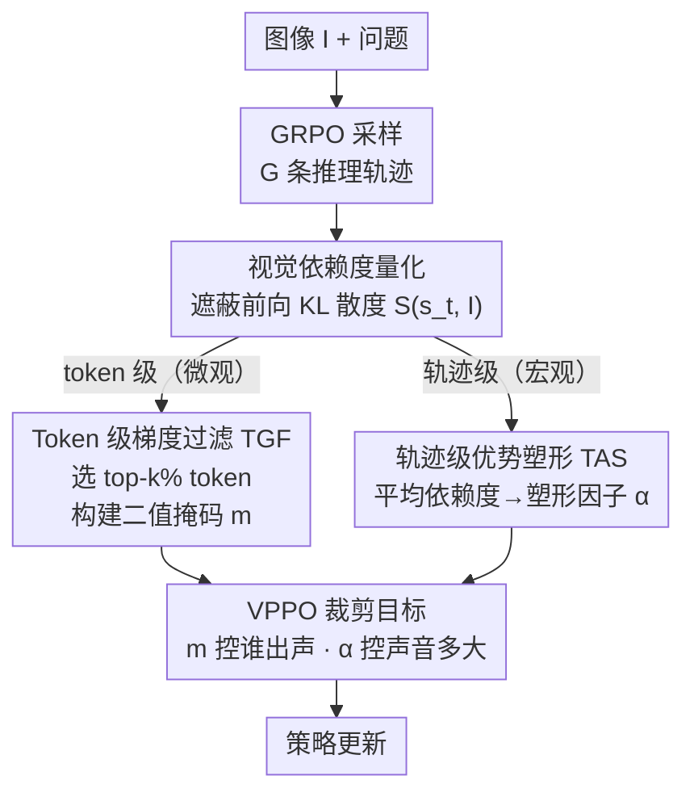

# Spotlight on Token Perception for Multimodal Reinforcement Learning

**会议**: ICLR 2026  
**arXiv**: [2510.09285](https://arxiv.org/abs/2510.09285)  
**代码**: [https://github.com/huaixuheqing/VPPO-RL](https://github.com/huaixuheqing/VPPO-RL)  
**领域**: 多模态强化学习 / 视觉语言模型  
**关键词**: RLVR, 多模态推理, token感知, 视觉依赖, 策略优化

## 一句话总结

提出 VPPO（Visually-Perceptive Policy Optimization），通过量化每个 token 的视觉依赖度，在轨迹级和 token 级两个层次对学习信号进行精细化调控，显著提升大视觉语言模型的多模态推理能力。

## 研究背景与动机

- **RLVR 在多模态中的局限**：现有 RLVR（如 GRPO、DAPO）主要为文本推理设计，在多模态场景中忽视了视觉感知的关键作用。它们对所有 token 广播统一的学习信号，无法区分哪些 token 真正依赖视觉信息。
- **感知与推理的耦合**：有效的多模态推理需要准确的视觉感知作为逻辑推理的基础。例如几何题中，模型必须从图像中识别出 OA、OB 是圆的半径，才能得出等腰三角形的结论。
- **核心发现**：
    - **Insight 1**：轨迹中 token 的视觉依赖度呈稀疏分布——仅少数 token 具有高视觉依赖性
    - **Insight 2**：不同推理轨迹在整体视觉依赖度上存在显著异质性——并非所有正确路径都是真正的视觉驱动推理

## 方法详解

### 整体框架

VPPO 的出发点是：既然轨迹里真正依赖视觉的 token 很稀疏、不同轨迹的视觉参与度又差异很大，那 GRPO 把统一学习信号广播给所有 token、所有轨迹就是在浪费甚至污染梯度。它先用一个无需额外标注的指标量化每个 token 对图像的依赖度，再以这个分数为统一调控依据，在两个层次上重新分配信号：轨迹级（宏观）按平均依赖度放大那些真正"看图说话"的路径，token 级（微观）只让高视觉依赖的关键 token 贡献梯度。两个模块都建立在 GRPO 之上，不改变采样和奖励流程，因此能即插即用地嵌进现有 RLVR 训练。

### 关键设计

**1. 视觉依赖度量化：用遮蔽前向给每个 token 打分**

要分层调控信号，首先得知道哪个 token 在依赖图像。作者把 token 在时刻 $t$ 的视觉依赖度定义为原始图像与遮蔽图像两种条件下输出分布的 KL 散度 $\mathcal{S}(s_t, I) := D_{\text{KL}}\left(\pi_\theta(\cdot|s_t, I) \,\|\, \pi_\theta(\cdot|s_t, I')\right)$，其中 $I'$ 是把图像替换成非信息性内容后的遮蔽版本。直觉很清楚：如果遮掉图像后某个 token 的预测分布几乎不变，说明它本就靠语言先验生成、与视觉无关；反之 $\mathcal{S}$ 越大，说明这个 token 的预测高度锚定在视觉证据上。这个分数只需多跑一次遮蔽前向即可得到，无需任何额外标注或辅助模型，成为后面两个模块的统一调控依据。经验上它高度右偏——只有数字、几何概念、逻辑算符等少数 token 拿到高分，印证了"视觉依赖稀疏"这一观察。

**2. Token 级梯度过滤（TGF）：只让关键 token 出声，对抗信号稀释**

一条推理轨迹里多数 token 是连接词、格式符等通用 token，把它们和真正承载视觉推理的 token 同等对待，会让有效信号被噪声淹没。TGF 对每条轨迹 $\tau_i$ 按 $\mathcal{S}$ 选出视觉依赖度最高的 top-$k\%$ token 集合 $\mathcal{K}_i$，构建二值掩码 $m_{i,t} = \mathbb{I}(t \in \mathcal{K}_i)$，策略梯度只在这些 token 上计算、其余一律屏蔽。实验中 $k=0.4$ 为最优过滤比例。这样做把梯度集中到决定推理对错的少数感知 token 上，避免大量低信息 token 把更新方向拉偏，对应框架图里 token 级（微观）那一支。

**3. 轨迹级优势塑形（TAS）：放大真正视觉驱动的路径**

GRPO 里只要答案正确，轨迹就拿到正优势，但有些"正确"轨迹其实是靠语言捷径蒙对的，并非真正的视觉推理，给它们同等权重会鼓励模型走捷径。TAS 先算每条轨迹的平均视觉依赖度 $\bar{\mathcal{S}}(\tau_i)$，再把组内这个量归一化映射到塑形因子

$$\alpha(\tau_i) = \beta_{\min} + (\beta_{\max} - \beta_{\min}) \frac{\bar{\mathcal{S}}(\tau_i) - \min_{\tau_j} \bar{\mathcal{S}}(\tau_j)}{\max_{\tau_j} \bar{\mathcal{S}}(\tau_j) - \min_{\tau_j} \bar{\mathcal{S}}(\tau_j)}$$

落在 $[\beta_{\min}, \beta_{\max}]$ 区间内。塑形后的优势 $\hat{A}'(\tau_i) = \alpha(\tau_i) \cdot \hat{A}_{\text{GRPO}}(\tau_i)$ 让视觉参与度高的轨迹获得更大更新、低依赖路径被压低，从而把学习偏好引向真正基于图像的推理，对应框架图里轨迹级（宏观）那一支。

### 损失函数 / 训练策略

把两个模块拼回 GRPO 的裁剪目标，token 级掩码 $m_{i,t}$ 控制谁出声、轨迹级塑形优势 $\hat{A}'_i$ 控制声音多大：

$$\mathcal{L}^{\text{VPPO}}(\theta) = \mathbb{E}\left[\frac{1}{G}\sum_{i=1}^{G}\frac{1}{|o_i|}\sum_{t=1}^{|o_i|} m_{i,t} \cdot \min\left(r_{i,t}(\theta)\hat{A}'_i, \text{clip}(r_{i,t}(\theta), 1-\varepsilon, 1+\varepsilon)\hat{A}'_i\right)\right]$$

作者进一步给出方差缩减定理 $\text{Var}(\mathbf{g}_{\text{VPPO}}) \approx k \cdot \mathbb{E}[\alpha(\tau)^2] \cdot \text{Var}(\mathbf{g}_{\text{GRPO}})$：稀疏率 $k \in (0,1)$ 来自只保留 top-$k\%$ token，而 $\alpha(\tau)$ 被压缩在 1 附近的窄带，两者相乘使梯度方差显著低于 GRPO，从机制上解释了为何 VPPO 训练更稳、收敛更快。

## 实验结果

### 主实验：8 个多模态推理基准 (avg@8 acc %)

| 模型 | MathVerse | DynaMath | MMK12 | Geo3k | MathVision | We-Math | LogicVista | MMMU-Pro | Avg. |
|------|-----------|----------|-------|-------|------------|---------|------------|----------|------|
| Qwen2.5-VL-7B | 39.0 | 55.7 | 42.5 | 37.1 | 18.4 | 46.4 | 42.4 | 25.1 | 38.3 |
| + GRPO | 66.5 | 65.8 | 72.3 | 40.2 | 30.7 | 68.1 | 45.6 | 35.2 | 53.1 |
| + DAPO | 68.3 | 66.6 | 82.1 | 41.5 | 30.5 | 68.0 | 46.8 | 35.9 | 55.0 |
| **+ VPPO** | **71.6** | **68.1** | **82.8** | **46.5** | **33.3** | **71.5** | **47.9** | **37.9** | **57.5** |

### 32B 规模扩展

| 模型 | Avg. |
|------|------|
| Qwen2.5-VL-32B + GRPO | 62.6 |
| Qwen2.5-VL-32B + DAPO | 63.5 |
| **Qwen2.5-VL-32B + VPPO** | **64.6** |

### 关键发现

- 7B 模型上 VPPO 相比 baseline 平均提升 **19.2%**，超越所有开源 RL 方法
- 32B 模型上带来 **7.6%** 平均提升
- 训练更稳定、收敛更快

## 消融实验

| 设置 | Avg. Acc |
|------|----------|
| VPPO (完整) | 57.5 |
| 仅 TAS（轨迹级优势塑形） | 55.8 |
| 仅 TGF（token 级梯度过滤） | 56.2 |
| 无 TAS + 无 TGF (DAPO baseline) | 55.0 |

- TAS 和 TGF 各自独立有效，组合后效果最优
- 梯度过滤比例 $k=0.4$ 为最佳选择

## 亮点与洞察

1. **首次从 token 感知角度分析多模态 RLVR**：揭示了视觉依赖的稀疏分布和轨迹异质性两个关键 insight
2. **双层次信号调控**：轨迹级 + token 级的层次化设计优雅且有效
3. **即插即用**：可无缝集成到 GRPO、DAPO 等主流算法中
4. **理论支撑**：证明了方差缩减效果

## 局限性

- 视觉依赖度计算需要额外的遮蔽图像前向传播，增加了计算开销
- 仅在 Qwen2.5-VL 系列上验证，其他模型架构的泛化性待验证
- 遮蔽策略的选择（如何构造 $I'$）可能影响依赖度估计质量

## 相关工作

- **多模态推理 RL**：GRPO、DAPO、NoisyRollout、VL-Rethinker 等，但均忽视视觉感知
- **奖励设计**：PAPO-D 等感知感知奖励方法，但在算法层面未做改进
- **关键 token 识别**：RLHF 中的分叉点检测、低置信度点探索等，但未针对多模态视觉依赖

## 评分

- **创新性**: ⭐⭐⭐⭐ — 从 token 视觉依赖角度切入多模态 RL，视角新颖
- **技术深度**: ⭐⭐⭐⭐ — 理论分析扎实，方差缩减有证明
- **实验充分性**: ⭐⭐⭐⭐⭐ — 8 个 benchmark，两个规模，消融完备
- **实用价值**: ⭐⭐⭐⭐ — 即插即用，效果显著

<!-- RELATED:START -->

## 相关论文

- [\[ICLR 2026\] From Narrow to Panoramic Vision: Attention-Guided Cold-Start Reshapes Multimodal Reasoning](from_narrow_to_panoramic_vision_attention-guided_cold-start_reshapes_multimodal_.md)
- [\[ICLR 2026\] Metis-SPECS: Decoupling Multimodal Learning via Self-distilled Preference-based Cold Start](metis-specs_decoupling_multimodal_learning_via_self-distilled_preference-based_c.md)
- [\[ICLR 2026\] MARS-Sep: Multimodal-Aligned Reinforced Sound Separation](mars-sep_multimodal-aligned_reinforced_sound_separation.md)
- [\[ICLR 2026\] UME-R1: Exploring Reasoning-Driven Generative Multimodal Embeddings](ume-r1_exploring_reasoning-driven_generative_multimodal_embeddings.md)
- [\[ICLR 2026\] LadderSym: A Multimodal Interleaved Transformer for Music Practice Error Detection](laddersym_a_multimodal_interleaved_transformer_for_music_practice_error_detectio.md)

<!-- RELATED:END -->
