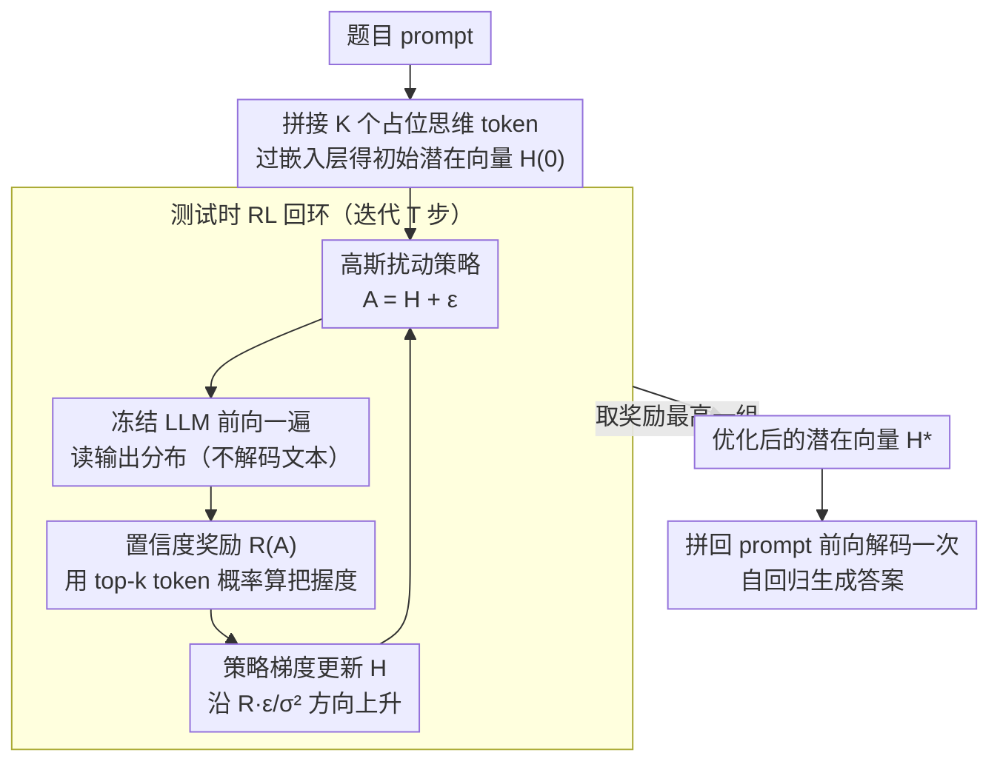

# Thinking on the Fly: Test-Time Reasoning Enhancement via Latent Thought Policy Optimization

**会议**: ICLR 2026  
**arXiv**: [2510.04182](https://arxiv.org/abs/2510.04182)  
**代码**: 无  
**领域**: 强化学习 / 大语言模型推理  
**关键词**: 潜在推理, 测试时优化, 策略梯度, 置信度奖励, Chain-of-Thought

## 一句话总结

本文提出潜在思维策略优化（LTPO），一种无需更新模型参数的测试时推理增强框架，通过将中间潜在"思维"向量视为可优化的动态参数，利用在线策略梯度方法和内在置信度奖励信号来增强冻结LLM的推理能力。

## 研究背景与动机

大语言模型（LLM）的推理能力近年来经历了一个重要转变：从**显式链式思维（Chain-of-Thought, CoT）推理**向更高效的**潜在推理（Latent Reasoning）**过渡。在显式CoT中，中间推理步骤以自然语言文本形式生成，计算开销大且效率低。在潜在推理中，中间思维被表示为向量而非文本，大幅提高了效率。

然而，潜在推理存在一个关键弱点：**在具有挑战性的分布外（OOD）任务上表现脆弱**。当面对需要稳健推理的困难问题时（如高难度数学竞赛题），现有的潜在推理基线模型往往会崩溃到接近零的准确率。

这一困境的根本原因在于：

**潜在思维向量是在训练时固定的**：模型一旦训练完成，其潜在表示方式就固定了，无法针对具体问题实例进行自适应调整。

**缺乏测试时的自省机制**：与CoT可以通过多次采样和验证来改善答案不同，潜在推理缺乏这样的自我纠正能力。

**OOD泛化困难**：潜在表示的泛化能力高度依赖于训练数据分布，对于未见过的问题类型表现不佳。

LTPO的核心动机是：既保留潜在推理的效率优势，又通过测试时优化赋予其CoT级别的推理稳健性。

## 方法详解

### 整体框架

LTPO 想解决潜在推理"训练完就定死、遇到难题就崩"的问题，但它不碰模型权重——所有动作都发生在测试时、针对单道题。给定一个冻结的 LLM 和一道新题，它先在原始 prompt 后面拼上 $K$ 个占位的"潜在思维"token（如 `[THINK]`），把它们过嵌入层得到的向量序列 $H$ 当成唯一可调的自由变量。接着进入一个测试时强化学习（RL）回环：每一步给 $H$ 加一个高斯随机扰动得到候选 $A$，让冻结 LLM 前向一遍读出输出分布、算一个置信度奖励，再用这个奖励沿扰动方向估计梯度、更新 $H$；如此迭代 $T$ 步并记下奖励最高的那组向量。最后拿优化好的 $H^*$ 拼回 prompt、前向解码一次，生成答案。整条链路里 LLM 参数始终冻结，被调的只有这 $K$ 个潜在向量，相当于给每道题临时"搜"出一条更好的推理路径。

### 关键设计

**1. 潜在思维向量：把推理表示变成测试时可优化的自由参数**

潜在推理的脆弱根源在于中间表示训练完就写死，碰到分布外（OOD）难题时这套固定向量编码不出正确推理所需的信息。LTPO 的做法不是改中间层，而是在原始 prompt 后面拼上 $K$ 个占位 token（如 `[THINK]`），把它们过嵌入层得到的向量序列 $H \in \mathbb{R}^{K\times d}$ 当成唯一的可调自由变量，与 prompt 的嵌入 $E(x)$ 拼成 $E(x)\,\|\,H$ 一起喂给冻结 LLM。这样每道题都会被单独优化出一组 $H$——原来一道题对应一组写死的表示，现在变成"给这道题现搜一组最合适的潜在思维"。要点是它既不更新任何模型权重，也不是从某个中间层抠隐藏状态，调的只是这几个输入侧的向量。

**2. 置信度奖励：用模型自身把握度当信号，无需标签也无需解码文本**

测试时没有标准答案、外接验证器又贵，所以 LTPO 把奖励直接建在冻结 LLM 自己的输出分布上。直觉是：一组好的潜在思维应当让模型对后续预测更"有把握"。具体地，把候选向量喂进模型得到每个位置的 token 分布，对单个潜在向量取其 top-$k$ 个最可能 token 的概率算出一个置信度 $C(a_i)$，整组奖励是 $K$ 个向量置信度的平均 $R(A)=\frac{1}{K}\sum_{i=1}^{K} C(a_i)$。关键是这个奖励只需一次"prompt + 潜在 token"的定长前向就能算出，完全跳过文本生成——不调外部验证器、也不真的解码一段推理，信号几乎是免费拿到的（消融里"低熵 = 高把握最有效"也来自这里）。

**3. 高斯扰动策略梯度：把找表示变成潜在空间里的零阶搜索**

奖励 $R(\cdot)$ 对输入向量不可微，没法直接反向传播，于是 LTPO 把 $H$ 本身当策略参数、用 REINFORCE 式的策略梯度来更新。每一步从以当前 $H$ 为中心的高斯分布采一个候选 $A = H + \epsilon,\ \epsilon\sim\mathcal{N}(0,\sigma^2 I)$（等价于加一个随机扰动，$\sigma$ 随迭代衰减、先探索后收敛），再用单样本蒙特卡洛估计梯度并做梯度上升：

$$H^{(t+1)} = H^{(t)} + \eta\,\frac{R(H^{(t)}+\epsilon^{(t)})\,\epsilon^{(t)}}{\sigma^2}$$

直观上就是"哪个扰动方向带来更高奖励，就往哪个方向挪"。相比 PPO/GRPO 直接优化模型几十亿参数，这里只搜 $K$ 个向量：模型完全不动、优化逐题定制、且全程不生成文本，比 CoT 省。迭代 $T$ 步里它还会记下奖励最高的那组向量，最后用 $H^*$ 解码一次出答案（消融中"优化步数先升后平"说明这个搜索有边际收益递减）。

### 损失函数 / 训练策略

LTPO 没有训练阶段，"目标函数"就是测试时要最大化的期望置信度奖励 $J(H)=\mathbb{E}_{A\sim\pi(\cdot|H)}[R(A)]$；优化只对 $K$ 个潜在向量做 $T$ 步梯度上升，每步一次前向、零反向（梯度由扰动估计），全程不改写任何权重。关键超参是扰动方差 $\sigma$（随步衰减）、学习率 $\eta$、潜在 token 数 $K$ 与优化步数 $T$。

## 实验关键数据

### 主实验

在五个推理基准上的表现：

| 基准测试 | 指标 | LTPO | 标准潜在推理 | CoT基线 |
|---------|------|------|-------------|---------|
| GSM8K | 准确率 | 匹配/超越 | 基准 | 强基线 |
| MATH | 准确率 | 匹配/超越 | 基准 | 强基线 |
| AIME 2024 | 准确率 | **大幅提升** | ~0% (崩溃) | 有限 |
| AIME（整体） | 准确率 | **显著提升** | ~0% (崩溃) | 有限 |
| 其他推理 | 准确率 | 匹配/超越 | 基准 | 强基线 |

### 消融实验

| 配置 | 关键指标 | 说明 |
|------|---------|------|
| 无优化（基线） | 基准 | 标准潜在推理 |
| 仅置信度奖励 | 显著提升 | 核心组件有效 |
| 不同优化步数 | 先升后平 | 有最优步数 |
| 不同置信度度量 | 熵最优 | 低熵 = 高信心最有效 |

### 关键发现

1. **标准任务上表现持平或更优**：在GSM8K、MATH等常规推理任务上，LTPO与强基线持平或略优，说明测试时优化不会损害正常表现。

2. **困难任务上表现突出**：最令人印象深刻的是在AIME基准上——这些高难度数学竞赛题让现有潜在推理基线完全崩溃（接近0%准确率），而LTPO能够获得显著的性能提升。

3. **稳健性极强**：LTPO展示了一种独特的能力——在其他方法失败的地方仍然有效工作。这说明测试时优化提供了一种额外的"推理弹性"。

4. **无需外部监督**：仅通过模型自身的置信度信号就能指导优化，这使得LTPO可以应用于没有标签的新任务。

## 亮点与洞察

1. **范式创新**：提出了一种全新的推理增强范式——既不是传统的微调（修改模型参数），也不是采样（多次生成取最优），而是在潜在空间中进行测试时优化。这是一个介于训练时学习和推理时采样之间的新范畴。

2. **优雅的自监督**：利用模型自身置信度作为奖励信号的设计非常优雅，避免了对外部奖励模型或验证器的依赖，同时与直觉一致——好的推理应该导致更确定的答案。

3. **计算效率与性能的平衡**：相比CoT需要生成大量中间文本，LTPO仅优化向量表示，计算更高效；相比标准潜在推理，LTPO通过少量优化步增加了少量计算但显著提高了稳健性。

4. **连接RL与LLM推理**：将RL中的策略优化思想自然地引入LLM推理过程，为两个领域的交叉研究提供了新视角。

## 局限与展望

1. **测试时计算开销**：虽然比CoT高效，但每个问题都需要多步优化，延迟显著高于标准单次前向传播。对于延迟敏感的应用场景可能不适用。

2. **置信度奖励的可靠性**：模型的高置信度不一定等于正确答案——模型可能对错误答案也表现出高置信度（如幻觉问题）。当模型的校准（calibration）较差时，置信度奖励可能误导优化方向。

3. **优化步数的选择**：最优优化步数可能因任务和问题而异，目前需要手动设定。自适应步数控制是一个有待解决的问题。

4. **仅在推理（数学）任务上验证**：尚未在其他类型任务（如常识推理、代码生成、创意写作）上验证效果。

5. **与显式CoT的结合**：是否可以将LTPO与CoT结合，在潜在空间优化的同时生成可解释的中间步骤？

## 相关工作与启发

- **潜在推理方法**（如Coconut等）：LTPO在此基础上增加了测试时优化维度。
- **测试时计算扩展（Test-Time Compute Scaling）**：与Best-of-N、Self-Consistency等方法互补，LTPO通过不同的机制实现测试时性能增强。
- **策略优化在LLM中的应用**：PPO/GRPO等方法优化模型参数，LTPO则优化中间表示，是一种更轻量的替代。
- **启发**：这一工作启示我们，LLM的推理能力可能不仅取决于模型参数，也取决于推理过程中中间表示的质量，而后者可以在测试时动态优化。

## 评分

- 新颖性: ⭐⭐⭐⭐⭐ （范式创新，将RL策略优化引入测试时推理）
- 实验充分度: ⭐⭐⭐⭐ （五个基准，突出AIME上的鲁棒性优势）
- 写作质量: ⭐⭐⭐⭐ （框架描述清晰）
- 价值: ⭐⭐⭐⭐⭐ （开辟了测试时潜在推理优化的新方向）

<!-- RELATED:START -->

## 相关论文

- [\[AAAI 2026\] Aligning Machiavellian Agents: Behavior Steering via Test-Time Policy Shaping](../../AAAI2026/reinforcement_learning/aligning_machiavellian_agents_behavior_steering_via_test-tim.md)
- [\[ICLR 2026\] AbstRaL: Augmenting LLMs' Reasoning by Reinforcing Abstract Thinking](abstral_augmenting_llms_reasoning_by_reinforcing_abstract_thinking.md)
- [\[ICLR 2026\] Self-Harmony: Learning to Harmonize Self-Supervision and Self-Play in Test-Time Reinforcement Learning](self-harmony_learning_to_harmonize_self-supervision_and_self-play_in_test-time_r.md)
- [\[ACL 2026\] SpiralThinker: Latent Reasoning through an Iterative Process with Text-Latent Interleaving](../../ACL2026/reinforcement_learning/spiralthinker_latent_reasoning_through_an_iterative_process_with_text-latent_int.md)
- [\[ICLR 2026\] P-GenRM: Personalized Generative Reward Model with Test-time User-based Scaling](p-genrm_personalized_generative_reward_model_with_test-time_user-based_scaling.md)

<!-- RELATED:END -->
