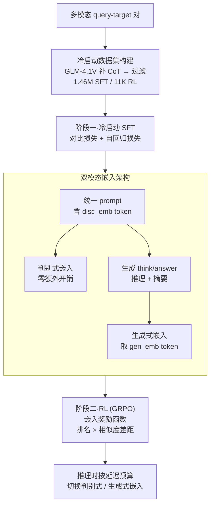

# UME-R1: Exploring Reasoning-Driven Generative Multimodal Embeddings

**会议**: ICLR 2026  
**arXiv**: [2511.00405](https://arxiv.org/abs/2511.00405)  
**代码**: [GitHub](https://github.com/XMUDeepLIT/UME-R1)  
**领域**: 强化学习  
**关键词**: multimodal embeddings, reasoning-driven generation, reinforcement-learning, MLLM, inference-time scaling

## 一句话总结

提出 UME-R1，首次探索推理驱动的生成式多模态嵌入范式，通过两阶段训练（冷启动SFT + 强化学习）让嵌入模型先推理再生成表示，在 MMEB-V2 基准的 78 个任务上显著超越传统判别式嵌入模型。

## 研究背景与动机

**领域现状**：基于多模态大语言模型（MLLM）的嵌入模型（如 VLM2Vec、MM-Embed）已在多模态嵌入任务上取得显著进展，大幅超越传统的双编码器视觉-语言模型（如 CLIP）。同时，以 DeepSeek-R1 为代表的大推理模型（LRM）在复杂推理任务上取得突破。

**现有痛点**：现有的 MLLM 多模态嵌入模型本质上是判别式的——直接编码输入并提取最后一个 token 的隐藏状态作为嵌入，不生成任何新 token。这使得它们无法受益于推理驱动的生成范式。虽有部分工作（如 CAFe）在训练中加入 next-token prediction loss 来保留生成能力，但推理时仍然是判别式的。

**核心矛盾**：推理能力和嵌入质量之间存在天然鸿沟——嵌入任务缺乏像数学那样有标准答案的验证机制，使得强化学习难以直接应用于嵌入模型优化。

**本文目标**：如何让多模态嵌入模型在生成范式下工作，使其能先推理再生成更高质量的嵌入？如何将 RL 成功应用于缺乏标准答案的嵌入任务？

**切入角度**：将嵌入任务统一到生成范式下，模型先生成推理过程和摘要，然后基于这些上下文产生嵌入。通过设计排名+相似度差距的组合奖励来实现 RL 优化。

**核心 idea**：让嵌入模型先思考推理再出表示，并通过 RL 持续优化推理质量，实现嵌入任务的推理时间扩展。

## 方法详解

### 整体框架

UME-R1 把多模态嵌入统一到生成范式下：同一个 MLLM 既能像传统模型那样直接吐出判别式嵌入，也能先生成一段推理与摘要、再据此产出更丰富的生成式嵌入。要让模型具备这个能力，作者先为只有匹配标签、没有推理链的嵌入数据补上思维链（CoT），再用两阶段训练把它教会——阶段一冷启动监督微调（SFT）让模型学会"先推理再表示"并同时产出判别式与生成式两种嵌入，阶段二强化学习（RL）用一个针对嵌入设计的可验证奖励持续打磨推理质量与生成式嵌入的好坏。训练完成后，推理时用户可按延迟预算在"直接出判别式嵌入"和"先推理再出生成式嵌入"两种模式间自由切换。

### 关键设计

**1. 冷启动数据集构建：给百万级 query-target 对补上 CoT，让 SFT 有推理可学**

嵌入数据本身只有匹配标签、没有现成的推理链，模型无从学起"先想再表示"。作者用 GLM-4.1V-Thinking 为 1.76M 个 query-target 对的 query 端和 target 端分别生成推理过程，再过滤掉含大量连续重复 token、推理超过 8192 token、以及不符合 `<think>...</think><answer>` 格式的样本，最终保留 1.46M 对用于 SFT；另从图像/视频/文档各模态均衡采样 11K 对（优先选未进入 SFT 的样本以避免过易）用于 RL。经过这一步，模型在 SFT 阶段就同时见过了推理轨迹和两种嵌入的产出方式，为后续 RL 提供了一个已经会"思考"的起点。

**2. 双模态嵌入架构：用一套模板同时拿到判别式与生成式两种表示**

传统 MLLM 嵌入模型只取最后一个 token 的隐藏态，无法利用任何生成出来的推理信息。UME-R1 在统一 prompt 里埋入两个特殊 token：紧跟输入的 `<disc_emb>` 直接给出判别式嵌入，零额外开销；随后模型生成 `<think>...</think><answer>` 完成推理与摘要，再以末尾的 `<gen_emb>` token 取出生成式嵌入，两种嵌入分别读取各自 token 在最后一层的隐藏状态。这样设计的好处在于判别式负责快速基线、生成式靠推理上下文补充更深的语义，二者天然互补——oracle 实验里把两种嵌入按样本择优组合，上限比单独用任一种高出 3–4 分，说明这个双轨设计不是冗余而是真正打开了表示空间的上界。

**3. 嵌入奖励函数：把没有标准答案的嵌入任务变成可验证的 RL 信号**

数学题有唯一答案能算对错，嵌入任务却没有，直接套 RLVR 无从打分。UME-R1 把每个采样响应 $o_i$ 的奖励设计成排名分数与相似度差距的乘积：

$$R_{emb}(o_i) = \underbrace{\frac{|\mathcal{S}^+ \cap \mathrm{top}_G(\mathcal{S}^+ \cup \mathcal{S}^-)|}{G}}_{\text{排名}} \times \underbrace{\big(\mathrm{avg}(\mathcal{S}^+) - \mathrm{avg}(\mathcal{S}^-)\big)}_{\text{相似度差距}}$$

其中 $\mathcal{S}^+$、$\mathcal{S}^-$ 分别是该响应与正、负目标的一组相似度分数。排名项衡量正样本相似度落进候选集合 top-$G$ 的比例，相似度差距项衡量正、负样本平均相似度的差值。之所以要相乘而非用单一阈值，是因为纯阈值（如 >0.5 给 1 分）会让一部分样本对过易或过难，正负样本全对或全错时梯度归零；排名分数保证只要正样本还没排到最前就有优化空间，相似度差距则在排名已饱和的简单样本上继续把正负样本拉开，两个信号叠加后即便在困难批次里也能持续提供非零的策略梯度（消融中二者缺一性能都明显下滑）。

### 损失函数 / 训练策略

SFT 阶段的目标是三项损失之和：作用在 `<disc_emb>` 上的判别式对比损失 $\mathcal{L}_{dctr}$（标准 InfoNCE）、作用在 `<gen_emb>` 上、带推理轨迹的生成式对比损失 $\mathcal{L}_{gctr}$，以及落在推理与摘要 token 上的自回归交叉熵 $\mathcal{L}_{ce}$，让模型同时学会"会推理"和"会出嵌入"。RL 阶段改用 GRPO 优化，奖励由两部分组成——检查是否严格遵循 `<think>...</think><answer>` 模板的格式奖励，加上前述排名×相似度差距的嵌入奖励；训练超参为 group size $G=8$、$\epsilon=0.2$、$\beta=0.04$、batch size 256、学习率 1e-6。

## 实验关键数据

### 主实验

| 模型 | Image | Video | VisDoc | All |
|------|-------|-------|--------|-----|
| VLM2Vec-V2 (2B) | 64.9 | 34.9 | 65.4 | 58.0 |
| CAFe (7B) | 67.6 | 42.4 | 63.9 | 60.6 |
| DUME (2B) | 62.5 | 33.2 | 52.8 | 52.7 |
| **UME-R1 (2B)** | **66.6** | **42.2** | **63.9** | **60.1** |
| UME-R1 Oracle (2B) | +4.3 | — | — | — |
| UME-R1 Oracle (7B) | +3.6 | — | — | — |

在相同数据量下（仅 VLM2Vec-V2 的 2/3），UME-R1 总体提升 2.1 分。

### 消融实验

| 组件 | Image | Video | VisDoc |
|------|-------|-------|--------|
| DUME (仅判别) | 62.5 | 33.2 | 52.8 |
| + 生成式嵌入 (SFT) | 66.6 (+4.1) | 42.2 (+9.0) | 63.9 (+11.1) |
| + RL | 进一步提升 | — | — |
| Oracle (判别+生成最优) | +4.3 (2B) / +3.6 (7B) | — | — |

### 关键发现

1. **生成式嵌入大幅优于判别式**：相同数据下，UME-R1 在图像/视频/文档三个模态分别提升 4.1/9.0/11.1 分
2. **两种嵌入高度互补**：Oracle 上限远超单独使用任一种，说明实际应用中可按需切换
3. **RL 有效提升生成式嵌入**：证明 RLVR 可扩展到缺乏标准答案的嵌入任务
4. **推理时间可扩展**：重复采样提升 pass@k 覆盖率，暗示推理时间扩展在嵌入任务上也有潜力

## 亮点与洞察

- **范式创新**：首次将推理驱动的生成范式引入多模态嵌入，打破了嵌入模型必须是判别式的传统认知
- **嵌入 RL 的突破**：巧妙设计排名×相似度差距奖励，解决了嵌入任务无标准答案下 RL 训练的零梯度问题
- **灵活性**：模型可同时输出判别和生成式两种嵌入，用户可按需选择
- **推理时间扩展**：pass@k 结果暗示嵌入任务也存在 inference-time scaling 的潜力，这一发现极具前瞻性
- **数据效率**：仅用 VLM2Vec-V2 2/3 的数据就实现了更好的性能

## 局限与展望

1. **推理开销**：生成式嵌入需要先生成推理和摘要，推理延迟显著增加，不适合延迟敏感场景
2. **CoT 标注依赖**：SFT 数据依赖 GLM-4.1V-Thinking 模型生成 CoT，标注质量受限于教师模型能力
3. **Oracle 差距大**：Oracle 与单模式嵌入差距仍达 3-4 分，说明当前模式选择策略有提升空间
4. **主要在 MMEB-V2 评估**：需要在更多下游任务（如检索引擎、RAG系统）上验证实际效果
5. **RL 数据量小**：仅 11K RL 训练对，扩大 RL 数据可能带来更大提升

## 相关工作与启发

- 与 **VLM2Vec / VLM2Vec-V2** 的渊源：采用相同的判别式嵌入框架作为基础，在此上扩展生成式能力
- 与 **DeepSeek-R1** 的联系：借鉴推理驱动生成范式，但应用场景从问答扩展到嵌入
- 对 **RAG 系统**的启发：推理驱动嵌入可能在复杂检索任务（需要理解查询意图）上带来显著提升
- 对 **inference-time scaling** 研究的启发：pass@k 结果表明嵌入任务也有推理时间扩展的潜力

## 评分

- **新颖性**: ⭐⭐⭐⭐⭐ — 首次将推理驱动生成范式引入嵌入任务，开辟全新方向
- **实验充分度**: ⭐⭐⭐⭐ — 78 个任务覆盖三个模态，消融充分，但缺少延迟分析和实际应用场景验证
- **写作质量**: ⭐⭐⭐⭐ — 问题动机清晰，方法描述完整，但部分符号较密集
- **价值**: ⭐⭐⭐⭐⭐ — 开辟嵌入模型新范式，RL 奖励设计和推理时间扩展的发现具有广泛启发意义

<!-- RELATED:START -->

## 相关论文

- [\[AAAI 2026\] MMhops-R1: Multimodal Multi-hop Reasoning](../../AAAI2026/reinforcement_learning/mmhops-r1_multimodal_multi-hop_reasoning.md)
- [\[ICLR 2026\] RM-R1: Reward Modeling as Reasoning](rm-r1_reward_modeling_as_reasoning.md)
- [\[ICLR 2026\] MARS-Sep: Multimodal-Aligned Reinforced Sound Separation](mars-sep_multimodal-aligned_reinforced_sound_separation.md)
- [\[ICLR 2026\] From Narrow to Panoramic Vision: Attention-Guided Cold-Start Reshapes Multimodal Reasoning](from_narrow_to_panoramic_vision_attention-guided_cold-start_reshapes_multimodal_.md)
- [\[ICLR 2026\] Unveiling the Cognitive Compass: Theory-of-Mind-Guided Multimodal Emotion Reasoning](unveiling_the_cognitive_compass_theory-of-mind-guided_multimodal_emotion_reasoni.md)

<!-- RELATED:END -->
