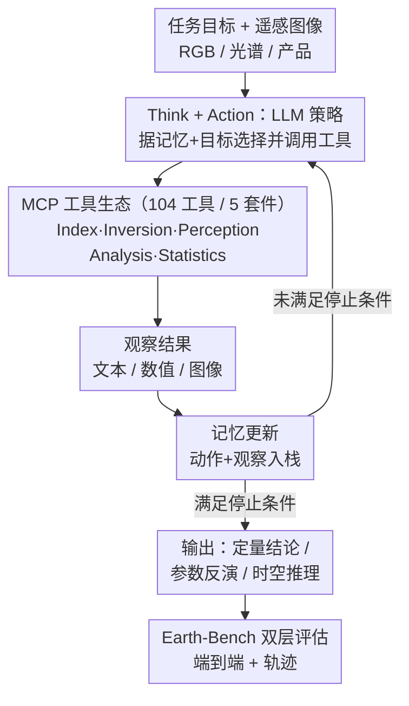

# Earth-Agent: Unlocking the Full Landscape of Earth Observation with Agents

**会议**: ICLR 2026  
**arXiv**: [2509.23141](https://arxiv.org/abs/2509.23141)  
**代码**: [opendatalab/Earth-Agent](https://github.com/opendatalab/Earth-Agent)  
**领域**: 遥感 / LLM Agent  
**关键词**: 地球观测, Agent框架, MCP工具生态, 多模态遥感, benchmark

## 一句话总结
Earth-Agent是首个基于MCP工具生态的地球观测Agent框架，统一了RGB和光谱遥感数据，通过动态调用104个专家工具实现跨模态、多步骤、定量时空推理，配套提出的Earth-Bench基准包含248个专家任务和13,729张图像，实验证明Earth-Agent远超通用Agent和遥感MLLM。

## 研究背景与动机
地球观测(EO)是理解地球系统演变状态的关键任务。近年来，多模态大语言模型(MLLM)已经推动了遥感研究的进步，但仍然存在根本性的能力缺失：

现有MLLM在EO领域的痛点：
- **仅限RGB感知**: 无法处理光谱数据（多光谱、高光谱、SAR等），而这正是科学级遥感分析的核心
- **浅层推理**: 无法进行需要多步骤推理和领域特定工具调用的复杂任务
- **缺乏定量能力**: 不能执行地球物理参数反演、定量时空分析等需要精确计算的科学任务
- **无系统评估**: 缺乏覆盖全模态、兼顾推理轨迹和最终结果的评估协议

现有Agent方法的局限：
- 局限于RGB感知，不处理光谱数据
- 推理深度不足，工具调用能力初级
- 没有面向EO的系统评估基准

Earth-Agent的切入角度：将EO分析建模为基于ReAct风格的POMDP过程，LLM作为策略网络，通过MCP协议动态调用领域专家工具，打通RGB和光谱模态。

## 方法详解

### 整体框架
Earth-Agent 是一个 ReAct 型 Agent 框架，把地球观测(EO)分析建模成部分可观察马尔可夫决策过程(POMDP)，用元组 $\langle g, S, A, O, T\rangle$ 描述：$g$ 是任务目标，$A$ 是工具调用构成的动作空间，$O$ 是工具返回的观察(文本/数值/图像)。LLM 充当策略网络 $\pi$，输入任务目标和 RGB/光谱/产品三类遥感数据，按"思考→调用工具→观察→更新记忆"的循环逐步逼近答案，最终输出定量分析、参数反演值或时空推理结论。关键之处在于真正的计算不由 LLM 内隐完成，而是委托给一个由 104 个领域专家工具组成的 MCP 工具生态——LLM 只决定调什么、按什么顺序调、传什么参数。下面三个设计分别支撑这条流水线：MCP 工具生态提供可调用的原子能力并打通跨模态、ReAct-POMDP 回环把多步任务串起来、Earth-Bench 与双层协议负责系统评估。

### 关键设计

**1. MCP 工具生态：把科学级计算从内隐知识里解耦，并打通 RGB 与光谱两个世界**

预训练 MLLM 处理遥感问题时，地表温度反演、光谱指数计算这类需要精确物理模型的任务只能靠"内隐知识"硬猜，既不可靠也无法定量；而且现有 EO Agent 大多只吃 RGB 可见光，恰恰丢掉了科学级遥感最核心的光谱数据。Earth-Agent 把计算能力外包给 104 个专家工具，按功能分成五大套件：Index Kit 算光谱指数(NDVI、NDWI、NBR 等)、Inversion Kit 做地球物理参数反演(地表温度 LST、可降水量、植被含水量、海冰浓度等)、Perception Kit 处理 RGB 感知(场景分类、目标检测、分割)、Analysis Kit 做时空分析(趋势检测、季节分解、变化点、空间自相关)、Statistics Kit 负责大规模预处理与统计(方差、批处理、云掩膜等)。这些工具统一通过模型上下文协议(Model Context Protocol, MCP)注册管理，LLM 按需动态组合。这样一来，从 Landsat 反演地表温度调用的是真正的物理模型而非猜测，能力上限突破了底座 MLLM 本身；同时由于光谱套件(Index/Inversion)与感知套件(Perception)并存，一个 Agent 就能根据任务自动走光谱工具链或感知工具链——查地表温度走 Inversion、做场景识别走 Perception——把此前被 RGB 割裂的定量光谱分析与常规视觉理解统一进同一框架。MCP 的标准接口也让工具集可扩展、可替换。

**2. ReAct-POMDP 多步推理：把复杂任务拆成可观察的决策链**

很多 EO 任务无法一步答出——比如"分析某地区 2020–2025 年植被变化趋势"需要先提取多时相 NDVI、再做时序分析、拟合趋势、最后综合结论。Earth-Agent 把它建模成 POMDP，LLM 不一次性给答案，而是每一轮根据当前记忆 $m_t=(o_0,a_0,\dots,o_t)$ 和目标 $g$ 采样下一个动作 $a_t \sim \pi(a_t\mid g,m_t)$，循环执行四步：①调用工具拿到观察、②把"动作+观察"压入记忆栈、③LLM 基于更新后的记忆思考下一步、④执行选定的工具调用，直到满足停止条件才输出最终答案和一条可复现的工具调用轨迹。中间结果全部进记忆供后续推理，这让 Agent 能处理单次调用搞不定的长链路定量分析，整个推理过程也因此变得可观察——这正是下一个设计能做"轨迹级评估"的前提。

**3. Earth-Bench 与双层评估协议：既看结果对不对，也看过程走得对不对**

为系统评估 EO Agent，论文构建了 Earth-Bench：248 个由领域专家人工策划的任务、约 13,729 张图像，覆盖光谱、产品、RGB 三类数据与 14 种代表性任务，并标注了 1,345 个参考步骤。每题分 Auto-Planning(自主规划，需 Agent 自己想出解题轨迹)和 Instruction-Following(查询里给定步骤指引)两种查询模式。评估采用双层协议：端到端层看最终结果，含答案正确率 Accuracy 和工具使用效率 Efficiency(实际工具数相对参考解的比值)；轨迹层深入推理过程，用 Tool-Any-Order 衡量是否用全所有必要工具、Tool-In-Order 衡量调用顺序是否正确、Tool-Exact-Match 衡量与专家轨迹的前缀级精确匹配、Parameter Accuracy 衡量工具标识与传参是否都正确。只评最终答案会掩盖"蒙对"的情况，轨迹层的引入才能真正刻画 Agent 的行为质量。

### 训练与推理设置
Earth-Agent 是纯推理时框架，不针对 EO 任务做额外训练，LLM 仅凭 prompt 和工具描述理解任务并完成调用，因此能即插即用地替换不同 LLM 后端(DeepSeek-V3、GPT-5、Kimi-K2 等)做对比。

## 实验关键数据

### 主实验
不同LLM后端在Earth-Bench上的表现：

| 模型 | Tool-Any-Order | Tool-In-Order | Tool-Exact-Match | Parameter | Accuracy | Efficiency |
|------|---------------|---------------|-------------------|-----------|----------|------------|
| DeepSeek-V3 (IF) | 0.892 | 0.876 | 0.741 | 0.572 | — | — |
| GPT-5 (AP) | 0.766 | 0.750 | 0.596 | 0.462 | 59.32% | 1.531 |
| Kimi-K2 (IF) | 0.806 | 0.799 | 0.633 | 0.522 | 62.71% | 1.410 |

### 消融实验

| 对比 | 关键指标 | 说明 |
|------|---------|------|
| Earth-Agent vs 通用Agent框架 | Accuracy | Earth-Agent显著优于LangChain等通用Agent |
| Earth-Agent vs 遥感MLLM | RGB benchmark | 在遥感基准上超越专用遥感MLLM |
| 光谱任务 vs RGB任务 | Tool-Exact-Match | 光谱任务工具链更长更复杂，精确匹配难度更大 |
| 不同LLM backbone | 综合表现 | 更强的LLM带来更好的工具调用和推理能力 |

### 关键发现
- DeepSeek-V3在工具使用准确性上表现最好（Tool-Any-Order 0.892）
- Kimi-K2在最终答案准确率上略胜GPT-5（62.71% vs 59.32%）
- 工具效率(Efficiency)普遍>1.0，说明模型倾向于使用比ground truth更多的工具
- 参数准确性(Parameter)是最大瓶颈（最高仅0.572），说明LLM对遥感领域参数的理解仍有限
- 工具顺序(Tool-In-Order)与工具存在性(Tool-Any-Order)差距不大，说明模型基本能把握正确顺序

## 亮点与洞察
- **范式转换**: 从MLLM直接回答遥感问题，转向Agent动态调用专家工具——这是EO-AI的重要方向转变
- **MCP协议的应用**: 使用MCP管理工具是工程上的良好实践，使得工具集可扩展、可替换
- **双层评估设计精妙**: 不仅评估最终结果，还评估推理过程（工具调用轨迹），这对理解Agent行为至关重要
- **实际科学价值**: 地球物理参数反演、定量时空分析等任务超越了传统CV的范畴，具有真正的科学应用价值
- **104个工具的构建**: 这本身就是一个重大的工程贡献，涵盖了EO分析的主要环节

## 局限与展望
- 强依赖LLM的能力上限——如果LLM推理出错，整个链路就会崩溃
- 参数准确性（Parameter Accuracy最高0.572）显示LLM对遥感领域知识仍有不足
- 工具效率>1说明模型倾向冗余调用，需要优化推理效率
- 仅评估了有限的几个LLM backbone，对开源小模型的适用性未知
- Earth-Bench规模（248题）相比NLP/CV基准仍较小
- 实时性方面未讨论——多步工具调用的延迟在实际遥感应用中可能是问题

## 相关工作与启发
- **ReAct (Yao et al., 2023)**: 思考-行动范式的奠基工作，Earth-Agent在EO领域的具体实例化
- **ToolFormer / Gorilla**: LLM工具使用的先驱工作，Earth-Agent将此扩展到104个领域专家工具
- **GeoChat / RS-ChatGPT**: 现有遥感MLLM，但仅处理RGB且不支持工具调用
- **Model Context Protocol (MCP)**: Anthropic提出的工具管理协议，Earth-Agent是MCP在科学领域的重要应用案例
- 启发：Agent + 领域工具的范式在其他科学领域（如天文、生物、材料科学）同样适用

## 评分
- 新颖性: ⭐⭐⭐⭐
- 实验充分度: ⭐⭐⭐⭐
- 写作质量: ⭐⭐⭐⭐
- 价值: ⭐⭐⭐⭐⭐

<!-- RELATED:START -->

## 相关论文

- [\[ICLR 2026\] Measuring the Intrinsic Dimension of Earth Representations](measuring_the_intrinsic_dimension_of_earth_representations.md)
- [\[CVPR 2026\] RAMEN: Resolution-Adjustable Multimodal Encoder for Earth Observation](../../CVPR2026/remote_sensing/ramen_resolution-adjustable_multimodal_encoder_for_earth_observation.md)
- [\[CVPR 2026\] OlmoEarth: Stable Latent Image Modeling for Multimodal Earth Observation](../../CVPR2026/remote_sensing/olmoearth_stable_latent_image_modeling_for_multimodal_earth_observation.md)
- [\[CVPR 2026\] NeighborMAE: Exploiting Spatial Dependencies between Neighboring Earth Observation Images in Masked Autoencoders Pretraining](../../CVPR2026/remote_sensing/neighbormae_exploiting_spatial_dependencies_between_neighboring_earth_observatio.md)
- [\[CVPR 2025\] EarthDial: Turning Multi-sensory Earth Observations to Interactive Dialogues](../../CVPR2025/remote_sensing/earthdial_turning_multi-sensory_earth_observations_to_interactive_dialogues.md)

<!-- RELATED:END -->
