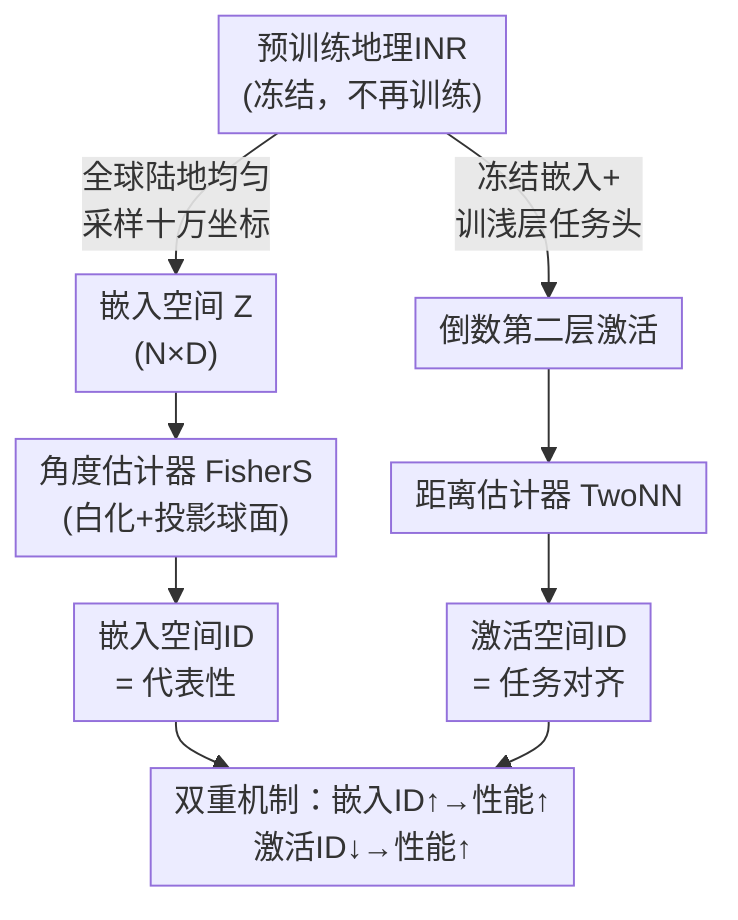

# Measuring the Intrinsic Dimension of Earth Representations

**会议**: ICLR 2026  
**arXiv**: [2511.02101](https://arxiv.org/abs/2511.02101)  
**代码**: [GitHub](https://github.com/arjunarao619/GeoINRID)  
**领域**: Remote Sensing / Representation Learning  
**关键词**: 内在维度, 地理隐式神经表示, 地球观测, 表示学习, 无监督评估

## 一句话总结

首次系统度量地理隐式神经表示（Geographic INR）的内在维度（ID），发现256-512维嵌入的真实ID仅2-10维；冻结嵌入空间的高ID与好的下游性能正相关，而监督任务头激活空间的低ID与高性能正相关，揭示了「代表性 vs 任务对齐」的双重机制。

## 研究背景与动机

地理隐式神经表示（Geographic INR）将经纬度坐标 $(λ, ϕ)$ 映射为高维嵌入向量 $z = f(λ, ϕ) \in \mathbb{R}^D$（$D$ 通常为256或512），通过在卫星图像、地面照片或文本上做对比学习预训练。SatCLIP、GeoCLIP、CSP等模型已被广泛用于土地覆盖分割、目标检测和图像地理定位等下游任务。

**核心问题**：这些高维表示中究竟包含了多少有效信息？现有评估完全依赖下游任务标签，缺乏架构无关、无需标签的信息量度量方式。

**关键洞察**：地球表面本身是二维球面 $S^2$，INR的输入流形维度已知为2。如果嵌入的内在维度（Intrinsic Dimension, ID）远高于2，说明模型确实编码了超越坐标本身的地理信号；如果ID接近环境维度 $D$，则可能存在冗余。这种"已知输入维度 + 可测量输出ID"的设定使得地理INR成为研究ID的理想对象。

## 方法详解

### 整体框架

本文不训练新模型，而是把一批已预训练的地理INR当作研究对象，用同一套内在维度（Intrinsic Dimension, ID）工具去量它们到底编码了多少独立信息。关键的设计是从**两个互补的空间**各量一次 ID，对应两个不同的问题。第一条线路冻结预训练编码器、在全球陆地均匀采样十万个坐标 $(λ, ϕ)$ 得到嵌入矩阵 $Z_{geo} \in \mathbb{R}^{N \times D}$，量这个嵌入流形有多少独立方向，对应"代表性"（representativeness）——表示本身有多丰富。第二条线路仍然冻结嵌入、只在其上训练一个浅层任务头，量监督学习能把特征压缩到多低维的任务流形上，对应"任务对齐"（task-alignment）——表示对某个下游任务有多好用。同一把 ID 尺子量这两个空间，最后却得到方向**相反**的相关结论，这个反差就是全文的核心发现。

### 关键设计

**1. 双空间ID测量协议：把"表示够不够丰富"和"表示好不好用"拆成两次测量**

只在一个空间量 ID 是说不清楚"高维更好还是低维更好"的，因为预训练和微调对维度的诉求恰恰相反。本文的做法是把这两件事分开量。代表性这一侧，对冻结的位置编码器 $f$ 在全球均匀坐标上生成嵌入 $Z_{geo}$，用前面那把"角度尺"量整个嵌入流形的全局 ID——ID 越高说明编码出的独立地理信号越多。任务对齐这一侧，**保持 INR 仍然冻结**，只额外训练一个浅层任务头，然后量这个任务头**倒数第二层激活**（penultimate-layer activation）的 ID（沿用 Ansuini et al. 2019 在分类网络里的做法）——本文把"任务对齐"定义成一个纯几何的概念：一个表示越能被浅层头压到低维流形上，就越对齐这个任务。两侧用同一把 ID 尺子，但因为量的空间不同（冻结嵌入 vs 监督激活），就能让"预训练要宽、微调要窄"这两个直觉在同一坐标系里被同时观测到。

**2. 角度估计器与距离估计器的互补使用：用对工具才不会被地理数据的空间异质性骗到**

地球表面的嵌入分布天然不均匀——气候带边界、海陆交界、训练图像的地域偏差都会造成局部密度突变，若直接用对邻域距离敏感的估计器做全局横向比较，结果会被这些局部结构污染。因此本文按用途分工：做**全局横向排名**（图中代表性这一侧）用**角度估计器 FisherS**，它先对嵌入白化再投影到球面，消除局部密度差异、只看方向分布的有效自由度，因而对空间异质性鲁棒，能在不同模型之间公平地排座次；做**逐点空间诊断**则用**距离估计器**（MLE、TwoNN、MOM、TLE），它们对局部邻域距离敏感，正好用来逐点估计、揭示嵌入的局部结构（任务对齐侧用的 TwoNN 也属此类）。两类估计器给出的数值常差一两倍（如 SatCLIP-L40 的 FisherS=8.08 而 MLE=2.03），这种差异本身被当作信号而非噪声来读。

**3. 局部ID地图：把单一标量铺开成全球图，让架构伪影和数据偏差现形**

全局 ID 只是一个数，掩盖了"哪里维度高、哪里维度低"的空间信息。本文用 MLE 估计器在 $k=100$ 近邻上逐点计算 ID，再画成全球地图，于是模型的内部毛病一目了然：GeoCLIP 的 ID 在美国和西欧最高，直接暴露其训练所用社交媒体图像的地域分布偏差；CSP 的地图呈规则网格条纹，源自位置编码的周期性重复；SatCLIP 则有细微振荡，对应球谐函数有限阶截断的截断效应。局部 ID 地图因此成为一个不需要标签的模型诊断工具。

**4. 分辨率—ID的因果实验：系统拨动位置编码的分辨率旋钮，把相关关系坐实成因果关系**

代表性高的模型性能好，可能只是相关；为说明分辨率确实在驱动 ID，本文逐一控制各模型位置编码的分辨率超参数——SatCLIP 的 Legendre 多项式阶数 $L$、GeoCLIP 的随机傅里叶特征（RFF）最大频率 $\sigma_{max}$ 与层级数 $M$、Space2Vec 的频率分量数 $S$——观察 ID 随之单调变化。结果 ID 随分辨率近乎单调递增（$L$ 从 10 升到 40 时 FisherS ID 从 5.0 升到 8.1，GeoCLIP 提高 $\sigma_{max}$ 后 ID 从 7.7 跃升近十倍至 75.7），把"高频位置编码扩展嵌入有效自由度"从猜测变成可控变量下的因果证据。

## 实验关键数据

### 各模型全局内在维度

| 模型 | 类型 | $D$ | FisherS | MLE | MOM | TLE |
|------|------|-----|---------|-----|-----|-----|
| SatCLIP-L10 | 位置编码器 | 256 | 5.00 | 1.96 | 2.02 | 2.16 |
| SatCLIP-L40 | 位置编码器 | 256 | 8.08 | 2.03 | 2.39 | 2.32 |
| GeoCLIP | 位置编码器 | 512 | 7.68 | 11.21 | 13.02 | 11.53 |
| CSP-fMoW | 位置编码器 | 256 | 1.70 | 5.18 | 5.23 | 6.25 |
| CSP-iNat | 位置编码器 | 256 | 0.92 | 3.37 | 4.64 | 4.14 |
| SINR | 位置编码器 | 256 | 3.19 | 2.19 | 3.36 | 2.74 |
| TaxaBind-Loc | 位置编码器 | 512 | 3.33 | 9.44 | 11.56 | 10.30 |
| CROMA | 图像编码器 | 768 | 9.79 | 19.57 | 17.00 | 20.30 |
| DOFA | 图像编码器 | 768 | 3.32 | 15.58 | 13.78 | 16.20 |
| ResNet152 | 图像编码器 | 2048 | 7.60 | 20.72 | 17.50 | 21.50 |

所有位置编码器的ID均比环境维度低1-2个数量级。GeoCLIP的距离估计ID（11-13）已接近大型图像编码器DOFA（14-16），说明仅靠经纬度输入也能编码丰富的地理信息。

### 输入模态对ID与性能的影响

| 预训练模态 | 全局FisherS ID | 气温R² | 高程R² | 人口R² |
|-----------|---------------|--------|--------|--------|
| Sentinel-2 | ~7.5 | ~0.76 | ~0.74 | ~0.78 |
| S1 + S2 | ~8.5 | ~0.80 | ~0.82 | ~0.82 |
| 全部模态（All） | ~9.5 | ~0.84 | ~0.86 | ~0.86 |

更多输入模态 → 更高ID → 更好下游性能，三者单调递增。

### 核心发现

- **嵌入空间ID与性能正相关**：冻结INR嵌入的全局FisherS ID越高，下游回归/分类性能越好（气温、高程、人口、生物群落、国家分类5个任务均成立）。高ID意味着更强的代表性，浅层学习器可利用更多独立方向。
- **激活空间ID与性能负相关**：监督MLP倒数第二层的TwoNN ID越低，性能越好。监督适配将INR特征压缩到了更低维的任务对齐流形上。这与Ansuini et al. (2019)在分类网络中的发现一致。
- **分辨率控制ID**：SatCLIP的Legendre阶数从10增到40时，FisherS ID从5.0升至8.1；GeoCLIP增加RFF最大频率后ID从7.7飙升至75.7。
- **局部ID暴露数据偏差**：GeoCLIP在美国/西欧ID最高（训练数据密集区），CSP呈网格伪影（位置编码周期性），可直接用于模型诊断。

## 亮点与洞察

- **代表性 vs 任务对齐的双重机制**是本文最核心的贡献：同一个ID度量在嵌入空间和激活空间呈现相反的相关方向，优雅地统一了"预训练要宽"和"微调要窄"两个直觉
- ID作为无标签度量的实用价值明确：可替代昂贵的下游评估做模型选择、超参数搜索和早停判断
- 局部ID地图是一个直观有效的模型诊断工具，可发现预训练数据覆盖偏差和架构引入的空间伪影
- 地理INR的ID（2-10）远低于环境维度（256-512），暗示当前模型表示严重冗余，存在压缩空间

## 分辨率对ID的影响

| 模型 | 分辨率参数 | 参数值 | 全局FisherS ID |
|------|-----------|--------|---------------|
| SatCLIP | Legendre阶数 $L$ | 10 | 5.0 |
| SatCLIP | Legendre阶数 $L$ | 20 | ~6.5 |
| SatCLIP | Legendre阶数 $L$ | 40 | 8.1 |
| GeoCLIP | RFF最大频率 $\sigma_{max}$ | $2^8$ | 7.7 |
| GeoCLIP | RFF最大频率 $\sigma_{max}$ | $2^{16}$ | 75.7 |

SatCLIP的ID随球谐函数阶数近乎线性增长；GeoCLIP在提高RFF频率后ID急剧跃升近10倍，说明高频位置编码极大扩展了嵌入的有效自由度。

## 局限性

- 不同ID估计器给出差异显著的数值（如SatCLIP-L40的FisherS=8.08 vs MLE=2.03），需根据场景选择估计器
- 仅分析了2D坐标输入的静态INR，未涉及加入时间维度的时空表示
- ID是单一标量，无法刻画嵌入空间的方向性结构或语义组织
- 代表性-任务对齐的相关性分析基于有限的7个位置编码器和5个下游任务，统计显著性依赖样本量
- 未探讨如何利用ID分析反向指导INR架构设计（如基于局部ID的自适应维度分配或区域加权微调）
- **表示学习评估**：传统的评估依赖下游任务probe，本文提供了无标签的替代方案
- 启发：ID分析方法可以推广到其他领域的预训练表示评估（如NLP中的语言模型表示、医学影像表示等）

## 评分
- 新颖性: ⭐⭐⭐⭐ （视角新但技术工具已有）
- 实验充分度: ⭐⭐⭐⭐ （多模型多维度分析全面）
- 写作质量: ⭐⭐⭐⭐ （27页含详尽附录）
- 价值: ⭐⭐⭐⭐ （为地球观测表示学习提供了重要分析工具）

<!-- RELATED:START -->

## 相关论文

- [\[ICLR 2026\] Earth-Agent: Unlocking the Full Landscape of Earth Observation with Agents](earth-agent_unlocking_the_full_landscape_of_earth_observation_with_agents.md)
- [\[CVPR 2026\] RAMEN: Resolution-Adjustable Multimodal Encoder for Earth Observation](../../CVPR2026/remote_sensing/ramen_resolution-adjustable_multimodal_encoder_for_earth_observation.md)
- [\[ICML 2026\] Localized, High-resolution Geographic Representations with Slepian Functions](../../ICML2026/remote_sensing/localized_high-resolution_geographic_representations_with_slepian_functions.md)
- [\[CVPR 2026\] GeoSANE: Learning Geospatial Representations from Models, Not Data](../../CVPR2026/remote_sensing/geosane_learning_geospatial_representations_from_models_not_data.md)
- [\[CVPR 2026\] OlmoEarth: Stable Latent Image Modeling for Multimodal Earth Observation](../../CVPR2026/remote_sensing/olmoearth_stable_latent_image_modeling_for_multimodal_earth_observation.md)

<!-- RELATED:END -->
