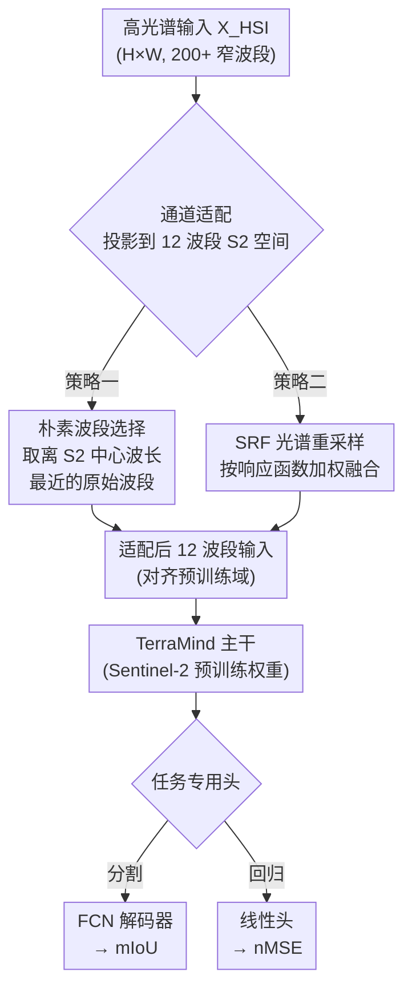

# Spectral Gaps and Spatial Priors: Studying Hyperspectral Downstream Adaptation Using TerraMind

**会议**: ICLR 2026  
**arXiv**: [2603.06690](https://arxiv.org/abs/2603.06690)  
**代码**: 无  
**领域**: 遥感  
**关键词**: 高光谱成像, 地理空间基础模型, 通道适配, TerraMind, 光谱响应函数

## 一句话总结

研究未经高光谱预训练的多模态地理空间基础模型 TerraMind 能否通过通道适配策略（朴素波段选择 vs. SRF 分组）有效适配高光谱下游任务，结果表明朴素波段选择一致优于物理感知的 SRF 方法，但性能差距随任务光谱复杂度增大而扩大。

## 研究背景与动机

1. 地理空间基础模型（GFM）已成为遥感领域的范式转变，从任务专用架构转向通用预训练模型，具备跨任务的可迁移表征能力。
2. 高光谱成像（HSI）通过数百个窄光谱通道提供丰富的光谱细节，对精准农业、矿物勘探和环境监测至关重要，但因数据复杂性在现有 GFM 中代表性不足。
3. 现有 HSI 专用 GFM（如 HyperSIGMA、SpectralEarth）大多为单模态；多模态 GFM（如 DOFA）虽纳入 HSI 预训练数据，但很少处理 HSI 所需的三维特征提取。
4. HSI 下游数据集的可用性和多样性有限，大多数基准数据集为单场景，难以支撑标准深度学习训练流程。
5. 核心研究问题：未经 HSI 预训练的多模态 GFM 能否作为 HSI 特定任务的有效基线？
6. 本文选择 TerraMind 作为研究对象，系统比较两种通道适配策略在四个 HSI 下游任务上的表现。

## 方法详解

### 整体框架

这篇论文想回答一个看似简单的问题：一个**根本没在高光谱数据上预训练过**的多模态地理空间基础模型 TerraMind，能不能当作高光谱（HSI）下游任务的有效基线？难点在于二者维度对不上——HSI 有数百个窄波段（$X_{\text{HSI}} \in \mathbb{R}^{H \times W \times C_{in}}$，$C_{in}$ 可达 200+），而 TerraMind 的光学分支只认 Sentinel-2 L2A 的 12 个波段。所以整条流程的核心就是一个「通道适配」环节：先把高维 HSI 投影到 12 波段的 S2 光谱空间（$\hat{X} \in \mathbb{R}^{H \times W \times 12}$），让它能喂进 TerraMind，再加上任务专用解码头，用预训练权重做下游微调。论文真正研究的，是这个投影该怎么做——**朴素波段选择**和 **SRF 光谱重采样**两种策略孰优孰劣，以及为什么。

### 关键设计

**1. 朴素波段选择：直接挑最近的那根波段，原样喂进去**

最直白的做法是不做任何融合：对 TerraMind 期望的每个 S2 目标波段 $k$（中心波长 $\mu_k$），从所有 HSI 波段里挑中心波长 $\lambda_j$ 离它最近的那一根，原值搬过来：

$$\hat{X}_{:,:,k} = X_{\text{HSI}}\left[:,:,\arg\min_j |\lambda_j - \mu_k|\right]$$

这样得到的 12 个通道，每个都保留了某根窄波段的**原始辐射值**，代价是其余几百个波段的光谱信息被直接丢弃。看上去很「浪费」，但它有个隐性优点：保留了 TerraMind 预训练时见过的、围绕 S2 中心波长的原始辐射分布——后面实验会发现这恰恰是它取胜的关键。

**2. SRF 光谱重采样：用物理响应函数加权融合，更「真实」却更平滑**

第二种是物理上更讲究的做法：用 Sentinel-2 的光谱响应函数（SRF）$\phi_k$ 去模拟真实卫星会怎么「看」这段光谱。每个 S2 波段 $k$ 不是只取一根 HSI 波段，而是把落进它响应范围的所有 HSI 波段按响应强度加权求和，权重矩阵 $\mathbf{W} \in \mathbb{R}^{C_{in} \times 12}$ 归一化为：

$$\hat{w}_{j,k} = \frac{\phi_k(\lambda_j)}{\sum_{m=1}^{C_{in}} w_{m,k}}$$

它的好处是合成出来的 12 波段在物理上更接近真实 S2 信号，理论上和 TerraMind 的预训练域更对齐。但加权求和本质上是个**低通滤波器**：它把多根窄波段抹成一个平滑的均值，关键的窄带光谱特征（树种、矿物的细峰）在这一步被糊掉了。所以「物理更真实」和「特征更模糊」在这里是一对内在矛盾，论文要验证的正是哪一头占上风。

### 损失函数/训练策略

- 分割任务使用 Fully Convolutional 解码器（256 通道）+ 交叉熵损失
- 回归任务使用线性头（隐藏维度 256）+ MSE 损失
- AdamW 优化器，训练 100 个 epoch，早停（patience=20）
- 分割用 Cosine Annealing，回归用 ReduceOnPlateau
- 所有实验重复 10 次（不同随机种子），确保统计鲁棒性

## 实验关键数据

### 主实验

| 模型 | 适配方式 | EnMAP-BNETD (Easy) | EnMAP-CDL (Moderate) | EnMAP-BDForet (Hard) | Hyperview-1 (V.Hard) |
|------|----------|-------|--------|---------|---------|
| TerraMind | Naive Selection | 0.465±0.002 | 0.693±0.006 | 0.657±0.007 | 0.813 (Rank #6) |
| TerraMind | SRF Grouping | 0.461±0.003 | 0.679±0.006 | 0.623±0.006 | 0.831 (Rank #25) |
| SpectralEarth | Full HSI (Upper) | **0.495±0.001** | **0.774±0.003** | **0.766±0.005** | **0.810** (Rank #5) |

### 消融实验

| 对比维度 | 结论 |
|----------|------|
| Naive vs. SRF | Naive 一致优于 SRF，分割任务高 0.4%~3.4% mIoU |
| 性能差距 vs. 光谱复杂度 | Easy: ~3% gap, Moderate: ~8% gap, Hard: ~11% gap |
| Hyperview-1 回归 | TerraMind Naive (0.813) 接近 SpectralEarth (0.810)，空间表征可补偿光谱缩减 |

### 关键发现

1. **朴素选择一致优于 SRF**：TerraMind 预训练对 S2 中心波长形成了强锚定，朴素选择保留了这些锚点的原始辐射分布；SRF 加权平均作为低通滤波器平滑了关键窄带特征。
2. **性能差距与光谱复杂度正相关**：简单任务（土地覆盖）靠空间特征即可补偿，复杂任务（树种分类）12 波段无法捕获细粒度光谱特征。
3. **回归任务的意外竞争力**：土壤参数（K, P₂O₅, Mg, pH）可通过有机质和黏土矿物等代理信号间接检测，这些信号的宽光谱响应与 S2 波段对齐。

## 亮点与洞察

1. 首次系统评估非 HSI 预训练的多模态 GFM 在 HSI 下游任务上的适配能力，建立了重要的基线参考。
2. 揭示了反直觉的结论：物理感知的 SRF 方法不如简单的波段选择，这与模型预训练的表征锚定机制有关。
3. 实验设计严谨——10 次随机种子重复，涵盖从"简单"到"极难"的四个任务梯度。
4. 对 Hyperview-1 回归结果的深入分析（土壤光谱学视角）展示了跨学科的洞察力。

## 局限与展望

1. 仅研究了 TerraMind 一个 GFM，结论可能具有模型特异性，需在其他 GFM（如 DOFA）上验证。
2. 通道适配仅限于简单的选择/加权策略，未探索可学习的光谱投影或适配器。
3. 缺乏对 HSI 原生 tokenizer 的探索，这是论文自身提出的未来方向。
4. 下游数据集规模有限（1600~2550 chips），可能影响微调效果的评估。

## 相关工作与启发

- **SpectralEarth**：HSI 原生基础模型，使用全部 202 波段，作为性能上界参考。
- **DOFA**：多模态 GFM 但未充分处理 HSI 三维特征提取。
- **TerraMind**：多模态 GFM，预训练于多光谱/SAR/DEM/LULC，光学部分为 Sentinel-2。
- 启发：未来多模态 GFM 需原生支持高光谱 tokenization，而非简单的降维适配。

## 评分

- ⭐ 新颖性: 3/5 — 研究问题有价值，但方法本身较简单（波段选择+微调）
- ⭐ 实验充分度: 4/5 — 四个数据集、两种策略、10 次重复，统计上严谨
- ⭐ 写作质量: 4/5 — 结构清晰，分析深入，对结果有合理解释
- ⭐ 价值: 3.5/5 — 为 HSI 集成到多模态 GFM 提供了重要基线和洞察

<!-- RELATED:START -->

## 相关论文

- [\[CVPR 2026\] HyperFM: An Efficient Hyperspectral Foundation Model with Spectral Grouping](../../CVPR2026/remote_sensing/hyperfm_an_efficient_hyperspectral_foundation_model_with_spectral_grouping.md)
- [\[CVPR 2026\] Spatial-Spectral Residuals Informed Diffusion Neural Operator for Pan-sharpening](../../CVPR2026/remote_sensing/spatial-spectral_residuals_informed_diffusion_neural_operator_for_pan-sharpening.md)
- [\[CVPR 2026\] HySeg: Learning Generative Priors for Structure-Aware Remote Sensing Segmentation](../../CVPR2026/remote_sensing/hyseg_learning_generative_priors_for_structure-aware_remote_sensing_segmentation.md)
- [\[CVPR 2026\] No Labels, No Look-Ahead: Unsupervised Online Video Stabilization with Classical Priors](../../CVPR2026/remote_sensing/no_labels_no_look-ahead_unsupervised_online_video_stabilization_with_classical_p.md)
- [\[CVPR 2026\] Exploring Spatiotemporal Feature Propagation for Video-Level Compressive Spectral Reconstruction](../../CVPR2026/remote_sensing/exploring_spatiotemporal_feature_propagation_for_video-level_compressive_spectra.md)

<!-- RELATED:END -->
