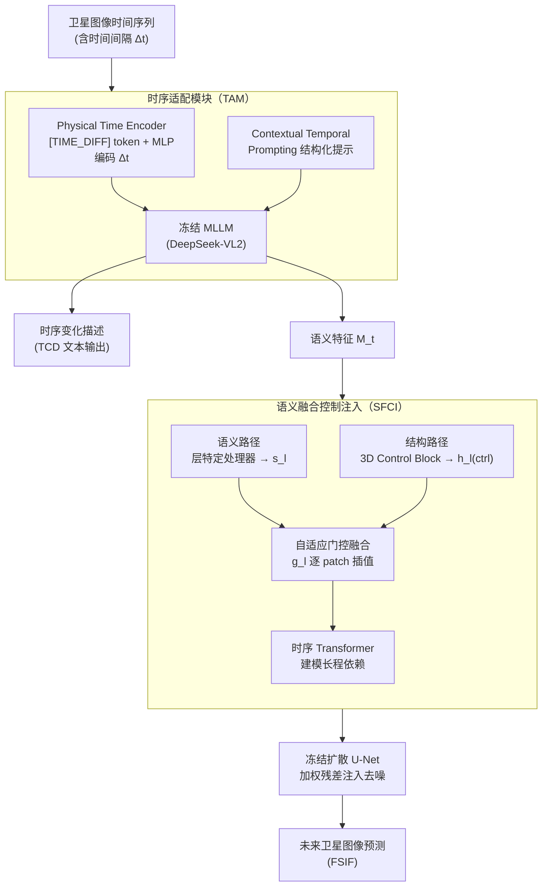

# TAMMs: Change Understanding and Forecasting in Satellite Image Time Series with Temporal-Aware Multimodal Models

**会议**: ICLR 2026  
**arXiv**: [2506.18862](https://arxiv.org/abs/2506.18862)  
**代码**: 无  
**领域**: 遥感  
**关键词**: 卫星图像时间序列, 变化描述, 未来预测, 多模态大模型, 扩散模型

## 一句话总结

提出 TAMMs——首个统一框架，在单一 MLLM-扩散架构中联合执行卫星图像时间序列的时序变化描述（TCD）和未来图像预测（FSIF），通过时序适配模块（TAM）唤醒冻结 MLLM 的时序推理能力，并通过语义融合控制注入（SFCI）机制将变化理解转化为生成控制信号。

## 研究背景与动机

1. 卫星图像时间序列（SITS）的时序变化描述（TCD）和未来图像预测（FSIF）是两个核心但历史上割裂的任务，共同受限于长程时序动态建模能力不足。
2. 现有 TCD 方法（如 SITSCC）通过简单交互融合时序多图信息，长程时序推理能力有限；现有 FSIF 方法（如 DiffusionSat）主要依赖元数据条件控制，缺乏对语义变化的理解。
3. MLLM 在视觉-语言任务上表现优异，但其视频理解能力针对密集采样的短时间间隔优化，无法直接适应 SITS 中跨越数年的稀疏、长期时间间隔。
4. 扩散模型的控制信号（如边缘图或元数据）通常为低层级信息，缺乏对时序演变叙事的高层语义理解指导。
5. 现有评估指标（PSNR、SSIM）存在"评估鸿沟"——无法惩罚时序不合理的预测，一个感知逼真但与历史趋势不一致的预测仍会获得高分。
6. 本文核心假设：赋能 MLLM 深度理解历史动态，可以带来更一致的未来预测——理解与生成的协同增益。

## 方法详解

### 整体框架

TAMMs 想在一个框架里同时做好两件历史上割裂的事——读懂卫星图像时间序列里"过去几年发生了什么变化"（时序变化描述 TCD），并据此画出"接下来会变成什么样"（未来图像预测 FSIF）。它把这串起来分两个协同阶段：先是时序变化理解阶段，时序适配模块（TAM）唤醒一个冻结多模态大模型（MLLM）的时序推理能力，让它输出文本描述和语义特征向量 $\mathbf{M}_t$；再是未来预测阶段，语义融合控制注入（SFCI）机制把 $\mathbf{M}_t$ 翻译成多尺度控制信号，引导冻结的扩散 U-Net 去噪生成未来图像。理解出来的"变化叙事"直接喂给生成，让预测不只是看着真，而是和历史趋势一致。MLLM 骨干为冻结的 DeepSeek-VL2，生成组件基于 DiffusionSat（Stable Diffusion 2-1），全程只训练轻量适配器。

### 关键设计

**1. 时序适配模块（TAM）：让冻结 MLLM 看懂"跨年"的稀疏时间间隔**

MLLM 的视频理解是为密集采样的短间隔优化的，直接喂给它跨越数年的卫星序列，注意力无法把视觉变化和真实时间跨度对应起来。TAM 用两个轻量组件解决这件事。一是 Physical Time Encoder（PTE）：引入可学习的时序 token `[TIME_DIFF]`，让一个 MLP 动态条件化于具体的时间间隔 $\Delta t_i$，再把它插到相邻两帧的视觉特征之间——这样 MLLM 的注意力机制就能把"这块地变了"和"中间隔了三年"直接绑在一起，而不是把所有帧当成等距快照。二是 Contextual Temporal Prompting（CTP）：用一段结构化文本提示给出详细的场景描述，把 MLLM 通用的视觉推理能力聚焦到"描述这段观测序列里发生了什么变化"这个具体的时序任务上。两者合起来，相当于不动 MLLM 主体、只用适配器就"唤醒"了它本就潜藏的时序推理能力。

**2. 语义融合控制注入（SFCI）：把"理解"翻译成扩散模型能用的细粒度控制信号**

光有文本描述还不够——ControlNet 那类粗粒度文本控制无法把 MLLM 的多图时序理解传到生成端。SFCI 通过一个增强控制模块（ECM）与冻结的扩散 U-Net 并行工作，分四步把语义注入去噪过程。先走结构路径：冻结的 3D Control Block 处理 U-Net 编码器特征，得到编码视觉动态的结构控制信号 $\mathbf{h}_l^{(ctrl)}$。再走语义路径：MLLM 输出的语义特征 $\mathbf{M}_t$ 经层特定处理器投影、平铺成空间感知的引导信号 $\mathbf{s}_l$。关键的一步是自适应门控融合——一个动态门 $\mathbf{g}_l$ 在两条信号之间逐位置插值：

$$\mathbf{f}_l = (1-\mathbf{g}_l) \odot \mathbf{h}_l^{(ctrl)} + \mathbf{g}_l \odot \mathbf{s}_l$$

让模型自己决定每个 patch 上"听结构"还是"听语义"。最后由一个时序 Transformer 建模长程依赖，通过加权残差连接把结果整合进 U-Net。这条路径把高层的变化理解直接落到 patch 级控制上，绕开了文本瓶颈。

**3. 时序一致性评分（TCS）：补上 PSNR/SSIM 罚不到时序乱真的"评估鸿沟"**

PSNR、SSIM 只看像素和感知逼真度，一个画得很真但与历史趋势相悖的预测照样拿高分。TCS 专门量化"预测的变化和历史动态是否一致"，由两个子分相乘构成：

$$\text{TCS} = \text{SPS} \cdot \text{ACS}$$

其中 SPS（空间接近度评分）衡量变化质心的位置是否对得上，ACS（面积一致性评分）衡量变化幅度是否相符。两者都基于二值变化检测，相乘意味着位置和幅度任一失配都会被惩罚，越高代表预测越贴合历史演变轨迹。

### 损失函数/训练策略

- 两阶段训练：先训练结构路径学习基础时空先验，再冻结结构路径训练语义组件
- 理解阶段：复合损失 $\mathcal{L} = \lambda_{\text{text}} \mathcal{L}_{\text{text}} + \lambda_{\text{temp}} \mathcal{L}_{\text{temp}}$，平衡文本准确性与时序正则化
- 生成阶段：标准扩散损失
- 仅训练轻量级适配器组件，MLLM 和 U-Net 均冻结

## 实验关键数据

### 主实验

**时序变化描述（TCD）**：

| 模型 | BLEU-4 | METEOR | ROUGE-L | CIDEr-D |
|------|--------|--------|---------|---------|
| RSICC-Former | 0.1285 | 0.1930 | 0.3489 | 0.5344 |
| SITSCC | 0.2122 | 0.2961 | 0.4701 | 0.6244 |
| TEOChat | 0.2398 | 0.3102 | 0.4735 | 0.8267 |
| **TAMMs** | **0.2669** | **0.3312** | **0.4690** | **0.9030** |

**未来图像预测（FSIF）**：

| 模型 | PSNR↑ | SSIM↑ | LPIPS↓ | TCS↑ |
|------|-------|-------|--------|------|
| DiffusionSat | 11.89 | 0.1520 | 0.5225 | 0.7624 |
| MCVD | 9.22 | 0.2098 | 0.4970 | 0.1930 |
| **TAMMs** | **12.07** | 0.1831 | **0.4931** | **0.9690** |

### 消融实验

| 配置 | BLEU-4 | CIDEr-D | TCS |
|------|--------|---------|-----|
| SFT only | 0.2134 | 0.7523 | 0.6842 |
| w/o PTE | 0.2387 | 0.8234 | 0.7456 |
| w/o CTP | 0.2445 | 0.8567 | 0.8234 |
| w/o Semantic Fusion | - | - | 0.7911 |
| w/o Text Guidance | - | - | 0.9410 |
| Base Control Block | - | - | 0.7624 |
| **TAMMs (Full)** | **0.2669** | **0.9030** | **0.9690** |

### 关键发现

1. **TCS 指标优势显著**：TAMMs 的 TCS (0.9690) 远超 DiffusionSat (0.7624) 和 GeoSynth-Canny (0.2170)，证明其生成的未来图像与历史演变轨迹更一致。
2. **语义融合至关重要**：移除语义特征融合导致 TCS 下降 18%（0.9690→0.7911），验证了将 MLLM 的深层语义推理直接注入生成控制路径的核心假设。
3. **PTE 对时序理解贡献最大**：移除 PTE 导致 TCS 下降 23%，表明显式时间间隔编码是唤醒 MLLM 时序推理的关键。

## 亮点与洞察

1. 首次将时序变化理解和未来预测统一到单一框架中，理解指导生成、生成验证理解的双向协同设计新颖。
2. TCS 指标填补了时序预测评估的空白——标准质量指标无法衡量时序一致性，TCS 通过空间接近度和面积一致性量化。
3. TAM 模块的设计很优雅——通过参数高效的方式"唤醒"冻结 MLLM 的潜在时序推理能力，而非昂贵的全模型微调。
4. SFCI 跳过了粗粒度文本控制的瓶颈，直接将 MLLM 的多图像时序理解特征转化为 patch 级别的细粒度控制信号。

## 局限与展望

1. 训练集标签由 Qwen2.5-VL 自动生成（37K 序列），可能引入系统性偏差，测试集仅 150 个序列。
2. SSIM 指标上 MCVD (0.2098) 高于 TAMMs (0.1831)，标准质量指标与时序一致性指标之间存在权衡。
3. TCS 指标基于二值变化检测，对渐变式变化（如植被缓慢退化）的捕获能力可能有限。
4. 未探索非常长期（>10 年）或突发事件的预测场景。

## 相关工作与启发

- **DiffusionSat**：基于元数据条件的卫星图像生成基础模型，缺乏语义理解指导。
- **SITSCC**：多时序变化描述方法，缺乏 MLLM 的深层语义推理。
- **TEOChat**：面向地球观测的时序 MLLM，但仅限描述任务无生成能力。
- **ControlNet**：仅用文本控制扩散模型生成，对时序预测的 patch 级信号引导不足。
- 启发：理解与生成的统一是遥感时空分析的重要方向，TAM 的"唤醒"思路可推广到其他时序感知不足的基础模型。

## 评分

- ⭐ 新颖性: 4.5/5 — 首个统一 TCD+FSIF 框架，TCS 指标、TAM 和 SFCI 均有创新
- ⭐ 实验充分度: 4/5 — 消融充分，定性分析丰富，但测试集较小（150 序列）
- ⭐ 写作质量: 4/5 — 问题驱动清晰，两个"How"问题引导方法设计
- ⭐ 价值: 4/5 — 为遥感时空分析建立了理解驱动生成的新范式

<!-- RELATED:START -->

## 相关论文

- [\[CVPR 2026\] UniChange: Unifying Change Detection with Multimodal Large Language Model](../../CVPR2026/remote_sensing/unichange_unifying_change_detection_with_multimodal_large_language_model.md)
- [\[ICML 2025\] Resampling Augmentation for Time Series Contrastive Learning: Application to Remote Sensing](../../ICML2025/remote_sensing/resampling_augmentation_for_time_series_contrastive_learning_application_to_remo.md)
- [\[CVPR 2026\] Sparsely Timing the Change: A Spiking Temporal Framework for Remote Sensing Interpretation](../../CVPR2026/remote_sensing/sparsely_timing_the_change_a_spiking_temporal_framework_for_remote_sensing_inter.md)
- [\[NeurIPS 2025\] EcoCast: A Spatio-Temporal Model for Continual Biodiversity and Climate Risk Forecasting](../../NeurIPS2025/remote_sensing/ecocast_a_spatio-temporal_model_for_continual_biodiversity_and_climate_risk_fore.md)
- [\[NeurIPS 2025\] Connecting the Dots: A Machine Learning Ready Dataset for Ionospheric Forecasting Models](../../NeurIPS2025/remote_sensing/connecting_the_dots_a_machine_learning_ready_dataset_for_ionospheric_forecasting.md)

<!-- RELATED:END -->
