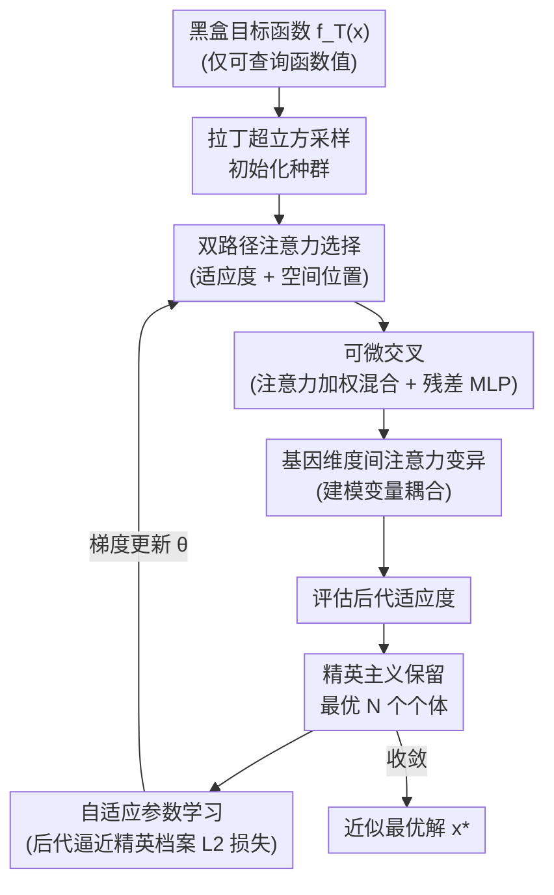

# Task-free Adaptive Meta Black-box Optimization

**会议**: ICLR 2026 Oral  
**arXiv**: [2601.21475](https://arxiv.org/abs/2601.21475)  
**代码**: 无  
**领域**: 遥感  
**关键词**: 黑盒优化, 元学习, 进化算法, 自适应参数学习, 零样本优化  

## 一句话总结
提出 ABOM——一种无需预定义训练任务的自适应元黑盒优化器，通过将进化算子（选择、交叉、变异）参数化为可微注意力模块，在优化过程中利用自生成数据在线更新参数，在合成基准和无人机路径规划上实现零样本竞争性能。

## 研究背景与动机

**领域现状**：黑盒优化（BBO）广泛应用于超参数调优、神经架构搜索等场景。传统进化算法（EA）依赖手工设计的算子和参数，Meta-BBO 方法通过元学习自动配置优化器，但需要在人工设计的训练任务分布 $\mathcal{F}$ 上预训练。

**现有痛点**：Meta-BBO 方法的核心限制在于对手工训练任务分布的依赖。在实际应用中，目标任务的分布往往未知或独特（如特定的工程优化问题），无法获得合适的训练任务集合。

**核心矛盾**：NFL 定理表明没有通用最优算法，因此需要自适应。但现有自适应方法要么需要领域知识设计规则（传统自适应 EA），要么需要训练任务分布（Meta-BBO）。如何在既无领域知识又无训练任务的情况下实现自适应？

**本文目标**：(a) 消除对预定义训练任务分布的依赖；(b) 将离散的算法选择空间替换为连续可微的参数空间；(c) 用优化过程中自生成的数据实现在线参数学习。

**切入角度**：将进化算子参数化为注意力机制，使其可微，然后用"让后代逼近精英档案"作为监督信号在线更新参数。

**核心 idea**：用注意力机制参数化进化算子，将 meta-learning 的"先训后用"模式转变为"边用边学"的闭环自适应。

## 方法详解

### 整体框架
输入为黑盒目标函数 $f_T(\mathbf{x})$（仅可查询函数值），输出为近似最优解 $\mathbf{x}^*$。ABOM 把传统进化算法的一轮迭代拆成一条闭环流水线：先用拉丁超立方采样初始化种群，再依次过三个**参数化进化算子**——双路径注意力选择决定谁来重组、可微交叉融合父代、基因维度间注意力变异注入扰动——生成一批后代；评估后代适应度后用精英主义保留最优 $N$ 个个体，最后以"后代该向精英档案靠拢"为监督信号反传梯度、就地更新算子参数 $\theta$，再进入下一轮。整个过程无需预训练，直接在目标任务上"边优化边学习"。

### 关键设计

ABOM 的核心是把进化算法里三个原本靠手工规则的算子——选择、交叉、变异——全部改写成带可学习参数的注意力模块，再加一个在线更新这些参数的闭环。前三个设计回答"后代怎么生成"，第四个回答"参数怎么在没有训练任务的情况下自己学好"。

**1. 双路径注意力选择：让"谁参与重组"同时看适应度和空间位置**

传统选择（如锦标赛选择）只按适应度排名挑个体，等于丢掉了"谁离谁近"这层信息。ABOM 把选择做成一个 $N \times N$ 的注意力矩阵 $\mathbf{A}^{(t)}$，决定每个个体重组时该从哪些个体取材。它开两条路径：一路用位置坐标 $\mathbf{P}$ 做 Query-Key 投影编码解之间的空间关系，另一路用适应度 $\mathbf{F}$ 做投影编码排名优劣，两者相加后过 softmax 融合：

$$\mathbf{A}^{(t)} = \text{softmax}\left(\frac{(\mathbf{P}\mathbf{W}^{QP})(\mathbf{P}\mathbf{W}^{KP})^\top + (\mathbf{F}\mathbf{W}^{QF})(\mathbf{F}\mathbf{W}^{KF})^\top}{\sqrt{d_A}}\right)$$

这样权重同时体现"谁更好"和"谁更近"，重组比纯按排名挑更有针对性。

**2. 可微交叉：用注意力加权的父代混合 + 残差 MLP 替代固定交叉规则**

有了选择矩阵后，交叉这一步要把被选中的父代信息融合成中间种群 $\mathbf{P}'^{(t)}$。ABOM 先用 $\mathbf{A}^{(t)}\mathbf{P}^{(t)}$ 对父代做注意力加权混合，得到一个"交叉池"，再过 MLP 学一个非线性偏移量，最后以残差形式叠回原种群：

$$\mathbf{P}'^{(t)} = \mathbf{P}^{(t)} + \text{MLP}_{\theta_c}(\mathbf{A}^{(t)}\mathbf{P}^{(t)})$$

残差连接保住父代本身的信息，MLP 负责学非线性的交叉模式。关键细节是交叉里的 Dropout（概率 $p_C$）在推理时也保持启用——它顶替了传统 EA 里那个手调的交叉概率超参数，成为持续注入探索随机性的来源。

**3. 基因维度间注意力变异：让变异考虑变量之间的耦合**

传统变异（如高斯扰动）对每一维独立加噪，忽略了"改第 $j$ 维往往得连带调第 $k$ 维"这种变量耦合。ABOM 为每个个体单独算一个 $d \times d$ 的变异矩阵 $\mathbf{M}_i^{(t)}$，用自注意力建模各基因维度之间的依赖强度，再以残差方式作用到中间个体上：

$$\hat{\mathbf{p}}_i = \mathbf{p}'_i + \text{MLP}_{\theta_m}(\mathbf{M}_i^{(t)}\mathbf{p}'_i)$$

于是变异不再是各维独立的随机扰动，而是能学到问题特定的维度交互结构（可视化里能看到 $\mathbf{M}_i$ 从随机初始化演化出有序模式）。

**4. 自适应参数学习：用"后代逼近精英档案"当监督信号，把先训后用变成边用边学**

前三个算子的所有参数 $\theta$ 都要学，但 task-free 设定下没有训练任务、也没有标注，监督信号从哪来？ABOM 的答案是拿精英档案 $\mathbf{E}^{(t)}$（当前保留的最优 $N$ 个个体）当目标，让本轮生成的后代 $\hat{\mathbf{P}}^{(t)}$ 在 L2 距离上向它靠拢：

$$\mathcal{L}^{(t)} = \|\hat{\mathbf{P}}^{(t)} - \mathbf{E}^{(t)}\|^2$$

每轮用 AdamW 做一步梯度更新 $\theta \leftarrow \theta - \eta \nabla_\theta \mathcal{L}^{(t)}$。精英档案携带了"目前已知哪里更优"的信息，把后代往这个方向拉，相当于"适者生存"的梯度版本——这条自生成的监督信号就是 ABOM 不需要预定义训练任务、能在目标问题上原地自适应的关键。

### 损失函数 / 训练策略
- 损失函数：$\mathcal{L}^{(t)} = \|\hat{\mathbf{P}}^{(t)} - \mathbf{E}^{(t)}\|^2$，后代与精英档案的 L2 距离
- 无预训练，参数随机初始化后在优化过程中在线学习
- 理论保证：在紧致搜索空间和连续目标函数下，ABOM 保证全局收敛

## 实验关键数据

### 主实验（BBOB 合成基准 $d=500$）
在 16 个测试函数上与 10 个基线对比（30 次独立运行，Wilcoxon 检验）：

| 方法类别 | 代表方法 | vs ABOM 胜/平/负 | 说明 |
|---------|---------|----------------|------|
| 传统 EA | RS/PSO/DE | 0/0/16 | ABOM 在所有函数上显著更好 |
| 自适应 EA | CMAES/JDE21 | 2~3/1~2/11~13 | ABOM 总体显著更优 |
| MetaBBO | GLEET/RLDEAFL/LES/GLHF | 1~4/1~3/9~14 | ABOM 无需训练任务即可匹配或超越 |

### 实际应用（无人机路径规划 - 28个问题）

| 指标 | ABOM | 最佳MetaBBO | 最佳自适应EA |
|------|------|------------|------------|
| 归一化代价收敛速度 | 最快 | 中等 | 慢 |
| 最终归一化代价 | 最低 | 中等 | 较高 |
| 运行时间 | GPU加速，最快之一 | 需预训练 | CPU-bound |

### 消融实验

| 配置 | BBOB $d=500$ 排名 | 说明 |
|------|------------------|------|
| ABOM（完整） | 最优 | 选择+交叉+变异+自适应学习 |
| w/o 自适应学习 | 显著下降 | 固定随机参数，退化为随机搜索 |
| w/o 选择注意力 | 下降 | 均匀选择，类似随机重组 |
| w/o 变异注意力 | 下降 | 独立维度变异 |

### 关键发现
- ABOM 在 **无需任何训练任务** 的情况下匹配或超越需要训练任务的 MetaBBO 方法
- 可视化揭示选择矩阵自动学会"适者生存"模式（高适应度个体权重更高），但不总是选最优个体（保持多样性）
- 变异矩阵从随机初始化演化出有序结构，反映了问题特定的基因交互模式
- 参数对 dropout 率 $p_C, p_M$ 较敏感，过低导致过早收敛，过高导致搜索过于随机

## 亮点与洞察
- **将元学习从"先训后用"变为"边用边学"**是核心创新：通过让后代逼近精英档案作为监督信号，将无监督的 BBO 问题转化为在线监督学习。这个思路可迁移到其他需要在线适应的元学习场景。
- **注意力机制作为进化算子**的类比非常自然：选择 = 个体间注意力权重，交叉 = 加权重组 + MLP 变换，变异 = 维度间自注意力。关键是 dropout 在推理时也保持启用来维持探索性。
- 提供了**全局收敛的理论保证**，尽管在实际中收敛速度取决于问题结构。

## 局限与展望
- 计算复杂度为 $O(d^3)$（$d$ 为搜索空间维度），对超高维问题（$d > 1000$）不实用
- 精英档案逼近损失可能导致种群多样性丧失——没有显式的多样性保持机制
- 仅在 BBOB 合成函数和 UAV 路径规划上验证，缺少更多实际应用场景
- 与传统自适应 EA（如 CMA-ES）在某些函数上仍有差距

## 相关工作与启发
- **vs CMA-ES**: CMA-ES 通过协方差矩阵自适应实现搜索方向调整，但需要领域知识设计。ABOM 通过注意力机制自动学习类似的搜索策略。
- **vs GLHF/RLDEAFL**: 这些 MetaBBO 方法需要在训练任务分布上预训练，ABOM 完全避免了这一依赖。
- **vs EvoTorch/OpenELM**: 现有可微进化框架侧重 GPU 加速，ABOM 进一步实现了算子参数化和在线学习。

## 评分
- 新颖性: ⭐⭐⭐⭐ 将进化算子完全参数化为可微注意力模块的思路新颖
- 实验充分度: ⭐⭐⭐⭐ BBOB 三个维度 + UAV应用 + 消融 + 可视化
- 写作质量: ⭐⭐⭐⭐ 从 MetaBBO 到 ABOM 的推导清晰
- 价值: ⭐⭐⭐⭐ 对元黑盒优化领域有重要贡献

<!-- RELATED:START -->

## 相关论文

- [\[CVPR 2025\] Meta-Learning Hyperparameters for Parameter Efficient Fine-Tuning](../../CVPR2025/remote_sensing/meta-learning_hyperparameters_for_parameter_efficient_fine-tuning.md)
- [\[CVPR 2026\] Semantic-Adaptive Diffusion for Dynamic Spatiotemporal Fusion](../../CVPR2026/remote_sensing/semantic-adaptive_diffusion_for_dynamic_spatiotemporal_fusion.md)
- [\[CVPR 2026\] VLM4RSDet: Collaborative Optimization with Vision-Language Model for Enhancing Remote Sensing Object Detection](../../CVPR2026/remote_sensing/vlm4rsdet_collaborative_optimization_with_vision-language_model_for_enhancing_re.md)
- [\[CVPR 2026\] HarmoniDiff-RS: Training-Free Diffusion Harmonization for Satellite Image Composition](../../CVPR2026/remote_sensing/harmonidiff-rs_training-free_diffusion_harmonization_for_satellite_image_composi.md)
- [\[CVPR 2026\] Prompt-Free Unknown Label Generation for Open World Detection in Remote Sensing](../../CVPR2026/remote_sensing/prompt-free_unknown_label_generation_for_open_world_detection_in_remote_sensing.md)

<!-- RELATED:END -->
