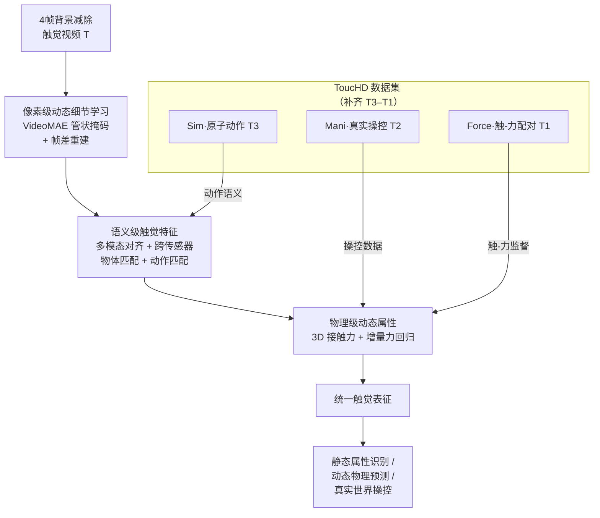

# AnyTouch 2: General Optical Tactile Representation Learning For Dynamic Tactile Perception

**会议**: ICLR 2026  
**arXiv**: [2602.09617](https://arxiv.org/abs/2602.09617)  
**代码**: [https://github.com/GeWu-Lab/AnyTouch2](https://github.com/GeWu-Lab/AnyTouch2)  
**领域**: 触觉感知 / 机器人  
**关键词**: 触觉表示学习, 动态感知, 光学触觉传感器, 力感知, 触觉数据集

## 一句话总结
AnyTouch 2提出触觉动态金字塔框架，构建包含242.6万接触样本的ToucHD层级数据集（涵盖原子动作、真实操控和触力配对数据），并设计统一像素级、语义级和物理级三层次动态感知的触觉表征学习框架，在静态属性识别、动态物理预测和真实世界操控四项任务上全面超越现有方法。

## 研究背景与动机
真实世界的接触密集型操控要求机器人感知时序触觉反馈、捕捉细微表面变形、推理物体属性和力学动态。光学触觉传感器能提供如此丰富的信息，但现有触觉数据集和模型存在严重局限：(1) 数据主要聚焦于物体级属性（如材质），忽视了物理交互过程中的细粒度触觉时序动态；(2) 现有的基于图像自监督或多模态对齐的预训练模型难以捕获细粒度变形和力感知动态。核心矛盾在于缺乏系统化的动态触觉感知范式——既缺少指导数据采集的层级框架，也缺少匹配的模型设计。本文的核心idea是：建立触觉动态金字塔，从数据和模型两个维度系统性地推进动态触觉感知。

## 方法详解

### 整体框架
AnyTouch 2把动态触觉感知拆成由浅入深的三层能力，分别对应触觉动态金字塔的不同阶梯——金字塔从 T5（仅按压）、T4（随机动作）、T3（特定动作）、T2（操控）一路到 T1（力数据），而 ToucHD 数据集恰好补齐了 T3–T1 三个最缺的高阶层级。模型以 4 帧背景减除后的连续触觉图像为输入，先在像素级学习细微变形，再在语义级建立物体与动作的理解，最后在物理级把表征锚定到可量化的接触力，输出一个能同时服务静态识别、动态预测和真实操控的统一触觉表征。整体上，ToucHD 数据集是这条由浅入深流水线的"燃料"，三层学习目标各取所需地从它的不同层级取数。

### 关键设计

**1. 像素级动态细节学习：让模型盯住帧间那点微小变形**

触觉信号最有价值的信息往往藏在相邻帧之间高度局部化的细微形变里，普通的图像级自监督会把这些信号淹没。这里用视频掩码自编码器（VideoMAE）处理背景帧减除后的归一化输入 $\mathbf{T} \in \mathbb{R}^{N \times H \times W \times 3}$，把视频切成 3D 时空 token 后施加比率 $\rho=0.75$ 的管状掩码再重建。仅靠原始帧重建不足以逼模型关注变化，因此额外加入**帧差重建**：以 $D_n = T_n - T_1$ 显式算出每帧相对首帧的差值并训练一个帧差解码器去重建它，总损失为 $\mathcal{L}_{Pixel} = \mathcal{L}_{rec}^{ori} + \mathcal{L}_{rec}^{dif}$。这一项把监督直接打在"帧与帧之间变了什么"上，从而把触觉接触中那种局部、微弱却关键的变形模式学进表征。

**2. 语义级触觉特征：把物体语义和动作语义一起注入表征**

像素级只学到"怎么变形"，还需要知道"是什么物体、在做什么动作"。这里并行挂三个语义目标。多模态对齐沿用 CLIP 范式，把触觉特征同时与视觉、语言特征拉齐，$\mathcal{L}_{Align} = \frac{\alpha_{TV}}{2}(\mathcal{L}_{T\to V} + \mathcal{L}_{V\to T}) + \frac{\alpha_{TL}}{2}(\mathcal{L}_{T\to L} + \mathcal{L}_{L\to T})$；跨传感器匹配则对同一物体在不同传感器上的触觉信号做正负样本配对，逼模型学到与传感器型号无关的物体级特征，$\mathcal{L}_{obj} = -\log\sigma(sim(\mathbf{T}, \mathbf{T}_{obj}^+)) - \log(1 - \sigma(sim(\mathbf{T}, \mathbf{T}_{obj}^-)))$。本文新增的动作匹配把 ToucHD 中的触觉视频按 8 类原子动作（按压、抬起、4 个方向滑动、2 个方向旋转）分组，训练 $\mathcal{L}_{act}$ 让同类动作互相靠近、异类动作彼此推远，从而把动作级语义也显式写进表征，弥补了以往触觉模型只懂"物体"不懂"动作"的缺口。

**3. 物理级动态属性：用触-力配对把表征锚定到可量化的物理量**

语义理解再丰富也是定性的，接触密集操控真正需要的是定量的力。借助 ToucHD 的大规模触-力配对数据，模型在触觉视频 $\mathbf{T}$ 上直接回归每帧的 3D 接触力 $\mathbf{F} \in \mathbb{R}^{(N-1) \times 3}$。和帧差重建同理，这里也补一项**增量力预测** $\Delta\mathbf{F}_n = F_n - F_{n-1}$，盯住力的时序变化而非静态大小，总损失 $\mathcal{L}_{Force} = \frac{1}{3(N-1)} \|\hat{\mathbf{F}} - \mathbf{F}\|_1 + \frac{1}{3(N-1)} \|\Delta\hat{\mathbf{F}} - \Delta\mathbf{F}\|_1$。这一层把高层语义和底层物理桥接起来，让最终表征贯穿金字塔全部层级。

**4. ToucHD 数据集：补齐金字塔最缺的三个高阶层级**

模型的三层能力全靠匹配的数据喂养，ToucHD 共 2,426,174 个接触样本，对应填上 T3–T1。模拟原子动作数据（Sim, T3）用 IMPM 模拟器让 5 种光学传感器在 1,043 个物体上执行滑动、旋转等 4 类原子动作，旋转扩充后共 8 类，得到 1,118,896 帧。真实操控数据（Mani, T2）把 FastUMI 夹爪改装后装上多种触觉传感器，设计了 46 个操控任务（拧笔盖、插 USB、揉黏土、叠积木等），采集 584,842 帧并配同步视频。触-力配对数据（Force, T1）用 5 种传感器搭配 71 种压头由机械臂控制多方向滑动，并用 6 轴力传感器记录 3D 力，得到 722,436 对触-力样本，正是物理级训练的来源。

### 损失函数 / 训练策略
四个目标并非同时启用，而是按课程式调度逐步引入：像素级重建从头训练且权重最高，高级任务在指定 epoch 之后才线性增大权重加入，总目标为
$$\mathcal{L}_{total} = \mathcal{L}_{Pixel} + \lambda_{Align}^i \mathcal{L}_{Align} + \lambda_{Match}^i \mathcal{L}_{Match} + \lambda_{Force}^i \mathcal{L}_{Force}$$
具体地，第 20 epoch 引入匹配和力预测，第 30 epoch 才引入对齐；最大权重为 $\lambda_{Align}^{max}=1.0$、$\lambda_{Match}^{max}=0.02$、$\lambda_{Force}^{max}=0.1$。整体基于 OpenCLIP-Base 编码器，在 4×H100 上训练 40 epochs。

## 实验关键数据

### 主实验
**离线基准（Object Bench + Sparsh Bench + ToucHD Bench）:**

| 任务 | 传感器 | AnyTouch 2 | AnyTouch 1 | MAE(Sparsh) | VJEPA(Sparsh) | 说明 |
|------|--------|------|----------|------|------|------|
| TAG材质分类 | GS | 76.97% | 71.10% | 67.06% | 66.57% | Acc↑ |
| Cloth纺织分类 | GS | 42.31% | 39.73% | 35.38% | 35.96% | Acc↑ |
| 滑动检测 | DG | 86.66 F1 | 81.20 | 82.44 | 83.90 | F1↑ |
| 力预测(ToucHD) | DG | 624.26 | 1540.76 | 783.64* | 1232.65 | RMSE(mN)↓ |
| 力预测(ToucHD) | Mini | 202.14 | 652.61 | 257.95* | 331.12 | RMSE(mN)↓ |

（*表示使用了ToucHD扩充数据）

**真实操控任务（4个任务 x 20次测试）:**

| 任务 | 金字塔层级 | AnyTouch 2 (DG) | AnyTouch 2 (Mini) | MAE(S)† (DG) | AnyTouch 1 (DG) |
|------|-----------|------|------|------|------|
| 触觉抓取 | T5 | 0.75 | 0.80 | 0.65 | 0.70 |
| 白板擦除 | T4&3 | 0.85 | 0.80 | 0.70 | 0.55 |
| USB插入 | T2 | 0.30 | 0.25 | 0.20 | 0.10 |
| 芯片移动 | T1 | - | 0.85 | - | 0.60 |

### 消融实验

| 配置 | TAG Acc | ToucHD Force(DG) | ToucHD Force(Mini) | 说明 |
|------|---------|------|------|------|
| 完整AnyTouch 2 | 76.97 | 624.26 | 202.14 | 全部模块 |
| - 帧差重建 | 76.19 | 687.13↓ | 225.18↓ | 像素级动态基础下降 |
| - 动作匹配 | 76.56 | 640.15 | 215.83 | 滑动检测下降 |
| - 力预测 | 75.17 | 777.41↓ | 283.59↓ | 力相关任务显著下降 |
| - 多模态对齐 | 71.70↓ | 594.15↑ | 196.10↑ | 静态下降但动态提升（有趣） |
| - ToucHD全集 | 68.58↓ | 1365.60↓ | 519.55↓ | 所有任务全面下降 |

### 关键发现
- 去除多模态对齐后，动态任务性能反而提升，因为粗粒度文本标签将不同力度的同物体样本拉近，损害了细粒度力感知——这反映了静态与动态感知间的trade-off
- ToucHD数据集的去除导致所有任务全面下降，验证了高阶层级数据的不可替代性
- 4帧输入全面优于2帧输入，更密集的动态信息有益于触觉感知
- GelSight Mini的清晰变形成像有利于细粒度属性任务，DIGIT的30Hz高频率在高阶操控任务上更有优势——传感器互补性
- 仅换了gel pad后性能仅有微小下降，展现了传感器无关表征的泛化能力

## 亮点与洞察
- **触觉动态金字塔**：提出了一个清晰的分层框架，系统性地定义了触觉感知能力的层级，为整个领域提供了统一的思考范式
- **数据+模型双轮驱动**：不仅构建了大规模层级数据集，还设计了与之匹配的多层次学习架构，二者协同增效
- **有趣的对齐悖论**：多模态对齐提升静态理解但损害动态感知的发现深刻揭示了CLIP式训练在细粒度物理任务上的局限性
- **46个操控任务设计**：ToucHD (Mani)涵盖了极其丰富的实际操作场景（从揉黏土到魔方旋转），为触觉社区提供了宝贵资源
- **力预测的物理意义**：通过显式预测触力及其增量，将触觉表征落地到可量化的物理量，超越了纯语义理解

## 局限与展望
- ToucHD中DM-Tac W和GelStereo BioTip传感器的数据未被利用
- 力数据采集受限于压头+传感器的简化设置，缺少对日常物体操控时的触力采集
- 多传感器配对操控数据仅用于对齐，未引入跨传感器协同的专用架构
- 仅限于光学触觉传感器，未扩展到阵列式触觉传感器
- 真实操控任务用了UMI+人手而非双UMI，可能引入视觉模态偏差

## 相关工作与启发
- **AnyTouch 1**: 前作聚焦于跨传感器静态特征学习，本文在此基础上全面引入动态维度
- **Sparsh (Meta)**: 基于MAE/VJEPA的触觉自监督模型，但缺少高阶层级数据和力感知
- **FeelAnyForce**: 触-力配对数据集先驱，但仅覆盖按压交互，缺少滑动等复杂动态
- **启发**：层级化设计思路（数据层级→能力层级→任务层级）可借鉴到其他感知模态的预训练中

## 评分
- 新颖性: ⭐⭐⭐⭐
- 实验充分度: ⭐⭐⭐⭐⭐
- 写作质量: ⭐⭐⭐⭐⭐
- 价值: ⭐⭐⭐⭐⭐

<!-- RELATED:START -->

## 相关论文

- [\[ICLR 2026\] APPLE: Toward General Active Perception via Reinforcement Learning](apple_toward_general_active_perception_via_reinforcement_learning.md)
- [\[CVPR 2026\] AT-VLA: Adaptive Tactile Injection for Enhanced Feedback Reaction in Vision-Language-Action Models](../../CVPR2026/robotics/at-vla_adaptive_tactile_injection_for_enhanced_feedback_reaction_in_vision-langu.md)
- [\[ICLR 2026\] ExoPredicator: Learning Abstract Models of Dynamic Worlds for Robot Planning](exopredicator_learning_abstract_models_of_dynamic_worlds_for_robot_planning.md)
- [\[NeurIPS 2025\] Task-Optimized Convolutional Recurrent Networks Align with Tactile Processing in the Rodent Brain](../../NeurIPS2025/robotics/task-optimized_convolutional_recurrent_networks_align_with_tactile_processing_in.md)
- [\[ICLR 2026\] RoboInter: A Holistic Intermediate Representation Suite Towards Robotic Manipulation](robointer_a_holistic_intermediate_representation_suite_towards_robotic_manipulat.md)

<!-- RELATED:END -->
