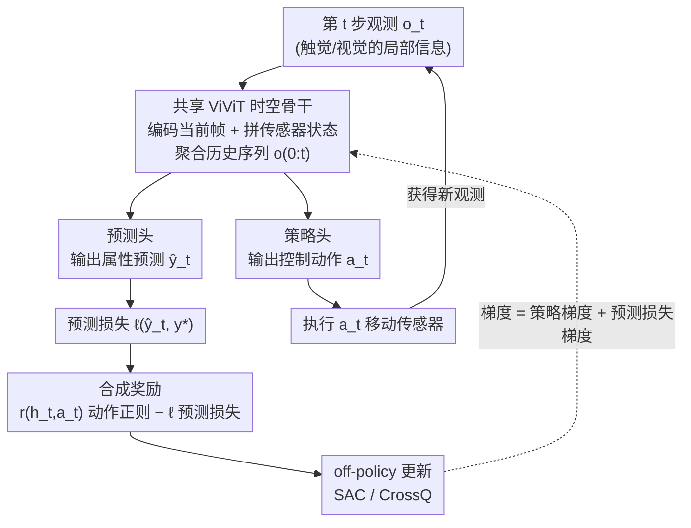

# APPLE: Toward General Active Perception via Reinforcement Learning

**会议**: ICLR 2026  
**arXiv**: [2505.06182](https://arxiv.org/abs/2505.06182)  
**领域**: 主动感知 / 强化学习  
**关键词**: active perception, reinforcement-learning, POMDP, supervised learning, off-policy, ViViT, CrossQ

## 一句话总结

提出APPLE——一种结合强化学习与监督学习的通用主动感知框架，将主动感知建模为POMDP，奖励函数设计为RL奖励减去预测损失，梯度自然分解为策略梯度和预测损失梯度两部分，基于off-policy算法（SAC/CrossQ）和共享ViViT骨干网络，在5个不同任务基准上验证通用性，其中CrossQ变体无需逐任务调参且训练效率提高53%。

## 研究背景与动机

**主动感知的核心挑战**：主动感知要求智能体通过主动控制传感器（如移动相机视角、执行触觉探索）来获取信息，同时完成感知预测任务，需要同时优化"如何感知"和"如何预测"。

**现有方法的碎片化**：当前主动感知方法通常针对特定任务和传感模态设计（如主动物体识别、主动触觉感知），缺乏统一的框架适用于多种任务。

**RL与预测任务的耦合难题**：纯RL方法需要设计奖励函数来间接评估感知质量，难以直接优化预测性能；纯监督学习方法无法学习感知策略。

**On-policy方法的失败**：实验发现REINFORCE和PPO等on-policy方法在主动感知任务上完全失败，因为探索效率过低且奖励信号稀疏。

**超参数敏感性**：现有方法往往需要针对每个任务精心调整超参数，限制了实际应用的通用性。

**计算效率需求**：实际部署场景要求高效的训练和推理，需要在不牺牲性能的前提下减少计算开销。

## 方法详解

### 整体框架

APPLE把主动感知统一建模成"嵌在监督学习里的POMDP"：智能体想学习环境的某个属性（物体类别、位姿、体积…），但这个真值 $y^*$ 藏在隐藏状态里、看不到，只能通过主动控制传感器一步步逼近它。于是每一步智能体的动作被拆成两部分——既输出一个控制动作 $a_t$（移动视角、触觉探索）去改变下一帧能看到什么，又输出一个对属性的当前预测 $y_t$。新观测 $o_t$ 进来后，先经一个ViViT编码当前帧、拼上传感器状态，再交给一个共享的Transformer时空骨干把历史序列 $o_{0:t}$ 聚合起来；骨干分出两个头，预测头给出 $\hat{y}_t$、策略头给出 $a_t$。整套系统的奖励被定义成"动作正则项减预测损失"，求梯度时天然劈成策略梯度和预测损失梯度两支，用off-policy算法（SAC/CrossQ）来优化。

### 关键设计

**1. 奖励即"动作正则减预测损失"：用一个标量把感知和预测缝在一起**

主动感知最别扭的地方是两个目标互相纠缠：纯RL框架得手工设计代理奖励去间接评估"看得好不好"，调起来很玄；纯监督学习又压根学不出该往哪看的感知策略。APPLE绕开了"设计代理奖励"这件事——它把每步奖励写成 $\tilde{r}(h_t, y^*_t, a_t, y_t) = r(h_t, a_t) - \ell(y^*_t, y_t)$，其中 $\ell$ 是可微的预测损失（分类用交叉熵、位姿估计用欧氏距离），而 $r(h_t,a_t)$ 这个"RL奖励"在本文里并不承载任务目标、只用来正则化动作（如约束运动幅度），甚至可以不可微、对智能体未知。真正驱动学习的是那个预测损失项。由于预测 $y_t$ 不影响未来状态，最大化期望折扣回报 $J(\pi_\theta)$ 的梯度可以干净地分解成两项：

$$\frac{\partial}{\partial\theta}J(\pi_\theta)=\underbrace{\mathbb{E}\Big[\tfrac{\partial}{\partial\theta}\ln\pi_\theta(\mathbf{a}\mid\mathbf{o})\textstyle\sum_t\gamma^t\tilde{r}\Big]}_{\text{策略梯度}}-\underbrace{\mathbb{E}\Big[\textstyle\sum_t\gamma^t\tfrac{\partial}{\partial\theta}\ell_{\pi_\theta}(y^*_t,o_{0:t})\Big]}_{\text{预测损失梯度}}$$

注意两项都是对**同一套共享参数 $\theta$** 求导（不是分给两组网络）：策略梯度教骨干"怎么动才看得更准"，监督损失梯度直接教骨干"基于已有观测怎么预测"。这样既省去硬编代理奖励，又让预测模型仍享受监督信号的直接梯度。

**2. 用off-policy（SAC/CrossQ）替代on-policy：先让探索能跑起来**

作者实测发现REINFORCE、PPO这类on-policy方法在主动感知任务上样本效率极低、难以规模化——攒不出足够有用的轨迹去学探索策略。于是APPLE把策略梯度那一项交给off-policy的actor-critic来估计，靠经验回放反复利用历史样本，给出APPLE-SAC和APPLE-CrossQ两个变体。把SAC/CrossQ搬进主动感知要改三处：状态换成历史观测序列 $o_{0:t}$（因为是部分可观测）；critic的Bellman残差里因为含预测损失项，每次从回放池采样时都要**动态重算**总奖励 $r_t-\ell_{\pi_\theta}(y^*_t,o_{0:t})$；策略更新时再把预测损失梯度叠加上去。其中CrossQ用BatchRenorm替掉了SAC的target network，把"target网络更新频率"这个最折磨人的超参直接消掉，因此更鲁棒、也更省事——这正是它能不逐任务调参就跨任务通用的来源。

**3. 共享ViViT骨干：把逐步积累的观测当成一段序列来读**

主动感知天然是观测一帧帧攒起来的过程，单帧（尤其触觉）信息又稀疏、局部。APPLE索性把历史观测序列当作"视频"，先用Video Vision Transformer（ViViT）编码每一帧、拼上传感器状态，再用Transformer沿时间维聚合整段 $o_{0:t}$。关键是这个骨干被策略头和预测头**共享**：一方面省参数，另一方面序列化的时空建模恰好契合"观测随交互逐步丰富"的结构，让"该往哪看"和"现在猜什么"都建立在同一套不断更新的时空表征上，也让APPLE对不同传感模态（视觉/触觉）几乎不用改结构就能套用。

## 实验关键数据

### 主实验

| 任务 | APPLE-SAC | APPLE-CrossQ | 最优基线 | 基线方法 |
|------|-----------|-------------|---------|---------|
| MHSB (分类) | 94.2% | **95.1%** | 89.7% | InfoGain |
| CircleSquare (检测) | 0.82 IoU | **0.84 IoU** | 0.76 IoU | Random |
| TactileMNIST (识别) | 92.8% | **93.5%** | 88.3% | Coverage |
| Volume (估计) | 0.031 MSE | **0.028 MSE** | 0.045 MSE | Heuristic |
| Toolbox (6DoF) | 78.5% | **80.2%** | 71.4% | AcTPa |

### 消融实验

| 方法/变体 | 平均排名 | 训练时间 (相对) | 超参调整需求 |
|-----------|---------|----------------|-------------|
| APPLE-CrossQ | **1.2** | **1.0x** | 低 |
| APPLE-SAC | 1.8 | 1.53x | 中 |
| REINFORCE | 4.5 | 0.8x | 高（效果差） |
| PPO | 4.8 | 1.1x | 高（效果差） |
| 纯监督 (无RL) | 3.2 | 0.6x | 低 |

### 关键发现

1. **On-policy方法完全失败**：REINFORCE和PPO在所有5个基准上均无法学到有效策略，验证了off-policy方法对主动感知的必要性。
2. **CrossQ全面优于SAC**：跨任务平均排名更高，训练速度快53%，且无需调整target network超参。
3. **通用性验证**：同一框架和超参设定在5个差异巨大的任务上均取得SOTA或接近SOTA。
4. **RL+监督优于纯监督**：去掉RL部分后性能显著下降，说明学习感知策略的重要性。

## 亮点与洞察

1. **统一框架**：首次提出适用于多种传感模态和任务类型的通用主动感知框架。
2. **优雅的梯度分解**：奖励-损失设计使策略梯度和预测梯度自然分离，理论清晰。
3. **重要的负面结果**：on-policy方法完全失败的发现对主动感知社区有重要参考价值。
4. **实用性突出**：CrossQ变体几乎不需要调参，显著降低了实际应用门槛。

## 局限与展望

1. **离散动作空间**：当前实验均为离散动作，连续动作空间（如连续视角控制）的效果未验证。
2. **模拟环境为主**：5个基准均为模拟环境，真实物理场景的泛化性有待验证。
3. **计算资源需求**：ViViT骨干的计算开销在资源受限的嵌入式平台上可能成为瓶颈。
4. **长时间序列**：当前实验的感知步数较短（5-20步），更长序列的性能趋势未探索。

## 相关工作与启发

- **主动感知**：Bajcsy et al. (2018) 的主动感知综述；AcTPa (Liang et al., 2025) 的触觉主动感知
- **Off-policy RL**：SAC (Haarnoja et al., 2018), CrossQ (Bhatt et al., 2024) 的高效off-policy方法
- **视觉Transformer**：ViViT (Arnab et al., 2021) 的视频理解架构
- **POMDP求解**：Kaelbling et al. (1998) 的POMDP理论框架

## 评分

- 新颖性: ⭐⭐⭐⭐ 统一框架和梯度分解设计新颖
- 实验充分度: ⭐⭐⭐⭐ 5个基准覆盖多种模态和任务类型
- 写作质量: ⭐⭐⭐⭐ 框架清晰，实验详实
- 价值: ⭐⭐⭐⭐ 通用主动感知框架的实际应用潜力大

<!-- RELATED:START -->

## 相关论文

- [\[ICLR 2026\] AnyTouch 2: General Optical Tactile Representation Learning For Dynamic Tactile Perception](anytouch_2_general_optical_tactile_representation_learning_for_dynamic_tactile_p.md)
- [\[NeurIPS 2025\] Real-World Reinforcement Learning of Active Perception Behaviors](../../NeurIPS2025/robotics/real-world_reinforcement_learning_of_active_perception_behaviors.md)
- [\[CVPR 2026\] General Process Reward Modeling for Robotic Reinforcement Learning](../../CVPR2026/robotics/general_process_reward_modeling_for_robotic_reinforcement_learning.md)
- [\[ICLR 2026\] Partially Equivariant Reinforcement Learning in Symmetry-Breaking Environments](partially_equivariant_reinforcement_learning_in_symmetry-breaking_environments.md)
- [\[ICLR 2026\] MVR: Multi-view Video Reward Shaping for Reinforcement Learning](mvr_multi-view_video_reward_shaping_for_reinforcement_learning.md)

<!-- RELATED:END -->
