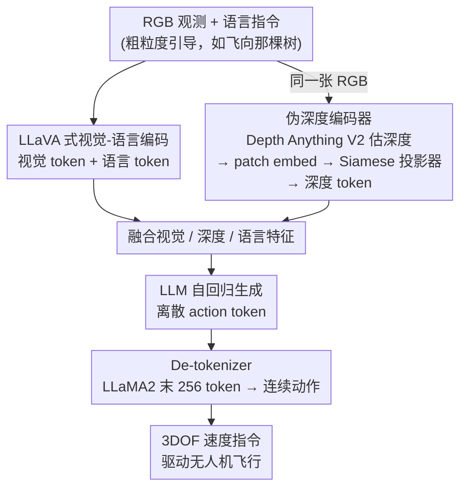

# AutoFly: Vision-Language-Action Model for UAV Autonomous Navigation in the Wild

**会议**: ICLR 2026  
**arXiv**: [2602.09657](https://arxiv.org/abs/2602.09657)  
**代码**: [https://xiaolousun.github.io/AutoFly](https://xiaolousun.github.io/AutoFly)  
**领域**: 遥感  
**关键词**: VLA, UAV navigation, pseudo-depth, autonomous navigation, sim-to-real

## 一句话总结
提出 AutoFly，一个面向无人机野外自主导航的端到端 VLA 模型，通过伪深度编码器从 RGB 输入推断空间信息，配合新构建的自主导航数据集（13K+ 轨迹含 1K 真实飞行），在模拟和真实环境中比 OpenVLA 成功率高 3.9%，碰撞率低 2.6%。

## 研究背景与动机
**领域现状**：无人机 VLN（Vision-Language Navigation）主要依赖详细的逐步指令沿预定路线飞行，在受控环境中表现良好。

**现有痛点**：真实户外探索发生在未知环境中，无法提供详细导航指令，只能给出粗粒度的方向或位置指引。现有方法假设了完整的环境知识和详尽指令，这在实际中不成立。同时，现有数据集过度依赖指令跟随而非自主决策，且缺乏真实世界数据。

**核心矛盾**：2D 地面机器人的 VLA 方法不适用于 3D 空间的无人机导航——无人机需要精确的深度估计、全方向避障和海拔控制，仅靠 RGB 输入的空间推理能力不足。

**本文目标** 让无人机在只有粗粒度引导（"飞向那棵树"）的情况下完成自主导航、避障和目标识别。

**切入角度**：引入伪深度编码器增强空间理解（无需额外深度传感器），构建强调自主行为建模的导航数据集。

**核心 idea**：用伪深度增强的 VLA 模型 + 自主导航数据集，让无人机从指令跟随升级到自主导航。

## 方法详解

### 整体框架
AutoFly 想让无人机只凭一句粗粒度引导（"飞向那棵树"）就在未知野外完成避障、寻找目标和海拔控制，而不再依赖逐步指令。整条链路是：RGB 观测和自然语言指令进入一个 LLaVA 式视觉-语言模型，同时由伪深度编码器（pseudo-depth encoder）从同一张 RGB 推断出深度并编码成空间特征；视觉特征、深度特征和语言一起融合后送进 LLM，LLM 自回归地吐出离散的 action token，最后经 de-tokenizer 还原成连续的速度指令驱动飞机。整套模型的差异点不在主干（沿用 OpenVLA 那一类 VLA），而在补进来的深度通道；而要让模型学会"自主决策"，还需要专门构建的导航数据集和两阶段训练这两条训练侧支撑。

> 上图是推理时的前向架构，其中"伪深度编码器"是核心创新（设计 1）；另外两个设计——自主导航数据集（设计 2）与两阶段训练（设计 3）作用在训练侧，决定这套架构学到的是"自主决策"还是"照指令复述"。

### 关键设计

**1. 伪深度编码器：不装深度相机也能让 RGB 模型"看出"远近**

无人机在 3D 空间里飞，避障和海拔控制都强依赖深度，而纯 RGB 的 VLA 空间推理能力不足；但直接用深度相机又有两个坑——AirSim 里的仿真深度过于理想化，真机上拿不到这么干净的深度，会放大 sim-to-real gap，同时机载深度传感器还要增加载荷和成本。AutoFly 的做法是用 Depth Anything V2 从单目 RGB 直接估出深度图，再经 patch embedding 切块、由一个深度投影器把深度 token 投到与视觉 token 对齐的特征空间，让 LLM 像读视觉 token 一样读空间信息。关键细节是这个投影器采用 Siamese MLP，与视觉编码器共享参数：参数共享相当于一种隐式正则化，强制深度和视觉两路学到一致的映射，防止两个模态的表示各跑各的、发散开来。

**2. 自主导航数据集：把训练目标从"跟着指令走"换成"自己做决策"**

现有无人机导航数据集有两个硬伤——过度偏向指令跟随、且几乎没有真实世界数据，模型学到的是照指令复述而非自主判断。AutoFly 重新构建了一个 13K+ 轨迹的数据集来对症下药。地面真值轨迹由一个用 SAC 强化学习训练出的采集 agent 生成（成功率 95%），再配合专家示范，保证轨迹质量；覆盖 12 个 AirSim 仿真环境外加 1K 条真实飞行数据，补上真实分布。更关键的是轨迹再平衡：长时导航里避障动作天然占绝大多数，直接训练会让模型偏向"一味躲"，所以用一个分割函数把每条轨迹切成避障阶段和目标寻找阶段，再平衡两类的训练比例，纠正这种类别不平衡。

**3. 两阶段训练：先对齐视觉语言，再带着深度学动作**

模型分两步训练。Stage 1 做视觉-语言对齐，用 Prismatic-VLMs 初始化，先让模型把图像和语言对上。Stage 2 才接入深度信息做 action fine-tuning，此时 LLM backbone 用较小的学习率 2e-5 微调、新加的 depth projector 用更大的 1e-4 快速学习，整体训练 80K steps。先对齐再微调，避免一上来就让随机初始化的深度通道干扰已经稳定的视觉-语言表示。

### 损失函数 / 训练策略
训练目标就是基础 LLM 的交叉熵损失，按自回归方式预测 action token。具体把 LLaMA2 词表里最后 256 个 token 挪用作 action token 的映射空间，于是连续速度指令被离散化成这 256 个槽位，整个动作预测复用语言模型的下一个 token 预测机制。

## 实验关键数据

### 主实验

| 方法 | Overall SR↑ | CR↓ | PER↑ |
|------|------------|-----|------|
| RT-1 | 24.3 | 65.1 | 61.1 |
| RT-2 | 41.9 | 26.0 | 73.7 |
| OpenVLA | 44.0 | 24.5 | 75.1 |
| **AutoFly** | **47.9** | **21.9** | **77.3** |

### 真实环境 Sim-to-Real

| 场景 | Sim:Real 比例 | SR | CR | PER |
|------|-------------|-----|-----|-----|
| 室内 | 0K:1K | 10 | 40 | 61.1 |
| 室内 | 10K:1K | **60** | 30 | 76.5 |
| 室外 | 10K:1K | **55** | 35 | 75.1 |

### 关键发现
- 伪深度编码器贡献 3.9% SR 提升和 2.6% CR 降低（对比无深度的 OpenVLA），在密集障碍物环境中优势明显
- Siamese 投影器优于 Non-Siamese 和直接深度融合——参数共享强制一致的特征映射
- 真实环境中室内 60% 和室外 55% 的成功率差距仅 5%，说明环境适应性较好
- 模拟数据量增加持续改善真实世界表现（10→25→60% SR），证实大规模模拟+少量真实数据的策略有效
- 数据再平衡对训练至关重要——避障行为的 KL 散度约 0.36，不平衡会导致学习偏差

## 亮点与洞察
- **从指令跟随到自主导航的范式转变**：现有无人机 VLN 研究都在做"按步骤飞"，本文首次系统地做"给个大方向自己飞"，更接近真实需求
- **伪深度是聪明的工程选择**：用 Depth Anything V2 替代深度相机，既避免了 sim-to-real gap 又减少硬件依赖
- **数据再平衡策略通用性强**：长时序控制任务中行为分布不均衡是普遍问题，分阶段再平衡的方法可以迁移

## 局限与展望
- 成功率绝对值仍不高（模拟 47.9%，真实 55-60%），离实用还有距离
- 仅 3DOF 动作空间（线速度），未处理姿态角控制
- 数据集规模相对小（13K 轨迹 vs OpenFly 100K），语言指令也很简短（avg 12 words）
- 深度编码器依赖 Depth Anything V2 的质量，在极端环境下深度估计可能失效

## 相关工作与启发
- **vs OpenVLA**: AutoFly 在 OpenVLA 基础上增加伪深度编码器和导航专用数据集，在所有指标上稳定提升
- **vs AerialVLN/OpenUAV**: 这些数据集侧重指令跟随，平均指令 83-104 words；AutoFly 数据集仅 12 words，更贴合粗粒度引导的真实场景
- **vs training-free 方法（VLM zero-shot）**: 不需要微调但在密集障碍物环境中缺乏高频反应控制能力

## 评分
- 新颖性: ⭐⭐⭐⭐ 自主导航范式和伪深度设计有新意
- 实验充分度: ⭐⭐⭐⭐ 模拟+真实环境、多消融，但绝对性能偏低
- 写作质量: ⭐⭐⭐⭐ 结构清晰，数据集描述详细
- 价值: ⭐⭐⭐⭐ 无人机自主导航方向的重要探索

<!-- RELATED:START -->

## 相关论文

- [\[ICML 2026\] From Abstraction to Instantiation: Learning Behavioral Representation for Vision-Language-Action Model](../../ICML2026/robotics/from_abstraction_to_instantiation_learning_behavioral_representation_for_vision-.md)
- [\[ICLR 2026\] From Spatial to Actions: Grounding Vision-Language-Action Model in Spatial Foundation Priors](from_spatial_to_actions_grounding_vision-language-action_model_in_spatial_founda.md)
- [\[ICML 2026\] Dual-Stream Diffusion for World-Model Augmented Vision-Language-Action Model](../../ICML2026/robotics/dual-stream_diffusion_for_world-model_augmented_vision-language-action_model.md)
- [\[ICLR 2026\] MemoryVLA: Perceptual-Cognitive Memory in Vision-Language-Action Models for Robotic Manipulation](memoryvla_perceptual-cognitive_memory_in_vision-language-action_models_for_robot.md)
- [\[CVPR 2026\] Counterfactual VLA: Self-Reflective Vision-Language-Action Model with Adaptive Reasoning](../../CVPR2026/robotics/counterfactual_vla_self-reflective_vision-language-action_model_with_adaptive_re.md)

<!-- RELATED:END -->
