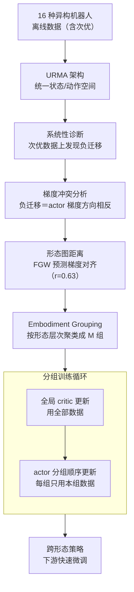

# Cross-Embodiment Offline Reinforcement Learning for Heterogeneous Robot Datasets

**会议**: ICLR 2026  
**arXiv**: [2602.18025](https://arxiv.org/abs/2602.18025)  
**代码**: 待确认  
**领域**: 强化学习 / 机器人  
**关键词**: cross-embodiment learning, offline RL, gradient conflict, robot foundation model, morphology grouping

## 一句话总结
系统研究跨形态离线 RL 预训练范式，发现次优数据比例和机器人多样性增加时梯度冲突导致负迁移，提出基于形态图距离的 Embodiment Grouping（EG）策略将机器人按形态聚类后分组更新 actor，在 16 种机器人平台的 locomotion benchmark 上显著缓解负迁移（70% 次优数据集上 IQL+EG 比 IQL 提升 34%）。

## 研究背景与动机

**领域现状**：机器人基础模型（如 RT-2, Octo, π0）通过跨形态学习从多种机器人的数据中学习通用控制先验。但这些模型几乎完全基于模仿学习，需要高质量专家演示——采集成本高。

**现有痛点**：(a) 模仿学习只能复制数据集中的行为，无法超越数据质量上限；(b) 离线 RL 可以利用次优数据通过 trajectory stitching 学到更好的策略，但尚未与跨形态学习系统性结合；(c) 天真地在异构机器人数据上做联合训练，不同形态的梯度可能相互冲突，导致某些机器人性能退化。

**核心矛盾**：跨形态学习可以增加数据规模→有利。但形态差异大的机器人的策略梯度可能冲突→有害。当数据中次优轨迹比例高时，冲突加剧。

**本文目标**：系统分析跨形态离线 RL 的优势与问题，设计方法缓解异构形态间的梯度冲突。

**切入角度**：将每个机器人表示为形态图（关节/末端为节点），用 Fused Gromov-Wasserstein 距离计算机器人间的相似度。发现形态相似度与梯度余弦相似度高度相关（Pearson r=0.63），因此按形态距离聚类后分组更新 actor。

**核心 idea**：形态相似的机器人有相似的策略梯度方向，按形态聚类后分组更新 actor 可以有效缓解跨形态离线 RL 中的梯度冲突。

## 方法详解

### 整体框架
本文要回答一个问题：能不能把"跨形态学习"和"离线 RL"拼起来，让机器人基础模型不再依赖昂贵的专家演示，而是直接吃多种机器人的混合（含大量次优）数据。整条工作是一条环环相扣的逻辑链：先把 16 种机器人的离线数据喂进 URMA 架构，由它把维度各异的状态/动作空间统一成同一套表示；在这个统一表示上，作者先**诊断**出跨形态联合训练在次优数据下会发生负迁移，再把负迁移**归因**到不同形态机器人的 actor 梯度方向相互冲突，进而找到一个训练前就能算的代理——**形态图距离**能预测梯度是否对齐，最后据此设计 **Embodiment Grouping（EG）**：按形态把机器人聚成若干组，训练时 critic 用全部数据做全局更新、actor 改成按组顺序更新。这样学到的跨形态策略在下游可以快速微调到新机器人。下面四个设计点正是这条"发现负迁移 → 归因梯度冲突 → 形态距离预测 → 分组缓解"链条的四环。

### 关键设计

**1. 跨形态离线 RL 的系统性诊断：先确认这条路有没有坑**

在动手设计方法前，作者先把 BC 和 IQL 在不同数据质量下的表现摆出来对比，判断跨形态联合训练到底是正迁移还是负迁移。结论分三层：专家数据上 BC ≈ IQL，两者差不多；一旦换成次优数据，IQL 就明显甩开 BC，这正是离线 RL 靠 trajectory stitching 把碎片轨迹拼出更优策略的优势所在；而且跨形态预训练确实能加速下游微调收敛。但坑也在这里暴露——在 70% 次优数据的设置下，双足机器人出现了灾难性负迁移，Unitree H1 从 54.47 掉到 6.00、G1 从 78.93 掉到 0.86。这说明跨形态离线 RL 不是无条件有效的，必须先搞清负迁移从哪来。

**2. 梯度冲突分析：把负迁移归因到 actor 梯度打架**

负迁移的嫌疑落在不同形态机器人的策略梯度方向上——如果它们指向相反方向，联合更新就会相互抵消，甚至破坏本来有用的更新。作者用梯度余弦相似度来量化这种冲突：对每一对机器人 $\tau_i, \tau_j$，计算它们 actor 梯度的余弦

$$C[\tau_i, \tau_j] = \frac{\langle g_{\tau_i}, g_{\tau_j} \rangle}{\|g_{\tau_i}\| \|g_{\tau_j}\|}$$

再统计 $C<0$（方向相反）的比例。三个观察坐实了猜测：次优数据比例越高，负余弦比例越大；参与的机器人种类越多，负余弦比例也越大；最关键的是，迁移增益和平均梯度余弦高度相关（$r=0.815$）——梯度越对齐，跨形态训练越赚，反之就亏。

**3. 形态图距离与梯度对齐的关联：找一个训练前就能算的代理量**

知道梯度冲突是元凶还不够，因为梯度要训练起来才看得到，没法事先用来决定怎么分组。作者的突破口是：能不能用机器人的**物理结构**来预测梯度方向？于是把每个机器人表示成一张形态图——节点是躯干/关节/足部，边是机械连接，节点特征则是相对位置加控制参数——再用 Fused Gromov-Wasserstein（FGW）距离衡量两个机器人的相似度，FGW 的好处是同时吃图结构和节点特征。验证下来，形态相似度和梯度余弦相似度的 Pearson 相关达到 $r=0.63$（$p = 1.26 \times 10^{-14}$）：形态像的机器人，梯度方向也像。这就给了一个训练前可计算的代理，能在没跑过任何梯度的情况下预判哪些机器人能安全地放一起训。

**4. Embodiment Grouping（EG）：按形态分组，让组内梯度天然不打架**

有了形态距离这把尺子，方法本身就很直接：对 FGW 距离做层次聚类，把 16 种机器人切成 $M$ 组，使同组内形态相近、梯度方向一致。训练时（Algorithm 1）每步先采一个全局 mini-batch，用全部数据做一次全局 critic / value 更新；然后随机排列各组的顺序，依次对每组 $\mathcal{G}_m$ 取出属于该组的样本 $\mathcal{B}_m$、计算 actor loss 并更新 $\theta_\pi$。这么做的道理是：组内机器人梯度方向一致，更新不会内耗；组间改成顺序更新而非同时累加，避免了相反梯度直接抵消。和动态解冲突的 PCGrad 相比，PCGrad 要在运行时把冲突梯度互相投影、开销大且效果有限，EG 则把先验知识（形态结构）一次性编码进静态分组，简单又高效。

### 损失函数 / 训练策略
方法建立在 IQL 框架上，EG 只改 actor 的更新方式、不动损失本身。critic 用 expectile regression 拟合状态价值 $V_\psi(s)$，再做 TD 更新 $Q_\theta(s,a)$；actor 用 advantage-weighted regression

$$\mathcal{L}_\tau^\pi(\theta) = -\mathbb{E}_{(s,a) \sim \mathcal{D}_\tau}\big[w(s,a) \log \pi_\theta(a|s)\big]$$

其中权重 $w(s,a) = \exp\big(\beta(Q(s,a) - V(s))\big)$ 给优势更大的动作更高的模仿权重。EG 接入的位置只在 actor：把这条 loss 从"全数据一把更新"换成"按形态分组、逐组更新"，损失函数的形式保持不变。

## 实验关键数据

### 主实验

| 方法 | Expert Forward | 70% Suboptimal Forward | 70% Suboptimal Backward | 均值 |
|------|---------------|-------|-------|------|
| BC | 63.31 | 30.52 | 41.42 | 49.17 |
| IQL | 63.39 | 36.62 | 38.69 | 52.05 |
| IQL+PCGrad | 63.37 | 39.63 | 41.04 | 53.48 |
| IQL+SEL | 63.37 | 44.59 | 44.45 | 55.07 |
| **IQL+EG** | **63.52** | **51.19** | **49.60** | **57.29** |

在次优数据占比 70% 的设置下，IQL+EG 比 IQL 提升 34%，比 PCGrad 提升 16%，比 SEL 提升 16%。

### 消融实验

| 分组策略 | 70% Suboptimal Forward | 相对 IQL 提升 |
|---------|----------------------|-------------|
| IQL (baseline) | 37.57 | 0% |
| Random grouping | 38.73 | +3.08% |
| Heuristic (bipeds/quads) | 34.45 | -8.31% |
| **EG (ours)** | **51.98** | **+38.34%** |

### 关键发现
- **EG 的优势不仅来自更多 actor 更新步数**：计算归一化实验中（匹配优化器步数和数据量），EG 仍比 IQL 高 7.78 分
- **直觉分组不工作**：按腿数（biped/quadruped/hexapod）的启发式分组反而降低性能——粗糙的形态分类无法捕获影响梯度方向的因素（执行器位置、连杆长度、质量分布等）
- **随机分组几乎无效**（+3.08%），说明合理的分组策略是关键
- **M=2~4 组就足够**：更多组数性能略微提升但训练时间显著增加
- 跨算法通用：EG 在 BC、TD3+BC、IQL 上都有效

## 亮点与洞察
- **形态距离预测梯度冲突**：这是一个深刻的发现——机器人的物理结构相似度直接关联到策略学习中的梯度方向对齐程度。这意味着可以在训练前就预测哪些机器人数据可以安全地联合训练
- **简单分组优于复杂冲突解决方法**：静态的形态聚类分组（EG）比 PCGrad 的动态梯度投影和 SEL 的动态任务分组效果更好——预先利用领域知识（形态结构）比运行时推断任务关系更可靠
- **跨形态离线 RL 互补性强**：跨形态提供数据多样性 + 离线 RL 利用次优数据——两者结合使得机器人基础模型不再需要大量高质量专家演示

## 局限与展望
- 仅在 MuJoCo 仿真的 locomotion 任务上验证，未扩展到真实机器人或 manipulation 任务
- FGW 图距离的计算需要预先定义机器人图结构，对于未知形态的新机器人可能需要手动建模
- 分组是静态的，训练过程中梯度冲突模式可能动态变化——自适应分组策略可能更好
- 数据集规模相对小（每个机器人 1M 步），未验证在更大规模下的扩展性
- Critic 仍然全局更新——如果 critic 也存在形态间冲突，分组更新 critic 也可能进一步提升

## 相关工作与启发
- **vs Open X-Embodiment**: OXE 使用跨形态模仿学习，本文是首个系统研究跨形态离线 RL 的工作
- **vs Q-Transformer**: Q-Transformer 在大规模机器人数据上做离线 RL 但只用单一平台，本文扩展到 16 种形态
- **vs PCGrad**: PCGrad 通过梯度投影解决多任务冲突，但在跨形态设置下效果有限；EG 用静态形态聚类更有效
- **vs SEL**: SEL 根据动态任务亲和度分组，但需要额外计算且不如基于形态先验的分组稳定

## 评分
- 新颖性: ⭐⭐⭐⭐ 首个系统性研究跨形态离线 RL 的工作，形态距离与梯度冲突的关联是新发现
- 实验充分度: ⭐⭐⭐⭐⭐ 16 种机器人、6 种数据集、8 种方法对比、全面消融
- 写作质量: ⭐⭐⭐⭐⭐ 从发现问题→分析原因→验证假设→设计方案的逻辑链清晰完整
- 价值: ⭐⭐⭐⭐ 为机器人基础模型的数据扩展提供了新方向，EG 策略简单实用

<!-- RELATED:START -->

## 相关论文

- [\[CVPR 2026\] GraspGen-X: Cross-Embodiment 6-DOF Diffusion-based Grasping](../../CVPR2026/robotics/graspgen-x_cross-embodiment_6-dof_diffusion-based_grasping.md)
- [\[NeurIPS 2025\] Sample-Efficient Tabular Self-Play for Offline Robust Reinforcement Learning](../../NeurIPS2025/robotics/sample-efficient_tabular_self-play_for_offline_robust_reinforcement_learning.md)
- [\[ICLR 2026\] Statistical Guarantees for Offline Domain Randomization](statistical_guarantees_for_offline_domain_randomization.md)
- [\[CVPR 2026\] TraceGen: World Modeling in 3D Trace Space Enables Learning from Cross-Embodiment Videos](../../CVPR2026/robotics/tracegen_world_modeling_in_3d_trace_space_enables_learning_from_cross-embodiment.md)
- [\[CVPR 2026\] RoboWheel: A Data Engine from Real-World Human Demonstrations for Cross-Embodiment Robotic Learning](../../CVPR2026/robotics/robowheel_a_data_engine_from_real-world_human_demonstrations_for_cross-embodimen.md)

<!-- RELATED:END -->
