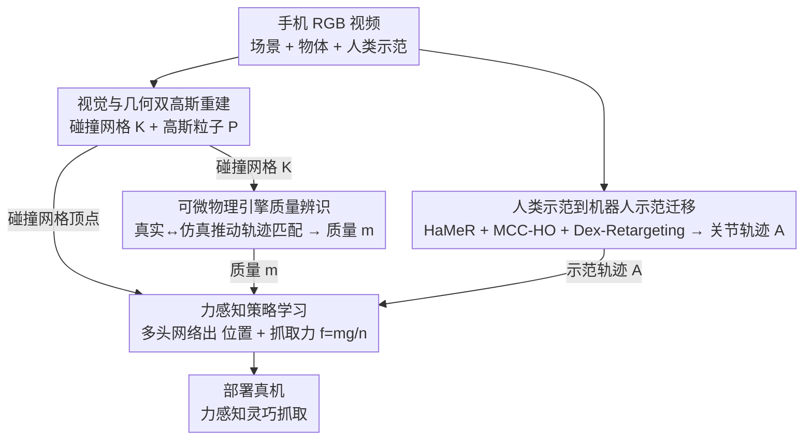

# D-REX: Differentiable Real-to-Sim-to-Real Engine for Learning Dexterous Grasping

**会议**: ICLR 2026  
**arXiv**: [2603.01151](https://arxiv.org/abs/2603.01151)  
**代码**: [drex.github.io](https://drex.github.io)  
**领域**: 3D视觉 / 机器人操纵  
**关键词**: real-to-sim-to-real, 可微物理仿真, 质量辨识, 灵巧抓取, 高斯表示

## 一句话总结
提出D-REX，一个基于高斯表示的可微real-to-sim-to-real引擎，通过视觉观测和机器人控制信号进行端到端物体质量辨识，并利用辨识的质量进行力感知的灵巧抓取策略学习，有效缩小了sim-to-real差距。

## 研究背景与动机

**领域现状**：仿真是机器人策略学习的核心平台，但sim-to-real gap仍是根本挑战。现有方法包括域随机化、系统辨识、域适应和数字孪生构建，各有局限。

**现有痛点**：
   - 构建精确的数字孪生需要集成几何重建和参数辨识等多个流程，复杂度高
   - 从视觉观测估计物体的物理属性（如质量）极其困难，SAM2/VLM初始估计通常与真实值偏差大
   - 现有抓取策略只做位置控制，忽略力控制——同一个抓取姿势对不同质量物体效果截然不同
   - 非可微仿真器限制了反向传播进行参数优化

**核心矛盾**：高保真物理仿真需要准确的物理参数，但这些参数从视觉观测难以获得；抓取策略需要力控制，但力大小取决于未知的物体质量

**本文目标**：(1) 从robot-object交互视频中辨识物体质量；(2) 用辨识的质量做力感知的灵巧抓取策略学习

**切入角度**：利用可微物理引擎对仿真轨迹进行反向传播，优化质量参数使仿真轨迹匹配真实轨迹

**核心 idea**：用可微仿真+高斯表示构建数字孪生，通过轨迹匹配辨识质量，再基于质量做力-位混合抓取策略学习

## 方法详解

### 整体框架
D-REX 要解决的是同一个抓取姿势对不同质量物体效果截然不同、而质量又无法从视觉直接读出来的矛盾。它把一段手机拍的 RGB 视频走通了一条 real→sim→real 的闭环，分四步走：先把视频重建成可碰撞、可渲染的数字孪生（视觉与几何双高斯重建），再让机器人在真实和仿真里做同一个推动动作、用可微物理引擎把仿真轨迹拟合到真实轨迹上反解出质量（质量辨识），然后把人类示范视频转译成机器人可执行的关节轨迹（示范迁移），最后训练一个既出关节位置、又按辨识质量出抓取力的力感知策略（策略学习）部署回真机。

### 关键设计

**1. 视觉与几何双高斯重建：碰撞要准、渲染要真，需求不同就分开建模**

碰撞检测需要的是干净精确的几何，而视觉监督需要的是写实的渲染，两者对表示的要求并不一致，硬塞进一套高斯里会互相拖累。D-REX 因此对手机采集的视频训练两组高斯原语：一组 2D 高斯带法线估计、用来抽出精确的碰撞网格 $\mathcal{K}$，另一组 3D 高斯负责高保真渲染、输出高斯粒子 $\mathcal{P}$。前者喂给物理引擎做接触，后者提供后续轨迹匹配所需的视觉监督，各司其职。

**2. 可微物理引擎 + 轨迹匹配辨识质量：让仿真轨迹去对齐真实轨迹，梯度直接落到质量上**

质量是抓取力大小的依据，但 SAM2/VLM 给的初始估计往往离谱（如把 125g 的物体猜成 500g）。D-REX 的思路是不去"看"质量，而是"推一下试出来"：真实世界和仿真里执行同一个推动动作，分别收集物体轨迹 $\{\mathbf{s}_t^{real}\}$ 和参数化于质量的仿真轨迹 $\{\mathbf{s}_t^{sim}(m)\}$，真实物体 6-DoF pose 由 FoundationPose 提供，然后最小化两条轨迹的逐帧 MSE：

$$\min_{m>0}\ \mathcal{L}_{traj}(m) = \sum_{t=1}^T \|\mathbf{s}_t^{sim}(m) - \mathbf{s}_t^{real}\|_2^2$$

仿真内部用半隐式 Euler 积分做状态更新 $G([\mathbf{s}_t, \mathbf{u}_t], m, \theta)$、接触用 compliant penalty-based 模型，使得整张计算图端到端可微，梯度可以经自动微分一路反传到质量参数：

$$\frac{\partial \mathcal{L}}{\partial m} = \sum_t \frac{\partial \mathcal{L}}{\partial \mathbf{s}_t^{sim}} \cdot \frac{\partial \mathbf{s}_t^{sim}}{\partial \mathbf{M}_t} \cdot \frac{\partial \mathbf{M}_t}{\partial m}$$

和 GradSim 这类需要手动指定外力的可微辨识不同，D-REX 直接复用一致的机器人控制信号来建模外力，等于把"外力是多少"这个本来要人猜的量交给了已知的控制输入，因而能从交互数据里干净地优化质量。

**3. 人类示范到机器人示范的迁移：把手部视频翻译成机器手可执行的关节轨迹**

策略学习需要示范，但人手和机器手的运动学不同，人类视频不能直接喂给机器人。D-REX 用 HaMeR + MCC-HO 从视频帧重建出人手关节和物体的 6-DoF 姿态，再经 Dex-Retargeting 把人手动作映射到机器人手的自由度上，输出可直接执行的关节角动作序列 $\mathbf{A}_t \in \mathbb{R}^{J_r}$，从而让一段人类操作视频变成机器人可学的示范。

**4. 力感知策略学习：位置之外再出一个由质量算出的抓取力**

只控位置的抓取策略对质量变化不敏感，重物体一抓就掉。D-REX 让策略 $\pi_\phi$ 以位置编码后的物体碰撞网格顶点为输入，用多头网络同时预测关节位置 $\hat{\mathbf{A}} \in \mathbb{R}^{16}$、接触约束 $\hat{\mathbf{r}} \in \mathbb{R}^2$、以及抓取力约束 $\hat{\mathbf{f}} = \frac{m \cdot g}{n_{active}}$——力约束直接由第 2 步辨识出的质量 $m$ 算出、在 $n_{active}$ 个活跃接触点之间均分重力，于是质量这个物理量被显式注入到了抓取力里。训练分两阶段：先只学位置控制让抓取姿势收敛，再加入力控制约束重训，避免一开始就同时优化两个目标导致不稳定。

### 损失函数 / 训练策略
质量辨识用轨迹 MSE 损失配 Adam 优化约 200 个 epoch（5–20 分钟）；策略训练用迁移得到的示范数据做监督学习，并附带接触约束损失。

## 实验关键数据

### 质量辨识

| 物体 | VLM推断质量 | 辨识质量 | 真值 | 误差% |
|------|-----------|---------|------|-------|
| Letter U | 500g | 110g | 125g | 12.0% |
| Letter A | 500g | 145g | 134g | 9.0% |
| Lego | 300g | 53g | 59g | 8.6% |
| Cookie | 500g | 200g | 210g | 4.8% |
| Ketchup | 1000g | 667g | 726g | 8.1% |

相同几何不同密度实验：三种密度的辨识误差均在13g以内。

### 抓取实验

| 方法 | 整体表现 |
|------|---------|
| DexGraspNet 2.0 | 抓取成功率低且方差大 |
| Human2Sim2Robot | 物体质量增大时性能显著退化 |
| **D-REX** | 8个物体上均高成功率、低方差 |

交叉评估表明：只有训练和评估质量匹配时策略才能达到最佳性能（匹配时75-95%，不匹配时15-40%），证实力控制的必要性。

### 消融实验
- 力条件策略 vs 纯位置策略：力条件在所有物体上持续更优
- 辨识质量 vs 真值质量：使用辨识质量的策略表现与使用真值质量的策略相当，远优于随机质量
- 推动任务设计（虚拟支点+减少摩擦）是质量辨识准确的关键

## 亮点
- 首次在real-to-sim-to-real框架中集成可微物理仿真与高斯表示做质量辨识
- 力-位混合策略学习是对纯位置策略的重要补充，实验结果令人信服
- VLM推断的质量与真值差距巨大（如500g vs 125g），证明了物理辨识的必要性
- 端到端从视频到数字孪生到策略部署，流水线完整且实际可用

## 局限与展望
- 质量辨识依赖简单的推动交互，可能不适用于所有物体类型
- 重建流程耗时30-35分钟/物体，质量辨识5-20分钟，限制了即时部署
- 只辨识质量一个参数，摩擦系数等其他物理参数未涉及
- 示范迁移依赖HaMeR/MCC-HO的手估计质量，对遮挡严重场景可能不鲁棒
- 只做了桌面抓取场景，更复杂的操纵任务（如倒水、工具使用）未验证
- compliant contact模型的刚度/阻尼参数也需要手动设定

## 与相关工作的对比
- vs GradSim：同样基于可微仿真做系统辨识，但D-REX直接利用机器人控制信号而非手动指定外力，更实用
- vs DexGraspNet 2.0：大规模仿真数据训练但无力控制，对质量变化不敏感
- vs Human2Sim2Robot：从人类视频学习但只做位置控制，高质量物体易掉落
- vs Gaussian-based数字孪生方法：多数只做视觉重建，D-REX进一步做物理参数辨识

## 启发与关联
- 可微仿真+视觉表示的结合思路可推广到更多物理参数辨识（惯性矩、刚度等）
- 力感知策略学习的框架可扩展到更多操纵任务
- 从"质量很重要"的实验结论出发，可探索更多物理属性对策略的影响

## 评分
- 新颖性: ⭐⭐⭐⭐ (可微仿真+高斯表示+力感知策略的完整链路)
- 实验充分度: ⭐⭐⭐⭐ (real-world验证+多维度消融)
- 写作质量: ⭐⭐⭐⭐
- 价值: ⭐⭐⭐⭐ (对sim-to-real领域有实际推进)

<!-- RELATED:START -->

## 相关论文

- [\[CVPR 2026\] RoboWheel: A Data Engine from Real-World Human Demonstrations for Cross-Embodiment Robotic Learning](../../CVPR2026/robotics/robowheel_a_data_engine_from_real-world_human_demonstrations_for_cross-embodimen.md)
- [\[AAAI 2026\] Sim-to-Real: An Unsupervised Noise Layer for Screen-Camera Watermarking Robustness](../../AAAI2026/robotics/sim-to-real_an_unsupervised_noise_layer_for_screen-camera_watermarking_robustnes.md)
- [\[ICLR 2026\] RRNCO: Towards Real-World Routing with Neural Combinatorial Optimization](rrnco_towards_real-world_routing_with_neural_combinatorial_optimization.md)
- [\[ICLR 2026\] Real-Time Robot Execution with Masked Action Chunking](real-time_robot_execution_with_masked_action_chunking.md)
- [\[CVPR 2026\] GeCo-SRT: Geometry-aware Continual Adaptation for Cross-Task Sim-to-Real Transfer](../../CVPR2026/robotics/geco-srt_geometry-aware_continual_adaptation_for_cross-task_sim-to-real_transfer.md)

<!-- RELATED:END -->
