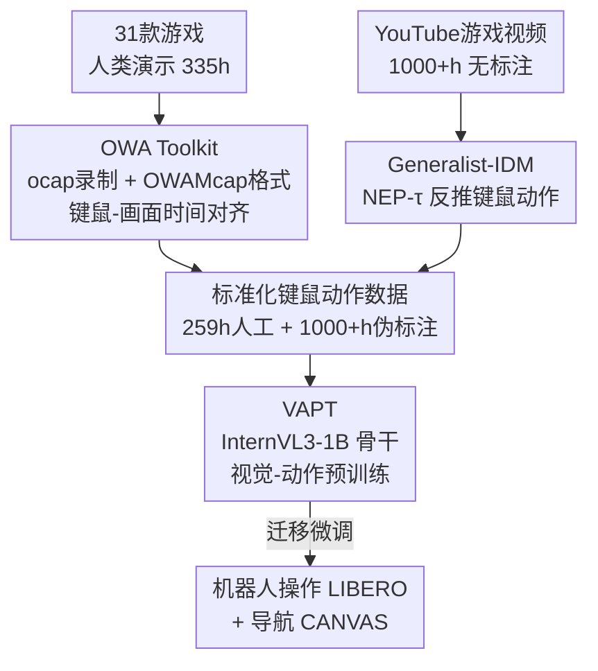

# D2E: Scaling Vision-Action Pretraining on Desktop Data for Transfer to Embodied AI

**会议**: ICLR 2026  
**arXiv**: [2510.05684](https://arxiv.org/abs/2510.05684)  
**代码**: [项目页](https://worv-ai.github.io/d2e/)  
**领域**: 机器人  
**关键词**: embodied AI, desktop pretraining, inverse dynamics model, vision-action pretraining, robotics transfer

## 一句话总结
提出 D2E 框架，证明桌面游戏交互数据可作为具身 AI 的有效预训练基底：通过 OWA 工具包收集 335h 人类演示 + Generalist-IDM 伪标注 1000+h YouTube 游戏视频 + VAPT 迁移训练，1B 参数模型在 LIBERO 操作达 96.6%、CANVAS 导航达 83.3%，匹敌或超越 7x 更大的模型。

## 研究背景与动机
**领域现状**: LLM 得益于互联网规模文本数据实现了跨任务泛化，但具身 AI 的物理轨迹数据收集成本极高（专用硬件、人工操作、复杂标注），数据规模远不足以驱动类似的 scaling。

**现有痛点**: 现有机器人数据集（DROID 等）规模小、领域特定、格式不兼容。VPT 仅限 Minecraft 单域，SIMA 跨游戏但数据私有。

**核心矛盾**: 具身 AI 需要大规模动作标注数据，但物理数据收集不可扩展；桌面交互（键盘鼠标）丰富且标准化，但能否迁移到物理机器人？

**本文目标**: 建立从桌面数据收集到具身任务迁移验证的完整管线。

**切入角度**: 游戏交互具有复杂感觉运动模式（导航、操作、规划），与具身 AI 挑战高度类似，且可通过 YouTube 大规模获取。

**核心 idea**: 桌面 = 便宜的具身 AI 预训练数据源，OWA收集 + 通用IDM伪标注 + VAPT迁移 = 完整管线。

## 方法详解

### 整体框架
D2E 把"桌面交互能不能迁移到具身机器人"这件事拆成一条三段式管线：先用 OWA Toolkit 收集并标准化键鼠级别的桌面演示数据，再用 Generalist-IDM 给海量无标注的 YouTube 游戏视频伪标注出动作，最后用 VAPT 在这批桌面数据上预训练一个统一骨干，再迁移到机器人操作与导航任务。三者环环相扣——工具解决"采得到、读得快"，IDM 解决"标得起、标得准"，VAPT 解决"迁得动"。

### 关键设计

**1. OWA Toolkit：让桌面演示数据采集与读取不再是瓶颈**

桌面数据看似廉价，但真要规模化，采集时的多源同步和训练时的 I/O 吞吐都是隐形成本。OWA 的录制器 ocap 基于 Windows API 加 GStreamer，把 60Hz 屏幕画面与键盘、鼠标事件做精确时间对齐，保证动作标签和画面帧严格配对。存储上它扩展 MCAP 标准为 OWAMcap 格式，用 H.265 编码拿到相对 raw 帧 217× 的压缩，并以 MediaRef 外部引用替代内联视频，从而支持高效随机访问而不必整段解码。训练侧再叠一层 FSLDataset（固定序列长度打包）和自适应批量解码，把吞吐拉到 119 img/s（相对基线 10.2× 提升），平均每张图磁盘读取仅 18.73 KB（比 TorchCodec 低 41×）。这套工程组合的直接结果是采集效率被压到极致：14 名标注员一个月就跨 31 款游戏收集了 335h 数据，对照 DROID 需要 50 名采集者、13 个机构、12 个月，桌面路线的成本优势一目了然。

**2. Generalist-IDM：用一个通用逆动力学模型把无标注游戏视频变成有动作标签的训练数据**

要利用 1000+h 的 YouTube 游戏视频，关键是从纯画面反推出当时玩家按了什么键、动了什么鼠标，这正是逆动力学模型（IDM）的活，但传统 IDM 都是逐游戏专用的。D2E 的做法是把动作建模成时间戳事件流：每个事件序列化为 `<EVENT_START>{TYPE}{TIMESTAMP}{DETAIL}<EVENT_END>`，不依赖固定 tick 间隔，于是无操作时段被自然跳过，模型只在真正发生动作时输出。训练目标是带时间偏移的下一事件预测 NEP-τ——把观测窗口向前多看 $\tau$ 步以提供未来上下文，损失写作 $\mathcal{L}_{\text{NEP-}\tau} = -\mathbb{E}\left[\sum_t \log P_\theta(a_t \mid o_{1:\min(t+\tau,T)}, a_{1:t-1})\right]$。这个 $\tau$ 不是可有可无的细节：实验里 $\tau=100$ms 为最优，而 $\tau=0$（只看当前帧）时预测动作和真值的 Pearson 相关性几乎归零，说明少量未来上下文对消解动作-画面的因果延迟至关重要。模型基于 InternVL3-1B 架构，仅约 192 H100 小时（约 \$800）即可训完，却能零样本泛化到未见游戏——在 Battlefield 6 上键盘准确率达 63%，已经匹敌专门为该游戏训练的 IDM，这正是让互联网规模伪标注变得可行的前提。

**3. VAPT：把桌面预训练得到的感觉运动先验迁移给机器人**

有了标准化的人工数据和伪标注数据，VAPT 在合计 1.3K+ 小时桌面数据（259h 人工 + 1000+h 伪标注）上预训练同一个 InternVL3-1B 骨干，再微调到下游机器人任务。它之所以能迁移，作者归因于三点共性：动作模态上桌面的离散键鼠与机器人动作空间可对齐，任务结构上两者都是目标导向的序列决策，数据分布上跨 20 款游戏的高多样性提供了广泛的感觉运动覆盖。这一先验的价值在训练动态上看得最清楚——VAPT 初始化的模型一上来就快速收敛，而随机初始化的基线要先经历一段明显的平台期才开始下降，等于把桌面学到的通用控制能力直接折算成了下游的样本效率。

### 损失函数 / 训练策略
Generalist-IDM 用 NEP-τ 目标做自回归的 next-event prediction，把动作伪标注转化为序列建模问题；VAPT 则在桌面数据上做标准的视觉-动作预训练，再在 LIBERO、CANVAS 等下游任务上微调。

## 实验关键数据

### 主实验
LIBERO 操作基准（成功率%）:

| 方法 | 参数量 | Spatial | Object | Goal | 10(long) | Total |
|------|--------|---------|--------|------|----------|-------|
| OpenVLA | 7B | 84.7 | 88.4 | 79.2 | 53.7 | 76.5 |
| π₀ | 3.3B | 90.0 | 86.0 | 95.0 | 73.0 | 86.0 |
| SmolVLA | 2.25B | 93.0 | 94.0 | 91.0 | 77.0 | 88.7 |
| **VAPT w/o pseudo** | **1B** | 95.8 | 98.4 | **98.6** | **93.6** | **96.6** |

CANVAS 导航基准（Baseline 75.3% → VAPT w/ pseudo **83.3%**）。

### 消融实验
Generalist-IDM vs Specialist-IDM（域内6款游戏）:

| 游戏 | 模型 | Pearson-X | 键盘准确率 |
|------|------|-----------|----------|
| Brotato | Specialist | 65.92 | 28.80 |
| Brotato | **Generalist** | **73.65** | **86.36** |
| Apex Legends | Specialist | 65.16 | 67.47 |
| Apex Legends | **Generalist** | **83.90** | **76.55** |

Generalist-IDM 在所有游戏上均超越 Specialist-IDM（键盘准确率最高提升 57.6%）。

### 关键发现
- 1B 参数 VAPT 在 LIBERO 上超越 3.3B π₀ 和 7B OpenVLA，长时域任务优势尤其明显（93.6% vs 73.0%）
- 伪标注数据对**导航**有帮助（+8%），但对**操作**反而无益——操作需要精确人工监督
- 真实机器人（SO101 pick-and-place）从 70% 提升到 80%，验证物理迁移有效
- OWA 数据收集效率远超机器人数据：14人×1月 vs DROID的50人×13机构×12月

## 亮点与洞察
- **范式创新**: 首次系统性地证明桌面游戏→物理机器人的迁移是可行的
- **完整管线**: 从工具→数据→模型→迁移→验证的端到端贡献
- **OWA Toolkit 的工程价值**: 152x 压缩、41x I/O 优化、标准化格式，对社区有实际贡献
- **NEP-τ 设计**: 时间戳驱动的事件预测比 tick-based 更高效，跳过无操作时段
- **Generalist-IDM 的零样本泛化**: 在未见游戏上超越专用模型，使互联网规模伪标注成为可能

## 局限与展望
- 桌面→机器人的迁移机制仍是假说层面，缺乏严格的理论分析
- 仅验证了 InternVL3-1B 一种骨干
- 真实机器人实验仅做了单个 pick-and-place 任务
- OWA Toolkit 目前仅支持 Windows
- 游戏数据可能引入与真实世界不一致的视觉偏见
- Meta-World 上绝对成功率仍较低（Very Hard 仅 20-24%）

## 相关工作与启发
- VPT 是先驱但限于 Minecraft 单域；SIMA 跨游戏但私有；D2E 是首个开源、多游戏、验证迁移的框架
- 与 RT-X/Open X-Embodiment 互补：D2E 提供了低成本预训练数据源
- LAPA 的潜动作预训练思路类似，但 D2E 直接操作在显式键鼠动作上
- 启发：互联网视频 + 通用 IDM 伪标注是扩展具身 AI 数据的可行路径

## 评分
- 新颖性: ⭐⭐⭐⭐⭐ 桌面→具身的迁移范式具有开创性意义
- 实验充分度: ⭐⭐⭐⭐ LIBERO/Meta-World/CANVAS + 真实机器人，但真实机器人实验较简单
- 写作质量: ⭐⭐⭐⭐ 系统性强，但内容跨度大导致部分细节需查附录
- 价值: ⭐⭐⭐⭐⭐ 开源工具+数据+模型，为具身AI数据扩展开辟新方向

<!-- RELATED:START -->

## 相关论文

- [\[ICLR 2026\] Grounding Generative Planners in Verifiable Logic: A Hybrid Architecture for Trustworthy Embodied AI](grounding_generative_planners_in_verifiable_logic_a_hybrid_architecture_for_trus.md)
- [\[ICML 2026\] Seeing Realism from Simulation: Efficient Video Transfer for Vision-Language-Action Data Augmentation](../../ICML2026/robotics/seeing_realism_from_simulation_efficient_video_transfer_for_vision-language-acti.md)
- [\[ICLR 2026\] TwinVLA: Data-Efficient Bimanual Manipulation with Twin Single-Arm Vision-Language-Action Models](twinvla_data-efficient_bimanual_manipulation_with_twin_single-arm_vision-languag.md)
- [\[ACL 2026\] Limited Linguistic Diversity in Embodied AI Datasets](../../ACL2026/robotics/limited_linguistic_diversity_in_embodied_ai_datasets.md)
- [\[NeurIPS 2025\] The Impact of Scaling Training Data on Adversarial Robustness](../../NeurIPS2025/robotics/the_impact_of_scaling_training_data_on_adversarial_robustness.md)

<!-- RELATED:END -->
