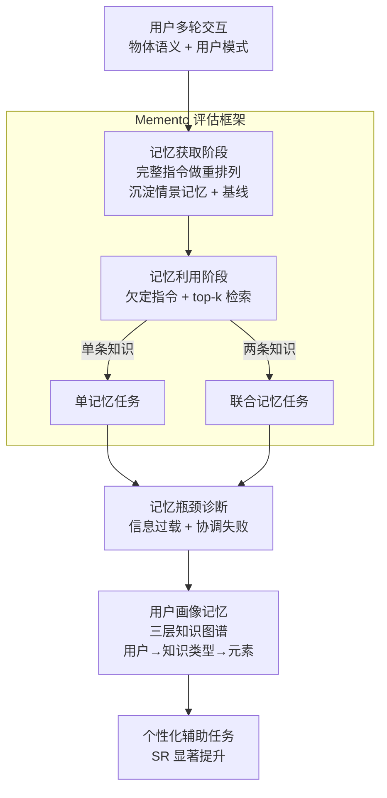

# Embodied Agents Meet Personalization: Investigating Challenges and Solutions Through the Lens of Memory Utilization

**会议**: ICLR 2026  
**arXiv**: [2505.16348](https://arxiv.org/abs/2505.16348)  
**代码**: [https://github.com/Connoriginal/MEMENTO](https://github.com/Connoriginal/MEMENTO)  
**领域**: 图学习  
**关键词**: 个性化具身智能, 记忆利用, 情景记忆, 知识图谱, LLM Agent

## 一句话总结
本文通过 Memento 框架系统评估了 LLM 驱动具身智能体的记忆利用能力，发现现有 agent 能回忆简单物体语义但无法处理用户行为模式的序列信息，并提出了基于层次知识图谱的用户画像记忆模块来有效提升个性化辅助任务的表现。

## 研究背景与动机

**领域现状**：当前 LLM 驱动的具身智能体在传统物体重排列任务上已取得不错进展，但这些任务通常只涉及单轮交互和静态指令，不需要理解用户的个性化偏好和历史行为。

**现有痛点**：现有具身智能体的记忆系统主要关注语义记忆（场景图、语义地图）和程序记忆（技能库），而情景记忆（episodic memory）仅作为被动的任务缓冲区或上下文历史使用，缺乏对个性化知识提取和利用的系统评估。

**核心矛盾**：用户的个性化知识（如"最喜欢的杯子"、"早晨例行流程"）需要 agent 从过去交互中提取并在新任务中灵活运用，但 agent 面临两个关键瓶颈：信息过载（检索记忆增多时性能下降）和协调失败（无法同时利用多条记忆）。

**本文目标** 1) 系统评估具身 agent 在个性化辅助任务中的记忆利用能力；2) 诊断记忆利用的关键瓶颈；3) 设计更好的记忆架构来支持个性化任务。

**切入角度**：从记忆利用的两个维度切入——物体语义（识别具有个人含义的物体）和用户模式（回忆行为常规中的序列），构建端到端评估框架。

**核心 idea**：通过分离个性化知识管理，构建层次知识图谱用户画像记忆模块，独立管理物体语义和用户模式信息，从而克服 LLM 情景记忆中的信息过载和协调失败问题。

## 方法详解

### 整体框架
这篇工作走的是"先建评估、再做诊断、最后给方案"的三段弧线。**评估**靠 Memento 框架完成：它把"具身 agent 用没用好记忆"拆成两个前后衔接的阶段，记忆获取阶段让 agent 在多轮交互中把用户的个性化信息（物体语义、用户模式两个维度）沉淀进情景记忆并建立性能基线，记忆利用阶段再把这些积累的知识搬到全新的辅助任务上检验；利用阶段的任务又按需要调动的记忆条数细分为只用一条知识的单记忆任务和必须同时协调多条知识的联合记忆任务。**诊断**则在这套任务上用控制变量找出 agent 在哪一步崩——隔离出"信息过载"和"协调失败"两类失效。**方案**针对诊断结论，并行挂一个层次知识图谱形式的用户画像记忆，把个性化知识从情景记忆流里单独拎出来结构化管理，从而同时缓解两类失效。

### 关键设计

**1. Memento 评估框架：把个性化知识拆成可度量的两个维度**

现有具身基准大多只考单轮静态指令，无法暴露个性化辅助里"agent 要记住你是谁、记住你怎么做事"的真实难点。Memento 的做法是把个性化知识显式切成两类并分别施压：物体语义指用户赋予物理对象的个人含义，比如"咖啡套装里那个红色杯子"，考的是识别带个人标签的物体；用户模式指行为常规中的序列信息，比如"早餐流程"先做什么后做什么，考的是把过去交互里的顺序重放出来。整个评估端到端打通，用 Percent Complete（$PC$，子目标完成比例）衡量任务推进程度、用 Success Rate（$SR$，整任务成功率）衡量最终是否达成，两个指标一软一硬，既能看出 agent 是"差一点"还是"完全没做对"。

**2. 记忆瓶颈诊断实验：用控制变量把失效原因钉死**

光知道 agent 表现下降还不够，要找出是在哪一步崩的。Memento 在单记忆任务里逐步放大检索条数 top-$k$（取 $k=3,5,7,10$），观察无关记忆增多时性能是否单调下滑，以此隔离"信息过载"——结果显示各模型性能随 $k$ 增大一致变差，说明检索越多反而越干扰决策。联合记忆任务则强制 agent 在一次任务里同时调用两条记忆，专门压"协调失败"这一维度。此外还做了记忆格式简化实验，把完整情景记忆分别替换成摘要化版本和仅保留指令的版本，用来判断情景记忆里到底哪部分信息在起作用，为后续设计提供依据。

**3. 层次知识图谱用户画像记忆 (User Profile Memory)：把个性化知识从情景流里单独拎出来管**

诊断实验发现情景记忆身兼两职——它既携带个性化知识，又充当上下文学习的示范，所以简单地把它摘要掉会连带削掉小模型的上下文收益（小模型上 SR 明显掉），不能直接替换。于是本文不动情景记忆，而是并行挂一个专门的用户画像记忆来结构化承载个性化知识。它是一个三层知识图谱：用户层 → 知识类型层（物体语义、用户模式）→ 具体元素层（物体、模式、位置），层与层之间用层次边表达归属关系，用户模式内部则用时序边记录动作先后顺序。这样 agent 在新任务里需要"红色杯子在哪""早餐第三步做什么"时，可以直接沿图取到干净、去噪、带顺序的结构化答案，而不必在一大堆原始情景片段里翻找，从机制上同时缓解了信息过载和协调失败。

## 实验关键数据

### 主实验

| 模型 | 阶段 | 任务类型 | PC (%) | SR (%) | ΔSR |
|------|------|---------|--------|--------|-----|
| GPT-4o | 获取 | - | 96.3 | 95.0 | - |
| GPT-4o | 利用 | 单记忆 | 88.0 | 85.1 | -9.9 |
| GPT-4o | 利用 | 联合记忆 | 86.7 | 63.9 | -30.5 |
| Qwen-2.5-72b | 获取 | - | 93.5 | 91.0 | - |
| Qwen-2.5-72b | 利用 | 单记忆 | 72.6 | 67.2 | -23.8 |
| Qwen-2.5-72b | 利用 | 联合记忆 | 68.9 | 36.1 | -58.3 |
| Llama-3.1-8b | 获取 | - | 78.1 | 68.5 | - |
| Llama-3.1-8b | 利用 | 单记忆 | 48.1 | 35.0 | -33.5 |

### 消融实验

| 模型 | 记忆格式 | PC (%) | SR (%) |
|------|---------|--------|--------|
| GPT-4o | 完整情景记忆 | 90.0 | 83.3 |
| GPT-4o | 摘要化 | 88.0 | 83.3 |
| GPT-4o | 仅指令 | 62.4 | 50.0 |
| Llama-3.1-8b | 完整情景记忆 | 72.8 | 63.3 |
| Llama-3.1-8b | 摘要化 | 49.4 | 43.3 |
| Llama-3.1-8b | 仅指令 | 40.0 | 30.0 |

### 关键发现
- 所有模型在个性化任务上 SR 下降超过 20%，GPT-4o 在联合记忆任务上 SR 下降 30.5%
- Agent 能有效回忆物体语义但严重挣扎于用户模式的序列理解
- 检索记忆数量增加（top-k 增大）一致性地降低所有模型性能，表明信息过载是关键瓶颈
- 记忆摘要化对大模型影响有限但导致小模型性能大幅下降，说明情景记忆同时提供上下文学习收益
- 用户画像记忆在单记忆和联合记忆任务上都带来显著性能提升

## 亮点与洞察
- **系统性的记忆利用瓶颈诊断**：通过控制变量实验清晰揭示了信息过载和协调失败两大核心瓶颈，这是理解具身 agent 个性化能力的基础性工作
- **情景记忆的双重角色发现**：证明情景记忆不仅提供个性化知识，还充当上下文学习的示范，这解释了为什么简单的记忆摘要化策略在小模型上反而有害

## 局限与展望
- 评估使用了 gold perception 和 motor skills，回避了感知和执行层面的挑战
- 个性化知识由 LLM 合成生成，可能不能完全反映真实用户的复杂知识结构
- 用户画像记忆的知识图谱构建依赖 LLM 提取，在生产环境中可能引入噪声
- 未探索记忆随时间演化和更新的长期适应场景

## 相关工作与启发
- **vs ProgPrompt/VOYAGER**: 这些方法关注程序记忆（技能库）来提升任务完成效率，本文关注情景记忆在个性化中的作用，两者是互补的记忆维度
- **vs Xu et al. (2024)**: 他们从少量示范中推断用户偏好，本文则要求 agent 从显式提供的交互历史中提取结构化个性化知识，更强调记忆的系统化管理

## 评分
- 新颖性: ⭐⭐⭐⭐ 首个系统评估具身 agent 记忆利用的框架，问题界定清晰
- 实验充分度: ⭐⭐⭐⭐ 多个模型、多种记忆条件的系统消融，发现有洞察力
- 写作质量: ⭐⭐⭐⭐ 三个 RQ 递进展开，逻辑清晰
- 价值: ⭐⭐⭐⭐ 对具身 agent 个性化方向有重要参考价值

<!-- RELATED:START -->

## 相关论文

- [\[NeurIPS 2025\] Memo: Training Memory-Efficient Embodied Agents with Reinforcement Learning](../../NeurIPS2025/robotics/memo_training_memory-efficient_embodied_agents_with_reinforcement_learning.md)
- [\[ICLR 2026\] REI-Bench: Can Embodied Agents Understand Vague Human Instructions in Task Planning?](rei-bench_can_embodied_agents_understand_vague_human_instructions_in_task_planni.md)
- [\[ICLR 2026\] Test-Time Mixture of World Models for Embodied Agents in Dynamic Environments](test-time_mixture_of_world_models_for_embodied_agents_in_dynamic_environments.md)
- [\[ICLR 2026\] Grounding Generative Planners in Verifiable Logic: A Hybrid Architecture for Trustworthy Embodied AI](grounding_generative_planners_in_verifiable_logic_a_hybrid_architecture_for_trus.md)
- [\[CVPR 2026\] AGENTSAFE: Benchmarking the Safety of Embodied Agents on Hazardous Instructions](../../CVPR2026/robotics/agentsafe_benchmarking_the_safety_of_embodied_agents_on_hazardous_instructions.md)

<!-- RELATED:END -->
