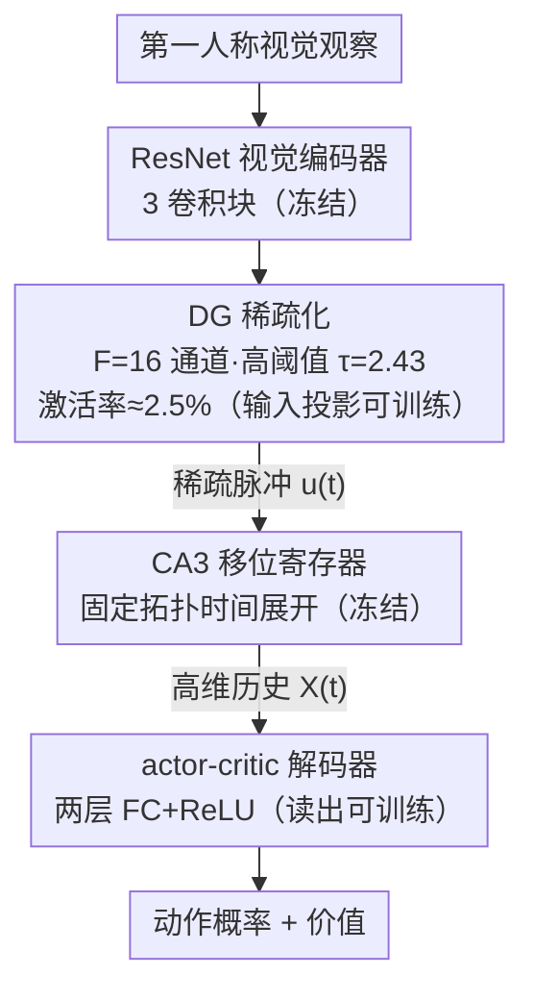

# Emergence of Spatial Representation in an Actor-Critic Agent with Hippocampus-Inspired Sequence Generator

**会议**: ICLR 2026  
**arXiv**: [2510.09951](https://arxiv.org/abs/2510.09951)  
**代码**: [有](https://github.com/xiaoxionglin/SF_hipposlam)  
**领域**: 强化学习  
**关键词**: 海马体序列生成器, 空间表征, Actor-Critic, 稀疏编码, 位置细胞

## 一句话总结
受海马体 CA3 区内在递归回路启发，提出最小序列生成器（shift register）与 actor-critic 结合，在稀疏视觉输入下实现迷宫导航，同时涌现出位置场、DG 正交化、距离相关空间核和任务依赖重映射等神经生物学现象。

## 研究背景与动机
- 海马体位置细胞（place cells）以 theta 序列形式有序放电，传统观点认为这来自沿轨迹的感觉输入驱动
- 作者提出更简约的解释：序列来源于 **CA3 区的内在递归回路**，可在无外部输入时长时间传播活动，充当时间记忆缓冲区
- 当可靠感觉证据稀疏时（如导航中只有少量地标），这种内在序列生成机制尤为关键
- 齿状回（DG）仅约 2-5% 的颗粒细胞在任一环境中活跃，提供极低活动率的稀疏编码
- 该机制与机器学习中的 SSM/结构化线性 RNN 思想共鸣：先将输入扩展到高维时间特征空间，再通过浅层非线性读出压缩
- 已有的后继表征、储库模型和概率方法虽能再现位置场活动，但很少明确回答序列从何而来

## 方法详解

### 整体框架
模型沿海马体通路把第一人称视觉观察逐级变成可导航的空间表征：固定的预训练 ResNet（3 个卷积块、匹配 IMPALA）抽取视觉特征，齿状回（DG）模块把它稀疏化成极少数活跃单元，CA3 移位寄存器把这些稀疏脉冲在时间上展开成一段规范的历史轨迹，最后由两层 actor-critic 解码器读出动作概率与价值。整套系统里只有 DG 的输入映射和解码器的输出权重可训练，视觉编码器与 CA3 递归回路全程冻结，从而把"序列生成"这件事单独隔离出来观察。

### 关键设计

**1. DG 稀疏化：用极低活动率把噪声线索挡在门外**

生物上齿状回任一环境只有约 2–5% 的颗粒细胞活跃，作者照搬这一极稀疏编码作为核心而非附属设计。ResNet 特征先线性映射到 $F=16$ 个通道，经保留率 0.95 的 batch normalization 后再过一道高阈值 $\tau=2.43$，把激活率压到约 2.5%。这样做的意义在于：迷宫纹理刻意做成均匀的，空间关系无法从视觉相似度推断，绝大多数视觉响应是无信息的噪声；高阈值只让真正能定位空间区域的强信号通过，使后续每个超阈值脉冲都对应一个可靠的"地标证据"，而不是把含糊不清的特征一起喂给递归模块混合。

**2. CA3 移位寄存器：固定拓扑生成时间序列，充当记忆缓冲区**

这是全文最关键的假设——位置细胞的有序序列不必来自沿轨迹的连续感觉输入，而可以由 CA3 内在递归回路自发产生。每个 DG 特征对应一条长度 $\ell=L+(R-1)$ 的预连线寄存器，状态更新为 $x_{t+1}=Sx_t+Ju_t$，其中 $S\in\mathbb{R}^{\ell\times\ell}$ 是下三角子对角线为 1 的移位算子，$J\in\mathbb{R}^{\ell\times 1}$ 把瞬时输入注入最前 $R$ 个槽位。一次输入在前 $R$ 位激起活动后，便在寄存器里以每步一位的速度自动向后传播，即使外部证据缺席也能持续若干步，因此天然是一个时间记忆缓冲区。$F$ 个特征各自独立演化，用 Kronecker 积 $A=I_F\otimes S$、$B=I_F\otimes J$ 拼成块对角更新，完整 CA3 状态为 $X_t\in\mathbb{R}^{F\ell}$。其中 $L$ 决定序列跨越多少个 theta 周期（即历史能回溯多远），$R$ 决定每周期同时点亮几个单元，并兼作时间平滑先验，让相邻时刻的表征不至于突变。

**3. 冻结递归、只训练读写：把序列生成的纯效果单独隔离**

CA3 权重完全固定、不参与梯度更新，这是一个刻意的控制变量——既然递归矩阵不学习，凡是涌现出的位置场、正交化、空间核等现象就只能归因于"稀疏输入 + 固定序列展开"这一机制本身，而非反向传播塑造的结果。可训练参数仅剩 DG→CA3 的输入投影和 CA3→解码器的两层 FC+ReLU 读出。这种"高维时间特征扩展 + 浅层非线性读出"的分工与机器学习里的 SSM / 结构化线性 RNN 思路一致：先把输入扩张到富含历史的高维空间，再用可学习的浅层网络压缩出策略和价值，既保留长时程信息又不像全连接 RNN 那样把所有特征不加区分地搅在一起。

### 损失函数 / 训练策略
环境是 19×19 的 DeepMind Lab 连续迷宫，墙壁随机覆盖 15% 的格子并支持多路径到达目标。训练目标是标准的 advantage actor-critic：策略梯度项 + 价值基线 + 熵正则化，用 Sample Factory（IMPALA 架构）做分布式训练。每个 episode 最多 900 步，agent 被随机放置在距目标至少 5 单位处，全部结果在 6 个随机种子上统计。

## 实验结果

### 架构对比

| 输入类型 | CA3 (L=64,R=8) | Random RNN | HiPPO-LegS | LSTM |
|---------|----------------|------------|-------------|------|
| 稀疏 (达80%步数) | **173.6±77.6M** | ✗ | ✗ | ✗ |
| 稀疏 (最终成功率) | **0.86±0.10** | 0.51±0.12 | 0.52±0.11 | 0.56±0.06 |
| 稠密 (达80%步数) | ✗ | ✗ | ✗ | **135.9±27.6M** |
| 稠密 (最终成功率) | 0.71±0.07 | 0.78±0.15 | 0.64±0.21 | **0.93±0.09** |

核心发现：稀疏输入下 CA3 是**唯一**能达到 80% 成功率的架构；稠密输入下 LSTM 反而更优——揭示表征稀疏性与记忆架构间的强交互效应。

### 迁移学习

| 迁移场景 | 所需训练帧数 |
|---------|------------|
| 新奖励位置 | ~50M（已有地图表征可复用） |
| 新地图 | ~150M |
| 路径阻断 | 快速适应 |

表明 agent 获得了对空间布局的可泛化表征，而非仅记忆特定路径。

### 消融实验
- **序列长度**：L=1,R=1（纯前馈，绕过 CA3）完全失败；L=16,R=8 可达一定成功率但不稳定；L=64,R=8 最优
- **空间信息因果性**：置换最高 SI 的 32 个 Decoder 单元→成功率降 4.9%、轨迹长度 1065→2794 帧；置换最低 SI 单元→无影响
- **噪声鲁棒性**：添加像素级高斯噪声抑制弱信号后，DG+CA3 受害远小于 LSTM
- **R 参数**：性能在较大范围 R 值下稳定，低速运动时对 R 更敏感

### 行为与表征分析
- **占据图演化**：agent 逐渐发展稳定轨迹，倾向先到达显著输入/地标位置再汇聚到目标，类似动物在熟悉环境中的习惯性导航策略
- **位置场涌现**：DG 和 CA3 单元自然发展出局部化位置场；LSTM 隐藏单元则不显示位置细胞特性
- **DG 正交化**：学习过程中 DG 群体活动地图间相关性逐步降低，形成各位置的唯一编码
- **序列内空间展宽**：CA3 序列中远离 DG 输入的单元展示更宽的空间调谐（高熵），与实验观察一致
- **距离相关空间核**：所有层的种群向量相关性呈现平滑的距离依赖性，CA3 核比 DG 核更平滑，Decoder 层 1 空间调谐最显著；LSTM 仅在输出层有非各向同性的弱空间核
- **任务依赖重映射**：奖励位置改变后位置场质心发生偏移，表征重映射；已训练与新奖励条件的相似性高于初始与已训练间，说明空间布局知识具有泛化性

## 亮点与洞察
- **极简但有效**的生物启发设计：固定权重移位寄存器，无需学习递归矩阵，结构透明可解释
- 清晰揭示不同递归架构适用于不同感觉模式的规律：稀疏编码 + 序列扩展 vs. 稠密输入 + 混合型递归（LSTM）
- CA3 模块将稀疏 DG 编码扩展为时间平滑的规范基集，提供长时程历史而不像全连接 RNN 那样不加区分地混合特征
- agent 发展出的行为模式（习惯性轨迹、地标导向汇聚）与动物导航策略一致；LSTM agent 则更像视觉搜索策略
- 对 Bitter Lesson 的中间立场：结构先验（稀疏性、序列）不规定表征方案，而是缩小假设空间而不牺牲可扩展性

## 生物学预测
- 更大环境或更稀疏的输入需要更长序列才能成功导航
- 海马体空间表征可能主要依赖内在序列生成回路，经验主要塑造前馈和读出连接
- 为内嗅皮层损伤后位置细胞仍能持续的现象提供解释
- 该机制对无明显 theta 震荡的物种同样适用（如蝙蝠中与翅膀拍击锁定的海马序列）

## 局限性
- CA3 权重完全固定，未加入局部可塑性规则；加入 DG-CA3 通路的可塑性可能更接近生物现实
- 仅在单一迷宫环境（DeepMind Lab）测试，更复杂 3D 环境和多任务场景待验证
- 未与路径积分（path integration）或内嗅皮层网格细胞交互建模
- 训练需要约 350M 帧，样本效率有待提升
- 未探讨分层跨区域的 theta 序列协调

## 相关工作对比
- **后继表征（SR）**：CA3 活动与 SR 有相似结构（策略依赖、时间有序、前瞻性），但 CA3 的预测结构源于固定拓扑而非 TD 学习
- **HiPPO/S4/SSM**：CA3 移位寄存器生成有限长度时间基，与 Legendre SSM 的旋转模式和 Laguerre SSM 的衰减模式形成对比；与 shift-diagonal 架构共鸣但针对稀疏感觉
- **储库计算（Reservoir Computing）**：CA3 本质上是受生物约束的储库网络，但移位结构赋予其可解释的序列语义
- 与以往取 allocentric 输入的海马 RL 研究互补：本文展示从 egocentric 观察中涌现类高斯位置场

## 评分
- 新颖性: 4/5 （极简生物启发设计，稀疏-序列协同假说新颖）
- 实验充分度: 5/5 （行为、位置场、空间信息、种群核、因果干预、噪声鲁棒性，多维度验证）
- 写作质量: 4/5 （结构清晰，跨学科表述准确，神经科学与 RL 视角兼顾）
- 价值: 4/5 （为海马体 theta 序列和 RL 导航提供统一机制解释，开辟生物启发稀疏架构新方向）

<!-- RELATED:START -->

## 相关论文

- [\[AAAI 2026\] Actor-Critic for Continuous Action Chunks: A Reinforcement Learning Framework for Long-Horizon Robotic Manipulation with Sparse Reward](../../AAAI2026/robotics/actor-critic_for_continuous_action_chunks_a_reinforcement_le.md)
- [\[ICLR 2026\] From Spatial to Actions: Grounding Vision-Language-Action Model in Spatial Foundation Priors](from_spatial_to_actions_grounding_vision-language-action_model_in_spatial_founda.md)
- [\[ICLR 2026\] RoboInter: A Holistic Intermediate Representation Suite Towards Robotic Manipulation](robointer_a_holistic_intermediate_representation_suite_towards_robotic_manipulat.md)
- [\[ICLR 2026\] Distributionally Robust Cooperative Multi-Agent Reinforcement Learning via Robust Value Factorization](distributionally_robust_cooperative_multi-agent_reinforcement_learning_via_robus.md)
- [\[ICLR 2026\] AnyTouch 2: General Optical Tactile Representation Learning For Dynamic Tactile Perception](anytouch_2_general_optical_tactile_representation_learning_for_dynamic_tactile_p.md)

<!-- RELATED:END -->
