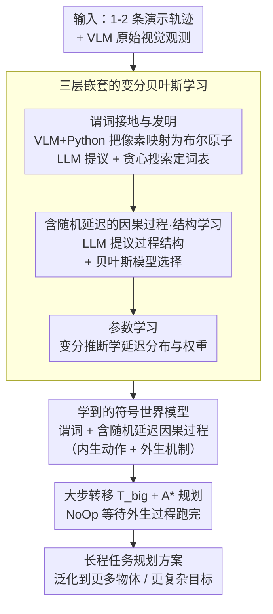

# ExoPredicator: Learning Abstract Models of Dynamic Worlds for Robot Planning

**会议**: ICLR 2026  
**arXiv**: [2509.26255](https://arxiv.org/abs/2509.26255)  
**代码**: 无  
**领域**: Robot Planning / World Models  
**关键词**: 抽象世界模型, 外生因果过程, 时间规划, 谓词发明, 变分推断, LLM引导  

## 一句话总结
提出 ExoPredicator 框架，联合学习符号化状态抽象和因果过程（含内生动作与外生机制），通过变分贝叶斯推断 + LLM 提议从少量轨迹中学习带随机延迟的因果世界模型，在 5 个桌面机器人环境中实现快速泛化规划。

## 背景与动机

### 现有痛点

1. 长期具身规划中，世界不仅因智能体动作而变化，还有**外生过程**（如水加热、多米诺骨牌级联）与智能体动作并发进行
2. 现有抽象世界模型（如 STRIPS）假设动作是瞬时的，不能建模延迟效果和自主外生过程
3. 经典 PDDL 也不直接支持外生过程（需 PDDL+ 扩展），且按时间粒度组合爆炸
4. VLM/VLA 模型缺乏可组合的世界模型，难以泛化到新任务
5. **核心问题**：如何学习同时抽象状态空间和因果过程时间进程的世界模型？

## 方法详解

### 整体框架

ExoPredicator 把一个动态世界拆成两层来学：底层用 VLM 接地的符号谓词把连续观测压成一组布尔原子（如 `IsHot(kettle)`），上层用一组**因果过程**描述这些原子如何随时间改变——既包括智能体主动触发的内生动作，也包括条件满足后自主展开的外生机制，而且每个过程的效果都带一个随机延迟。给定 1-2 条演示轨迹，框架用一个由外到内的三层嵌套循环来学这套模型：外层用 LLM 提议加贪心搜索发明谓词词表，中层用 LLM 提议加贝叶斯模型选择搜过程结构，内层用变分推断拟合延迟分布与权重。学到的符号世界模型最后交给一个配了大步转移与 fast-forward 启发式的 A\* 规划器，去求解需要等待外生过程的长程任务。

### 关键设计

**1. 谓词接地与发明：把像素世界压成可组合的符号空间**

直接在原始观测上规划会陷入维度灾难，于是每个谓词被实现为一段 Python 函数加一次 VLM 查询，把当前观测映射成一组布尔接地原子（如 `IsHot(kettle)`、`NOT-IsImmovable`）。词表不靠人手设计：让 LLM 提议大量候选谓词，复用它的视觉常识来命名物理概念，再由外层搜索（见设计 3）从中挑出真正解释轨迹所必需的那几个。这样既保留了符号空间的可组合性、能泛化到更多物体，又免去了人工逐个定义谓词的繁琐。

**2. 含随机延迟的因果过程：统一刻画动作与外生机制**

经典 STRIPS / PDDL 把动作当作瞬时生效，无法表达"加热需要时间""骨牌依次倒下"这类时序现象。本文把世界的一切变化统一写成因果过程 $L = \langle \text{Par}, C, O, E, W, p^{\text{delay}} \rangle$：$C$ 是触发条件、$E$ 是效果、$W$ 是权重，关键在于每个过程都带一个随机延迟分布 $p^{\text{delay}}$——条件满足后效果不立即落地，而要等从 $p^{\text{delay}}$ 采样的若干步之后才生效。内生过程额外绑定一个可执行技能（如 Pick/Place/SwitchBurnerOn），由智能体直接触发；外生过程（水壶注水、多米诺级联、风扇吹球）则在条件满足后自主推进。规划时再配一个 NoOp 动作让智能体原地等待，直到抽象状态发生改变，从而把瞬时算子扩展成能表达并发延迟动态的世界模型。

**3. 三层嵌套的变分贝叶斯学习：从 1-2 条演示里同时学出谓词、结构与延迟**

同时学谓词、过程结构和延迟参数会让假设空间膨胀到 $2^{50}$ 量级，因此学习被组织成由外到内的三层循环。外层是谓词发明（LLM 提议候选 + 贪心局部搜索定词表，目标是最大化数据似然加偏好简洁的模型先验），中层是过程结构学习（LLM 提议候选过程结构，用贝叶斯模型选择打分挑结构），内层是参数学习。内层的难点在于因果效果的真实到达时刻不可观测，于是引入变分分布 $q$ 去近似每个效果的到达时间，把"对所有可能时序求和"的组合爆炸转成一个可用 Adam 优化的证据下界（ELBO），该下界分解为延迟模型、抽象动力学与熵正则三项。LLM 负责把搜索压到合理的候选集、贝叶斯评分负责在候选里做可靠取舍，二者互补，使从极少数据学出模型成为可能（消融显示：去掉 LLM 后搜索空间不可行，去掉贝叶斯则完全依赖 LLM 先验而不可靠）。

**4. 大步转移与 A\* 规划：跳过无关时间步做长程搜索**

外生过程常常持续多步而抽象状态不变，逐步前向搜索会在大量"什么都没变"的时间步上空耗。框架定义一个大步转移函数 $\mathcal{T}_{\text{big}}$，一次性跳过抽象原子不发生变化的整段时间，只在状态真正切换处分叉，把规划图压到关键决策点。在此之上用 A\* 搜索、配一版改写的 fast-forward 启发式来引导，使学到的含延迟世界模型能直接支撑长程、含等待的任务规划。

## 实验

### 5 个 PyBullet 环境

| 环境 | 描述 | 外生过程 |
|------|------|---------|
| Coffee | 咖啡机出咖啡 → 倒入杯中 | 出咖啡、倒入 |
| Grow | 浇花（颜色匹配） | 植物生长 |
| Boil | 注水+烧开（避免溢出） | 注水、加热、溢出 |
| Domino | 推多米诺骨牌级联 | 骨牌间碰撞 |
| Fan | 用风扇吹球到目标 | 风吹球 |

### 主要结果

| 方法 | Coffee | Grow | Boil | Domino | Fan |
|------|--------|------|------|--------|-----|
| Manual | ~100% | ~70% | ~85% | ~80% | ~100% |
| **Ours** | ~100% | ~85% | ~80% | ~90% | ~100% |
| ViLa-fs | ~80% | ~30% | ~30% | ~10% | ~20% |
| MAPLE | ~20% | ~10% | ~5% | ~5% | ~5% |
| VisPred | ~60% | ~20% | ~20% | ~15% | ~30% |

- ExoPredicator 在全部领域一致优于 VLM 规划、HRL、STRIPS 学习基线
- 仅需 1-2 条演示 + 至多 3 轮在线学习即收敛
- 在 Grow 和 Domino 上甚至超越手工设计的 Manual（归功于变分推断学到更好的延迟参数）

### 消融
- No LLM：搜索空间达 $2^{50}$，不可行
- No Bayes：完全依赖 LLM 先验，不可靠
- Manual-d（手工抽象但未调延迟）：接近零性能，说明延迟参数学习关键

## 亮点与洞察
- 首个联合学习符号状态抽象 + 外生因果过程（含随机延迟）的框架
- 变分推断处理因果效果时序的组合爆炸问题，理论优雅
- LLM 提议 + 贝叶斯评分的搜索策略兼顾效率与可靠性
- 从极少数据（1-2 demo）学出可泛化的世界模型，泛化到更多物体和更复杂目标

## 局限与展望
- 仅在 PyBullet 桌面环境验证，未扩展到大规模/高噪声场景
- 外生过程条件学习不完整（如 Boil 中溢水的析取条件）
- 依赖预定义的闭环技能（Pick/Place 等），未学习技能本身
- 谓词提议依赖 LLM 质量，对罕见物理现象可能失效

## 相关工作
- **PDDL/PDDL+**：手工编写时序规划域描述，本文自动学习
- **HRL (MAPLE)**：不显式建模外生动态，探索困难
- **VLM 规划 (ViLA)**：无世界模型，组合泛化差
- **VisualPredicator**：STRIPS 式算子学习，不建模延迟和外生过程
- **因果 RL**：特征层面因果图，未涉及符号抽象和时序过程

## 评分
- 新颖性: ⭐⭐⭐⭐⭐
- 实验充分度: ⭐⭐⭐⭐
- 写作质量: ⭐⭐⭐⭐⭐
- 价值: ⭐⭐⭐⭐⭐

<!-- RELATED:START -->

## 相关论文

- [\[ICLR 2026\] RoboPARA: Dual-Arm Robot Planning with Parallel Allocation and Recomposition Across Tasks](robopara_dual-arm_robot_planning_with_parallel_allocation_and_recomposition_acro.md)
- [\[ICLR 2026\] AnyTouch 2: General Optical Tactile Representation Learning For Dynamic Tactile Perception](anytouch_2_general_optical_tactile_representation_learning_for_dynamic_tactile_p.md)
- [\[ICLR 2026\] Test-Time Mixture of World Models for Embodied Agents in Dynamic Environments](test-time_mixture_of_world_models_for_embodied_agents_in_dynamic_environments.md)
- [\[ICLR 2026\] Cross-Embodiment Offline Reinforcement Learning for Heterogeneous Robot Datasets](cross-embodiment_offline_reinforcement_learning_for_heterogeneous_robot_datasets.md)
- [\[CVPR 2026\] D3D-VLP: Dynamic 3D Vision-Language-Planning Model for Embodied Grounding and Navigation](../../CVPR2026/robotics/d3d-vlp_dynamic_3d_vision-language-planning_model_for_embodied_grounding_and_nav.md)

<!-- RELATED:END -->
