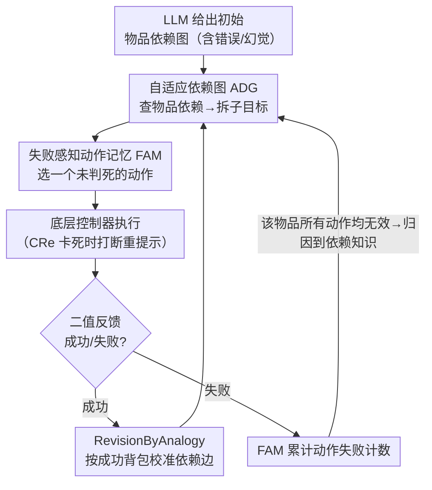

# Experience-based Knowledge Correction for Robust Planning in Minecraft

**会议**: ICLR 2026  
**arXiv**: [2505.24157](https://arxiv.org/abs/2505.24157)  
**代码**: 无  
**领域**: 机器人  
**关键词**: LLM planning, knowledge correction, Minecraft, embodied agent, self-correction failure

## 一句话总结
证明 LLM 无法通过 prompting 自我纠正其错误的规划先验知识（物品依赖关系），提出 XENON——通过算法化的知识管理（自适应依赖图 ADG + 失败感知动作记忆 FAM）从二值反馈中学习，使 7B LLM 在 Minecraft 长期规划中超越使用 GPT-4V + oracle 知识的 SOTA。

## 研究背景与动机
**领域现状**：LLM 驱动的 Agent 在 Minecraft 等长期规划任务中需要准确的物品依赖知识（如钻石镐需要钻石+木棍），但 LLM 的参数化知识常有错误。

**现有痛点**：自我纠正（self-correction）——即用 prompt 让 LLM 反思并修正知识——在参数化知识错误上无效。LLM 会反复犯同样的错误，因为错误编码在权重中，prompt 无法改变。

**核心矛盾**：LLM 的语言理解能力强但事实知识不可靠，需要外部机制而非 prompting 来纠正知识。

**本文目标** 如何在仅有二值反馈（成功/失败）的情况下，算法化地修正 LLM 的规划知识？

**切入角度**：将知识纠正从"让 LLM 自己修正"转为"用算法修改外部知识库"。

**核心 idea**：算法化知识管理（用成功经验修正依赖图 + 用失败经验过滤无效动作）优于 LLM 自我纠正。

## 方法详解

### 整体框架
XENON 想解决的是一个被前人忽略的问题：LLM 规划失败往往不是"想不通"，而是脑子里记错了事实（比如以为某个物品需要某个不存在的材料），而这种参数化的知识错误靠 prompt 反思改不掉。XENON 的思路是把知识从 LLM 权重里"搬"到外部、可被算法直接改写的结构里，再用 agent 在 Minecraft 里实际试错产生的成功/失败信号去更新它。它把规划知识拆成两块、各配一个外部模块：**自适应依赖图（Adaptive Dependency Graph, ADG）** 管"做什么需要什么"的物品依赖知识，**失败感知动作记忆（Failure-aware Action Memory, FAM）** 管"哪个动作真能拿到东西"的动作知识。

一轮规划是这样转的：LLM 先给出一份初始的物品依赖图作为冷启动 → agent 读 ADG 拆出当前子目标（需要哪些前置物品）、读 FAM 选一个尚未被判死的动作去执行 → 底层控制器实际操作，环境只回一个成功/失败的二值信号。两块知识据此分头更新：成功时 ADG 用 RevisionByAnalogy 把依赖边校准对，失败时 FAM 累计该动作的失败计数。关键的衔接在于 FAM 还充当"归因器"——当某个物品的所有动作都被 FAM 判为无效，说明问题不在动作而在依赖知识，于是它**反过来触发 ADG 对这个物品做一次修正**。LLM 始终只负责语言层面的规划，事实层面的对错交给这两个模块用经验闭环校准。另有一个辅助机制**上下文感知重提示（Context-aware Re-prompting, CRe）** 处理"知识对了但底层控制器卡死"的执行缝隙，仅在 MineRL 长期规划里启用。

### 关键设计

**1. 自适应依赖图 ADG：用成功经验把 LLM 记错的物品依赖改回来**

LLM 对 Minecraft 物品依赖（钻石镐需要钻石加木棍之类）常常记错甚至凭空编造，而这些错误一旦写进规划前提，整条任务就会卡死。ADG 把依赖关系存成一张外部有向图，核心更新算法叫 RevisionByAnalogy，并给每个物品 $v$ 维护一个修正计数 $C(v)$。每当某物品的依赖需要修正时，先清空它当前的需求集，再按 $C(v)$ 是否超过阈值 $c_0$ 分两种情况处理：$C(v)\le c_0$ 时（Case 2）类比已经成功拿到的相似物品，把它们的需求集"借"过来作为新的候选依赖——实际拿到手的物品组合才是真相，与之矛盾的旧边被改写；$C(v)>c_0$ 时（Case 1）说明这个物品反复修正仍拿不到，判定它很可能是 LLM 幻觉出来的不可达物品，于是递归地把它所有后代物品对它的依赖删掉、让 agent 改走别的路径。这一机制天然能处理幻觉物品：一个根本不存在的物品永远不会出现在任何成功背包里，得不到经验支持，最终被从图中剔除。靠这种"边试边改"的方式，依赖图在 Mineflayer 上跑满 400 轮后准确率（EGA）能爬到约 0.90，远比直接信任 LLM 的初始知识可靠。

**2. 失败感知动作记忆 FAM：从二值反馈里筛动作，并归因失败的来源**

环境只告诉 agent 这次成功还是失败，没有更细的解释，怎么从这种最稀疏的信号里学到东西是难点。FAM 给每个物品下的每个动作各维护成功/失败计数，反复尝试中不断累加，越过阈值后把动作定性为"经验有效"或"经验无效"——被判无效的动作在后续规划里直接过滤，只有当某物品还没有任何经验有效动作时才回头问 LLM 挑一个未充分探索的动作。更关键的是 FAM 还承担**失败归因**：当一个物品在动作空间里所有动作都被判为无效，就说明反复失败的根子不在"动作选错"而在"依赖知识错了"，FAM 据此断定错误出在 ADG 并触发它对该物品做 RevisionByAnalogy，同时重置该物品在 FAM 里的历史、让它在修正后的依赖下重新探索动作。和 ADG 修"目标-材料"层面的知识不同，FAM 修"动作-效果"层面的可靠性，两者通过这条触发边构成闭环。

**3. 上下文感知重提示 CRe：在底层控制器卡死时把它救出来**

XENON 的高层规划要靠 STEVE-1 这类不完美的底层控制器去实际操作，而这类控制器经常会在执行中卡住（比如陷在深水里），动作发出去了、环境状态却长时间不变。CRe 让 LLM 结合当前图像观测和控制器的语言子目标，判断要不要把当前子目标替换掉、并提出一个临时子目标（如"先离开水里"）把 agent 拉回正轨。它改编自 Optimus-1、为适配小模型做了两点改动，其中之一是采用先给观测生成文字描述、再做纯文本决策的两阶段推理。它补的是"知识对了但执行掉链子"这种规划与控制之间的缝隙，因此只在控制器较弱的 MineRL 长期规划里启用。

## 实验关键数据

### 长期规划成功率（学习知识 vs oracle）

| 目标类型 | Oracle 知识 SR | 学习知识 SR |
|----------|---------------|------------|
| Gold items | 0.83 | 0.74 |
| Diamond items | 0.82 | 0.64 |
| Redstone items | 0.75 | 0.28 |
| 总体 | 0.80 | 0.54 |

### 依赖学习准确率（EGA）

| 平台 | 400 轮后 |
|------|---------|
| MineRL | ~0.60 |
| Mineflayer | ~0.90 |

### 模型对比
- 7B Qwen2.5-VL + XENON > Optimus-1 (GPT-4V + oracle) 在多个目标类别上。

### 关键发现
- 准确的依赖知识是成功规划的关键——oracle 知识达 0.75 SR 的 Redstone，学习知识降至 0.00（controller 能力限制）。
- XENON 对 LLM 生成的幻觉物品具有鲁棒性（通过 RevisionByAnalogy 识别并移除）。
- LLM 自我纠正（通过 prompting）在所有基线中均失败——无法修正参数化知识错误。

## 亮点与洞察
- **"LLM 不能自我纠正参数化知识"的实证**：这一发现对 LLM Agent 设计有重要启示——不要依赖 prompt-based self-correction 来修正事实知识。
- **算法 > Prompting 的范式**：当问题的本质是知识错误而非推理错误时，算法化修正（外部记忆+统计更新）远优于自然语言反思。
- **小模型 + 好知识管理 > 大模型 + 差知识**：7B 模型 + XENON 打败 GPT-4V + oracle，说明知识管理策略比模型规模更重要。

## 局限与展望
- 性能受底层控制器能力限制——STEVE-1 无法执行某些复杂动作导致 Redstone 类完全失败。
- RevisionByAnalogy 有多个超参数需调优。
- 仅在 Minecraft 验证（附录有家务任务初步实验）。
- 假设依赖关系形成 DAG（无环）。

## 相关工作与启发
- **vs Optimus-1**：用 GPT-4V + oracle 依赖，XENON 用 7B + 学习依赖在多类别上更优。
- **vs Voyager/DEPS**：使用 LLM prompting 的 Minecraft agent，但不修正知识错误。

## 评分
- 新颖性: ⭐⭐⭐⭐ "算法替代自我纠正"的理念新颖且有力
- 实验充分度: ⭐⭐⭐⭐ 多平台 × 多目标类型 × 详细消融
- 写作质量: ⭐⭐⭐⭐ 问题定义清晰
- 价值: ⭐⭐⭐⭐ 对 LLM Agent 知识管理有重要范式启示

<!-- RELATED:START -->

## 相关论文

- [\[ICML 2026\] R2R2: Robust Representation for Intensive Experience Reuse via Redundancy Reduction in Self-Predictive Learning](../../ICML2026/robotics/r2r2_robust_representation_for_intensive_experience_reuse_via_redundancy_reducti.md)
- [\[ICLR 2026\] Distributionally Robust Cooperative Multi-Agent Reinforcement Learning via Robust Value Factorization](distributionally_robust_cooperative_multi-agent_reinforcement_learning_via_robus.md)
- [\[ICCV 2025\] Interaction-Merged Motion Planning: Effectively Leveraging Diverse Motion Datasets for Robust Planning](../../ICCV2025/robotics/interaction-merged_motion_planning_effectively_leveraging_diverse_motion_dataset.md)
- [\[CVPR 2026\] AGiLe: Learning Robust Long-Horizon Manipulation via Affordance-Grounded Bidirectional Latent Planning](../../CVPR2026/robotics/agile_learning_robust_long-horizon_manipulation_via_affordance-grounded_bidirect.md)
- [\[CVPR 2026\] VideoWorld 2: Learning Transferable Knowledge from Real-world Videos](../../CVPR2026/robotics/videoworld_2_learning_transferable_knowledge_from_real-world_videos.md)

<!-- RELATED:END -->
