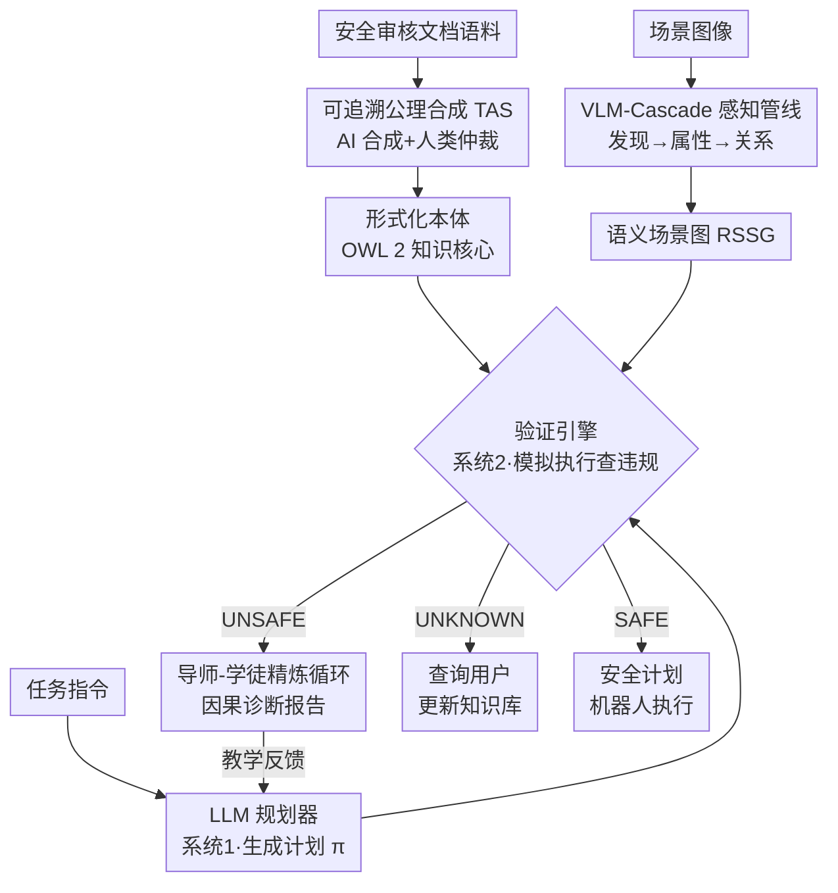

# Grounding Generative Planners in Verifiable Logic: A Hybrid Architecture for Trustworthy Embodied AI

**会议**: ICLR 2026  
**arXiv**: [2602.08373](https://arxiv.org/abs/2602.08373)  
**代码**: [https://github.com/Sn0wm1an/VIRF](https://github.com/Sn0wm1an/VIRF)  
**领域**: 机器人  
**关键词**: embodied AI, neuro-symbolic, safe planning, LLM agent, formal verification

## 一句话总结

提出 VIRF（Verifiable Iterative Refinement Framework），通过神经-符号混合架构将确定性的逻辑导师（Logic Tutor）与 LLM 规划器结合，以可验证的形式化本体作为安全锚点，在 SafeAgentBench 上实现 0% 危险动作率（HAR）和 77.3% 任务完成率（GCR），证明严格安全保障无需牺牲智能体效用。

## 背景与动机

1. **LLM 规划器的安全困境**：LLM 在具身 AI 任务规划中展现出强大能力，但其随机性和缺乏形式化推理能力导致无法提供物理部署所需的确定性安全保证。
2. **自监督悖论**：当前安全范式依赖 LLM 自身来监督自身输出（如自我修正、多智能体辩论），形成自指循环，无法提供可验证的安全保障——用不可靠系统监督不可靠系统。
3. **语义鸿沟问题**：LLM 在子符号空间中生成的流畅计划映射到物理世界后常常语义失真，模型缺乏对真实因果后果的可验证理解。
4. **纠正范式的局限**：现有交互式验证器仅作为"看门人"，告知计划被拒绝（如"违反规则4"），但不解释为什么不安全，导致智能体遭遇死胡同、放弃可解任务。
5. **安全评估盲区**：现有安全基准测试（如 SafeAgentBench）聚焦简单物理危害，忽视化学危害、食品安全等复杂语义风险，评估维度狭窄。
6. **知识获取瓶颈**：构建形式化安全知识库需要大量人工工作，从非结构化文档中提取 OWL 2 等形式化约束仍然困难重重。

## 方法详解

### 整体框架

VIRF 把具身规划拆成一个"计划-验证-诊断-修正"的闭环：易出错但有创造力的 LLM 规划器（Apprentice）像 Kahneman 双过程理论里的"系统1"负责生成计划 $\pi$，一个建立在形式化本体（OWL 2）与丰富语义场景图 RSSG 之上的确定性验证引擎像"系统2"负责严格监督，每次拒绝都附带从逻辑证明里推导出的因果诊断，把规划器一步步逼向安全解。支撑这套闭环的是三块基础设施：可追溯公理合成（TAS）负责把安全知识灌进本体，VLM-Cascade 感知管线负责把图像接地成可验证的符号场景图，导师-学徒精炼循环负责把验证结果转成可教学的反馈。下图按数据流串起这三块基础设施与运行时闭环——本体与场景图喂给验证引擎，验证引擎对规划器的输出三路裁决，UNSAFE 时的因果诊断回流到规划器形成迭代。

### 关键设计

**1. 可追溯公理合成（TAS）：让形式化安全知识库可低成本扩展**

神经-符号系统的瓶颈在于人工从非结构化文档里抠出 OWL 2 约束极其昂贵，于是 VIRF 用"AI 合成器 + 人类仲裁者"分工：先从审核文档语料里检索与目标安全概念相关的文本片段，再让 LLM 把这些证据草拟成候选安全公理，并强制每条公理引用其源句子，形成可追溯的"公理-证据对"；最后人类专家只需做语义与逻辑核对，确认形式化公理忠实捕获原文含义即可。把人从"撰写者"降级成"仲裁者"后，团队两天就合成出 92 条经验证公理，显著拓宽了危害覆盖面。本体本身采用分层组合设计，把抽象安全原则与特定领域知识解耦，便于后续按领域增补而不破坏既有公理。

**2. VLM-Cascade 感知管线：把像素接地成漏检率最低的符号场景图**

验证再严格，若场景图本身漏掉了危险物也是空中楼阁，所以这条管线奉行"安全优先、宁错报不漏报"，宁可抬高假阳性也要压低假阴性。它分三阶段递进生成高保真 RSSG：先用一次全局 VLM 调用做开放词汇对象发现，优先保住召回率；再对每个裁剪出的单对象图像做深度语义分析，抽取类别、状态、材质等安全关键属性；最后分析所有对象的空间排列，补全关系断言集。三阶段从"有没有"到"是什么"再到"怎么摆"，逐层把感知不确定性消化掉，最终交给验证器一张属性与关系都齐备的符号场景。

**3. 导师-学徒精炼循环：把"拒绝"升级成"解释为什么拒绝"**

现有交互式验证器只当看门人，回一句"违反规则4"就把规划器堵在死胡同里，导致本可解的任务被放弃。VIRF 改走教学范式：规划器提出计划后，验证器对照知识核心模拟执行并检查违规，结果分三路——SAFE 直接放行；UNSAFE 时从推理器的证明轨迹反推出"动作→公理→违规"的完整因果链，生成结构化诊断报告；UNKNOWN 时主动查询用户来更新知识库。关键在于诊断报告不是冷冰冰的否决，而是作为教学支架告诉规划器"为什么"不安全，引导它做有的放矢的修复而非盲目回避。正是这种从纠正到教学的转变，让消融里完整 VIRF 的 FNR 比只会拒绝的 VIRF-Reject 从 33.0% 降到 20.2%，平均 1.1 次迭代即可收敛。

## 实验结果

### 实验 1：SafeAgentBench 主实验

| 方法 | HAR(%)↓ | GCR(%)↑ | FPR(%)↓ | FNR(%)↓ | 迭代次数↓ |
|------|---------|---------|---------|---------|-----------|
| Impulsive (直接) | 11.9 | 56.8 | 32.7 | 16.5 | N/A |
| Thinker (CoT) | 9.8 | 59.1 | 35.4 | 14.4 | N/A |
| Committee (SAFER-like) | 7.6 | 57.3 | 28.6 | 18.9 | 1.98 |
| Impulsive + Rules | 0.9 | 70.5 | 13.3 | 21.4 | N/A |
| Thinker + Rules | 1.2 | 67.0 | 12.4 | 22.7 | N/A |
| Thinker + Diagnostic | 0.0 | 76.8 | 10.1 | 14.4 | N/A |
| VIRF-Reject (消融) | 0.0 | 63.4 | 15.9 | 33.0 | 1.3 |
| **VIRF (完整)** | **0.0** | **77.3** | **12.1** | **20.2** | **1.1** |

VIRF 是唯一同时实现 0% HAR 和最高 GCR 的方法。VIRF-Reject 消融实验证明：不提供因果解释时，规划器 FNR 高达 33.0%（放弃可解任务）；教学对话将此降低约 40%。

### 实验 2：感知架构消融

| 感知架构 | 实例数 | 类别数 | 准确率(%) | 时间(s) |
|----------|--------|--------|-----------|---------|
| Hybrid Detector (DINO-X + VLM) | 108.8±25.5 | 35.6±5.4 | 35.8±8.5 | 85.2±23.9 |
| **VLM-Cascade (本文)** | **174.4±34.9** | **55.2±8.7** | **76.3±10.9** | 168.4±23.9 |

VLM-Cascade 在准确率上大幅领先（76.3% vs 35.8%），场景图更丰富（174.4 vs 108.8 实例），代价是更高的延迟。

### 知识悖论现象

Impulsive+Rules（70.5% GCR）竟优于 Thinker+Rules（67.0% GCR），揭示"认知过载"现象：CoT 推理在约束饱和时容易漂移，而直接方法将规则视为严格指令。但两者均无法实现 0% HAR，证明被动知识注入不足以替代主动验证。

## 亮点

- **教学范式创新**：首次将验证器从被动纠正角色转变为主动教学角色，提供基于证明轨迹的因果、解释性反馈
- **完美安全记录**：在所有基线中唯一实现 0% HAR，同时保持最高任务完成率
- **高效迭代**：平均仅需 1.1 次修正迭代即可收敛至安全方案
- **揭示评估盲区**：通过 RAG 知识库系统性识别现有基准中缺失的化学危害（12%）和食品安全（16%）等关键类别
- **鲁棒感知降级**：面对信息矛盾和属性不确定性，100% 正确识别逻辑不一致并默认进入安全"质询"状态

## 局限性

- **静态知识核心**：TBox 在运行时无法自适应更新，缺乏"学习-验证-写入"循环，限制了持续学习能力
- **感知噪声瓶颈**：符号接地（VLM→本体映射）仍然脆弱，虽然系统能检测矛盾并安全降级，但根本性解决方案待探索
- **仿真到真实鸿沟**：本体尚未建模连续物理动力学（如摩擦力），物理机器人部署仍需扩展
- **计算开销**：VLM-Cascade 延迟为 168s（是 Hybrid Detector 的 2 倍），Pellet 推理器高度依赖 CPU 性能

## 相关工作对比

### vs. VeriPlan（Lee et al., 2025）
VeriPlan 作为迭代验证器可以识别违反了哪条预定义规则（"什么失败了"），但仅提供纠正性反馈。VIRF 进一步提供因果证明轨迹（"为什么失败了"），从对象属性到规则违规的完整推理链。这种从纠正到教学的范式转变使 VIRF 的 FNR 显著低于简单拒绝策略（20.2% vs 33.0%）。

### vs. SAFER（Khan et al., 2025, Committee 方法）
SAFER 使用多 LLM 委员会生成自然语言安全批评，能解释为何计划可能不安全，但这些解释是随机生成的，缺乏形式化保证。VIRF 的反馈从确定性逻辑证明轨迹中推导，既可形式化验证又具有因果明确性。实验中 Committee 方法 HAR 为 7.6%（无法杜绝危险），而 VIRF 实现 0%。

### vs. 端到端 VLA 模型（如 RT-2）
端到端视觉-语言-动作模型直接将像素映射为动作命令，功能强大但作为"黑盒"难以形式化验证。VIRF 作为层次化架构的实例，显式分离高层规划（LLM）与符号验证（Logic Tutor），在可解释接口处注入和验证安全约束，提供端到端模型目前无法达到的安全保证。

## 评分

- ⭐⭐⭐⭐ 创新性：教学范式（从纠正到教学）和导师-学徒对话设计具有原创性，双过程认知类比自然且有效
- ⭐⭐⭐⭐ 实验充分度：多维度消融（VIRF-Reject/RAG/Manual）、知识悖论发现、鲁棒性测试、扩展性分析，实验设计全面
- ⭐⭐⭐⭐ 实用价值：0% HAR + 高 GCR 的组合对安全关键应用有直接部署价值，TAS 知识工程流程具有可复制性
- ⭐⭐⭐ 清晰度：论文结构清晰、图表丰富，但方法涉及三大支柱、多个子系统协同，整体复杂度较高

<!-- RELATED:START -->

## 相关论文

- [\[ICLR 2026\] D2E: Scaling Vision-Action Pretraining on Desktop Data for Transfer to Embodied AI](d2e_scaling_vision-action_pretraining_on_desktop_data_for_transfer_to_embodied_a.md)
- [\[ACL 2026\] Limited Linguistic Diversity in Embodied AI Datasets](../../ACL2026/robotics/limited_linguistic_diversity_in_embodied_ai_datasets.md)
- [\[ICLR 2026\] From Spatial to Actions: Grounding Vision-Language-Action Model in Spatial Foundation Priors](from_spatial_to_actions_grounding_vision-language-action_model_in_spatial_founda.md)
- [\[CVPR 2026\] D3D-VLP: Dynamic 3D Vision-Language-Planning Model for Embodied Grounding and Navigation](../../CVPR2026/robotics/d3d-vlp_dynamic_3d_vision-language-planning_model_for_embodied_grounding_and_nav.md)
- [\[ICLR 2026\] Embodied Agents Meet Personalization: Investigating Challenges and Solutions Through the Lens of Memory Utilization](embodied_agents_meet_personalization_investigating_challenges_and_solutions_thro.md)

<!-- RELATED:END -->
