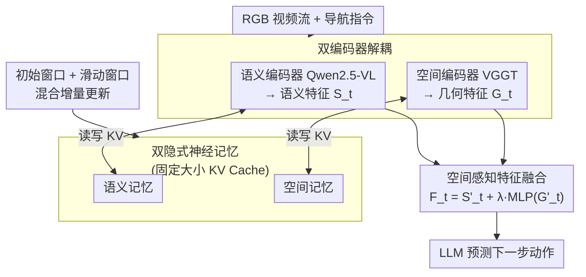

# JanusVLN: Decoupling Semantics and Spatiality with Dual Implicit Memory for Vision-Language Navigation

**会议**: ICLR2026  
**arXiv**: [2509.22548](https://arxiv.org/abs/2509.22548)  
**代码**: [项目主页](https://miv-xjtu.github.io/JanusVLN.github.io/)  
**领域**: 机器人  
**关键词**: Vision-Language Navigation, Dual Implicit Memory, Spatial-Geometric Encoding, KV Cache, Embodied AI  

## 一句话总结
受人类左脑语义理解、右脑空间认知的启发，提出 JanusVLN——首个为 VLN 设计的双隐式神经记忆框架，将空间几何记忆和视觉语义记忆分别建模为固定大小的 KV Cache，仅凭 RGB 视频即可实现高效空间推理，在 VLN-CE 基准上取得 SOTA。

## 背景与动机
视觉-语言导航（VLN）要求智能体根据自然语言指令在未见环境中导航。近年来，基于多模态大语言模型（MLLM）的方法迅速兴起，但它们普遍存在三大瓶颈：

1. **显式语义记忆的局限**：一类方法（MapNav 等）用文本描述构建认知地图，但纯文本难以精确传达空间关系，导致关键的视觉、几何和上下文信息丢失；另一类方法（NaVILA、StreamVLN 等）存储历史观测帧，每步决策都需重新处理全部历史，计算冗余严重。
2. **记忆膨胀**：两类方法的显式记忆都随导航时间指数增长，使模型难以从海量碎片化记忆中提取关键信息。
3. **2D 编码器的空间盲区**：现有 VLN 模型的视觉编码器几乎全部继承 CLIP 的 2D 图文对预训练范式，擅长捕捉高层语义但缺乏对 3D 几何结构和空间信息的理解，而导航本质上是 3D 物理交互。

## 核心问题
如何在仅使用 RGB 视频输入的条件下，同时解决 VLN 中 (1) 空间信息丢失、(2) 计算冗余、(3) 记忆膨胀三大问题？

## 方法详解

### 整体框架
JanusVLN 模仿人脑左右半球分工，用两条独立编码路径处理同一段 RGB 视频：一路由 Qwen2.5-VL 的视觉编码器抽取语义特征 $S_t$，一路由 VGGT 抽取 3D 空间几何特征 $G_t$，两者各自维护一份固定大小的隐式 KV Cache 作为历史记忆，再融合成统一特征 $F_t$ 交给 LLM 预测下一步动作。整个流程只吃单目 RGB，不需要深度图、点云或里程计。

### 关键设计

**1. 双编码器解耦：让语义和空间各司其职**

VLN 的视觉编码器几乎都继承 CLIP 式的 2D 图文对预训练，强于高层语义却对 3D 几何近乎失明，而导航本质是 3D 物理交互。JanusVLN 不去改造单个编码器，而是直接保留 Qwen2.5-VL 的语义编码器提取 $S_t$，并行接入 VGGT（Visual Geometry Grounded Transformer）——一个在像素-3D 点云对上预训练的前馈式几何基础模型——从纯 RGB 视频中提取空间几何特征 $G_t$。VGGT 自带的 3D 几何先验恰好补上语义路径的空间盲区，两路信息互补而非冗余，这一点在消融里得到验证：换成 DINOv2 或 SigLIP 2 这类 2D 编码器几乎没有增益（SR 47.5/47.9 vs 去掉空间记忆的 47.0），因为它们和 Qwen2.5-VL 提供的信息高度重叠；用随机初始化的 VGGT 也无效（SR 47.2），说明优势来自几何先验本身而非参数量。

**2. 双隐式神经记忆：用固定大小 KV Cache 替代膨胀的显式记忆**

现有方法要么把历史写成文本认知地图（空间关系被语言压扁、信息丢失），要么存储原始历史帧（每步决策都要重处理全部历史、计算冗余，且记忆随时间无限膨胀）。JanusVLN 把两路的历史都建模为隐式神经表示——即缓存经 Transformer 注意力模块深度处理后的历史 KV 对。这些 KV 不是原始像素的堆叠，而是网络提炼出的高层抽象，因此处理新帧 $x_t$ 时只需让它的图像 token 与记忆做一次交叉注意力即可检索历史，无需回放旧帧：$G_t = \text{Decoder}(\text{CrossAttn}(\text{Encoder}(x_t), \{M_{initial}, M_{sliding}\}))$。记忆容量被钉死成固定大小，从根上消除了显式记忆的膨胀问题——去掉双隐式记忆后 SR 从 52.8 暴跌到 24.8，单独去掉空间或语义记忆也分别掉到 47.0、45.5，证明两份记忆缺一不可。

**3. 初始窗口 + 滑动窗口的混合增量更新：兼顾全局锚点与近期上下文**

固定大小的记忆该装哪些帧？JanusVLN 用两段拼接：滑动窗口队列 $M_{sliding}$（容量 $n$）以 FIFO 方式保留最近 $n$ 帧的 KV Cache，让模型聚焦当下；初始窗口 $M_{initial}$ 永久保留导航最初几帧的 KV Cache，借助 "Attention Sinks" 现象（首帧持续吸附高注意力权重）充当贯穿全程的全局锚点。这样推理时间只随新增帧线性增长，而非随历史长度爆炸。直接复用 VGGT 重算全序列时 32 帧要 1549 ms，改用 KV 缓存后只要 149 ms，开销降了约 90%，SR 反而从 51.2 微升到 51.7。实现上初始窗口取 8 帧、滑动窗口取 48 帧。

**4. 空间感知特征融合：以语义为主、几何为辅的加权相加**

拿到对齐形状后的语义特征 $S'_t$ 和空间几何特征 $G'_t$（后者经 spatial merging 对齐），JanusVLN 用一个轻量两层 MLP 投影几何特征再加到语义特征上：$F_t = S'_t + \lambda \cdot \text{MLP}(G'_t)$，其中权重 $\lambda = 0.2$。之所以让几何只占小份额而非平权融合，是因为语义路径仍是导航决策的主干，几何信息只是注入空间约束的补充；融合后的 $F_t$ 与指令文本 embedding 一起送入 LLM 输出动作。

### 损失函数 / 训练策略
基座为 Qwen2.5-VL 7B 配 VGGT，双编码器全程冻结，只微调 LLM 和投影层（学习率分别 2e-5 与 1e-5），从而把 VGGT 的几何先验和 Qwen2.5-VL 的语义能力当作稳定的预训练知识保留下来。训练数据在标准 VLN-CE 之外补充了 ScaleVLN 子集的 155K 轨迹和 DAgger 在线采集的 14K 轨迹。

## 实验关键数据

### R2R-CE Val-Unseen（核心指标 SR / SPL）

| 方法 | 输入 | SR↑ | SPL↑ |
|------|------|-----|------|
| NaVILA | RGB | 54.0 | 49.0 |
| StreamVLN | RGB | 56.9 | 51.9 |
| **JanusVLN** | **RGB** | **60.5** | **56.8** |
| JanusVLN*（无额外数据）| RGB | 52.8 | 49.2 |

- 相比使用全景视图+里程计+深度的多输入方法，仅用单 RGB 就提升 SR 10.5-35.5
- 相比使用深度数据的 g3D-LF 和 NaVid-4D，SR 提升 12.6-16.7
- 无额外数据的 JanusVLN* 在 SPL 上仍超过依赖额外数据的方法 3.7-18.8

### RxR-CE Val-Unseen

| 方法 | SR↑ | SPL↑ | nDTW↑ |
|------|-----|------|-------|
| NaVILA | 49.3 | 44.0 | 58.8 |
| StreamVLN | 52.9 | 46.0 | 61.9 |
| **JanusVLN** | **56.2** | **47.5** | **62.1** |

### 消融实验（R2R-CE，无额外数据）

| 配置 | SR↑ | SPL↑ |
|------|-----|------|
| JanusVLN 完整 | 52.8 | 49.2 |
| 去除空间隐式记忆 | 47.0 | 40.9 |
| 去除语义隐式记忆 | 45.5 | 40.0 |
| 去除双隐式记忆 | 24.8 | 16.8 |

- 用 DINOv2 或 SigLIP 2 替换 VGGT 仅有微弱提升（SR 47.5/47.9 vs 47.0），因为 2D 预训练编码器与 Qwen2.5-VL 提供的信息高度冗余
- 随机初始化的 VGGT 无明显增益（SR 47.2），证明优势来自 3D 几何先验而非参数量增加

### 推理效率

| 记忆方式 | 32帧推理时间 | SR↑ |
|---------|-------------|-----|
| VGGT 原始（需重算全序列）| 1549 ms | 51.2 |
| Cached Memory（KV缓存）| 149 ms | 51.7 |

KV 缓存方式推理开销降低 69%-90%，同时性能还略有提升。

## 亮点
1. **范式创新**：首次将双隐式神经记忆引入 VLN，用固定大小 KV Cache 替代膨胀式显式记忆，是一种全新的记忆范式
2. **巧妙的 3D 先验引入**：通过 VGGT 从纯 RGB 视频中提取 3D 空间几何信息，无需任何额外 3D 传感器或数据，却大幅提升空间推理能力
3. **高效增量更新**：初始窗口 + 滑动窗口的混合策略既保留全局锚点又聚焦近期上下文，推理时间仅随帧数线性增长
4. **消融设计严谨**：通过替换不同编码器（DINOv2/SigLIP 2/随机 VGGT）有力证明性能提升来自 3D 几何先验而非模型容量

## 局限与展望
1. 滑动窗口大小（48帧）是固定超参数，对不同复杂度的导航任务可能不是最优的，自适应窗口调整值得探索
2. 空间几何特征权重 $\lambda = 0.2$ 在所有场景中固定，动态调节机制可能进一步提升性能
3. VGGT 编码器完全冻结，端到端微调或部分微调空间编码器可能释放更多潜力
4. 仅在 Matterport3D 场景的 VLN-CE 上验证，在更大规模真实环境中的泛化性有待进一步考察
5. 真实世界实验仅展示定性结果，缺少系统性的定量评估

## 与相关工作的对比
- **vs MapNav**（文本认知地图）：JanusVLN 用隐式 KV Cache 替代显式文本描述，避免空间信息丢失和描述冗余，SR 提升 20.8
- **vs NaVILA/StreamVLN**（历史帧存储）：无需每步重处理全部历史帧，推理效率大幅提升，SR 提升 3.6-10.8
- **vs g3D-LF / NaVid-4D**（需深度数据）：仅用 RGB 即超越使用深度输入的方法，SR 提升 12.6-16.7，消除了对昂贵 3D 传感器的依赖
- **vs Uni-NaVid / NaVid**（RGB-only 基线）：在相同输入条件下大幅领先，验证了双隐式记忆范式的有效性

## 启发与关联
- 左右脑分工的认知科学类比为多编码器架构设计提供了清晰的设计哲学，可推广到其他需要同时感知语义和空间的具身任务
- Attention Sinks 现象（初始帧持续获得高注意力权重）在导航场景中的验证，为 LLM 长序列推理中的 KV Cache 管理提供了支撑证据
- VGGT 作为桥梁使 2D MLLM 获得 3D 感知能力的方案，可迁移到机器人操控、自动驾驶等其他 3D 交互任务

## 评分
- 新颖性: ⭐⭐⭐⭐⭐ （双隐式记忆范式在 VLN 领域首创，3D 先验引入方式巧妙）
- 实验充分度: ⭐⭐⭐⭐ （消融全面，但真实世界实验偏定性）
- 写作质量: ⭐⭐⭐⭐⭐ （结构清晰，类比直观，图表丰富）
- 价值: ⭐⭐⭐⭐⭐ （开创新范式，SOTA 显著，对后续 VLN 研究方向有引领作用）

<!-- RELATED:START -->

## 相关论文

- [\[CVPR 2026\] DecoVLN: Decoupling Observation, Reasoning, and Correction for Vision-and-Language Navigation](../../CVPR2026/robotics/decovln_decoupling_observation_reasoning_and_correction_for_vision-and-language_.md)
- [\[ECCV 2024\] DISCO: Embodied Navigation and Interaction via Differentiable Scene Semantics and Dual-Level Control](../../ECCV2024/robotics/disco_embodied_navigation_and_interaction_via_differentiable_scene_semantics_and.md)
- [\[CVPR 2026\] Global Prior Meets Local Consistency: Dual-Memory Augmented Vision-Language-Action Model for Efficient Robotic Manipulation](../../CVPR2026/robotics/global_prior_meets_local_consistency_dual-memory_augmented_vision-language-actio.md)
- [\[ICLR 2026\] MemoryVLA: Perceptual-Cognitive Memory in Vision-Language-Action Models for Robotic Manipulation](memoryvla_perceptual-cognitive_memory_in_vision-language-action_models_for_robot.md)
- [\[ICML 2026\] Spatial Memory for Out-of-Vision Manipulation in Vision-Language-Action](../../ICML2026/robotics/spatial_memory_for_out-of-vision_manipulation_in_vision-language-action.md)

<!-- RELATED:END -->
