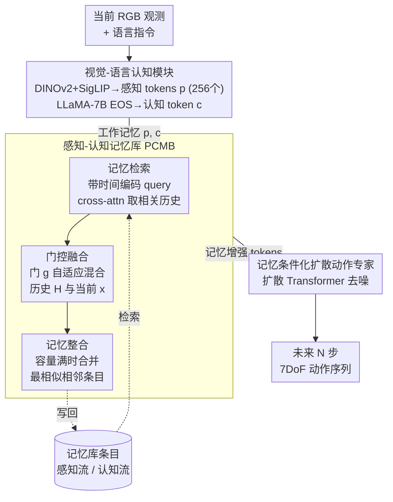

# MemoryVLA: Perceptual-Cognitive Memory in Vision-Language-Action Models for Robotic Manipulation

**会议**: ICLR 2026  
**arXiv**: [2508.19236](https://arxiv.org/abs/2508.19236)  
**代码**: [项目页面](https://shihao1895.github.io/MemoryVLA)  
**领域**: 机器人/VLA  
**关键词**: VLA, 记忆机制, 长时序操作, 扩散策略, 认知科学

## 一句话总结
受认知科学双重记忆系统启发，提出MemoryVLA框架，在VLA模型中引入感知-认知记忆库（PCMB），通过记忆检索、门控融合和整合机制捕捉长时序依赖，在SimplerEnv/LIBERO/真实世界150+任务上全面超越CogACT和π₀。

## 研究背景与动机

**领域现状**：VLA模型（OpenVLA、π₀、CogACT）在机器人操作中取得显著进展，但主流方法仅依赖当前观测，忽略时序依赖——在长时序任务上表现差。如Push Buttons任务中，按压前后视觉几乎无差异，无法判断动作是否完成。

**现有痛点**：(1) 拼接多帧→自注意力二次复杂度+与单帧预训练分布不匹配；(2) RoboFlamingo用LSTM压缩→丢失细粒度信息；(3) TraceVLA画轨迹→丢失语义细节；(4) UniVLA加过去动作→只是CoT不是真正的记忆利用。

**核心矛盾**：机器人操作本质是非马尔可夫的（过去动作影响未来决策），但当前VLA模型是马尔可夫的（只看当前帧）。

**切入角度**：认知科学中人类通过工作记忆（短期）+情景记忆（长期，含verbatim细节和gist语义）来处理操作任务。据此设计PCMB存储感知细节和认知语义两个层次的记忆。

## 方法详解

### 整体框架
MemoryVLA 要解决的是「VLA 只看当前帧、做不好长时序任务」这一短板，它的设计直接对应认知科学里人脑的双重记忆系统——用工作记忆做即时控制、用海马体式的情景记忆保存历史。整体是一条「认知-记忆-动作（Cognition-Memory-Action）」流水线，每来一帧都走三段：先用一个 7B 视觉-语言认知模块把当前 RGB + 语言指令编码成两类工作记忆——保留视觉细节的**感知 tokens** $p$ 和压缩高层语义的**认知 token** $c$；接着这份工作记忆去查一个持续累积的感知-认知记忆库（PCMB），检索相关历史、与当前信息门控融合，并把融合结果写回库里、容量满时做整合；最后把记忆增强后的 tokens 作为条件喂给一个扩散动作专家，生成未来 N 步的 7DoF 动作序列。整条链路端到端训练，关键在于中间这块 PCMB——它让模型从「马尔可夫地只看当前」变成「非马尔可夫地参考历史」。

### 关键设计

**1. 视觉-语言认知模块：把当前帧拆成「细节」和「语义」两套表示**

记忆要存什么、检索什么，前提是先把当前观测编码成合适的粒度。这里并行用 DINOv2 + SigLIP 做视觉编码、把两者特征拼成原始视觉 tokens，再经一个 SE 瓶颈（squeeze-and-excitation）压缩成 256 个感知 tokens $p$，保留细粒度的空间视觉信息；同时把视觉特征和语言指令一起送进 LLaMA-7B，取句末 EOS 位置的输出作为单个认知 token $c$，编码任务级的高层语义理解。$p$ 和 $c$ 合起来就是当前帧的工作记忆。之所以分两套，是因为长时序任务对历史的需求是分层的——有时需要回看像素级细节（物体到底动没动），有时只需要回看语义状态（这一步该不该算完成），后续的记忆库正是按这两个流分别存取。

**2. 感知-认知记忆库（PCMB）：用检索-融合-整合三步实现真正的时序记忆**

这是全文的核心，针对的痛点是前人那些「拼多帧 / LSTM 压缩 / 画轨迹」要么算力炸、要么丢信息、要么不是真正的记忆利用。PCMB 把工作记忆按时间不断写入一个有限容量的库，并通过检索、融合、整合三步让当前决策真正用上历史。**检索**阶段把当前 tokens 加上时间位置编码作为 query，对 PCMB 做 cross-attention，取出与当前决策相关的历史感知/认知信息 $H^p, H^c$——不是平均所有历史，而是按需取相关的那部分。检索到的历史不能无脑覆盖当前，于是**融合**阶段用一个学到的门控自适应混合：

$$\tilde{x} = g^x \odot H^x + (1-g^x) \odot x, \qquad g^x = \sigma(\text{MLP}(\text{concat}[x, H^x]))$$

门 $g^x$ 由当前信息 $x$ 和检索历史 $H^x$ 共同决定，因此简单任务时 $g$ 偏小、主要用当前观测，复杂的长时序任务时 $g$ 偏大、更多依赖历史。融合后的 tokens 写回库里；当库容量满时，**整合**阶段不简单丢弃最旧的（FIFO 会误删关键帧），而是计算相邻条目的相似度、把最相似的一对合并——相邻且相似往往意味着冗余，合并它们能在控制库大小的同时保住关键的非冗余历史。

**3. 记忆条件化扩散动作专家：让动作生成同时感知历史**

有了记忆增强的感知 + 认知 tokens，最后一步是把它们作为条件，用扩散 Transformer 去噪生成未来 N 步的 7DoF 动作（认知 token 做主条件，感知 tokens 补充细粒度细节）。选扩散而非回归，是因为机器人动作分布天然多模态（同一状态可有多条合理轨迹）；而把记忆融合后的 tokens 作为条件，等于让原本只看当前的动作头也获得了时序感知——这正是它在 Push Buttons 这类「按压前后画面几乎无差异」的任务上能判断动作是否完成的关键。

### 损失函数 / 训练策略
整套框架端到端训练：7B VLM 先在 OXE 数据集上预训练；扩散动作专家用标准 DDPM 目标训练；感知侧用 SE-bottleneck 做压缩，认知侧取 EOS token 作为语义摘要。

## 实验关键数据

### 仿真主实验

| 基准 | MemoryVLA | CogACT | π₀ | 提升 |
|------|-----------|--------|-----|------|
| SimplerEnv-Bridge | **71.9%** | 57.3% | 低于 | **+14.6** |
| SimplerEnv-Fractal | **72.7%** | 68.1% | 低于 | +4.6 |
| LIBERO-5 | **96.5%** | 次优 | 次优 | 超越两者 |
| Mikasa-Robo | **41.2%** | — | 29.4% | **+11.8** |

### 真实世界实验（12任务）

| 任务类型 | MemoryVLA | CogACT | π₀ |
|---------|-----------|--------|-----|
| 通用技能(6任务) | **85%** | 76% | 低 |
| 长时序依赖(6任务) | **83%** | 57% | 低→**+26** |

### 关键发现
- 长时序任务提升最显著(+26 vs CogACT)→证明记忆机制对时序依赖至关重要
- 门控融合中 $g$ 的值随任务需要动态变化——简单任务主要用当前信息，复杂任务更多依赖历史
- 记忆整合通过合并相似邻居控制大小，比固定窗口或FIFO更高效
- 在OOD条件（不同背景/干扰物/光照/遮挡）下展现强鲁棒性

## 亮点与洞察
- **认知科学驱动的设计**：工作记忆+情景记忆的双重系统映射到感知tokens+认知token+PCMB。不是简单堆叠帧或LSTM，而是有认知理论支撑的记忆架构。
- **感知vs认知的分离**：感知tokens(256个)保留空间细节，认知token(1个)压缩高层语义。PCMB分两个流存储和检索→不同任务需要不同层次的历史信息。
- **+26在长时序任务上**：这个提升量说明记忆不是锦上添花而是必要条件——没有记忆的VLA在需要时序理解的任务上根本做不好。

## 局限与展望
- 7B VLM推理开销大——实时性受限
- PCMB容量L需要手动设置——自适应容量管理值得探索
- 余弦相似度做整合可能不够精细——更复杂的记忆选择策略可能更好
- 仅用第三人称RGB——多视角+触觉等多模态记忆未探索

## 相关工作与启发
- **vs π₀**: π₀无记忆机制，在长时序任务上差距巨大；MemoryVLA的PCMB填补了这个空白
- **vs CogACT**: CogACT也用扩散动作头但无时序建模，MemoryVLA加了记忆后全面超越
- **vs RoboFlamingo**: RoboFlamingo用LSTM粗粒度记忆，MemoryVLA的双流记忆更细致

## 评分
- 新颖性: ⭐⭐⭐⭐⭐ 认知科学启发的双流记忆架构在VLA中首次出现
- 实验充分度: ⭐⭐⭐⭐⭐ 3个机器人、150+任务(仿真+真实)、多baseline、OOD测试
- 写作质量: ⭐⭐⭐⭐ 认知科学动机清晰，架构图直观
- 价值: ⭐⭐⭐⭐⭐ 解决了VLA领域的关键缺失（时序记忆），实验效果convincing

<!-- RELATED:START -->

## 相关论文

- [\[ICML 2026\] Spatial Memory for Out-of-Vision Manipulation in Vision-Language-Action](../../ICML2026/robotics/spatial_memory_for_out-of-vision_manipulation_in_vision-language-action.md)
- [\[ICLR 2026\] TwinVLA: Data-Efficient Bimanual Manipulation with Twin Single-Arm Vision-Language-Action Models](twinvla_data-efficient_bimanual_manipulation_with_twin_single-arm_vision-languag.md)
- [\[ICLR 2026\] ST4VLA: Spatially Guided Training for Vision-Language-Action Models](st4vla_spatially_guided_training_for_vision-language-action_models.md)
- [\[CVPR 2026\] Global Prior Meets Local Consistency: Dual-Memory Augmented Vision-Language-Action Model for Efficient Robotic Manipulation](../../CVPR2026/robotics/global_prior_meets_local_consistency_dual-memory_augmented_vision-language-actio.md)
- [\[CVPR 2026\] ActiveVLA: Injecting Active Perception into Vision-Language-Action Models for Precise 3D Robotic Manipulation](../../CVPR2026/robotics/activevla_injecting_active_perception_into_vision-language-action_models_for_pre.md)

<!-- RELATED:END -->
