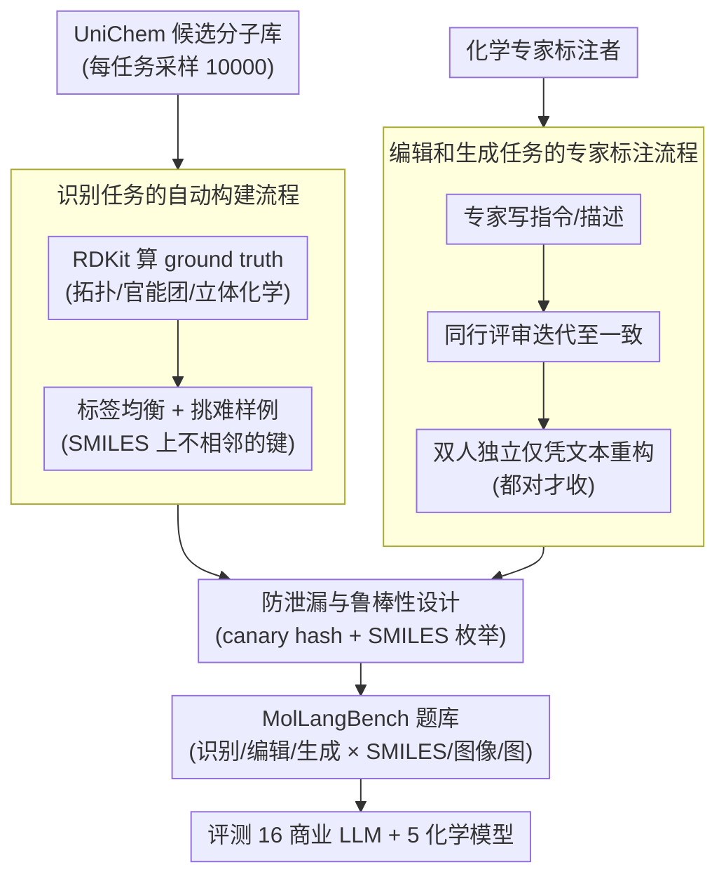

# MolLangBench: A Comprehensive Benchmark for Language-Prompted Molecular Structure Recognition, Editing, and Generation

**会议**: ICLR 2026  
**arXiv**: [2505.15054](https://arxiv.org/abs/2505.15054)  
**代码**: [GitHub](https://github.com/TheLuoFengLab/MolLangBench) / [HuggingFace](https://huggingface.co/datasets/ChemFM/MolLangBench)  
**领域**: AI for Chemistry  
**关键词**: molecular recognition, molecule editing, molecule generation, molecule-language alignment, benchmark

## 一句话总结

提出 MolLangBench 基准，通过自动化工具和专家标注构建高质量、无歧义的分子-语言接口评估数据集，覆盖识别/编辑/生成三类任务和 SMILES/图像/图三种模态，评估 16+ 个商业 LLM 和 5 个化学模型，揭示即使 GPT-5 在基础分子操作上仍显著不足（生成仅 43%）。

## 研究背景与动机

**领域现状**：近年大量工作尝试将分子与语言对齐（molecule-language alignment），但这些方法通常直接针对下游数学任务（如性质预测、反应预测），跳过了结构层面的基础能力。类比视觉-语言建模的成功——VLM 将文本与视觉可观察内容对齐，而当前分子-语言模型试图将符号化分子结构与不可观察的化学性质对齐，这一 mismatch 使得对齐更加困难。**现有痛点**：(1) 缺乏系统评估 AI 在分子结构基础操作（识别、编辑、生成）上的能力的基准；(2) 现有分子基准多关注高级任务（药物设计、性质预测），忽视了前提条件——模型是否真正"理解"分子结构；(3) 现有数据集质量不一，可能存在歧义和不确定性。**核心矛盾**：如果 AI 连基本的分子结构识别和操作都做不好，更复杂的化学推理任务（药物发现、材料设计）也难以信赖。化学家的工作流始终以结构理解为起点。**本文目标** 提供首个系统化、高质量的基础分子-语言能力评估工具。**切入角度**：从化学家实际工作流出发——先识别结构、再操作结构、再生成结构——三层递进任务设计。**核心 idea**：用确定性、无歧义的高质量数据评估 AI 的分子结构基础能力，暴露当前模型缺陷。

## 方法详解

### 整体框架

MolLangBench 想回答一个被现有化学基准跳过的前提问题：AI 到底能不能稳定地识别、编辑、生成分子结构。它把这件事拆成三类难度递增的任务——分子结构识别（recognition，给定分子用自然语言回答结构问题：邻居原子、键类型、官能团、环结构、立体化学）、分子编辑（editing，按语言指令改结构）、分子生成（generation，仅凭文本描述从头生成分子），每类都支持 SMILES 字符串、分子图像（2D 结构图）、分子图三种表示。

基准真正的难点不在任务定义，而在怎么造出一份答案唯一、没有歧义的题。识别题靠 RDKit 自动算标准答案；编辑／生成题机器写不出，只能走化学专家三阶段标注；两条路造出的题再统一过一遍防泄漏与鲁棒性校验，最后用来评测 16 个商业 LLM 和 5 个化学模型。整体流程如下：

### 关键设计

**1. 识别任务的自动构建流程：用 RDKit 算 ground truth，把"答案是否唯一"这件事从人手里拿掉**

识别任务最怕的是答案有歧义——同一个结构问题不同标注者可能给不同回答，基准就失去了判分依据。MolLangBench 干脆不让人来定答案：所有识别问题（单跳邻居、键类型、官能团识别、环结构、立体化学等）的 ground truth 全部由 RDKit 自动计算，覆盖局部拓扑、功能基、立体化学三大类。这样每个问题都有唯一确定的标准答案，主观性无从进入。为了让题目真正有区分度，采样时从 10,000 个候选分子中做标签均衡采样，并刻意挑更难的样例——比如键所连接的两个原子在 SMILES 字符串里并不相邻的情况，逼模型真正理解结构而非靠字符邻近蒙对。

**2. 编辑和生成任务的专家标注流程：以"仅凭文本能否重构出分子"作为无歧义的最强验证**

编辑和生成没法用 RDKit 自动出题，因为它们要求的是高质量的语言指令／描述与分子结构之间的精确映射，这恰恰是机器写不出、必须靠化学专家的部分。团队设计了一条三阶段管线：先由有化学背景的标注者撰写指令或描述；再交给第二位标注者做同行评审，反复迭代修改直到双方达成一致；最后由两位独立验证者在只看文本、看不到原分子的前提下各自重构分子结构，只有当两人都重构正确时这条数据才被接受。最后一步是整个流程的核心判据——如果两个独立的人仅凭文本就能还原出同一个分子，就证明这段指令／描述确实无歧义。这条管线代价不菲，累计投入了超过 500 小时的专家标注和验证工作。

**3. 防泄漏与鲁棒性设计：堵住数据污染，再确认模型不是靠字符串巧合答对**

基准要可信，还得排除两类干扰：测试数据被模型在预训练里见过（泄漏），以及模型只对某种特定 SMILES 写法敏感（脆弱）。前者用唯一 hash 金丝雀字符串来检测——一旦模型输出里出现这串本不该见过的字符，就说明数据被泄漏。后者用 SMILES 枚举增强来检验：同一个分子从不同起始原子枚举出多种等价 SMILES 写法，再看模型表现是否稳定；结果在 5 种不同增强下编辑准确率为 $0.773\pm0.027$，方差很小，说明模型的能力是对结构的而非对某一种字符串拼法的。

### 损失函数 / 训练策略

MolLangBench 本身不训练模型。评估指标：识别和编辑任务用精确匹配准确率，生成任务用准确率（生成分子是否满足所有条件），辅以 Tanimoto 相似度（分子指纹）和 pass@k 指标。

## 实验关键数据

### 主实验

**16 个商业 LLM 评估结果**（SMILES 模态，核心测试集）：

| 模型 | 识别准确率 | 编辑(有效/相似/准确) | 生成(有效/相似/准确) |
|------|----------|-------------------|-------------------|
| GPT-5 | 0.862 | 0.960/0.923/**0.855** | 0.920/0.741/**0.430** |
| o3 | 0.918 | 0.945/0.903/0.785 | 0.670/0.546/0.290 |
| o4-mini | 0.872 | 0.930/0.885/0.740 | 0.820/0.651/0.350 |
| Gemini-2.5-Pro | 0.852 | 0.930/0.881/0.745 | 0.865/0.737/0.430 |
| Claude-Opus-4.1 | 0.814 | 0.950/0.884/0.705 | 0.920/0.725/0.330 |
| Llama-4-Maverick | 0.614 | 0.895/0.772/0.545 | 0.875/0.511/0.115 |
| Qwen3-Max | 0.486 | 0.690/0.561/0.360 | 0.465/0.104/0.000 |

### 消融实验

**化学专用模型 vs 通用 LLM**：

| 模型类型 | 识别 | 编辑准确率 | 生成准确率 |
|---------|------|----------|----------|
| ChemDFM-13B | 0.300 | 0.025 | 0.000 |
| Galactica-120B | 0.290 | 0.040 | 0.000 |
| HIGHT (图-语言) | 0.127 | 0.000 | 0.000 |
| GPT-4o (通用) | 0.593 | 0.525 | 0.115 |

**SMILES vs SELFIES 表示**（o3 模型）：

| 表示 | 识别 | 编辑准确率 | 生成准确率 |
|------|------|----------|----------|
| SMILES | 0.918 | 0.785 | 0.290 |
| SELFIES | 0.528 | 0.195 | 0.000 |

**pass@k 结果**（o3 模型）：

| 任务 | pass@1 | pass@3 | pass@5 |
|------|--------|--------|--------|
| 编辑(核心) | 0.785 | 0.856 | 0.900 |
| 生成(核心) | 0.290 | 0.485 | 0.545 |

### 关键发现

1. **生成任务极具挑战**：最强 GPT-5 仅 43.0%，pass@5 也仅 54.5%——当前 AI 从文本描述构建分子结构的能力严重不足
2. **o3 模型六类错误分析**：无效 SMILES 语法(11/66 编辑/生成)、立体化学错误(9/15)、链长错误(4/8)、取代基错位(13/42)、环结构错误(10/23)、多余/缺少基团(1/3)——BPE 分词导致的原子计数和枚举问题是根本原因之一
3. **SELFIES 远不如 SMILES**：相同 o3 模型，SELFIES 生成准确率为 0%——因 LLM 训练数据中 SELFIES 极少
4. **化学专用模型全面落后**：ChemDFM、Galactica 等远低于通用 GPT-4o，说明规模效应 > 领域知识
5. **结构理解促进下游推理**：GPT-4o 先描述结构再预测性质比直接预测提升约 5%（BBBP: 0.551→0.603, BACE: 0.583→0.632）

## 亮点与洞察

- **填补重要空白**：首个从化学家工作流出发、系统评估 AI 分子结构基础能力的全面基准
- **高质量数据构建**：500+ 小时专家标注、三阶段验证流程保证无歧义——这本身是核心贡献
- **揭示路径偏差**：当前分子-语言研究可能走错了方向——跳过结构理解直接做性质预测，类似于 VLM 不识别图像物体就做推理
- **配套训练数据**：MolLangData 提供大规模训练数据，形成完整生态

## 局限与展望

- 编辑/生成各 200 样本（核心集），规模偏小（但 500 小时人工成本限制了扩展）
- 分子限制为 < 40 重原子（覆盖 UniChem 93% 的分子），未涉及生物大分子
- 依赖 Mathpix API 将生成图像转回 SMILES 评估，引入额外错误源
- 评估以 OpenAI 模型为主，开源模型覆盖可更全面

## 相关工作与启发

- **vs MoleculeNet**: 关注性质预测，MolLangBench 关注语言-分子结构交互——不同层次
- **vs MolX/Uni-MRL**: 做性质预测和字幕标注，跳过了结构理解这一前提
- **类比 GPQA**: 仅 198 个样本的"钻石集"仍是 LLM 科学推理的标准基准；高质量 > 大规模
- **启发**：AI for Science 领域需要先测基础能力再测高级任务——化学领域的"GLUE moment"

## 评分

- 新颖性: ⭐⭐⭐⭐ 首个全面的分子-语言结构接口基准，问题定义清晰且契合真实化学工作流
- 实验充分度: ⭐⭐⭐⭐⭐ 16+ LLM + 5 化学模型 + 3 模态 + SELFIES + pass@k + 错误分析 + 下游性质实验，极其全面
- 写作质量: ⭐⭐⭐⭐ 结构清晰动机明确，论证充分
- 价值: ⭐⭐⭐⭐⭐ 为 AI 化学领域提供急需的标准化评估工具，可能改变该领域的研究重心

<!-- RELATED:START -->

## 相关论文

- [\[CVPR 2026\] Towards Training-Free Scene Text Editing](../../CVPR2026/robotics/towards_training-free_scene_text_editing.md)
- [\[CVPR 2026\] HTNav: A Hybrid Navigation Framework with Tiered Structure for Urban Aerial Vision-and-Language Navigation](../../CVPR2026/robotics/htnav_a_hybrid_navigation_framework_with_tiered_structure_for_urban_aerial_visio.md)
- [\[ICLR 2026\] RF-MatID: Dataset and Benchmark for Radio Frequency Material Identification](rf-matid_dataset_and_benchmark_for_radio_frequency_material_identification.md)
- [\[CVPR 2026\] LIBERO-Plus: A Progressive Robustness Benchmark for Visual-Language-Action Models](../../CVPR2026/robotics/libero-plus_a_progressive_robustness_benchmark_for_visual-language-action_models.md)
- [\[CVPR 2026\] DemoFunGrasp: Universal Dexterous Functional Grasping via Demonstration-Editing Reinforcement Learning](../../CVPR2026/robotics/demofungrasp_universal_dexterous_functional_grasping_via_demonstration-editing_r.md)

<!-- RELATED:END -->
