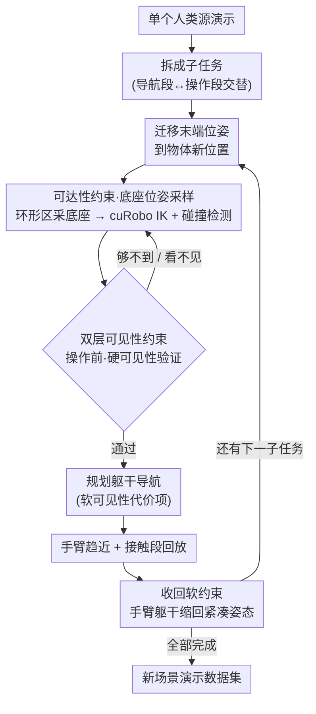

# MoMaGen: Generating Demonstrations under Soft and Hard Constraints for Multi-Step Bimanual Mobile Manipulation

**会议**: ICLR 2026  
**arXiv**: [2510.18316](https://arxiv.org/abs/2510.18316)  
**代码**: [项目页面](https://momagen.github.io)  
**领域**: 强化学习  
**关键词**: 移动操作, 双臂协调, 约束优化, 自动数据生成, 模仿学习

## 一句话总结

MoMaGen 将双臂移动操作的演示数据生成建模为约束优化问题，通过硬约束（可达性、无碰撞、可见性）和软约束（导航中物体可见性、收回紧凑姿态）的协同，从单个人类遥操作演示自动生成大规模多样化数据集，训练出的视觉运动策略仅用 40 个真实演示微调即可部署到实体机器人。

## 研究背景与动机

- **领域现状**: 从大规模人类遥操作数据学习（模仿学习）已被证明是训练机器人操作技能的有效范式。X-Gen 系列方法（MimicGen、SkillMimicGen、DexMimicGen 等）通过以少量人类演示为种子，在仿真中自动生成 25x~350x 的数据变体，大幅降低了数据采集成本。然而，这些方法主要针对固定基座的桌面操作任务。
- **现有痛点**: 双臂移动操作面临两个核心新挑战：(1) **可达性问题**——移动底座意味着在新场景中需要重新规划底座位置，直接重放源演示的导航段在物体位置变化后常导致手臂无法到达目标；(2) **可见性问题**——移动底座自带移动相机，naive 数据增强会使任务相关物体移出相机视野，导致视觉运动策略无法做出正确决策。
- **核心矛盾**: 人类遥操作双臂移动操作极其困难（同时控制底座+两只高自由度手臂），数据收集代价高昂；但现有自动数据生成方法无法处理底座运动和相机可见性，仅适用于简单桌面任务。
- **本文目标**: 为双臂移动操作设计一个通用的自动数据生成框架，能够在场景激进随机化（物体位置、干扰物、障碍物）下仍然生成高质量、多样化的演示数据。
- **切入角度**: 将数据生成统一建模为带硬约束和软约束的优化问题。这一抽象不仅适用于移动操作新场景，还能将先前的 X-Gen 系列方法纳入同一框架——区别仅在于约束的选择不同。
- **核心 idea**: 引入可达性（硬约束）、操作时物体可见性（硬约束）、导航时物体可见性（软约束）和收回紧凑姿态（软约束）四类约束，通过采样-验证循环自动发现满足所有约束的底座位姿和全身运动轨迹。

## 方法详解

### 整体框架

MoMaGen 把一个人类源演示拆成若干子任务（交替的导航段与操作段），在随机化后的新场景里逐子任务重新生成轨迹。每个子任务先把源演示里"末端执行器相对目标物体"的位姿迁移到物体的新位置，再围绕这个目标采样一个能让手臂够得到、相机看得见的底座位姿，然后规划躯干导航、手臂趋近、接触段回放、最后收回手臂；任意一步验证失败就回退重采样，直到整条轨迹满足全部约束。整条流水线本质上就是在**解一个带硬约束和软约束的优化问题**——下面这张图里的每一步验证，都是在检验某一类约束是否被满足。

### 关键设计

**1. 约束优化形式化：把所有数据生成方法装进同一个框架**

MoMaGen 的核心抽象是把自动数据生成写成一个约束优化问题：优化变量是整条动作序列 $\{a_t\}_{t \in [T]}$，需要同时满足系统动力学 $s_{t+1} = f(s_t, a_t)$、运动学可行性 $\mathcal{G}_{\mathrm{kin}}(s_t, a_t) \leq 0$、无碰撞 $\mathcal{G}_{\mathrm{coll}}(s_t, a_t) \geq 0$、可见性 $\mathcal{G}_{\mathrm{vis}}(s_t, a_t, o_{i(t)}) \leq 0$、接触段相对位姿保持 $\mathbf{T}_W^{E_k} = \mathbf{T}_W^{o_i} (\mathbf{T}_W^{o_{i,\text{src}}})^{-1} \mathbf{T}_W^{E_k}$ 以及任务成功，目标函数 $\mathcal{L}(\cdot)$ 则编码轨迹长度、平滑性等用户指定的软约束。这个视角的价值在于，先前的 MimicGen、SkillMimicGen、DexMimicGen 其实都在解同一类问题，只是各自挑了不同（且不充分）的约束子集——MimicGen 只管任务成功，SkillMimicGen 补上了运动学和碰撞。把它们统一起来后，方法之间的差异一目了然，扩展新能力也只需往约束集合里添项，而非重写整套流水线。

**2. 可达性约束与底座位姿采样：移动底座变了，重放轨迹就够不着了**

固定基座方法可以直接重放源演示的底座轨迹，但一旦物体被随机化到家具的任意位置（D1）甚至加上障碍物（D2），原来的底座位置往往让手臂够不到目标。MoMaGen 改为在目标物体周围的环形区域里随机采样底座位姿 $\mathbf{T}^{\mathrm{base}}$，再用逆运动学（IK）逐一验证迁移后的每段末端执行器轨迹 $\{\mathbf{T}_W^{E_k}\}$ 是否都落在手臂工作空间内，同时用碰撞检测剔除与家具、障碍物冲突的候选。整个 IK 求解和无碰撞路径规划交给 GPU 加速的运动生成器 cuRobo，使得在每个子任务上做大量采样-验证仍然可负担——这也是基线在 D1/D2 下成功率直接归零、而 MoMaGen 还能生成数据的根本原因。

**3. 双层可见性约束：操作时必须看见，导航时尽量看见**

移动底座自带移动相机，朴素增强很容易把目标物体甩出视野，而视觉运动策略全靠 RGB 图像决策，物体一旦频繁不可见策略就学不会可靠的视觉伺服。MoMaGen 据此把可见性拆成两层强度：操作阶段开始前用**硬约束**验证采样的底座位姿与头部相机朝向能无遮挡地看到目标物体（即满足 $\mathcal{G}_{\mathrm{vis}}(s_t, a_t, o_{i(t)}) \leq 0$），不满足就重采样；导航阶段则用**软约束**，在运动规划器里加一个偏好相机朝向目标的代价项，鼓励但不强制。这种"操作必须看见、导航最好看见"的分层既保证了关键时刻的数据质量，又不会因为约束过死而把生成成功率压垮——消融显示去掉全部可见性约束后 Tidy Table 策略成功率从 0.40 暴跌到 0.05，八倍差距说明它是 must-have 而非锦上添花。

**4. 收回作为软约束：操作完手臂缩回去，给后续导航让路**

每个操作子任务结束后，机器人把手臂和躯干收回到预定义的"紧凑"关节角度，缩小整机占地面积。这一步以软约束形式存在，目的是降低后续导航段与环境（尤其是 D2 场景中的地面障碍物）发生碰撞的概率，让长程的多步任务更容易整体跑通。

### 损失函数 / 训练策略

数据生成阶段是约束采样-验证循环，属非梯度优化，不涉及传统损失。策略训练阶段则用标准行为克隆 $\arg\min_\theta \mathbb{E}_{(s,a) \sim \mathcal{D}} [-\log \pi_\theta(a|s)]$，并对比两种策略学习方法：WB-VIMA 从头训练，输入本体感知加头部、左右腕三路 RGB（融合成自中心点云）输出目标关节角；$\pi_0$ 则在预训练权重上用 LoRA（rank=32）微调，输入 RGB 加本体感知同样输出目标关节角。

## 实验关键数据

### 主实验

四个家庭任务：Pick Cup（导航+抓杯子）、Tidy Table（远距离移动杯子到水槽）、Put Dishes Away（双臂独立堆盘子）、Clean Frying Pan（双臂协调刷锅）。三级随机化：D0（±15cm/±15°）、D1（家具上任意位置）、D2（D1+额外干扰物和地面障碍物）。

**数据生成成功率对比**:

| 方法 | Pick Cup | Tidy Table | Put Dishes Away | Clean Frying Pan |
|------|----------|------------|-----------------|------------------|
| MoMaGen (D0) | 0.86 | 0.80 | 0.38 | 0.51 |
| SkillMimicGen (D0) | 1.00 | 0.69 | 0.38 | 0.40 |
| DexMimicGen (D0) | 1.00 | 0.72 | 0.38 | 0.35 |
| MoMaGen (D1) | 0.60 | 0.64 | 0.34 | 0.20 |
| MoMaGen (D2) | 0.47 | 0.22 | 0.07 | 0.16 |

注意：基线方法在 D1/D2 下成功率为零（底座位姿重放后物体超出可达范围），因此省略。

**任务相关物体可见性对比**:

| 方法 | Pick Cup | Tidy Table | Put Dishes Away | Clean Frying Pan |
|------|----------|------------|-----------------|------------------|
| MoMaGen (D0) | 1.00 | 0.86 | 0.79 | 0.69 |
| SkillMimicGen (D0) | 1.00 | 0.40 | 0.71 | 0.65 |
| DexMimicGen (D0) | 1.00 | 0.39 | 0.71 | 0.67 |
| MoMaGen w/o vis. (D0) | 0.90 | 0.46 | 0.40 | 0.35 |
| MoMaGen (D1) | 0.93 | 0.89 | 0.78 | 0.80 |
| MoMaGen (D2) | 0.94 | 0.79 | 0.75 | 0.81 |

### 消融实验

**可见性约束对策略性能的影响（WB-VIMA, 1000 demos, D0）**:

| 方法 | Pick Cup 成功率 | Tidy Table 成功率 |
|------|----------------|-------------------|
| MoMaGen（完整） | 0.75 | 0.40 |
| w/o 软可见性 | ~0.55 | ~0.05 |
| w/o 硬可见性 | ~0.50 | ~0.05 |
| w/o 所有可见性 | ~0.45 | ~0.05 |

**$\pi_0$ 数据规模效应（Pick Cup D1）**:

| 演示数量 | 500 | 1000 | 2000 |
|---------|-----|------|------|
| 成功率趋势 | 较低 | 中等 | 更高 |

D1 随机化下数据量增加带来显著性能提升（覆盖更大的状态-动作空间）。

**Sim-to-Real 结果（Pick Cup D0, 40 real demos fine-tune）**:

| 方法 | 有预训练 | 无预训练 |
|------|---------|---------|
| WB-VIMA | 10% | 0% |
| $\pi_0$ | 60% | 0% |

### 关键发现

- MoMaGen 平均生成成功率 63%（D0），且是唯一能处理 D1/D2 随机化的方法——基线在 D1/D2 下成功率为零
- 可见性约束显著影响策略质量：Tidy Table 任务中，去除所有可见性约束后策略成功率从 0.40 降到 0.05，降幅 87.5%
- 数据多样性是关键：MoMaGen 的 D1 数据覆盖整个台面而非小角落，PCA 投影显示手臂/躯干关节角分布远比基线广
- $\pi_0$ 即使有强预训练权重（10k+ 小时机器人数据），仍然受益于仿真预训练——0% → 60% 成功率

## 亮点与洞察

- **统一框架视角极具洞察力**: 将所有 X-Gen 系列方法统一为"约束优化问题的不同约束选择"，这一抽象不仅清晰对比了方法差异（MimicGen 只有成功约束、SkillMimicGen 加了运动学和碰撞约束等），更为未来扩展提供了原则性基础。后续工作只需定义新的硬/软约束即可。
- **双层可见性设计体现了对视觉策略训练的深入理解**: 区分操作阶段（必须看到→硬约束）和导航阶段（最好看到→软约束），这种分层处理在工程上既保证了数据质量又不过度约束导致生成率过低。可见性对策略性能的影响之大（8 倍差距）说明这不是 nice-to-have 而是 must-have。
- **从单个演示到真实部署的完整链路**: 1 个人类演示 → 1000 个仿真变体 → 策略训练 → 40 个真实演示微调 → $\pi_0$ 60% 真实成功率，展示了 X-Gen 范式在复杂双臂移动操作场景下的完整实用价值。

## 局限与展望

- **依赖完整场景知识**: 当前假设在数据生成时有全场景信息（物体精确位姿、几何），这在仿真中自然满足但在真实世界需要额外感知系统（如 SAM2 估计物体相对位姿）
- **仅支持交替式导航-操作**: 当前框架假设导航和操作交替进行，不支持全身操作（如推开门时同时移动底座和手臂）
- **GPU 资源要求高**: 依赖 cuRobo 等 GPU 加速运动生成器，计算密集；仿真执行占总时间最大份额（底座运动规划 18 秒 vs 仿真执行 100 秒）
- **底座采样效率可改进**: 当前在环形区域内均匀随机采样，可行底座位姿稀疏时搜索变慢，可引入更智能的采样策略（偏向自由空间大的区域）
- **D2 下生成成功率显著降低**: 地面障碍物使导航空间紧张，Put Dishes Away 在 D2 下仅 7% 成功率，复杂场景仍有较大提升空间

## 相关工作与启发

- **vs MimicGen**: MimicGen 是 X-Gen 系列的开创性工作，但仅支持单臂固定基座任务，直接重放底座轨迹。MoMaGen 通过引入底座位姿采样+可达性约束突破了这一根本限制。
- **vs SkillMimicGen**: SkillMimicGen 加入了运动学和碰撞约束、支持障碍物场景，但仍然局限于固定底座单臂。MoMaGen 扩展到移动底座+双臂+主动相机的全身控制。
- **vs DexMimicGen**: DexMimicGen 支持双臂灵巧操作但无移动底座、不考虑可见性。MoMaGen 在此基础上增加了移动底座、可见性约束和障碍物处理。
- **vs DemoGen/PhysicsGen**: DemoGen 和 PhysicsGen 分别引入了碰撞自由和系统动力学约束，但均不支持移动底座和主动感知。MoMaGen 是唯一同时满足所有六类约束的方法。

## 评分

- 新颖性: ⭐⭐⭐⭐ 将数据生成统一为约束优化的框架视角新颖，可达性+双层可见性约束设计原创性强，但底层技术（IK、运动规划、cuRobo）均为已有工具
- 实验充分度: ⭐⭐⭐⭐⭐ 四个任务×三级随机化×多种基线和消融+数据多样性分析+策略训练+真实机器人部署，实验链覆盖完整
- 写作质量: ⭐⭐⭐⭐ 统一框架的形式化清晰，实验设计逻辑严密，图表信息丰富；约束优化公式可读性好
- 价值: ⭐⭐⭐⭐ 双臂移动操作的自动数据生成是社区迫切需求，框架通用性好可扩展到新任务和新机器人，但依赖完整场景信息限制了直接的真实世界应用

<!-- RELATED:START -->

## 相关论文

- [\[CVPR 2026\] AffordGen: Generating Diverse Demonstrations for Generalizable Object Manipulation with Affordance Correspondence](../../CVPR2026/robotics/affordgen_generating_diverse_demonstrations_for_generalizable_object_manipulatio.md)
- [\[ICML 2025\] Learning Dynamics under Environmental Constraints via Measurement-Induced Bundle Structures](../../ICML2025/robotics/learning_dynamics_under_environmental_constraints_via_measurement-induced_bundle.md)
- [\[CVPR 2026\] Scalable Trajectory Generation for Whole-Body Mobile Manipulation](../../CVPR2026/robotics/scalable_trajectory_generation_for_whole-body_mobile_manipulation.md)
- [\[ICLR 2026\] TwinVLA: Data-Efficient Bimanual Manipulation with Twin Single-Arm Vision-Language-Action Models](twinvla_data-efficient_bimanual_manipulation_with_twin_single-arm_vision-languag.md)
- [\[ICLR 2026\] VLBiMan: Vision-Language Anchored One-Shot Demonstration Enables Generalizable Bimanual Robotic Manipulation](vlbiman_vision-language_anchored_one-shot_demonstration_enables_generalizable_bi.md)

<!-- RELATED:END -->
