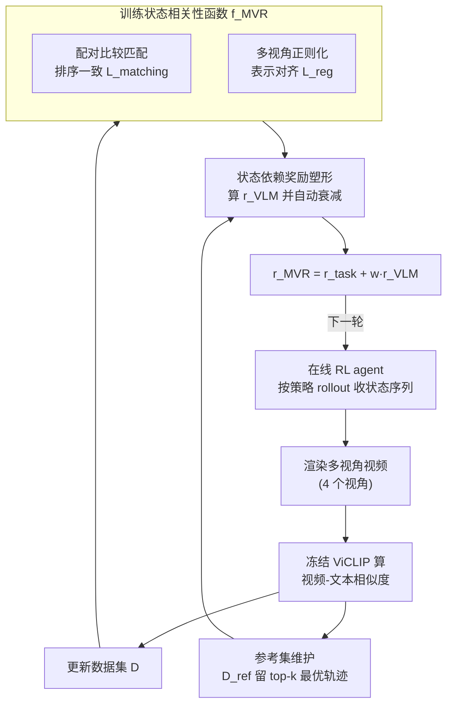

# MVR: Multi-view Video Reward Shaping for Reinforcement Learning

**会议**: ICLR 2026  
**arXiv**: [2603.01694](https://arxiv.org/abs/2603.01694)  
**代码**: [https://mvr-rl.github.io/](https://mvr-rl.github.io/)  
**领域**: 强化学习  
**关键词**: 视觉奖励塑形, 多视角视频, 强化学习, 视觉语言模型, 状态相关性学习

## 一句话总结
提出 MVR 框架，利用多视角视频的视频-文本相似度学习状态相关性函数，结合状态依赖的奖励塑形（自动衰减 VLM 引导），在 HumanoidBench 和 MetaWorld 共 19 个任务上超越现有 VLM 奖励方法。

## 研究背景与动机

**领域现状**：强化学习中的奖励设计至关重要。近年来一个新兴范式是利用 VLM 的图像-文本相似度作为视觉信号来增强奖励（如 VLM-RM, RoboCLIP），引导 agent 访问与任务描述匹配的状态。

**现有痛点**：(a) **静态图像的局限**：单帧图像-文本相似度无法表征动态运动——优化单帧相似度会让 agent 反复停在"最像跑步"的那一帧，而不是真正跑起来（需要双腿交替的节律性运动）。(b) **单视角遮挡**：单一摄像头角度导致机器人肢体间的遮挡，产生视角依赖的偏差。(c) **缺乏自适应衰减**：现有方法简单线性叠加 VLM 分数和任务奖励，可能改变最优策略。

**核心矛盾**：VLM 提供的视觉引导对学习初期有价值（帮助发现正确的运动模式），但如果持续施加，可能与任务目标产生冲突——需要一种"先用后放"的机制。

**本文目标** (a) 用视频替代静态图像准确评估动态运动质量；(b) 用多视角消除遮挡偏差；(c) 设计自动衰减的奖励塑形，避免 VLM 引导与任务奖励的持续冲突。

**切入角度**：不直接拟合 VLM 分数（语义鸿沟太大），而是通过配对比较（paired comparison）保持视频空间和状态空间的排序一致性；利用多视角正则化消除视角偏差；基于 Bradley-Terry 模型设计自动衰减机制。

**核心 idea**：从多视角视频中学习状态空间的相关性排序函数，再通过与参考集的比较产生自动衰减的奖励塑形信号。

## 方法详解

### 整体框架
MVR 要解决的是"怎么让一个冻结的视觉语言模型（VLM）在线指导 RL，既能纠正动态运动又不会长期跑偏"。它把这件事拆成一个边训练边自我改进的在线循环：agent 一边按当前策略与环境交互、积累状态序列，MVR 一边周期性地把这些轨迹渲染成多视角视频，用冻结的 ViCLIP 打出视频-文本相似度，再据此学一个**状态相关性函数** $f^{\text{MVR}}$，最后用它产生一份"早期强、后期自动归零"的视觉反馈奖励送回 agent。

整条 pipeline 的关键是相似度分数不直接拿来当奖励，而是先沉淀成两份东西：一份完整数据集 $\mathcal{D}$ 用来训练 $f^{\text{MVR}}$，一份只留最优轨迹的参考集 $\mathcal{D}^{\text{ref}}$ 用来当"最优策略"的替身；奖励塑形再拿 $f^{\text{MVR}}$ 和 $\mathcal{D}^{\text{ref}}$ 一比，比出当前行为离最佳还差多少，差得越少反馈越弱，直到归零退场。

### 关键设计

**1. 配对比较匹配：用排序一致性绕开状态与视频之间的语义鸿沟**

直接让状态空间去回归 VLM 给出的视频-文本相似度分数太难——状态向量和视频特征不在一个语义空间里。MVR 改为只要求两者的**排序**一致：给定两个视频 $\mathbf{o}, \mathbf{o}'$，先用 Bradley-Terry 模型把 VLM 的相似度差转成一个偏好概率 $h_{\text{vid}}(\mathbf{o}, \mathbf{o}') = \sigma(\psi^{\text{VLM}}(\mathbf{o}, \ell) - \psi^{\text{VLM}}(\mathbf{o}', \ell))$，再要求状态空间算出的排序 $h_{\text{state}}(\mathbf{s}, \mathbf{s}')$ 与之对齐，两者之间的交叉熵即匹配损失 $L_{\text{matching}}$。这和偏好学习（RLHF）同源，但拟合的是连续概率而非二元标签，因此更平滑稳定；又因为跨视角的视频对共享同一段状态序列，比较数据可以被自然扩增，等于免费多出几倍的训练对。

**2. 多视角正则化：消除摄像头角度带来的系统性偏差**

只从一个视角看，某些肢体会被遮挡，正面视角又往往因为可见性好而虚高，于是视角依赖的偏差被混进相关性评分里。MVR 把相关性函数显式拆成两部分 $f^{\text{MVR}}(s) = \langle g^{\text{rel}}, g^{\text{state}}(s) \rangle$——一个状态编码器 $g^{\text{state}}$ 和一个可学习的相关方向 $g^{\text{rel}}$，再加一个正则项 $L_{\text{reg}} = |\psi^{\text{VLM}}(\mathbf{o}_i, \mathbf{o}_j) - \langle \bar{g}^{\text{state}}(\mathbf{s}_i), \bar{g}^{\text{state}}(\mathbf{s}_j) \rangle|$，强行让状态表示之间的相似度结构对齐到（跨视角平均后的）视频表示。这样做把"学好表示"（交给 $L_{\text{reg}}$ 锚定共享表示）和"打好相关分"（交给 $L_{\text{matching}}$ 挑出相关方向 $g^{\text{rel}}$）解耦开，多视角信息得以被有效聚合而不是相互干扰。

**3. 参考集维护：用历史最佳轨迹现成地近似最优策略 $\pi^\ell$**

下面的衰减机制需要一个最优策略 $\pi^\ell$ 当对照，而单独训练一个策略去近似它代价不小，更没有它的样本可采。MVR 直接复用在线经验：$\mathcal{D}^{\text{ref}}$ 只保留跨视角聚合相似度最高的 $k=10$ 条状态序列，相当于"回忆自己最好的那几次尝试"，无需专家演示也无需额外训练，就把参考策略的获取成本压到几乎为零。这份参考集和训练 $f^{\text{MVR}}$ 用的数据集 $\mathcal{D}$ 出自同一次 ViCLIP 打分，只是按相似度 top-k 截了个尖。

**4. 状态依赖奖励塑形：让 VLM 引导早期强、后期自动归零**

现有方法把 VLM 分数和任务奖励固定权重一叠了事，引导会持续存在并可能改变最优策略。MVR 把目标写成"让当前策略变得和最优策略 $\pi^\ell$ 难以区分"：定义策略相关性 $h^\pi = \sum_s f^{\text{MVR}}(s) d^\pi(s)$，优化 $\max_\pi v^\pi + w \log(\sigma(h^\pi - h^{\pi^\ell}))$，再用 Jensen 不等式把它展开成逐状态的塑形信号

$$r^{\text{VLM}}(s) = \mathbb{E}_{s' \sim \pi^\ell}[\log(\sigma(f^{\text{MVR}}(s) - f^{\text{MVR}}(s')))],$$

其中对 $\pi^\ell$ 的期望就用上一步的参考集 $\mathcal{D}^{\text{ref}}$ 采样近似。关键在于这个信号会自己衰减：当 agent 的行为已经和 $\mathcal{D}^{\text{ref}}$ 对齐时，$f^{\text{MVR}}(s) \approx f^{\text{MVR}}(s')$，于是 $r^{\text{VLM}} \to 0$，VLM 引导自然退场，不再和任务奖励 $r^{\text{task}}$ 持续打架——相当于把"先用后放"写进了奖励本身，而不靠手调衰减曲线。

### 损失函数 / 训练策略

状态相关性模型训练：$L_{\text{rel}} = L_{\text{matching}} + L_{\text{reg}}$，每 100K 步更新一次，带早停。最终奖励：$r^{\text{MVR}}(s) = r^{\text{task}}(s) + w \cdot r^{\text{VLM}}(s)$，$w \in \{0.01, 0.1, 0.5\}$ 网格搜索。渲染频率：每 9 条轨迹渲染 1 条，随机选取视角，视频段长度 64 帧。使用 ViCLIP-L（428M 参数）。

## 实验关键数据

### 主实验

HumanoidBench 9 个任务（10M步，3 seeds）：

| 任务 | MVR | TQC | VLM-RM | RoboCLIP | DreamerV3 |
|------|-----|-----|--------|----------|-----------|
| Walk | **927.47** ✓ | 510.58 | 535.35 | 737.34 ✓ | 800.2 ✓ |
| Run | **749.23** ✓ | 647.87 | 14.93 | 501.15 | 633.8 |
| Slide | **735.03** ✓ | 514.91 | 163.13 | 494.20 | 436.5 |
| Stand | **918.55** ✓ | 576.59 | 728.69 | 849.73 ✓ | 622.7 |
| Sit_Hard | **756.67** ✓ | 511.85 | 322.95 | 559.38 | 433.4 |
| Avg Rank | **1.67** | 3.11 | 3.78 | 2.89 | 3.56 |

MetaWorld 10 个任务（1M步，5 seeds，成功率）：MVR 平均排名 1.50，RoboCLIP 2.00，VLM-RM 2.40。

### 消融实验

| 变体 | 说明 |
|------|------|
| w/o reg（去掉 $L_{\text{reg}}$） | 多个任务性能下降，验证多视角正则的价值 |
| w/o reference（直接用 $f^{\text{MVR}}$ 做奖励） | 缺少自动衰减，部分任务过拟合 VLM 引导 |
| MVR-CLIP（用图像替代视频） | 动态任务（Run, Walk）严重退化——单帧无法表征节律运动 |
| direct（直接拟合 VLM 分数） | 语义鸿沟导致学习不稳定 |
| 视角数量（1→4） | 多视角通常有益，Stand 单视角即可（因为是静态姿态不存在遮挡问题） |

### 关键发现
- MVR 在 5/9 HumanoidBench 任务上最优，平均排名最好（1.67），且是唯一在 Walk 和 Run 上同时达到成功阈值的方法
- VLM-RM 在 Run 上完全失败（14.93 vs 749.23），因为单帧相似度诱导 agent 停在"跑步姿势"而非真正跑步
- 多视角对动态任务显著有益，对静态姿态任务影响较小
- 自动衰减机制关键：案例研究显示 MVR 能在早期纠正不良姿势后自动退出，让 agent 专注于速度优化

## 亮点与洞察
- **根本性解决动态运动的视觉评价问题**：用视频替代图像是自然但被忽视的选择。论文清晰展示了单帧方法在跑步任务上的戏剧性失败（VLM-RM: 14.93），动机极其有说服力
- **配对比较的巧妙设计**：不直接回归 VLM 分数（语义鸿沟太大），而是保持排序一致——这种"只学相对顺序"的思路比"学绝对值"鲁棒得多，类似于 RLHF 的成功逻辑
- **自动衰减的优雅机制**：$r^{\text{VLM}}$ 随行为改善自然趋零，不需要手动设计衰减计划。这比现有的固定权重叠加方案优雅得多
- **参考集=最佳回忆**：用在线收集的 top-k 轨迹近似目标策略，避免了需要专家演示或单独训练的开销。这个类比人类技能学习的直觉很有启发性

## 局限与展望
- 仅在模拟环境中验证，未在真实机器人上测试——渲染多视角视频在真实场景中需要多相机设置
- 每 9 条轨迹渲染 1 条已经减少了开销，但仍需调用 ViCLIP（428M 参数），计算成本不可忽视
- 权重 $w$ 仍需网格搜索，虽然自动衰减减轻了调参负担，但初始权重仍影响性能
- 对 Balance_Simple 和 Balance_Hard 任务效果不佳（VLM-RM 反而更好），可能因为这些任务的视觉信号更适合静态评估
- 参考集 $\mathcal{D}^{\text{ref}}$ 的质量取决于探索——如果早期探索不足，参考集可能不够好

## 相关工作与启发
- **vs VLM-RM (Rocamonde et al., 2024)**: VLM-RM 用 CLIP 图像-文本相似度+固定权重叠加。MVR 用 ViCLIP 视频-文本+自动衰减。在 Run 任务上的对比（749 vs 15）是最有力的论据
- **vs RoboCLIP (Sontakke et al., 2024)**: RoboCLIP 也用视频-文本相似度但只提供轨迹级稀疏奖励。MVR 学习状态级密集相关性函数，引导更精细
- **vs RLHF**: MVR 的配对比较+BT 模型与 RLHF 同源，但此处的"偏好"来自 VLM 而非人类，且比较对象是同一策略的不同轨迹而非不同模型的输出
- **迁移潜力**：多视角+状态相关性学习 的框架可迁移到任何需要从视频评估行为质量的场景（如体育训练分析、手术技能评估）

## 评分
- 新颖性: ⭐⭐⭐⭐ 视频+多视角+自动衰减三个设计互补恰当，但每个单独看不是全新的
- 实验充分度: ⭐⭐⭐⭐⭐ 19 个任务 × 5 个方法 × 多项消融，实验设计非常系统
- 写作质量: ⭐⭐⭐⭐ 方法推导清晰，但符号较多需要仔细跟读
- 价值: ⭐⭐⭐⭐ 对 VLM 驱动的 RL 奖励设计有实质性推进，实用且可扩展

<!-- RELATED:START -->

## 相关论文

- [\[CVPR 2026\] General Process Reward Modeling for Robotic Reinforcement Learning](../../CVPR2026/robotics/general_process_reward_modeling_for_robotic_reinforcement_learning.md)
- [\[ICLR 2026\] Distributionally Robust Cooperative Multi-Agent Reinforcement Learning via Robust Value Factorization](distributionally_robust_cooperative_multi-agent_reinforcement_learning_via_robus.md)
- [\[ACL 2026\] Mango: Multi-Agent Web Navigation via Global-View Optimization](../../ACL2026/robotics/mango_multi-agent_web_navigation_via_global-view_optimization.md)
- [\[AAAI 2026\] Scalable Multi-Objective and Meta Reinforcement Learning via Gradient Estimation](../../AAAI2026/robotics/scalable_multi-objective_and_meta_reinforcement_learning_via_gradient_estimation.md)
- [\[NeurIPS 2025\] Sample Complexity of Distributionally Robust Average-Reward Reinforcement Learning](../../NeurIPS2025/robotics/sample_complexity_of_distributionally_robust_average-reward_reinforcement_learni.md)

<!-- RELATED:END -->
