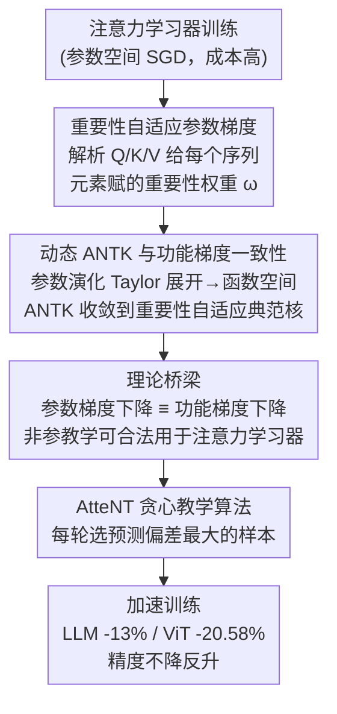

# Nonparametric Teaching of Attention Learners

**会议**: ICLR 2026  
**arXiv**: [2602.20461](https://arxiv.org/abs/2602.20461)  
**领域**: 训练效率/学习理论  
**关键词**: 非参教学, 注意力机制, 功能梯度, 训练加速, 核方法

## 一句话总结

提出AtteNT——从非参教学理论视角重新解释注意力学习器(Transformer/ViT)的训练过程：解析注意力在参数梯度中的重要性自适应角色→证明动态ANTK收敛到功能梯度中的重要性自适应典范核→桥接参数空间与函数空间→用贪心教学算法选择预测偏差最大的样本加速训练→LLM微调省时13.01%/ViT从头训练省时20.58%且精度不降反升。

## 研究背景与动机

**领域现状**：注意力学习器(Transformer、ViT等)在NLP和CV中取得了巨大成功，但训练成本极高——LLM预训练需要数百万句子、视频理解的数据规模更为庞大。降低训练成本成为迫切需求。

**现有痛点**：

1. **非参教学的适用性局限**：现有非参教学理论通过选择教学样本加速学习，但仅适用于MLP学习器，未考虑注意力机制的影响
2. **参数空间与函数空间的鸿沟**：注意力网络(ANN)通过参数空间的梯度下降(SGD)训练，而非参教学在函数空间使用功能梯度下降(FGD)——两者之间的一致性从未被证明
3. **注意力如何改变学习动态**：注意力机制三次调用输入(Q、K、V)为序列元素赋予不同重要性，这如何影响参数梯度的结构未被解析

**核心矛盾**：非参教学理论有潜力加速注意力学习器训练，但其数学基础(功能梯度下降)与实际训练方式(参数梯度下降)之间存在理论鸿沟，且注意力机制的加入使得从MLP到ANN的扩展不平凡。

**本文方案**：系统解析注意力在参数梯度中的角色→证明ANN的参数梯度下降与功能梯度下降的一致性→将非参教学的贪心算法(选择预测偏差最大的样本)直接应用于加速注意力学习器。

## 方法详解

### 整体框架

AtteNT 要解决的问题是注意力学习器（Transformer、ViT）训练太贵，想用"挑样本"的方式加速、又不靠拍脑袋。它的思路分三步走通一条从参数空间到函数空间、再落回训练算法的链路：先在参数空间解析注意力让梯度结构变成什么样，再用动态 ANTK 把这条参数演化轨迹映射回函数空间、证明它与功能梯度下降收敛到同一个核，从而把原本只适用于多层感知机（MLP）的非参教学（nonparametric teaching）理论合法地搬到注意力学习器上；有了这座理论桥梁，最后落地为一个贪心选样算法——每轮挑预测偏差最大的样本优先训练来加速收敛。

### 关键设计

**1. 注意力的重要性自适应参数梯度：解释注意力为何让梯度结构区别于 MLP**

把非参教学从 MLP 扩展到注意力网络（attention neural network, ANN）的第一道坎，是注意力机制三次调用输入（Q、K、V）后参数梯度长什么样并不清楚。作者对单层单头自注意力网络 $f_\theta(\mathbf{S}) = \text{softmax}(\frac{\mathcal{Q}(\mathbf{S})\mathcal{K}(\mathbf{S})^\top}{\sqrt{d}})\mathcal{V}(\mathbf{S})$ 解析推导出参数梯度的显式形式，以对 Query 权重列的梯度为例为 $\frac{\partial f_\theta(\mathbf{S})}{\partial \mathbf{W}^Q_{(:,i)}} = [d^{-1/2}\,\mathbf{S}_{(j,:)}\cdot\omega_j]_{S\times d}$。这里的关键是梯度不只依赖序列元素特征 $\mathbf{S}_{(j,:)}$，还乘上一个元素特定的标量 $\omega_j$——它由 $\mathcal{Q},\mathcal{K},\mathcal{V}$ 共同决定，正是注意力给每个序列元素赋的重要性权重。由此推出两个干净的性质：参数梯度被序列内平均消掉了对序列长度 $S$ 的依赖、只取决于特征维度 $d$；而梯度的行序与输入元素顺序保持一致（等变性），与推理时的排列不变性天然对应。这说明注意力学习器的更新本质是一种"重要性自适应"的更新，为后续把它对齐到非参教学的重要性自适应核埋下伏笔。

**2. 动态 ANTK 与功能梯度的一致性：填平参数空间训练与函数空间理论之间的鸿沟**

非参教学的数学基础是函数空间里的功能梯度下降（functional gradient descent, FGD），而注意力网络实际跑的是参数空间的随机梯度下降（SGD），两者是否等价此前从未被证明。作者对参数演化做 Taylor 展开，把它改写成函数空间形式

$$\frac{\partial f_{\theta^t}}{\partial t} = -\frac{\eta}{NS}\left[\frac{\partial \mathcal{L}}{\partial f_{\theta^t}(\mathbf{S}_1)},\ldots,\frac{\partial \mathcal{L}}{\partial f_{\theta^t}(\mathbf{S}_N)}\right]\cdot[K_{\theta^t}(\mathbf{S}_i,\cdot)]_N + o(\cdot)$$

其中 $K_{\theta^t}(\mathbf{S}_i,\cdot)\coloneqq\langle\frac{\partial f_{\theta^t}(\mathbf{S}_i)}{\partial\theta^t},\frac{\partial f_{\theta^t}(\cdot)}{\partial\theta^t}\rangle$ 就是把神经正切核（neural tangent kernel, NTK）扩展到注意力网络得到的动态注意力神经正切核（attention neural tangent kernel, ANTK）。核心结论（Theorem 3）是：在凸损失 $\mathcal{L}$ 和给定训练集下，这个动态核逐点收敛到 FGD 里的重要性自适应典范核，即 $\lim_{t\to\infty}K_{\theta^t}(\mathbf{S}_i,\cdot)=K(\mathbf{S}_i,\cdot)$。这条收敛把"用参数梯度训练注意力网络"和"用功能梯度教一个重要性自适应非参学习器"画上了等号，非参教学的整套工具因此可以名正言顺地用上——这正是框架图里"参数梯度下降 ≡ 功能梯度下降"那座桥梁。

**3. AtteNT 贪心教学算法：把理论等价性落地为可加速训练的选样规则**

有了上面的桥梁，加速训练就归结为在函数空间里挑能让功能梯度投影最大的样本。由于凸损失对预测的偏导范数与预测偏差正相关，选择规则可以简化成直接挑预测偏差最大的一批样本：$\{\mathbf{S}_i\}_m^* = \arg\max_{\{\mathbf{S}_i\}_m\subseteq\{\mathbf{S}_i\}_N}\|[f_\theta(\mathbf{S}_i)-f^*(\mathbf{S}_i)]_m\|_\mathcal{F}$，直觉就是"先教模型最不懂的"——这些样本梯度最陡、收敛最快，与课程学习（curriculum learning）的思路一致但有了核理论支撑。这种选法并非启发式而有保证：在 Lipschitz 光滑和有界核条件下，Proposition 4 给出损失的充分递减 $\frac{\partial \mathcal{L}}{\partial t}\leq-\frac{\eta\gamma}{2}(\frac{1}{NS}\sum_{i,j}\frac{\partial \mathcal{L}}{\partial f_{\theta^t}(\mathbf{S}_i)_{(j,:)}})^2$，因此选样在压缩数据量的同时不会牺牲收敛性。实际落地时配合 Soft 选样（Gumbel-Top-k 概率采样）和递增式选样比例，兼顾时间与鲁棒性。

## 实验关键数据

### 主实验1：LLM微调(NLG任务)

| 模型 | AtteNT | 平均时间↓ | GSM8K↑ | MATH↑ | HumanEval↑ | MBPP↑ | MT-Bench↑ |
|------|--------|---------|--------|-------|-----------|-------|----------|
| LLaMA 2-7B | w/o | 246m | 42.96 | 5.06 | 18.35 | 35.65 | 4.58 |
| LLaMA 2-7B | **w** | **213m** | **43.45** | **6.48** | **21.80** | **37.61** | 4.49 |
| Mistral-7B | w/o | 204m | 69.13 | 20.06 | 43.42 | 58.52 | 5.03 |
| Mistral-7B | **w** | **180m** | **71.26** | **23.12** | **46.55** | **61.74** | **5.32** |
| Gemma-7B | w/o | 228m | 75.23 | 30.52 | 53.83 | 65.69 | 5.42 |
| Gemma-7B | **w** | **201m** | **77.74** | **31.40** | **54.26** | **66.28** | **5.44** |

AtteNT平均减少12.78%训练时间，同时在GSM8K上提升1.39-2.42分、MATH上提升0.76-2.89分、HumanEval上提升0.29-3.66%、MBPP上提升2.08-3.31%。性能提升+时间节省同时实现。

### 主实验2：ViT从头训练(CV任务)

| 模型 | AtteNT | 预训练时间↓ | ImageNetS50↑ | NYUv2(S)↑ | NYUv2(D)↑ |
|------|--------|-----------|-------------|----------|----------|
| Multi-Modal MAE | w/o | 1234m | 92.2 | 51.9 | 52.1 |
| Multi-Modal MAE | **w** | **980m(-20.58%)** | **92.3** | **52.6** | **57.2(+5.1%)** |

训练时间减少20.58%，且所有下游任务性能提升，深度估计任务获得最大增幅(+5.1%)。

### 消融实验：数据选择策略

| Ratio策略 | Interval策略 | Selection策略 | 训练时间 | ImageNetS50 | NYUv2(S) | NYUv2(D) |
|----------|-------------|-------------|---------|-------------|----------|----------|
| - | - | -(标准) | 1234m | 92.2 | 51.9 | 52.1 |
| Cosine | Incremental | Random | 966m | 88.6 | 45.3 | 49.6 |
| Cosine | Incremental | Hard | 972m | 91.8 | 49.5 | 57.3 |
| **Incremental** | **Incremental** | **Soft** | **980m** | **92.3** | **52.6** | **57.2** |
| Incremental | Fixed | Soft | 1319m | 92.4 | 53.7 | 62.1 |

Soft策略(Gumbel-Top-k概率采样)在时间和性能间取得最佳平衡：Random选择破坏数据分布导致精度下降，Hard选择过于确定性缺乏鲁棒性，Fixed间隔虽精度最高但时间翻倍。

## 亮点与洞察

- **"非参教学→训练加速"的理论优美性**：不是启发式选数据，而是有RKHS+功能梯度+核收敛的完整理论支撑——知道**为什么**work
- **ANTK的理论贡献**：NTK(Neural Tangent Kernel)用于全连接网络→ANTK将其扩展到注意力网络——重要的理论工具扩展
- **"最不懂的先教"与教育学直觉的一致**：难的样本优先训练 → 容易的自然学会 → 符合课程学习(curriculum learning)思想但有更强的理论保证
- **13-21%加速不减精度的"免费午餐"**：用更少数据达到同等或更好性能→非参教学理论为数据选择提供了有原则性的指导

## 局限性

- 理论分析聚焦于单层单头自注意力，多层多头的扩展为直接推广但未完整证明
- 每个epoch开始需对所有数据评估偏差→增加选择开销(但整体仍节省)
- 未在超大规模预训练(如GPT级别)上验证

## 评分

- 新颖性: ⭐⭐⭐⭐⭐ 注意力学习器的非参教学理论首次建立
- 实验充分度: ⭐⭐⭐⭐ NLP+CV+从头/微调+多模型+消融
- 写作质量: ⭐⭐⭐⭐⭐ 理论推导严谨，与实验验证紧密结合
- 价值: ⭐⭐⭐⭐ 对Transformer训练效率有理论+实用双重贡献

<!-- RELATED:START -->

## 相关论文

- [\[NeurIPS 2025\] Knolling Bot: Teaching Robots the Human Notion of Tidiness](../../NeurIPS2025/robotics/knolling_bot_teaching_robots_the_human_notion_of_tidiness.md)
- [\[CVPR 2026\] AVA-VLA: Improving Vision-Language-Action models with Active Visual Attention](../../CVPR2026/robotics/ava_vla_improving_vision_language_action_models_with_active_visual_attention.md)
- [\[ECCV 2024\] AFF-ttention! Affordances and Attention models for Short-Term Object Interaction Anticipation](../../ECCV2024/robotics/aff-ttention_affordances_and_attention_models_for_short-term_object_interaction_.md)
- [\[AAAI 2026\] TTF-VLA: Temporal Token Fusion via Pixel-Attention Integration for Vision-Language-Action Models](../../AAAI2026/robotics/ttf-vla_temporal_token_fusion_via_pixel-attention_integratio.md)
- [\[NeurIPS 2025\] Beyond Parallelism: Synergistic Computational Graph Effects in Multi-Head Attention](../../NeurIPS2025/robotics/beyond_parallelism_synergistic_computational_graph_effects_in_multi-head_attenti.md)

<!-- RELATED:END -->
