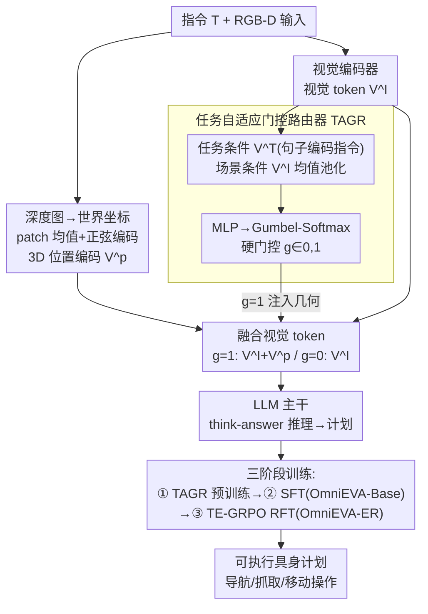

# OmniEVA: Embodied Versatile Planner via Task-Adaptive 3D-Grounded and Embodiment-aware Reasoning

**会议**: ICLR 2026  
**arXiv**: [2509.09332](https://arxiv.org/abs/2509.09332)  
**代码**: [项目页面](https://github.com/OmniEVA-Project)  
**领域**: 具身智能/3D推理  
**关键词**: MLLM, 任务自适应3D接地, 门控路由, 具身感知推理, GRPO

## 一句话总结
提出OmniEVA——通过任务自适应门控路由器动态注入3D位置编码(仅在需要时启用几何推理)和具身感知推理框架(将物理约束融入规划循环),解决了空间MLLM的两大gap：几何适应性差(2D-only或硬编码3D)和具身约束缺失(理论可行但实际不可执行的计划),在8个基准中7个达到SOTA。

## 研究背景与动机

**领域现状**：把多模态大模型(MLLM)用作具身智能体，需要它同时具备空间理解、推理和行动能力。现有工作大致两条路线：一是直接吃 2D RGB 输入，简单但丢掉了深度/世界坐标这类几何信息；二是 3D-LLM，把点云、体素或 3D 位置编码硬编码进每一次推理，灵活性差。

**几何适应性 gap**：纯 2D 模型在堆叠、遮挡处理、导航这类依赖几何的任务上会失败；而硬编码注入 3D 的模型走到另一个极端——当任务本不需要几何、或 3D 输入本身嘈杂时，强行注入反而引入噪声拖累性能。问题在于「要不要用 3D」被写死成了固定结构，而不是随任务自适应。

**具身约束 gap**：在网络图像/视频上训练的模型不感知机器人本体的物理约束(抓取位、工作空间边界、运动学可达性)，于是常输出「语义上对、但机器人物理上做不到」的计划——理论可行，落地不可执行。

**切入角度**：针对这两个 gap，OmniEVA 给出两个对应部件——用一个门控路由器动态判断当前任务需不需要 3D、需要才按需注入；再用 TE-GRPO 把物理可执行性写进强化学习奖励，逼模型尊重机器人本体约束。

## 方法详解

### 整体框架

OmniEVA 以 InternVL3-8B 这样的多模态大模型(MLLM)为主干，目标是让同一个模型在「需要几何推理的 3D 任务」和「纯 2D 任务」上都好用，且产出的计划机器人真能执行。它在主干前端挂一个任务自适应门控路由器(Task-Adaptive Gated Router, TAGR)：给定指令和 RGB-D 输入，先判断这个任务到底需不需要 3D 几何信息——需要才把 3D 位置编码注入视觉 token，不需要就走纯 2D；融合后的视觉 token 连同文本 token 一起送进 LLM 主干，以「think-answer」结构推理出计划。这套能力靠三阶段训练长出来：先单独预训练 TAGR 学会门控行为、再做监督微调(SFT)打好通用具身推理底子(得到 OmniEVA-Base)、最后用 TE-GRPO 强化微调把计划拉到物理可执行(得到 OmniEVA-ER)。

### 关键设计

**1. 任务自适应门控路由器(TAGR)：让模型自己决定何时注入 3D**

纯 2D 模型丢几何、硬编码 3D 又在不需要时引入噪声——TAGR 把「是否注入 3D」从写死的结构变成一个可学习的二值开关，专治几何适应性 gap。它一边从深度图重建世界坐标、按 patch 做均值后过正弦编码，得到 3D 位置编码 $V^p \in \mathbb{R}^{N \times H_p \times W_p \times d_v}$；一边用轻量句子 Transformer(all-MiniLM-L6-v2)编码指令得到任务条件 $V^T$、用视觉编码器输出均值池化得到场景条件 $V_{avg}^I$。两个条件拼接后过 MLP 得到二维 gate logits，再用 Gumbel-Softmax 转成可端到端反传的**硬门控** $g\in\{0,1\}$：

$$g = \text{GumbelSoftmax}\big(\text{MLP}([V^T; V_{avg}^I]),\ \tau\big),\qquad V^{final}=\begin{cases}V^I+V^p & g=1\\ V^I & g=0\end{cases}$$

关键是这里**不用 soft-weighting**：正弦位置编码的幅值一旦被连续权重扭曲，空间推理会明显掉点，所以宁可用硬门控保住幅值。这等价于在「纯视觉 token $V^I$」和「融合 token $V^I+V^p$」之间做一次专家混合(MoE)。开关由当前任务和场景共同决定，模型就能在堆叠/遮挡/导航这类几何敏感任务上启用 3D、在纯 2D 任务上自动关闭，避免无用几何拖累。

**2. 具身感知推理与 TE-GRPO：把物理可执行性写进强化学习奖励**

针对具身约束 gap——模型常给出语义对、物理却做不到的计划。OmniEVA 在 GRPO(Group Relative Policy Optimization)基础上提出 TE-GRPO(Task- and Embodiment-aware GRPO)，在保留鼓励 think-answer 结构的格式奖励 $r^{format}$ 之外，再加两路准确性奖励：任务奖励 $r^{task}$ 由 $\text{EvalTask}(\cdot)$ 度量「语义上完成任务的程度」(如 pointing 任务中落在目标区域内的点比例)，与本体无关；具身奖励 $r^{embod}$ 由 $\text{EvalExec}(\cdot)$ 在仿真里检查运动学、可达性和环境约束，直接验证「机器人能不能做」。为避免一上来就被严苛的物理约束卡死，作者用课程式(curriculum)奖励调度，让优化重心从语义正确逐步转向物理可行：

$$r^{acc}_{i,t} = (1-\lambda_t)\, r^{task}_i + \lambda_t\, r^{embod}_i,\qquad \lambda_t:\ 0 \to 1$$

训练早期 $\lambda_t\approx0$，约束只部分满足也给正奖励；随训练推进 $\lambda_t\to1$，强制更严的物理合规。最终奖励由格式奖励与该组合准确性奖励相加。这样模型不只追求「答对」，还被持续拉向「机器人真能执行」，在移动操作等需要落地的任务上显著提升成功率。

### 损失函数 / 训练策略

三阶段级联，让模型从空间理解一路长到可执行规划：**① TAGR 预训练**——用 ScanNet、Matterport3D 等深度感知数据先把门控行为学出来，对 LLM 主干用很小学习率($5e^{-7}$)保护预训练知识、对 TAGR 参数用较大学习率($1e^{-4}$)加速适应；预训练完冻结 TAGR、丢弃被微调的主干以免干扰。**② SFT**——在冻结好的 TAGR 上混合 2D/视频/3D 的通用具身推理数据与自建导航/操作数据做监督微调，得到 OmniEVA-Base。**③ TE-GRPO 强化微调(RFT)**——以 OmniEVA-Base 为起点，用上面带课程调度的物理约束奖励做 RL，得到面向物理可行性的 OmniEVA-ER。

## 实验关键数据

评测覆盖 8 个公开基准(跨 2D 图像、视频、3D)，外加作者新建的 4 个原始技能基准——Where2Go(部分可观下的次优视角选择)、Where2Fit(带碰撞约束的自由空间预测)、Where2Approach(遮挡感知导航)、Where2Grasp(以物体为中心的识别)。注意这 4 个 Where2* 是用来评估具身计划可执行性的**基准**，而非方法本身的模块。

### 主实验（OmniEVA-Base，SFT 后）

| 基准 | 结果 |
|------|------|
| 8 个公开基准(2D/3D/视频) | 7/8 达到 SOTA |
| 4 个 2D 具身推理基准均值 | 8B 模型，较前 SOTA Robobrain2.0-32B 平均 **+10.45** |
| 目标导航 HM3D / MP3D | 排行榜第一 |
| 4 个原始技能基准 | 全部超过现有模型 |

### 消融：TE-GRPO 强化微调（OmniEVA-ER vs Base / naive RL）

| 任务 | OmniEVA-ER 提升 |
|------|----------------|
| Where2Approach | 准确率 +28.95% |
| Where2Fit | 准确率 +34.28% |
| Mobile Placement(Easy / Hard) | 成功率 +43% / +50% |

### 关键发现
- **门控按语义类别自适应触发**：形状相关 prompt 激活率最高(76.9%)，其次动作/活动(50.9%)、可见性遮挡(33.0%)——说明 3D 推理确实被几何、动态、遮挡线索强烈唤起，验证了「按需注入」的自适应策略。
- **硬门控 > 软门控**：用连续 sigmoid 加权注入 3D 的软门控在所有基准上一致更差，因为它破坏了位置编码的数值稳定性——印证了用 Gumbel-Softmax 硬门控保住幅值的必要性。
- **TE-GRPO 把计划拉向可执行**：$r^{task}$ 与 $r^{embod}$ 各自有用，但联合优化效果最佳，在原始技能和移动操作任务上一致提升，证明把物理约束写进奖励能显著增强落地鲁棒性。

## 亮点与洞察
- **"按需3D"的设计哲学**：不是"给所有任务都加3D"→而是让模型自己学习何时需要→这比人工规则更灵活更准确。
- **原始技能基准的贡献**：4个新基准(Where2Go/Grasp/Approach/Fit)→首次系统评估具身计划的可执行性。
- **TE-GRPO连接了LLM训练和机器人学**：将GRPO(LLM后训练主流方法)与物理约束奖励结合→是LLM-for-robotics的自然且有效的融合方式。

## 评分
- 新颖性: ⭐⭐⭐⭐⭐ 任务自适应3D+具身感知推理的双重创新
- 实验充分度: ⭐⭐⭐⭐⭐ 8+4基准+消融+排行榜
- 写作质量: ⭐⭐⭐⭐ 架构描述清晰
- 价值: ⭐⭐⭐⭐⭐ 对具身MLLM有重要推动

<!-- RELATED:START -->

## 相关论文

- [\[NeurIPS 2025\] MesaTask: Towards Task-Driven Tabletop Scene Generation via 3D Spatial Reasoning](../../NeurIPS2025/robotics/mesatask_towards_task-driven_tabletop_scene_generation_via_3d_spatial_reasoning.md)
- [\[ACL 2025\] Task-aware MoILE: Hierarchical-Task-Aware Multi-modal Mixture of Incremental LoRA Experts for Embodied Continual Learning](../../ACL2025/robotics/hierarchical-task-aware_multi-modal_mixture_of_incremental_lora_experts_for_embo.md)
- [\[ICLR 2026\] REI-Bench: Can Embodied Agents Understand Vague Human Instructions in Task Planning?](rei-bench_can_embodied_agents_understand_vague_human_instructions_in_task_planni.md)
- [\[CVPR 2026\] Recurrent Reasoning with Vision-Language Models for Estimating Long-Horizon Embodied Task Progress](../../CVPR2026/robotics/recurrent_reasoning_with_vision-language_models_for_estimating_long-horizon_embo.md)
- [\[ICLR 2026\] Cross-Embodiment Offline Reinforcement Learning for Heterogeneous Robot Datasets](cross-embodiment_offline_reinforcement_learning_for_heterogeneous_robot_datasets.md)

<!-- RELATED:END -->
