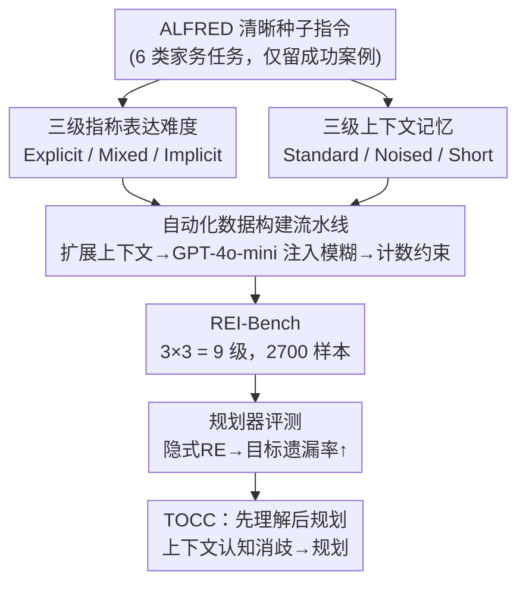

# REI-Bench: Can Embodied Agents Understand Vague Human Instructions in Task Planning?

**会议**: ICLR 2026  
**arXiv**: [2505.10872](https://arxiv.org/abs/2505.10872)  
**代码**: [项目页面](https://jcx0110.github.io/rei-bench-project)  
**领域**: 具身AI/任务规划  
**关键词**: 指称表达, 模糊指令, LLM规划, 共指消解, 鲁棒性

## 一句话总结

首次系统研究人类模糊指令中的指称表达(Referring Expressions)对LLM机器人任务规划的影响——构建REI-Bench基准建模9级共指模糊度(3级RE难度×3级上下文)，发现隐式RE可使现有规划器成功率下降高达36.9%，提出Task-Oriented Context Cognition (TOCC)方法将任务理解与规划决策解耦，平均提升成功率6.5%。

## 研究背景与动机

**领域现状**：LLM驱动的机器人任务规划(SayCan、ProgPrompt、DAG-Plan等)已取得显著进展，但都基于一个理想化假设——用户指令清晰、完整、无歧义。然而真实场景中，人类语言天然带有模糊性。

**核心痛点**：真实用户(尤其是老人、儿童、阿尔茨海默症患者)的指令常包含隐式指称表达，如用"它"代替"锅"、用"那个重东西"代替"平底锅"。语言学研究表明，新闻中约20%的表达是描述性的(隐式RE)，日常对话中比例更高。这些群体恰恰是最需要机器人服务的。

**研究空白**：(1) 缺乏系统化评估模糊指令对机器人规划影响的基准；(2) 现有模糊性数据集(AmbiK、CLARA等)未系统建模RE的位置、频率和形式；(3) 不清楚LLM在规划场景中能否充分发挥其固有的语言理解能力。

**理论基础**：桥接推理理论(Clark, 1975)解释了人类解析隐式RE的机制：听到"那个重东西"时，人会从上下文记忆中找到多个候选(锅、食材、水槽)，选择最匹配的。语用学者Levinson进一步区分了指称表达(RE)和指示表达(DE)两种模糊类型。

**关键发现动机**：作者发现LLM在单独提示时可以正确解析隐式RE(如通过反思提示)，但在规划过程中这种能力无法充分发挥——LLM过度关注计划生成而忽略了语言理解。这挑战了"嵌入LLM即可保证机器人理解人类语言"的常见假设。

**实际影响**：隐式RE导致的失败主要表现为"目标遗漏"(object omission)——规划器无法正确识别指令中的目标对象，从而生成错误的动作序列。例如"the heated one"被错误识别为"plate"而非"potato"。

## 方法详解

### 整体框架

REI-Bench把真实人机交互里的共指模糊性拆成两个正交维度——指称表达(Referring Expression, RE)的难度和对话上下文的质量——再用一条不依赖人工标注的自动流水线，从ALFRED的清晰种子指令出发，扩展上下文、注入模糊，最终得到覆盖9种模糊等级、共2700个样本的评估基准。在这个基准上系统压测各类LLM规划器后，作者发现失败几乎都源于"目标遗漏"，于是配套提出TOCC方法，用"先理解、再规划"的解耦思路把语言理解从规划里摘出来，缓解模糊指令带来的规划失败。

### 关键设计

**1. 三级指称表达难度：把"清晰到模糊"做成可控梯度**

真实用户的表达模糊程度因人而异，老人、儿童常用"它""那个重东西"代替具体物名，因此基准需要能定量区分不同模糊程度。论文据此把RE分为三级：显式RE(Explicit)是专有名词("apple")、定冠词短语("the apple")、不定冠词短语("an apple")，可直接对应物体；隐式RE是代词("it"/"them")和属性表达("sweet fruit")，对应多个候选对象、必须依赖上下文推理。三档的构造方式逐级加难——Explicit 保留原始数据集中的全部显式表达；Mixed 把指令里的显式RE换成隐式RE，但上下文记忆中的显式RE原样保留；Implicit 则把所有显式RE都换成隐式，仅在上下文里留下第一个显式RE作为唯一线索。替换规则参照OntoNotes语料的共指消解模式，确保生成的隐式RE符合自然语言习惯，而非机械替换。

**2. 三级上下文记忆：模拟真实交互里参差不齐的信息质量**

语用学认为词与物的绑定是在具体上下文里建立的(Levinson, 1983)，因此同一条隐式指令在不同上下文下解析难度天差地别。论文设计了三种上下文：Standard 提供完整的任务相关信息；Noised 注入"歧义名称"噪声，即与场景物体名相近的人名/品牌名(如把"Rose"扩成反复出现的"Mrs. Rose")，制造干扰；Short 在噪声基础上再随机删掉一部分含任务相关显式RE的名词短语，进一步抽走线索。噪声对应日常里"一词多义"的误导(如"apple"既是水果又是品牌)，删减则对应老人/儿童认知局限带来的语义缺失。把三级RE和三级上下文做笛卡尔积，就得到 $3 \times 3 = 9$ 种模糊等级，足以从多个角度压测规划器的鲁棒性。

**3. 自动化数据构建流水线：无需人工标注地批量生成模糊样本**

已有的模糊表达数据集(OntoNotes、Winograd Schema)由语言学家标注，却没有系统化RE的位置、频率和形式，难以支撑规模化基准。论文转而搭了一条全自动管线，恰好把上面两个维度落地：先从ALFRED挑出6种家务任务(Pick & Place、Stack & Place等，排除不稳定的Pick Two & Place)，用规划器实际执行、只保留成功案例作种子指令，从而过滤掉那些即便指令清晰也完不成的任务，把RE的影响隔离出来；再用GPT-4o-mini依次扩展上下文对话、派生出Standard/Noised/Short三种上下文变体、以CoT方式把显式RE逐级替换成隐式RE；最后用计数规则约束各任务中显式RE的数量一致，违规样本直接丢弃。这样既保证了2700样本×9级的规模与一致性，又消除了人工标注的主观偏差。

**4. Task-Oriented Context Cognition (TOCC)：把理解和规划物理解耦**

在基准上压测时作者撞见一个反直觉现象：直接提示LLM"the heated one指什么"时它能正确答出"potato"，可一旦放进规划任务，同样的输入却被错认成"plate"——问题不在于LLM不会理解隐式RE，而在于同时做理解和规划时注意力被规划抢占。TOCC据此分成两步：先是上下文认知阶段，LLM只专注于结合对话上下文识别隐式RE、推断其真实指代，输出一条消歧后简洁清晰的重述指令；再是规划阶段，规划器基于已经消歧的清晰指令生成动作序列，不必再分心做语言理解。这与其他几种提示策略形成对照——Aware Prompt 仅提醒"指令可能模糊"而不引导深层推理，改进有限还可能在清晰指令上引入幻觉；Chain-of-Thought 让规划器边分析RE边规划，是TOCC的雏形但仍在单次生成里完成；In-Context Learning 靠示例帮助推断，可小模型从示例中学习的能力有限。TOCC的优势正在于它把理解与规划从单次生成里物理分开，从根上避免了注意力竞争，因而无需额外训练或新模块就能见效。

## 实验关键数据

### 主实验：规划器成功率随模糊度的变化

| 规划器 | Explicit+Standard | Mixed+Standard | Implicit+Standard | 最大下降 |
|---------|-------------------|----------------|-------------------|----------|
| LLaMA3.1-8B + SayCan | 46.90% | 30.10% (-16.8%) | 22.10% (-24.8%) | -24.8% |
| GPT-4o-mini + SayCan | 45.00% | 25.90% (-19.1%) | 24.30% (-20.7%) | -20.7% |
| DeepSeekMath-7B + SayCan | 27.00% | 19.80% (-7.2%) | 14.70% (-12.3%) | -12.3% |
| LLaMA3.1-8B + DAG-Plan | — | — | — | 最高36.9% |
| GPT-4o + SayCan | 较高基线 | 下降较小 | 仍有明显下降 | — |

> 注：基线(不含上下文的Explicit REs)下LLaMA3.1-8B+SayCan成功率为57.7%，加入多轮对话后降至46.90%。

### 消融实验：不同提示方法对比 (LLaMA3.1-8B + SayCan, Standard Context)

| 方法 | Explicit RE 总错误率 | Mixed RE 总错误率 | Implicit RE 总错误率 | Implicit RE 目标遗漏率 |
|------|---------------------|-------------------|---------------------|----------------------|
| 原始 (Baseline) | 53.1% | 69.9% | 77.9% | 53.9% |
| + AP | 53.2% (+0.1) | 71.0% (+1.1) | 77.3% (-0.6) | 49.9% (-4.0) |
| + CoT | 52.7% (-0.4) | 69.1% (-0.8) | 77.9% (+0.0) | 47.6% (-6.3) |
| + ICL | 60.8% (+7.7) | 71.7% (+1.8) | 78.6% (+0.7) | 49.9% (-4.0) |
| + TOCC | **41.0%** (-12.1) | **66.4%** (-3.5) | **70.7%** (-7.2) | **40.1%** (-13.8) |
| - Context | 42.3% (-10.8) | 86.9% (+17.0) | 90.6% (+12.7) | 85.1% (+31.2) |

## 关键发现

- **隐式RE是规划失败的主因**：随着隐式RE比例增加，所有规划器的成功率持续下降。以LLaMA3.1-8B+SayCan为例，Mixed级别下降16.8%，Implicit级别再下降8.0%。而上下文噪声和信息缺失的影响相对较小。

- **失败根源是"目标遗漏"而非"执行错误"**：错误分析显示，随隐式RE增加，**目标遗漏率**从22.6%飙升至53.9%(LLaMA3.1-8B)，而执行错误率反而从30.5%降至24.0%。这表明LLM并非不会规划，而是无法正确识别隐式指称的目标对象。

- **LLM具备RE解析能力但在规划中失效**：当直接提示LLM解析"the heated one"指什么时，它能正确回答"potato"；但在规划任务中，同一段输入却导致错误识别为"plate"。这说明规划任务消耗了LLM的注意力资源，抑制了语言理解能力的发挥。

- **TOCC通过解耦实现全面提升**：TOCC在所有模糊等级上都实现了最佳性能，平均提升6.5%的成功率。在Implicit REs级别上，目标遗漏率从53.9%降至40.1%(降幅13.8%)，是所有方法中改进最大的。

- **去掉上下文验证了语用学理论**：仅使用指令(无上下文)时，Explicit REs表现与TOCC相当，但Mixed和Implicit REs下性能暴跌(目标遗漏率从38.8%跃升至81.6%)。这符合语用学理论——上下文对解析隐式RE不可或缺。

## 亮点与洞察

1. **语言学理论驱动的AI系统设计**：论文将桥接推理、语用学等语言学理论系统性地融入机器人规划评估，不是简单地测试"模糊指令"，而是从信号(Signifier)与所指(Signified)的一对多关系出发，构建了有理论深度的基准。

2. **揭示了LLM能力的"场景依赖失效"**：LLM并非缺乏理解隐式RE的能力，而是在规划场景的多任务压力下无法发挥。这个发现对所有依赖LLM的系统都有启示——不能假设LLM的所有能力在任意任务组合下都能同时生效。

3. **简单方法的有效性**：TOCC本质上就是"先理解再规划"的两步解耦，没有额外训练、没有新模块。这种简洁性反映了问题根源的准确定位——回到了软件工程中"关注点分离"的基本原则。

## 局限性

1. **任务复杂度有限**：为隔离RE的影响，数据集仅包含LLM在清晰指令下能完成的简单、短视野、单目标任务。更复杂的长视野多目标场景尚未覆盖。

2. **仅考虑共指模糊**：人类语言模糊性还包括指示表达(DE，依赖空间/时间)、句法模糊、范围模糊等，本文仅关注共指模糊一种类型。

3. **缺乏多模态信息**：实验在AI2-THOR模拟器中进行，仅评估文本层面的语义理解能力，未考虑视觉和空间感知信息(如VLM-based规划器可能通过视觉线索帮助解析"那个红色的东西")。

4. **TOCC增加推理开销**：两步解耦意味着LLM需要两次推理调用。对于资源受限的机器人端(小模型)，额外的推理成本可能影响实时性。

## 相关工作与启发

### vs AmbiK (Ivanova et al., 2025)
AmbiK是厨房环境下的模糊自然语言指令数据集(1k样本)。与REI-Bench相比：(1) AmbiK不支持任务规划评估(无Planning)；(2) AmbiK不包含多轮对话上下文；(3) REI-Bench的模糊性建模更系统——通过RE类型和上下文类型的组合实现9级粒度控制，而AmbiK未系统区分模糊来源。REI-Bench在评估框架的全面性上更优。

### vs CLARA (Park et al., 2023) / KNOWNO (Ren et al., 2023)
CLARA让LLM判断指令是否确定，KNOWNO测量并对齐LLM规划器的不确定性。两者都是"检测模糊性→请求澄清"的范式，而REI-Bench关注"在不请求澄清的前提下，规划器能否自行解析模糊性"。TOCC提供了一种不依赖用户二次交互的轻量解决方案。

### vs DialFRED (Gao et al., 2022)
DialFRED采用"提问者-执行者"框架，通过53K问答对支持多轮交互。其核心思路是通过主动提问获取缺失信息。REI-Bench的视角不同——它假设机器人应能从已有上下文中自主推断，而非依赖额外交互。这两种范式互补：TOCC适用于用户不便回答追问的场景(如老年用户)。

## 评分

| 维度 | 评分 | 理由 |
|------|------|------|
| 新颖性 | ★★★★☆ | 首次系统性建模指称表达模糊度对机器人规划的影响，理论驱动的基准设计有创新性；但TOCC方法本身较简单 |
| 技术深度 | ★★★☆☆ | 基准构建流水线完整，但核心方法(TOCC)仅是两步提示解耦，无模型训练或架构创新 |
| 实验完整性 | ★★★★★ | 12个规划器(6 LLM × 4框架)、9种模糊等级、4种提示方法的全面消融；错误归因分析深入(目标遗漏 vs 执行错误) |
| 实际影响 | ★★★★☆ | 揭示了LLM规划器在真实场景中被忽视的脆弱性，对HRI领域有直接启发；局限于简单任务和仿真环境 |

<!-- RELATED:START -->

## 相关论文

- [\[CVPR 2026\] AGENTSAFE: Benchmarking the Safety of Embodied Agents on Hazardous Instructions](../../CVPR2026/robotics/agentsafe_benchmarking_the_safety_of_embodied_agents_on_hazardous_instructions.md)
- [\[CVPR 2026\] RoboAgent: Chaining Basic Capabilities for Embodied Task Planning](../../CVPR2026/robotics/roboagent_chaining_basic_capabilities_for_embodied_task_planning.md)
- [\[NeurIPS 2025\] Can Agents Fix Agent Issues?](../../NeurIPS2025/robotics/can_agents_fix_agent_issues.md)
- [\[ICML 2026\] EMBGuard: Constructing Hazard-Aware Guardrails for Safe Planning in Embodied Agents](../../ICML2026/robotics/embguard_constructing_hazard-aware_guardrails_for_safe_planning_in_embodied_agen.md)
- [\[ICLR 2026\] Embodied Agents Meet Personalization: Investigating Challenges and Solutions Through the Lens of Memory Utilization](embodied_agents_meet_personalization_investigating_challenges_and_solutions_thro.md)

<!-- RELATED:END -->
