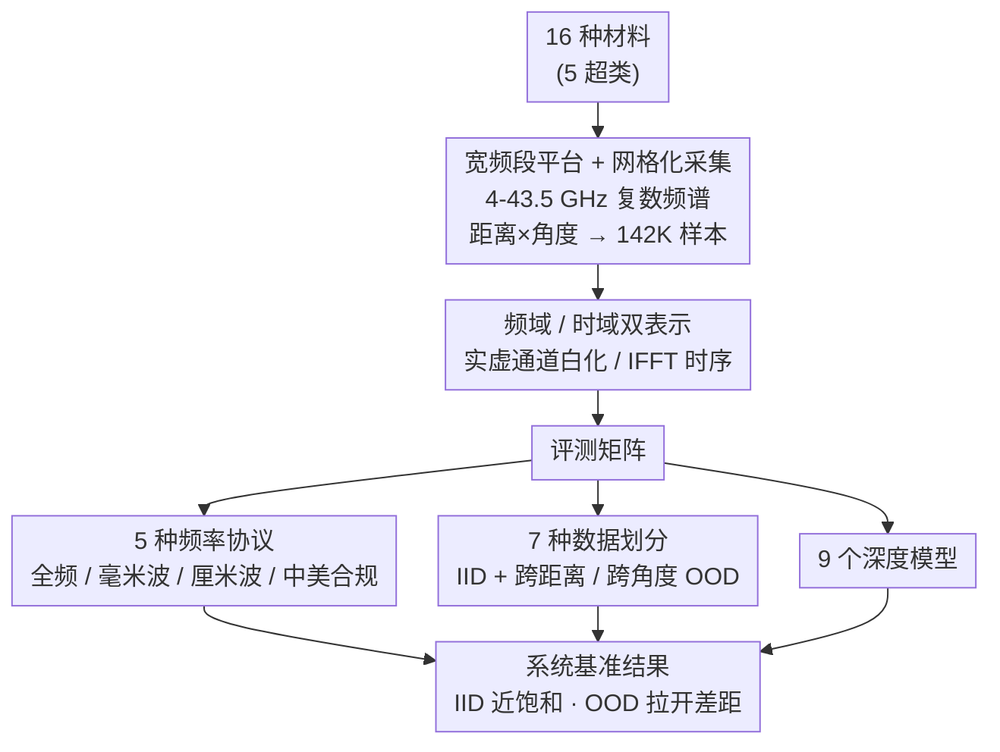

# RF-MatID: Dataset and Benchmark for Radio Frequency Material Identification

**会议**: ICLR 2026  
**arXiv**: [2601.20377](https://arxiv.org/abs/2601.20377)  
**代码**: 有（项目页面提供）  
**领域**: AI Safety / 具身智能 / RF 感知  
**关键词**: RF sensing, material identification, UWB-mmWave, dataset benchmark, embodied AI

## 一句话总结
构建了首个开源的大规模、宽频段（4-43.5 GHz）、几何扰动多样的 RF 材料识别数据集 RF-MatID，包含 16 种细粒度材料类别（5 大类）/142K 样本，并建立了覆盖 9 个深度学习模型、5 种频率协议、7 种数据划分的系统基准。

## 研究背景与动机

**领域现状**：材料识别是具身 AI 的基础能力，目前主要依赖光学传感器（摄像头、高光谱）。RF（射频）方法通过电磁波与材料的物理交互来揭示内在材料属性（介电常数、电导率等），不受光照和视觉相似性限制。

**现有痛点**：(1) 现有 RF 材料数据集全部不公开，阻碍了算法间的公平比较；(2) COTS 传感器频段窄且碎片化（如仅 77-81 GHz），无法跨频段系统评估；(3) 缺乏对几何扰动（角度、距离变化）的系统评估，实际部署鲁棒性存疑。

**核心矛盾**：RF 方法有理论优势（穿透力强、不受光照影响），但研究基础设施（数据集+基准）的缺失严重制约了学习方法的发展和评估。

**本文目标** 构建首个开源、宽频、几何多样的 RF 材料识别数据集，建立完整基准测试框架。

**切入角度**：自建 UWB-mmWave 传感平台（4-43.5 GHz 连续覆盖），系统采集 16 种材料在不同距离（200-2000mm）和角度（0-10°）下的 RF 响应。

**核心 idea**：通过首个开源宽频段 RF 数据集和系统基准，推动学习方法在 RF 材料识别中的标准化研究。

## 方法详解

### 整体框架
RF-MatID 不是提出一个新模型，而是搭一套能让"用学习方法做 RF 材料识别"这件事被公平评估的基础设施。整条流水线分三步走：先用自建的 UWB-mmWave 平台，把 16 种材料在不同距离和角度下的频域电磁响应一格一格扫出来；再把每个采到的复数频谱整理成频域、时域两种配对表示喂给网络；最后用"频率协议 × 数据划分 × 模型"三个维度交叉，构成一张系统的评测表（5 种频率协议 × 7 种数据划分 × 9 个深度模型）。整套设计的落点都在"开源"和"可复现的横向比较"上。

### 关键设计

**1. 宽频段传感平台与网格化采集：把 4-43.5 GHz 一次性扫全，再按几何位置铺成网格**

这一步直接针对现有 COTS 传感器频段窄且碎片化（如只有 77-81 GHz）的痛点。平台用 DRH40 双脊喇叭天线接 MS46131A 矢量网络分析仪，对每个样本测出 2048 个频率 bin 上的复数响应 $H(f_i) = I(f_i) + jQ(f_i)$，其中 $I$、$Q$ 分别是同相和正交分量。采集时并不是随手测几下，而是在距离 200-2000mm（50mm 步长）× 角度 0-10°（1° 步长）的网格上系统扫描，最终攒到 142K 样本。39.5 GHz 的带宽远超此前最大的 4 GHz 带宽数据集，好处是一份数据里同时含住了厘米波（3-30 GHz）那段偏穿透的信息和毫米波 Q-band（30-50 GHz）那段对表面更敏感的信息——这正是单一窄频段传感器拿不到的。覆盖的材料按物理属性分成 5 个超类、16 个细粒度类别：砖（过烧粘土砖、轻质多孔砖、火山砖）、玻璃（透明亚克力、钢化玻璃、白色不透明亚克力）、合成材料（三聚氰胺贴面板、矿物纤维板、PVC 板）、木材（雪松枕木、柳安胶合板、红橡胶合板）、石材（透水铺路石、人造石、花岗岩、混凝土）。

**2. 频域 / 时域双表示：让网络既看见频率选择性衰减，又看见传播延迟**

采到的是复数频谱，但怎么把它喂给网络是个选择题。这里给每个样本生成两种配对表示：频域侧把复数拆成实部、虚部两个实数通道，并做复数白化以保留相位关系；时域侧对频谱做 IFFT，得到长度 10240 的时序信号再标准化。两种表示各有侧重——频域看的是材料在不同频率上吸收/反射强弱的频率选择性衰减，时域看的是信号穿过/反射回来的传播延迟。论文实验里这种双通道实数表示稳定优于直接用复数网络处理，给后续所有模型定下了统一的输入约定。

**3. 五种频率协议：把"哪段频谱合法可用"写进基准**

光有全频段还不够，真实部署里频谱是受监管的，不是想用哪段就用哪段。于是定义 5 种频率分配方案：P1 用满全频段 4-43.5 GHz，P2 只取毫米波 30-43.5 GHz，P3 只取厘米波 4-30 GHz，P4 限定美国合法商用频段，P5 限定中国合法频段。这是首次把频率监管约束纳入材料识别基准，意义在于评测结果能直接回答"在某地合规的频段下到底能做到多好"，让研究和落地之间少一道翻译。

**4. 七种数据划分：把"传感器换了位置还认不认得出"做成可测的题目**

模型在训练分布里刷高分容易，难的是位置一变还稳不稳。划分设置因此分两类：S1 是标准随机划分（IID），测的是数据充足时的基本上限；S2 按距离做跨域 OOD（mod1-3 对应不同的距离子集），S3 按角度做跨域 OOD。S2/S3 刻意让训练和测试落在不同的几何条件上，对应的就是实际部署中传感器距离、角度漂移带来的分布偏移——这也是后面实验里最能拉开模型差距的地方。

## 实验关键数据

### 主实验（Protocol 1, 全频段 4-43.5 GHz）

| 模型 | S1 (IID) | S2-mod1 (跨距离) | S3-mod1 (跨角度) | 说明 |
|------|----------|------------------|------------------|------|
| Baseline (自研) | 99.57 | 86.62 | 98.89 | 简单 CNN |
| LSTM-ResNet | 99.84 | 97.12 | 99.69 | 最佳 IID |
| ConvNeXt | 99.51 | 79.10 | 98.85 | CV 模型 |
| AirTac | 96.81 | 91.36 | 98.12 | RF 专用 |
| Material-ID | 99.28 | 95.67 | 97.63 | RF 专用 |

### 跨域鲁棒性（S2 OOD, Protocol 1）

| 模型 | S2-mod1 | S2-mod2 | S2-mod3 | 说明 |
|------|---------|---------|---------|------|
| LSTM-ResNet | 97.12 | 49.95 | 71.00 | mod2 大幅下降 |
| AirTac | 91.36 | 86.95 | 65.41 | 跨距离最鲁棒 |
| ConvNeXt | 79.10 | 64.19 | 63.52 | CV 模型跨域差 |

### 关键发现
- **IID 场景已近饱和**：多数模型在 S1 下 >99%，区分度不大，说明有充足数据时 RF 材料识别不难
- **跨距离域偏移是最大挑战**：S2-mod2 下精度普遍暴跌到 50-87%，距离变化导致的信号衰减对模型影响巨大
- **AirTac 跨域表现最稳**：虽然 IID 不是最高，但 OOD 下降最小，说明 RF 专用架构设计对鲁棒性有帮助
- **频域 vs 时域**：频域双通道表示优于时域表示，且优于复数网络处理方式
- **合规频段可用**：P4/P5（合法频段）下性能虽低于全频段但仍可用，验证了实际部署的可行性

## 亮点与洞察
- **首个开源 RF 材料数据集的标杆意义**：正如 ImageNet 推动了视觉研究，RF-MatID 有望推动 RF 感知的标准化研究。数据集的开源政策是最大贡献。
- **频率协议设计考虑监管约束**：首次将法规合规性纳入基准设计，对从研究到部署的转化有直接帮助。
- **几何扰动系统化**：距离和角度的网格化采集方式可以被其他传感模态（如激光雷达、超声波）借鉴。

## 局限与展望
- **材料种类有限**：16 类仍偏少，实际环境中材料种类更多，包括液体、织物、金属等
- **仅单一传感平台**：所有数据来自同一套设备，跨设备泛化能力未知
- **室内受控环境**：未考虑多径干扰、遮挡等真实环境因素
- **角度范围小**：仅 0-10°，实际机器人操作中角度变化可达 0-90°
- **缺乏多模态基准**：作为具身 AI 数据集，未提供对应的视觉/触觉数据进行多模态融合研究

## 相关工作与启发
- **vs VNA-based datasets (he2022accurate, shanbhag2023contactless)**: 频段更宽（39.5 GHz vs 4 GHz）且开源
- **vs Wi-Fi/RFID datasets**: 信号质量更高（相干收发）但需要专用硬件
- 对具身 AI 的材料感知研究提供了基础数据资源，可作为 RF 分支的 baseline

## 评分
- 新颖性: ⭐⭐⭐⭐ 首个开源宽频 RF 材料识别数据集，填补重要空白
- 实验充分度: ⭐⭐⭐⭐ 9 个模型 × 5 协议 × 7 划分，覆盖全面
- 写作质量: ⭐⭐⭐⭐ 结构完整，背景知识介绍详尽
- 价值: ⭐⭐⭐⭐ 数据集贡献对该领域有持久推动力

<!-- RELATED:START -->

## 相关论文

- [\[CVPR 2026\] Materialistic RIR: Material Conditioned Realistic RIR Generation](../../CVPR2026/robotics/materialistic_rir_material_conditioned_realistic_rir_generation.md)
- [\[AAAI 2026\] TouchFormer: A Robust Transformer-based Framework for Multimodal Material Perception](../../AAAI2026/robotics/touchformer_a_robust_transformer-based_framework_for_multimodal_material_percept.md)
- [\[ICLR 2026\] MolLangBench: A Comprehensive Benchmark for Language-Prompted Molecular Structure Recognition, Editing, and Generation](mollangbench_a_comprehensive_benchmark_for_language-prompted_molecular_structure.md)
- [\[CVPR 2025\] GigaHands: A Massive Annotated Dataset of Bimanual Hand Activities](../../CVPR2025/robotics/gigahands_a_massive_annotated_dataset_of_bimanual_hand_activities.md)
- [\[CVPR 2025\] SortScrews: A Dataset and Baseline for Real-time Screw Classification](../../CVPR2025/robotics/sortscrews_a_dataset_and_baseline_for_real-time_screw_classification.md)

<!-- RELATED:END -->
