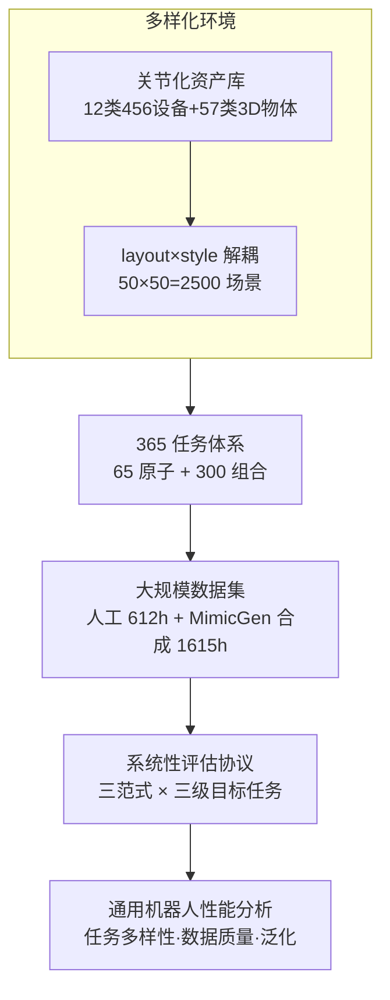

# RoboCasa365: A Large-Scale Simulation Framework for Training and Benchmarking Generalist Robots

**会议**: ICLR 2026  
**arXiv**: [2603.04356](https://arxiv.org/abs/2603.04356)  
**代码**: [https://robocasa.ai](https://robocasa.ai) (项目主页，含开源代码和模型)  
**领域**: 机器人学 / 仿真基准 / 通用机器人  
**关键词**: 仿真平台, 家庭移动操作, 多任务学习, 基础模型训练, 终身学习

## 一句话总结

RoboCasa365 构建了一个包含 365 个日常厨房任务、2500 个多样化厨房场景和超过 2000 小时机器人交互数据的大规模仿真基准，系统评估了多任务学习、基础模型训练和终身学习三大范式下通用机器人策略的性能表现，发现预训练数据的任务多样性是提升下游泛化能力的关键因素。

## 研究背景与动机

**领域现状**：近年来机器人学习快速发展，π₀、π₀.₅、GR00T N1.5 等大规模机器人基础模型相继出现，展示了在新物体、新环境和新任务上的泛化能力。

**现有痛点**：训练通用机器人需要海量数据，但现有真实世界数据集在多样性和任务覆盖上仍然有限；真实世界评估耗资巨大、噪声明显，难以进行可复现的系统性比较。

**核心矛盾**：现有仿真框架（如 RLBench、LIBERO、robosuite 等）任务数量少、环境多样性低、缺乏大规模配套数据集，无法支撑对通用机器人策略的系统研究。大多数围绕简单桌面操作或单房间场景，无法回答"任务多样性、环境变化、数据规模如何影响泛化"这一核心问题。

**本文目标**：(a) 构建一个足够大规模、足够多样化的仿真基准；(b) 提供系统性的评估协议，覆盖多任务学习、基础模型预训练+微调、终身学习三种范式；(c) 通过大量实验分析影响通用机器人性能的关键因素。

**切入角度**：在已有 RoboCasa 平台基础上大幅扩展——从 100 个场景扩展到 2500 个，从数十个任务扩展到 365 个，从 100K 演示扩展到 500K+ 演示，打造"家庭厨房"领域的 ImageNet 级别基准。

**核心 idea**：通过极大规模的任务-场景-数据三维扩展，构建首个同时满足"大规模任务、大规模场景、大规模数据、系统性基准"四个条件的机器人仿真框架。

## 方法详解

### 整体框架

RoboCasa365 本质上不是一个新算法，而是一条"造数据 + 造评测"的流水线：先把厨房里能交互的东西做成关节化 3D 资产，再把这些资产拼成大量多样化的厨房场景，在场景里定义机器人要完成的任务，最后为这些任务采集大规模演示数据，所有这些素材汇成三套系统性的评测协议。所以它围绕四个核心组件层层递进——**多样化环境（资产 + 场景）→ 365 任务体系 → 大规模数据集 → 系统性评估协议**——每一层都在前一层基础上"放大一个量级"，从而把"任务多样性、环境变化、数据规模到底如何影响泛化"这个问题第一次变得可系统研究。

仿真底座沿用 RoboCasa 的 robosuite + MuJoCo 物理引擎，以 20Hz 运行；机器人是 Franka Panda 机械臂 + Omron 移动底座，动作空间 12 维（7 维末端执行器 + 5 维移动底座）。相比前作 RoboCasa，本文把资产、场景、任务、数据四个维度同时扩了约一个数量级（场景 100→2500、任务约数十→365、演示 100K→500K+）。

### 关键设计

**1. 多样化环境：把资产关节化、再用 layout×style 乘法造出 2500 个厨房**

研究"策略能否泛化到没见过的环境"，前提是手里得有海量且互不雷同的环境，而逐个手搭 2500 个厨房既不现实、也难保多样性。本文分两步解决。第一步把可交互设备从 RoboCasa 的 4 类 20 个扩到 12 类 456 个，补上烤面包机、搅拌机、电水壶等常见电器，3D 物体新增 57 个类别，且每类设备备 20-50 个不同实例撑起外观多样性；关键是所有设备都做成关节化（articulated）MJCF 模型，支持开关门、按按钮、转旋钮等真实交互——而前作里冰箱、烤箱、洗碗机根本不能关节化，无法当操作对象。第二步把场景拆成两个正交维度：空间布局（layout，即户型）从 Zillow 房产平台采集 50 个美国真实厨房构建 50 种，视觉风格（style，即材质/设备/纹理搭配）独立设计 50 种，两者相乘得 $50 \times 50 = 2500$ 个预训练场景——建模成本线性增长、场景数量却呈乘法爆炸。这 2500 个预训练场景与另设的 10 个目标场景在 style 上严格不重叠，于是微调和评估时测到的是对全新环境的泛化、而非对见过场景的记忆。

**2. 365 任务体系：原子任务测单步操作、组合任务测长程规划**

要全面考验通用策略，单一难度的任务集是不够的，得同时覆盖"一步到位的技能"和"十几步的长程规划"。RoboCasa365 沿用原子任务（atomic，单技能）/ 组合任务（composite，多技能序列）的两分法，定义 65 个原子任务（25 个沿用前作 + 40 个新建）和 300 个组合任务（83 个沿用 + 217 个新建），合计 365 个，跨越烧水、烤面包、冲咖啡、洗碗、储存剩菜等 60 种日常活动（再归为 6 个活动族）。组合任务走"LLM 生成任务蓝图（活动→任务名 + 描述 + 涉及物体 + 技能序列）+ 人工编码实现"的半自动管线，任务长度从 1 个子任务一直延伸到 15+ 个子任务。这样原子任务专测单步操作精度、组合任务专测长程推理与规划，且其中 220 个任务需要移动操作（mobile manipulation）、145 个不需要，把"要不要挪底座"这一关键设定也分了开。

**3. 大规模数据集：人工遥操作打底、MimicGen 合成扩量，超过 2000 小时**

训通用策略要海量演示，但纯靠人工遥操作采不起、纯靠合成又质量存疑，本文用两条腿凑出 2000+ 小时数据。预训练数据 = 300 个任务各 100 条人工演示（30K 条，404 小时）+ 60 个原子任务各 10K 条 MimicGen 合成（600K 条，1615 小时）；目标数据 = 50 个代表性任务各 500 条人工演示（25K 条，208 小时）。MimicGen 以约 $100\times$ 的倍率把原子任务数据撑大，看似一本万利——但后续实验恰恰发现这批合成数据质量参差不齐，加进来反而可能拖低下游性能。这条"合成数据并非越多越好"的负面结论不是 bug，而是基准刻意要暴露、并供社区研究的重要产出。

**4. 系统性评估协议：三种学习范式 × 三级目标任务，把"操作"和"泛化"解耦**

如果只报一个总成功率，就分不清模型究竟是基本操作不行还是泛化不行，也分不清不同学习设定的优劣。本文从两个轴向把评测拆开。一个轴是三种学习范式：多任务学习（一把训完所有任务）、基础模型训练（预训练 + 在目标任务上微调）、终身学习（任务按阶段顺序到来）。另一个轴是把 50 个目标任务切成三级——Atomic（18 个，单步操作能力）、Composite-Seen（16 个，预训练见过、测迁移）、Composite-Unseen（16 个，预训练没见过、测零样本泛化）。两轴交叉后，"操作能力"和"泛化能力"被干净地解耦，"预训练对未见任务的增益大于已见任务""任务多样性主要提升泛化"这类结论才能从实验里清楚读出，而不是被一个笼统的平均成功率糊住。

### 评测的策略与设置

基准本身不训新模型，而是统一在语言条件化（language-conditioned）的视觉策略上对比四种 SOTA：扩散策略 **Diffusion Policy**、视觉-语言-动作流匹配模型 **π₀** 及其开放世界增强版 **π₀.₅**、以及 NVIDIA 开源人形基础模型 **GR00T N1.5**；其中 VLA 模型都从公开预训练检查点起步微调。基础模型训练这条协议下，先在全部预训练数据上训练，再分别在三级目标任务上微调，并比较 10%/30%/100% 不同目标数据量的效果，以此量化预训练带来的数据效率增益。

## 实验关键数据

### 多任务学习结果

| 任务分组 | Diffusion Policy | π₀ | π₀.₅ | GR00T N1.5 |
|----------|------------------|----|------|------------|
| Atomic | 15.7% | 36.3% | 39.6% | 43.0% |
| Composite-Seen | 0.2% | 5.2% | 7.1% | 9.6% |
| Composite-Unseen | 1.25% | 0.7% | 1.2% | 4.4% |
| **平均** | **6.1%** | **15.0%** | **16.9%** | **20.0%** |

GR00T N1.5 在所有分组上均表现最佳，Diffusion Policy 最差，说明高容量 VLA 模型在大规模多任务数据上的拟合能力更强。所有方法在 Composite-Unseen 上表现极差，通用性仍是开放挑战。

### 基础模型训练结果

| 任务类型 | 仅预训练 | 仅目标10% | 仅目标30% | 仅目标100% | 预训练+目标10% | 预训练+目标30% | 预训练+目标100% |
|----------|----------|-----------|-----------|------------|----------------|----------------|-----------------|
| Atomic | 41.9% | 38.7% | 50.6% | 60.6% | 56.9% | 59.1% | 68.5% |
| Composite-Seen | 0.0% | 11.0% | 22.7% | 35.0% | 25.4% | 34.6% | 40.6% |
| Composite-Unseen | 0.2% | 11.2% | 27.5% | 33.3% | 22.7% | 30.8% | 42.1% |
| **平均** | **15.1%** | **21.0%** | **34.3%** | **43.7%** | **35.9%** | **42.2%** | **51.1%** |

预训练带来约 **3× 数据效率提升**：预训练+10% 目标数据的性能（35.9%）接近仅用 30% 目标数据的性能（34.3%）。在 Composite-Unseen 上，预训练+100% 目标数据达到 42.1%，远超仅用目标数据的 33.3%，说明预训练对未见任务的泛化增益尤为显著。

### 预训练数据组成分析

| 预训练数据 | Avg (10% target) | Avg (100% target) |
|-----------|-------------------|---------------------|
| 无预训练 | 21.0% | 43.7% |
| Human50 (50 任务) | 34.7% | 50.0% |
| Human300 (300 任务) | 40.0% | 52.5% |
| Human300 + MG60 (合成) | 35.9% | 51.1% |

关键发现：(1) 仅使用人工数据（Human300）的效果**优于**加入 MimicGen 合成数据（Human300+MG60），因为合成数据质量参差不齐；(2) 任务多样性从 50→300 带来显著提升，尤其在低数据量（10%）条件下；(3) 对 Composite-Unseen 任务的提升最为明显（+8.5% at 10%），说明任务多样性对新任务泛化至关重要。

### 终身学习结果

| 训练阶段 | Atomic | 2-3阶段任务 | 4-5阶段任务 | 6+阶段任务 |
|----------|--------|------------|------------|-----------|
| Phase 1 | 41.5% | - | - | - |
| Phase 2 | 13.9% | 24.5% | - | - |
| Phase 3 | 13.9% | 4.8% | 11.3% | - |
| Phase 4 | 10.6% | 1.7% | 2.7% | 4.3% |

终身学习面临严重的灾难性遗忘：Atomic 任务成功率从 Phase 1 的 41.5% 降到 Phase 4 的 10.6%；长程任务本身也更难学习（对角线成功率递减：41.5% → 24.5% → 11.3% → 4.3%）。

### 真实世界迁移

| 方法 | 关电水壶盖 | 取烤箱物品 | 柜台→橱柜 | 放碗架 | 平均 |
|------|-----------|-----------|----------|--------|------|
| 仅真实 | 70% | 70% | 52% | 55% | 61.8% |
| 仿真+真实 | 70% | 100% | 84% | 65% | 79.8% |

使用仿真数据联合训练后平均成功率从 61.8% 提升至 79.8%（+18.1%），验证了仿真基准对真实世界的实用价值。

## 亮点与洞察

- **数据质量 > 数据数量的实证**：MimicGen 合成数据将原子任务数据量扩大了 100×，但加入后下游性能反而下降。这在 Robot Foundation Model 的数据策略上发出警示——盲目扩大合成数据规模可能适得其反，筛选和质量控制是关键。
- **任务多样性的非线性收益**：50→300 任务的预训练数据扩展在低数据 regime 下带来了近 2× 的提升，且对未见任务的增益超过对已见任务的增益，揭示了"任务多样性是泛化的燃料"这一关键洞见。
- **layout × style 解耦的场景生成**：通过将厨房空间布局和视觉风格解耦，50×50 组合生成 2500 个场景，巧妙地在有限建模成本下实现了指数级场景多样性。这一设计思路可以迁移到其他需要大规模环境变化的领域（如自动驾驶场景生成）。
- **LLM 辅助的任务系统设计**：用 LLM 生成活动列表→任务蓝图→人工编码的管线，平衡了任务多样性和质量控制，比纯人工设计或纯自动化都更实用。

## 局限与展望

- **仅限厨房场景**：所有 2500 个场景都是厨房，结论能否迁移到卧室、客厅、办公室等其他家庭/商业环境尚不确定。
- **Sim-to-Real Gap**：虽然验证了仿真+真实联合训练的有效性，但只在 4 个简单任务上做了真实世界对比，且使用了特定的相机视角对齐方法，可推广性有限。
- **MimicGen 数据质量问题**：论文发现合成数据降低了性能但未深入分析原因，也未尝试数据筛选/加权策略。开发更有效利用大规模混合质量数据集的方法是重要的未来方向。
- **终身学习基准设计较简单**：四阶段顺序学习的设置是最基本的终身学习场景，未考虑主动数据回放、弹性权重固化等经典 CL 方法的集成。
- **物理保真度**：MuJoCo 在流体、软体、布料等方面的建模能力有限，这限制了可以模拟的任务类型（如做菜、倒水等涉及流体的任务）。
- **单一机器人形态**：仅使用 Franka Panda + 移动底座，未测试双臂或人形机器人，限制了对多形态泛化的研究。

## 相关工作与启发

- **vs RoboCasa (RSS 2024)**：RoboCasa365 是 RoboCasa 的大幅扩展版（100→2500 场景，~100→365 任务，100K→500K+ 演示），增加了 MimicGen 合成数据和三种基准评估协议。本文的主要贡献在规模和系统性实验上。
- **vs LIBERO (NeurIPS 2023)**：LIBERO 仅有 130 个任务且环境多样性有限，专注于终身学习；RoboCasa365 任务数量是其 2.8 倍，且覆盖多任务、预训练、终身学习三种范式。
- **vs BEHAVIOR-1K (CoRL 2023)**：BEHAVIOR-1K 提供了 1000 个活动的多样性，但缺乏配套的大规模数据集；RoboCasa365 虽然活动数量少（60 个活动），但每个任务都配有数百条高质量演示。
- **vs ManiSkill 系列**：ManiSkill 侧重通用物体操作和 GPU 并行仿真，支持更丰富的物理交互；RoboCasa365 侧重房间级场景的日常任务，二者定位互补。

## 评分

- 新颖性: ⭐⭐⭐ — 核心技术贡献是工程性的规模扩展，方法论新颖性有限
- 实验充分度: ⭐⭐⭐⭐⭐ — 四种 SOTA 方法对比 + 三种训练范式 + 数据组成消融 + 真实世界验证，实验体系非常完整
- 写作质量: ⭐⭐⭐⭐ — 结构清晰，实验讨论深入，图表丰富
- 价值: ⭐⭐⭐⭐ — 作为机器人通用策略的标准化评估基准，对社区有很高的基础设施价值；数据组成分析的发现对数据策略制定有直接指导意义

<!-- RELATED:START -->

## 相关论文

- [\[ICLR 2026\] Rethinking Policy Diversity in Ensemble Policy Gradient in Large-Scale Reinforcement Learning](rethinking_policy_diversity_in_ensemble_policy_gradient_in_large-scale_reinforce.md)
- [\[ICLR 2026\] Towards Bridging the Gap between Large-Scale Pretraining and Efficient Finetuning for Humanoid Control](towards_bridging_the_gap_between_large-scale_pretraining_and_efficient_finetunin.md)
- [\[ICML 2026\] RoboMME: Benchmarking and Understanding Memory for Robotic Generalist Policies](../../ICML2026/robotics/robomme_benchmarking_and_understanding_memory_for_robotic_generalist_policies.md)
- [\[CVPR 2026\] QuantVLA: Scale-Calibrated Post-Training Quantization for Vision-Language-Action Models](../../CVPR2026/robotics/quantvla_scale-calibrated_post-training_quantization_for_vision-language-action_.md)
- [\[ICLR 2026\] UrbanVerse: Scaling Urban Simulation by Watching City-Tour Videos](urbanverse_scaling_urban_simulation_by_watching_city-tour_videos.md)

<!-- RELATED:END -->
