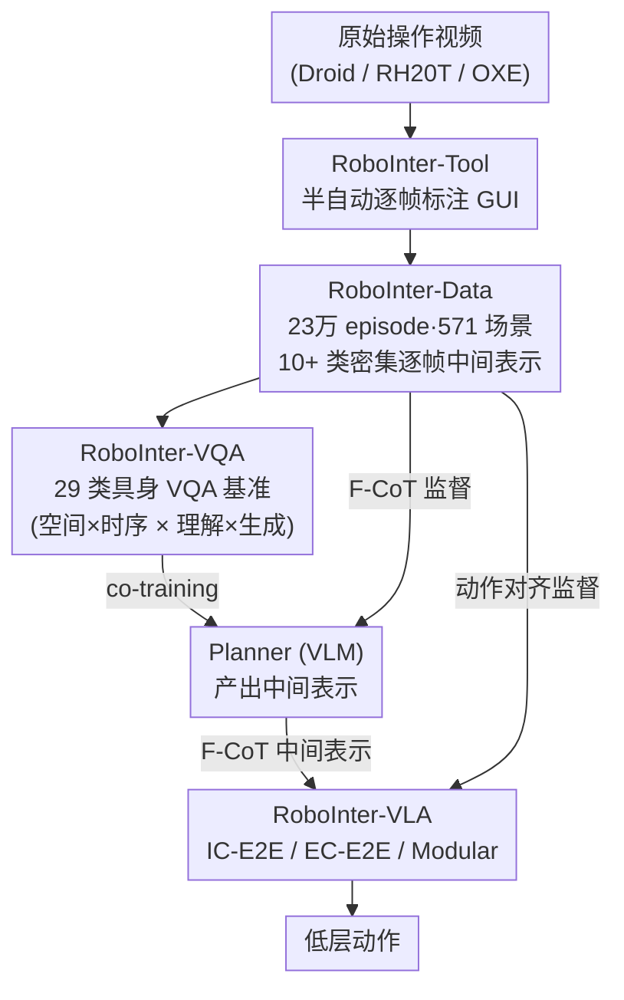

# RoboInter: A Holistic Intermediate Representation Suite Towards Robotic Manipulation

**会议**: ICLR 2026  
**arXiv**: [2602.09973](https://arxiv.org/abs/2602.09973)  
**代码**: [GitHub](https://github.com/RoboInter)  
**领域**: 机器人学习 / 数据集  
**关键词**: 中间表示, VLA, 操作数据集, 具身VQA, plan-then-execute

## 一句话总结

提出 RoboInter 操作套件——统一的中间表示数据/基准/模型资源：RoboInter-Tool（半自动标注 GUI）+ RoboInter-Data（23 万 episode × 571 场景 × 10+ 类中间表示的密集逐帧标注）+ RoboInter-VQA（29 类具身 VQA 基准）+ RoboInter-VLA（支持模块化和端到端的 plan-then-execute 框架），为通过中间表示提升 VLA 泛化提供完整基础设施。

## 研究背景与动机

**领域现状**：VLA（Vision-Language-Action）系统将大规模预训练 VLM 与机器人操作相结合，但现有操作数据集存在成本高、embodiment 特异、覆盖不足等问题。Plan-then-execute 范式（先生成高层规划再翻译为低层动作）已被验证是提升泛化的有效思路，但其核心依赖中间表示（subtask、trace、grounding 等）的监督信号。

**现有痛点**：

1. 现有数据集几乎不提供密集的中间表示标注 → 限制 plan-then-execute 方法的发展
2. 已有标注工作要么规模小（ShareRobot 仅 51k），要么标注类型单一（LLARVA 只有 trace），要么依赖自动标注质量不可控（ECoT）
3. 缺乏系统评估 VLM 在具身场景中空间/时序推理能力的基准
4. 模块化 vs 端到端 VLA 的对比缺乏统一框架和数据支撑

**核心矛盾**：plan-then-execute 范式的潜力已被验证，但缺乏大规模、高质量、多类型的中间表示标注数据来真正释放这一潜力。

**本文方案**：构建完整的中间表示生态系统——从标注工具（RoboInter-Tool）到数据（RoboInter-Data）到基准（RoboInter-VQA）到模型框架（RoboInter-VLA），一站式解决数据、评估和方法三大瓶颈。

## 方法详解

### 整体框架

RoboInter 是围绕"中间表示"搭建的一整套基础设施，目标是补上 plan-then-execute 范式最缺的那块——大规模、多类型、密集对齐的中间表示监督。整套套件像一条从"造数据"到"用数据"的流水线：标注工具 RoboInter-Tool 在原始操作视频（Droid / RH20T / OXE）上做半自动逐帧标注，沉淀出 RoboInter-Data（23 万+ episode、571 场景、10+ 类中间表示的密集逐帧标注）；这些标注再被重组成 RoboInter-VQA（29 类具身 VQA 基准），既能体检现有 VLM 的具身推理能力，又能 co-training 出一个具身 Planner；最后 RoboInter-VLA 用 Planner + Executor 的 plan-then-execute 框架，把中间表示以 F-CoT 的形式真正喂进策略学习。前两块解决"数据从哪来"，后两块解决"数据怎么用来评估和提升 VLA"。

### 关键设计

**1. RoboInter-Tool 与多层次中间表示标注：把一段操作拆成可监督的细粒度信号**

Plan-then-execute 的瓶颈在于缺少密集且多类型的监督，单一类型（如只有 trace）的标注撑不起完整的规划链路，而纯自动标注又质量不可控。RoboInter-Tool 走 human-in-the-loop 的半自动路线，把标注组织成由粗到细的三个层次：任务层把视频按 15 种预定义原始技能（Pick、Place、Push、Pull 等）切成片段，用 ChatGPT 先给语言描述初稿、再由人工修订片段级和视频级描述，并记录机械臂接触物体的接触帧；物体层在标好交互物体后自动调 SAM2 做分割与跟踪、异步返回供人工复核，产出约 6100 万帧物体 grounding 标注；执行层则因许多原始录像缺相机参数，先估一个标定矩阵、再用夹爪检测加点跟踪补全，重建末端执行器的 2D 轨迹（约 7000 万帧 trace），并由接触帧反推 affordance box、接触点、6D 抓取位姿和夹爪 bounding box（共约 19 万 affordance box 与 placement proposal）。关键在于所有标注都在时间轴上与动作、机器人状态、第三视角与腕部视角观测严格对齐，因此同一帧能同时取出技能标签、物体框、affordance 和 trace，供下游按需组合而不会错位。

**2. RoboInter-VQA：把标注重组成可体检也可训练的具身推理基准**

有了密集标注，光当监督信号还不够——现有 VLM 在具身场景里的空间/时序推理能力到底强不强，缺一把统一的尺子。RoboInter-VQA 沿两个轴把标注重组成 29 类任务：一轴是中间表示的空间 vs 时序（9 类空间 + 20 类时序），另一轴是目标能力的理解 vs 生成。空间侧用选择/判断题考"选对物体框、选对抓取位姿、判断是否接触"，并用预测题要求模型生成物体框、抓取位姿、placement、关键点、夹爪框；时序侧考夹爪运动方向、trace 与描述匹配、子任务/技能区分、执行阶段识别，以及 trace 生成与多步规划（按给定的历史信息量预测后续步骤）。这套基准既能横向暴露各家 VLM 的具身短板，又能反过来 co-training 出 RoboInter-VLA 的高层 Planner，让"评估"和"训练"复用同一份标注。

**3. F-CoT 灵活思维链：用可裁剪的中间表示串起 Planner 与 Executor**

不同任务对中间表示的需求并不相同——精确抓取更依赖 affordance 和接触点，长程搬运更依赖 subtask 和 trace——固定一套思维链既冗余又不够。为此引入 Flexible Chain-of-Thought（F-CoT），它由多种中间表示（subtask、skill、object box、affordance box、trace 等）自由组合而成，扮演两个角色：对 Planner 它是 VQA 形式的训练监督，对 Executor 它是与动作对齐的条件指导。F-CoT 既可以是纯文本（对应 Te-Modular），也可以是叠加在图像上的视觉提示（对应 Im-Modular），用户能按任务挑子集（如 subtask + trace、或 affordance + skill）。这种"按需取用"让同一份多层次标注适配不同操作场景，而不被单一固定链路束缚。

**4. 三种 Plan-then-Execute VLA 变体：在统一框架下对比中间表示的使用方式**

中间表示到底是隐式喂给策略好，还是显式生成出来再约束动作好，此前缺乏同框架的公平比较。RoboInter-VLA 在同一套数据和骨干下给出三种变体：IC-E2E（Implicitly-Conditioned）把预训练 Planner 的 VLM 当作 Executor 的特征提取器，中间表示仅以预训练权重的形式隐式存在；EC-E2E（Explicitly-Conditioned）让 Executor 用 Planner 的 VLM 初始化，联合优化中间表示推理与动作生成，属于显式但端到端；Modular 则把 Planner 与 Executor 彻底分离，训练时 Executor 用真值中间表示作条件、推理时改用 Planner 预测的中间表示，是显式且解耦的形式。三者共享同一个 Executor 实现——Qwen2.5-VL 骨干接 DiT（Diffusion Transformer）action head，并通过一个信息聚合器把所有输入/输出 token 及中间表示的隐藏状态压缩成可控长度的条件特征——从而把性能差异干净地归因到中间表示的使用方式，而非骨干或动作头的差别。

## 实验与结果

### 主实验：第三方基准上的 VLM 能力评估

| 模型 | Where2Place ↑ | RoboRefIt ↑ | RoboVQA ↑ | RefCOCOg ↑ |
|------|:---:|:---:|:---:|:---:|
| QwenVL2.5-7B | 18.9% | 75.8% | 38.4 | 87.2% |
| RoboBrain-2.0-7B | 63.6% | 8.8% | 31.6 | 62.9% |
| **RoboInter-Qwen-7B** | **65.8%** | **85.6%** | **74.4** | **88.4%** |
| RoboInter-LLaVAOV-7B | 66.3% | 89.3% | 74.5 | 87.3% |

RoboInter-VLM 在所有具身基准上大幅超越基线，同时保持通用能力稳定（TextVQA 83.0、MME 2281）。

### Open-Loop 执行器评估

| 方法 | OLS@0.1 | OLS@0.05 | OLS@0.01 | mOLS |
|------|:---:|:---:|:---:|:---:|
| Vanilla | 0.6793 | 0.3608 | 0.0189 | 0.3086 |
| IC-E2E | 0.6984 | 0.3810 | 0.0204 | 0.3218 |
| EC-E2E | 0.7049 | 0.3930 | 0.0314 | 0.3340 |
| **Te-Modular** | **0.7124** | **0.4133** | **0.0584** | **0.3543** |
| Oracle+Executor | 0.7511 | 0.4640 | 0.0587 | 0.3861 |

Te-Modular（文本 F-CoT + 模块化架构）取得学习方法中最佳结果，解耦规划和执行有利于各自专注优化。

### 消融实验：中间表示类型的贡献

| 中间表示组合 | mOLS |
|------------|:---:|
| Vanilla（无中间表示） | 0.3086 |
| + Subtask | 0.3146 |
| + Subtask + Primitive Skill | 0.3159 |
| + ... + Object Box | 0.3289 |
| + ... + Gripper Box | 0.3391 |
| + ... + Affordance | 0.3435 |
| + ... + **Trace** | **0.3861** |

粗粒度表示（Subtask、Skill）贡献边际，空间精确的信号（Object Box、Affordance）贡献显著，**Trace 提供了最大收益**（密集时序信息直接约束动作生成）。

### 真实世界闭环评估

| 模型 | ID 平均成功率 | OOD 平均成功率 | ID→OOD 下降 |
|------|:---:|:---:|:---:|
| OpenVLA | 45.0% | 23.3% | 21.7% |
| π₀ | 63.3% | 45.0% | 18.3% |
| Vanilla | 65.0% | 38.3% | 26.7% |
| IC-E2E | 77.3% | 58.3% | 19.0% |
| **EC-E2E** | 68.3% | **60.0%** | **8.3%** |

EC-E2E 在 OOD 上表现最优且下降最小（仅 8.3%），显式中间表示推理提供了更强的泛化鲁棒性。

## 论文评价

### 优点

1. **系统性极强**：从标注工具到数据到基准到模型框架，对中间表示的研究提供了"全家桶"式基础设施
2. **规模可观**：23 万 episode + 571 场景 + 6100 万帧 grounding 标注，远超现有工作
3. **实验完整**：open-loop / closed-loop / 跨平台 / SimplerEnv / 消融实验全覆盖
4. **洞察深刻**：系统验证了中间表示粒度、架构设计选择（模块化 vs E2E）对性能的影响

### 不足

1. VQA 数据来自模板 + 重组标注，多样性受限于标注模板的设计
2. 真实世界实验仅在 4 个任务上评估，泛化到更复杂长序列任务的效果未知
3. 模块化 Planner 推理延迟较高（~2.4s），实际部署需要异步推理等工程优化

### 评分

⭐⭐⭐⭐⭐

RoboInter 是机器人中间表示研究的里程碑式工作。它不仅提供了迄今为止最大规模的多类型中间表示数据集，还通过 VQA 基准和 VLA 框架的系统设计，为 plan-then-execute 范式的研究搭建了完整的实验平台。消融实验清晰揭示了 Trace > Affordance > Object Box > Subtask 的中间表示价值层级，这一洞察对未来的具身 AI 研究具有重要指导意义。

<!-- RELATED:START -->

## 相关论文

- [\[CVPR 2026\] Rethinking Intermediate Representation for VLM-based Robot Manipulation](../../CVPR2026/robotics/rethinking_intermediate_representation_for_vlm-based_robot_manipulation.md)
- [\[CVPR 2026\] Language-Grounded Decoupled Action Representation for Robotic Manipulation (LaDA)](../../CVPR2026/robotics/lada_robotic_manipulation.md)
- [\[ICLR 2026\] MemoryVLA: Perceptual-Cognitive Memory in Vision-Language-Action Models for Robotic Manipulation](memoryvla_perceptual-cognitive_memory_in_vision-language-action_models_for_robot.md)
- [\[ICLR 2026\] When would Vision-Proprioception Policies Fail in Robotic Manipulation?](when_would_vision-proprioception_policies_fail_in_robotic_manipulation.md)
- [\[ICLR 2026\] TwinVLA: Data-Efficient Bimanual Manipulation with Twin Single-Arm Vision-Language-Action Models](twinvla_data-efficient_bimanual_manipulation_with_twin_single-arm_vision-languag.md)

<!-- RELATED:END -->
