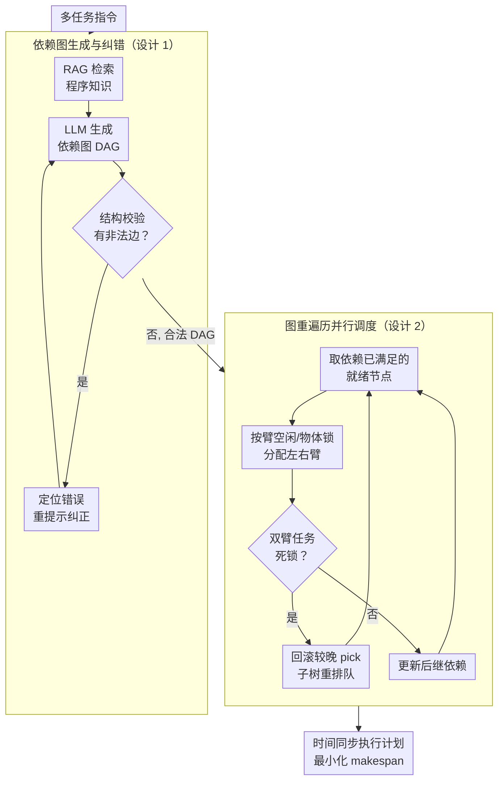

# RoboPARA: Dual-Arm Robot Planning with Parallel Allocation and Recomposition Across Tasks

**会议**: ICLR 2026  
**arXiv**: [2506.06683](https://arxiv.org/abs/2506.06683)  
**代码**: [https://github.com/AiDuanshiying/RoboPARA](https://github.com/AiDuanshiying/RoboPARA)  
**领域**: 机器人 / 任务规划  
**关键词**: 双臂机器人, 并行任务规划, DAG依赖图, LLM规划, 多任务调度

## 一句话总结
提出 RoboPARA 框架，通过依赖图构建和图重遍历两阶段优化双臂机器人的任务并行性，在多场景基准上实现相比现有方法 30-50% 的执行时间缩减和 34% 的成功率提升。

## 研究背景与动机

**领域现状**：LLM 驱动的双臂机器人任务规划（如 RoCo、FLTRNN）已取得进展，但这些方法主要优化任务成功率和完成时间，大多产生单臂顺序执行的计划。

**现有痛点**：现有方法忽略了双臂间的并行性——当一个任务只需要一只手臂时，另一只手臂完全空闲。这导致双臂系统的协作潜力未被充分利用，执行效率低下。

**核心矛盾**：双臂并行规划需要同时处理任务间的依赖关系（某些步骤必须按序执行）和并行机会（独立步骤可以同时分配给两只手臂），这是一个组合优化问题。

**本文目标** 在保证任务正确性的前提下，最大化双臂的并行利用率，减少执行时间。

**切入角度**：借鉴人类日常行为——烧水的同时刷牙，利用 DAG（有向无环图）建模任务依赖关系，然后通过图遍历调度算法最大化并行度。

**核心 idea**：将双臂任务规划解耦为"LLM 生成依赖图→调度算法最大化并行"两阶段，让 LLM 专注于理解任务语义而非直接规划并行。

## 方法详解

### 整体框架
RoboPARA 把双臂并行规划形式化为"双臂协同调度问题"，并拆成两步走：第一步让 LLM 把一组多任务指令翻译成一张刻画依赖关系的有向无环图（DAG, directed acyclic graph）并自我纠错，第二步用一套确定性的图重遍历算法在这张图上为左右两臂分配可并行的步骤。这样 LLM 只需专注理解"哪步必须在哪步之后做"，而把"如何排布才能在保证依赖正确的前提下最小化总执行时间"这个组合优化问题交给图算法处理。整个流程不训练任何参数；为了能衡量这种并行能力，作者还另外构建了 X-DAPT 数据集作为评测底座（它不属于运行时 pipeline，而是评估维度，见关键设计 3）。

### 关键设计

**1. 依赖图生成与纠错：把任务语义沉淀成可调度的结构**

并行规划的第一个难点是让 LLM 输出的计划既正确又"可被并行化"。RoboPARA 用 RAG（检索增强生成）从混合记忆系统里检索任务相关知识——既含短期观测（物体状态），也含长期执行历史（任务包知识库），再把环境约束、依赖规则、并行指引、格式样例拼成结构化提示，引导 LLM 把多任务指令转写成一张 DAG：节点是原子操作（pick / use / place / open-close / complete 等类型），每条边 $(u \rightarrow v)$ 表示步骤 $v$ 必须等 $u$ 完成后才能开始，所有终止依赖汇聚到唯一的 complete 汇点。DAG 这种结构天然契合并行调度——依赖都已满足的节点可以立即执行，当多个这样的节点同时存在时就构成了并行机会。但 LLM 初次生成的图常含非法依赖，作者用一道结构校验例程专门检测三类典型错误：①某 use/place 错误地依赖了另一物体的 place；②pick-use-place 序列里的 place 直接依赖 pick 而非中间的 use；③某节点依赖了无关物体的 use。一旦定位到错误，就把相关节点与依赖规则写进新提示让 LLM 迭代重生成，直到产出一张干净合法的 DAG 再交给调度器。

**2. 图重遍历并行调度：在合法图上贪心榨出最大并行度**

有了正确的依赖图，下一步是决定每只手臂在每个时刻做什么。求最优并行排布本质是 NP 难的组合优化，RoboPARA 转而用一套确定性的图重遍历算法近似求解，目标是最小化 makespan（整批任务的最晚完成时刻）$C_{\max} = \max_{v}\big(\sigma(v) + t_v\big)$，其中 $\sigma(v)$ 是步骤 $v$ 的开始时间、$t_v$ 是其时长。算法维护一个动态就绪队列 $\mathcal{Q}$，只放入所有前驱都已被调度的节点 $\texttt{Ready}(v)$；每轮从队列里取节点按臂可用性、任务类型（单臂 $\delta_v{=}1$ 或双臂 $\delta_v{=}2$）和物体持有一致性分配：单臂任务派给空闲臂（两臂都空时偏向左臂），双臂协作任务（如一手扶一手拧）则要求两臂同时空闲并同步起停。分配受四类约束保障正确性：依赖约束（$\sigma(v) \ge \max_{u \in \text{pred}(v)}(\sigma(u)+t_u)$）、同臂不重叠占用、同一物体的 pick-use-place 必须由同一只臂完成（臂锁），以及死锁预防——当一个双臂任务就绪、但两臂分别被不同物体锁住时，回滚两条冲突链里较晚的那个 pick 及其后继子树重新入队，腾出手臂让较早的链先走完，再重新调度该双臂任务。把语义正确性交给 DAG 生成、把并行度优化交给这层带回滚的调度，是 RoboPARA 能在不牺牲正确性的前提下大幅提速的关键。

**3. X-DAPT 基准：把"并行性"做成可量化的评估维度**

现有双臂规划基准只看成功率和完成时间，无法衡量两臂究竟协作了多少，导致并行能力既无法对比也无从改进。RoboPARA 因此构建了 X-DAPT（Cross-Scenario Dual-Arm Parallel Task）——首个专门评估双臂任务并行性的数据集，覆盖厨房、办公室、农业温室、工厂、超市、医院、灾难救援、酒店、宠物店、图书馆等 10 个场景，每个场景分简单/中等/困难三档（步数越多越难），共 1000+ 任务包。它配套引入四个指标：TEI（时间效率指标）、TFR（任务失败率）、PPR（并行步数占总步数的比例）和 APR（平均并行度）。其中 PPR 和 APR 直接刻画两臂同时工作的程度，正是衡量协作效率、也是 RoboPARA 相比顺序执行方法拉开差距的核心维度。

### 损失函数 / 训练策略
无需训练——整个框架建立在 LLM 的零样本/少样本推理与确定性调度算法之上（实验用 GPT-4o / DeepSeek V3 作为底座 LLM、m3e-base 作记忆检索器），不涉及任何参数更新。

## 实验关键数据

### 主实验

| 方法 | TEI ↑ | TFR ↓ | PPR ↑ | APR ↑ | 场景 |
|------|-------|-------|-------|-------|------|
| RoboPARA | 0.953 | 0.033 | 0.543 | 0.283 | 厨房 |
| Embodied TaPA | 0.859 | 0.200 | 0.000 | 0.080 | 厨房 |
| RoCo | 0.836 | 0.067 | 0.008 | 0.041 | 厨房 |
| ChatGPT-Prompts | 0.817 | 0.081 | 0.000 | 0.010 | 厨房 |
| LLM-Planner | 0.858 | 0.200 | 0.000 | 0.077 | 厨房 |

### 消融实验

| 配置 | PPR | APR | 说明 |
|------|-----|-----|------|
| RoboPARA (完整) | 0.543 | 0.283 | 完整框架 |
| w/o 图纠错 | ~0.35 | ~0.18 | DAG 生成可能含循环/冗余 |
| w/o RAG 检索 | ~0.40 | ~0.20 | 任务分解质量下降 |

### 关键发现
- RoboPARA 平均实现 4.5× 以上的并行和协作步数，执行时间减少 30-50%
- 在最复杂任务组合中，RoboPARA 成功率比其他方法平均高 34%
- 所有 baseline 方法的并行步数接近零（PPR ≈ 0），证实现有方法完全忽略并行性
- 在真实人形机器人上的部署展示了接近人类活动模式的行为

## 亮点与洞察
- **规划-调度解耦设计**：让 LLM 专注于任务语义理解和依赖关系建模，将 NP 难的调度问题交给确定性算法，是合理的职责分工
- **并行性作为评估维度**：首次将并行度作为双臂机器人的核心评估指标，PPR/APR 指标可推广到多机器人协作场景

## 局限与展望
- DAG 生成仍依赖 LLM 的推理能力，对复杂跨任务依赖可能出错
- 调度算法使用启发式而非最优求解，可能遗漏最优并行方案
- 假设每个原子操作的执行时间已知或可预估，实际中可能不成立
- 未考虑执行过程中的动态重规划（如某步失败后的恢复策略）

## 相关工作与启发
- **vs RoCo**: RoCo 让 agent 通过对话协商来分解和分配任务，但产生的计划仍以顺序执行为主；RoboPARA 显式优化并行度
- **vs FLTRNN**: FLTRNN 使用 RNN 结构进行长期规划，关注任务分解和记忆管理，不关注双臂并行

## 评分
- 新颖性: ⭐⭐⭐⭐ 首个系统性关注双臂并行度的 LLM 规划框架
- 实验充分度: ⭐⭐⭐⭐ 丰富的 baseline 对比和多场景评测
- 写作质量: ⭐⭐⭐⭐ 动机清晰、方法描述充分
- 价值: ⭐⭐⭐⭐ 对多臂/多机器人任务调度有实际指导意义

<!-- RELATED:START -->

## 相关论文

- [\[CVPR 2025\] RoboTwin: Dual-Arm Robot Benchmark with Generative Digital Twins](../../CVPR2025/robotics/robotwin_dual-arm_robot_benchmark_with_generative_digital_twins.md)
- [\[ICLR 2026\] ExoPredicator: Learning Abstract Models of Dynamic Worlds for Robot Planning](exopredicator_learning_abstract_models_of_dynamic_worlds_for_robot_planning.md)
- [\[ICLR 2026\] REI-Bench: Can Embodied Agents Understand Vague Human Instructions in Task Planning?](rei-bench_can_embodied_agents_understand_vague_human_instructions_in_task_planni.md)
- [\[ICLR 2026\] TwinVLA: Data-Efficient Bimanual Manipulation with Twin Single-Arm Vision-Language-Action Models](twinvla_data-efficient_bimanual_manipulation_with_twin_single-arm_vision-languag.md)
- [\[ICML 2026\] HDFlow: Hierarchical Diffusion-Flow Planning for Long-horizon Tasks](../../ICML2026/robotics/hdflow_hierarchical_diffusion-flow_planning_for_long-horizon_tasks.md)

<!-- RELATED:END -->
