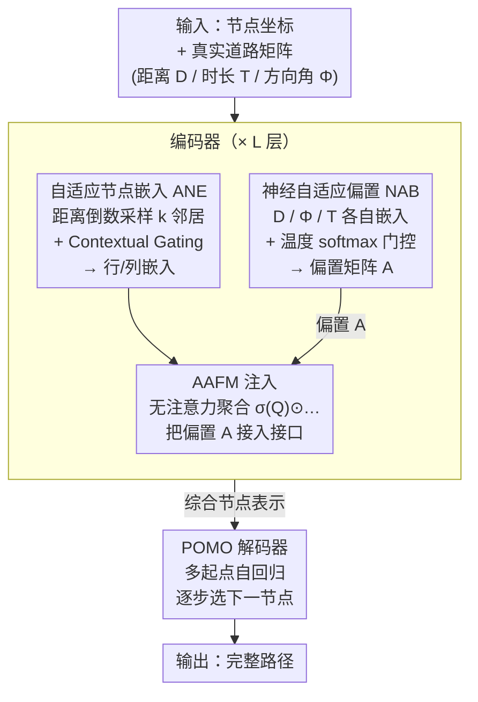

# RRNCO: Towards Real-World Routing with Neural Combinatorial Optimization

**会议**: ICLR 2026  
**arXiv**: [2503.16159](https://arxiv.org/abs/2503.16159)  
**代码**: [https://github.com/ai4co/real-routing-nco](https://github.com/ai4co/real-routing-nco)  
**领域**: 组合优化 / 神经路由规划  
**关键词**: Neural Combinatorial Optimization, Vehicle Routing Problem, Asymmetric Routing, Sim-to-Real Gap, Attention-Free Module

## 一句话总结

提出 RRNCO 架构，通过自适应节点嵌入（ANE）和神经自适应偏置（NAB）两大创新，首次在深度路由框架中联合建模非对称距离、时长和方向角，并构建了基于 100 个真实城市的 VRP 基准数据集，显著缩小了 NCO 方法从仿真到真实世界部署的差距。

## 研究背景与动机

**车辆路由问题（VRP）是物流优化的核心**：VRP 是一类 NP-hard 组合优化问题，广泛应用于末端配送、灾害救援、城市出行等场景。2025 年全球物流市场规模超过 10 万亿美元，路由效率的提升具有巨大的成本节约和环保价值。

**NCO 方法在合成数据上表现优秀但脱离实际**：神经组合优化通过强化学习自动学习启发式策略，在合成 VRP 实例上取得了令人印象深刻的结果，但主要依赖简化的对称欧式距离数据，无法反映真实道路网络的非对称性（单行道、交通模式、转弯限制等）。

**Sim-to-Real Gap 的两个根源**：
   - **数据层面**：训练和测试使用的合成数据集（如 TSPLIB、CVRPLIB）假设对称距离 $d_{ij}=d_{ji}$，与现实不符
   - **架构层面**：现有 NCO 架构基于节点级 Transformer，本质上无法高效处理边特征（非对称距离/时长矩阵）

**已有真实数据集的局限**：少数已有工作依赖商业 API、静态不可在线生成、速度慢且常不公开，同时缺少行驶时长信息。

**现有边特征编码方法不足**：MatNet 的行/列嵌入、GOAL 的交叉注意力虽然引入了部分边信息，但通常只处理单一代价矩阵，无法融合距离、时长、方向角等多模态非对称特征。

## 方法详解

### 整体框架

RRNCO 是一个编码器-解码器（encoder-decoder）架构：编码器把节点坐标和真实道路矩阵（距离、时长、方向角）压缩成一组综合节点表示，解码器再以 POMO 风格自回归地逐步选下一个节点、拼出完整路径。所有针对"真实世界非对称性"的创新都集中在编码器端——先用自适应节点嵌入（Adaptive Node Embedding, ANE）把距离信息注入节点表示并派生行/列嵌入，再用神经自适应偏置（Neural Adaptive Bias, NAB）把距离、时长、方向角三种边特征学成一张偏置矩阵，最后把这张偏置接进无注意力模块 AAFM 的聚合接口，让堆叠 $L$ 层的编码器始终带着"这条边好不好走"的非对称先验。

### 关键设计

**1. 自适应节点嵌入（ANE）：让节点表示带上真实距离信息**

真实道路的距离矩阵 $\mathbf{D} \in \mathbb{R}^{N \times N}$ 是非对称的，但若直接把整张 $N \times N$ 矩阵塞进编码器，计算量是 $O(N^2)$ 级别的负担；可只用节点坐标又会把"两点间实际开车多远"这一关键信息丢光。ANE 的做法是对每个节点按距离倒数做概率加权采样，只取 $k$ 个最相关的邻居：采样概率 $p_{ij} = \frac{1/d_{ij}}{\sum_{j} 1/d_{ij}}$，越近的邻居越可能被选中，从而在 $O(Nk)$ 的代价下保留了非对称邻域的主要结构。采样得到的距离经一条线性投影变成 $\mathbf{f}_{\text{dist}}$，坐标经另一条投影变成 $\mathbf{f}_{\text{coord}}$，两者再用一个 Contextual Gating 融合：门控权重 $\mathbf{g} = \sigma(\text{MLP}([\mathbf{f}_{\text{coord}}; \mathbf{f}_{\text{dist}}]))$ 由两路特征共同决定，融合结果 $\mathbf{h} = \mathbf{g} \odot \mathbf{f}_{\text{coord}} + (1 - \mathbf{g}) \odot \mathbf{f}_{\text{dist}}$ 让模型自己学到"何时该信坐标、何时该信距离"。最后借鉴 MatNet 的思路，从 $\mathbf{h}$ 分别派生行嵌入 $\mathbf{h}^r$ 和列嵌入 $\mathbf{h}^c$，用两套表示分别编码非对称关系的去向和来向两个方向。

**2. 神经自适应偏置（NAB）：把距离、时长、方向角学成一张偏置矩阵**

AAFM 这类无注意力模块原本靠一个手工偏置 $A = -\alpha \cdot \log(N) \cdot d_{ij}$ 来注入空间结构，但这个公式只认距离，既不知道单行道带来的方向不对称，也建模不了时长和距离之间的非线性关系（堵车路段距离短却耗时长）。NAB 把这块偏置改成数据驱动：先把三种边特征各自嵌入一遍，距离 $\mathbf{D}$、方向角 $\mathbf{\Phi}$、时长 $\mathbf{T}$ 分别过一个两层 ReLU 投影，

$$\mathbf{D}_{emb} = \text{ReLU}(\mathbf{D}\mathbf{W}_D)\mathbf{W}'_D, \quad \mathbf{\Phi}_{emb} = \text{ReLU}(\mathbf{\Phi}\mathbf{W}_\Phi)\mathbf{W}'_\Phi, \quad \mathbf{T}_{emb} = \text{ReLU}(\mathbf{T}\mathbf{W}_T)\mathbf{W}'_T$$

其中方向角由 $\phi_{ij} = \text{arctan2}(y_j - y_i, x_j - x_i)$ 给出，显式刻画了 $i \to j$ 的朝向（这正是单行道效应的来源）。三路嵌入再经一个带可学习温度 $\tau$ 的 softmax 门控加权融合，让模型按情境分配三种模态的权重，最后投影成标量偏置矩阵 $\mathbf{A} = \mathbf{H}\mathbf{w}_{out} \in \mathbb{R}^{B \times N \times N}$。相比手工偏置只能编码一维距离，NAB 把三种非对称信号耦合进同一张偏置里，这也是后文消融中性能提升最大的来源。

**3. AAFM 注入：用无注意力模块吸收非对称偏置**

编码器的骨架是 Zhou et al. (2024a) 提出的无注意力模块 AAFM，定义为 $\text{AAFM}(Q,K,V,A) = \sigma(Q) \odot \frac{\exp(A) \cdot (\exp(K) \odot V)}{\exp(A) \cdot \exp(K)}$。它绕开了标准注意力的 $O(N^2)$ softmax，用逐元素门控和加权求和近似信息聚合，因此天然有一个偏置项 $A$ 的接口。RRNCO 正是把 NAB 算出的 $\mathbf{A}$ 接到这个位置，使每一层的节点聚合都带上"这条边到底好不好走"的非对称先验，让无注意力的高效骨架也能感知真实路由约束。

### 损失函数 / 训练策略

训练用 REINFORCE 配 POMO 基线的策略梯度，目标是最大化期望回报 $J(\theta) = \mathbb{E}_{\mathbf{x} \sim \mathcal{D}} \mathbb{E}_{\mathbf{a} \sim \pi_\theta(\cdot|\mathbf{x})} [R(\mathbf{a}, \mathbf{x})]$，其中奖励 $R$ 就是路径总代价的负值，POMO 的多起点采样既当基线降方差又增强了解的多样性。训练实例不来自预存的合成数据集，而是用 OSRM 路由引擎从 100 个真实城市在线采样生成，每次都能拿到带真实距离/时长矩阵的新实例，既避免了商业 API 的速度和可得性问题，也让模型直接在贴近部署分布的数据上学习。

## 实验关键数据

### 主实验

在真实世界路由基准上的表现（ATSP 任务，50 节点）：

| 方法 | In-Dist Cost | Gap(%) | OOD-City Cost | Gap(%) | 时间 |
|------|-------------|--------|---------------|--------|------|
| LKH3 | 38.387 | *(best) | 38.903 | *(best) | 1.6h |
| POMO | 51.512 | 34.19 | 50.594 | 30.05 | 10s |
| MatNet | 39.915 | 3.98 | 40.548 | 4.23 | 27s |
| GOAL | 41.976 | 9.35 | 42.590 | 9.48 | 91s |
| **RRNCO** | **39.078** | **1.80** | **39.785** | **2.27** | **23s** |

ACVRP 任务（有容量约束）：

| 方法 | In-Dist Cost | Gap(%) | OOD-City Cost | Gap(%) | 时间 |
|------|-------------|--------|---------------|--------|------|
| PyVRP | 69.739 | *(best) | 70.488 | *(best) | 7h |
| MatNet | 74.801 | 7.26 | 75.722 | 7.43 | 30s |
| AAFM | 76.663 | 9.93 | 77.811 | 10.39 | 11s |
| **RRNCO** | **72.145** | **3.45** | **73.010** | **3.58** | **26s** |

### 消融实验

| 配置 | ATSP Gap(%) | ACVRP Gap(%) |
|------|------------|-------------|
| Full RRNCO | 1.80 | 3.45 |
| 去掉 NAB（用手工偏置） | ~9.35 | ~9.93 |
| 去掉 ANE（仅坐标） | ~34.19 | ~23.16 |
| 去掉方向角 $\Phi$ | 性能下降显著 | - |
| 去掉时长矩阵 $T$ | 性能下降显著 | - |

### 关键发现

1. **RRNCO 在所有真实世界任务上均为 NCO 方法 SOTA**：在 ATSP/ACVRP/ACVRPTW 三种任务、In-Distribution/OOD-City/OOD-Cluster 三种分布下全面领先
2. **与传统求解器差距极小**：ATSP 仅 1.8% 差距于 LKH3，但速度快约 250 倍（23s vs 1.6h）
3. **NAB 是关键创新**：GOAL 和 AAFM 使用手工偏置的差距分别为 9.35% 和 19.81%，而 RRNCO 仅 1.80%
4. **联合建模距离+时长+方向角的收益巨大**：去掉任一模态性能均显著下降
5. **泛化能力强**：OOD-City 和 OOD-Cluster 场景仅有微小性能损失

## 亮点与洞察

1. **首次将距离、时长、方向角三模态联合建模引入 NCO**：NAB 机制不仅技术新颖，更揭示了真实路由中这三者的耦合关系对求解质量的关键影响
2. **概率加权采样是高效处理距离矩阵的优雅方案**：避免了 $O(N^2)$ 的完整矩阵处理，同时保留了关键的非对称邻域信息
3. **开源数据集的价值**：100 个城市的真实数据集 + 在线采样框架，为后续 NCO 研究提供了标准化的真实世界基准
4. **Contextual Gating 的通用性**：ANE 和 NAB 中的门控融合机制可推广到其他需要融合异构特征的场景

## 局限与展望

1. **目前仅考虑静态路由**：未涉及动态交通流、实时路况变化等更复杂的真实场景
2. **节点规模有限**：实验主要在 50-100 节点范围，大规模（1000+）真实场景的可扩展性未验证
3. **数据集覆盖面**：虽然 100 个城市已是显著进步，但不同区域（农村、高速公路）的道路类型覆盖仍可扩展
4. **与传统求解器的差距**：在大规模实例上与 LKH3/PyVRP 的差距可能放大
5. **多目标优化**：实际物流中需要同时优化距离、时间、油耗等多目标，目前只优化单一代价函数

## 相关工作与启发

- **MatNet (Kwon et al., 2021)**：首次引入行/列嵌入处理非对称性，RRNCO 的 ANE 在此基础上增加了距离采样和门控融合
- **AAFM (Zhou et al., 2024a)**：提供了无注意力的高效框架，但使用手工偏置；RRNCO 的 NAB 将其升级为数据驱动的学习偏置
- **GOAL (Drakulic et al., 2024)**：使用交叉注意力编码边信息，但只处理单一代价矩阵
- 启发：Sim-to-Real Gap 问题不仅存在于路由领域，在机器人控制、自动驾驶等领域也普遍存在；RRNCO 的数据生成+架构创新的双管齐下思路具有普适价值

## 评分

- **新颖性**: ⭐⭐⭐⭐ — NAB 机制首次联合建模三种非对称特征，概念清晰且实现优雅；ANE 的概率采样也有一定新意
- **实验充分度**: ⭐⭐⭐⭐⭐ — 三种任务 × 三种分布 × 多种基线，消融实验完整，真实城市数据集令人信服
- **写作质量**: ⭐⭐⭐⭐ — 问题动机清晰，框架图直观，实验表格丰富；数学公式密集但组织有序
- **价值**: ⭐⭐⭐⭐⭐ — 开源数据集和代码为 NCO 社区提供了首个真实世界标准基准，推动该领域从玩具问题走向实际应用

<!-- RELATED:START -->

## 相关论文

- [\[CVPR 2026\] VideoWorld 2: Learning Transferable Knowledge from Real-world Videos](../../CVPR2026/robotics/videoworld_2_learning_transferable_knowledge_from_real-world_videos.md)
- [\[ICLR 2026\] D-REX: Differentiable Real-to-Sim-to-Real Engine for Learning Dexterous Grasping](d-rex_differentiable_real-to-sim-to-real_engine_for_learning_dexterous_grasping.md)
- [\[NeurIPS 2025\] Real-World Reinforcement Learning of Active Perception Behaviors](../../NeurIPS2025/robotics/real-world_reinforcement_learning_of_active_perception_behaviors.md)
- [\[CVPR 2025\] Neural Motion Simulator: Pushing the Limit of World Models in Reinforcement Learning](../../CVPR2025/robotics/neural_motion_simulator_pushing_the_limit_of_world_models_in_reinforcement_learn.md)
- [\[CVPR 2026\] RoboWheel: A Data Engine from Real-World Human Demonstrations for Cross-Embodiment Robotic Learning](../../CVPR2026/robotics/robowheel_a_data_engine_from_real-world_human_demonstrations_for_cross-embodimen.md)

<!-- RELATED:END -->
