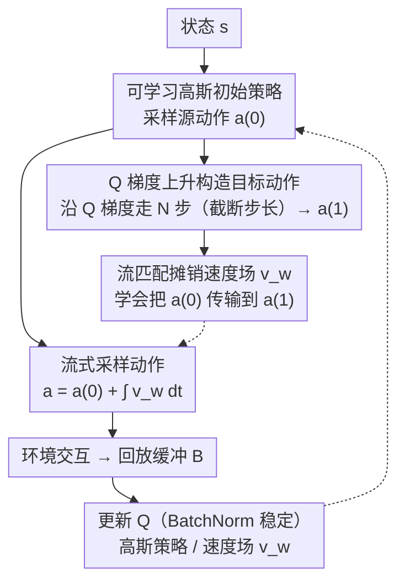

# Scalable Exploration for High-Dimensional Continuous Control via Value-Guided Flow

**会议**: ICLR 2026  
**arXiv**: [2601.19707](https://arxiv.org/abs/2601.19707)  
**领域**: 强化学习/高维控制  
**关键词**: 高维控制, 价值引导流, 概率流探索, 肌骨模型, actor-critic

## 一句话总结

提出Qflex(Q-guided Flow Exploration)——在高维连续动作空间中实现可扩展探索的RL方法：从可学习源分布沿Q函数诱导的概率流传输动作→探索与任务相关梯度对齐(而非各向同性噪声)→在多种高维基准上超越高斯/扩散RL基线,成功控制700执行器的全身人体肌骨模型执行敏捷复杂动作。

## 研究背景与动机

**领域现状**：高维动力系统控制(全身肌骨/多腿机器人)→RL的核心挑战。动作空间可达数百维→标准高斯探索急剧失效。

**现有痛点**：
   - (1) 高斯噪声探索→维度增长→覆盖率指数级下降→样本效率骤降
   - (2) 降维方法(DynSyn/DEP-RL)→限制策略表达力→牺牲灵活性
   - (3) 扩散/流策略→用于多模态→但isotropic初始分布→高维仍低效
   - (4) 700个肌肉执行器→远超现有方法的成功应用范围

**切入角度**：Q函数引导的概率流→使探索对齐任务相关方向→保持高维原始空间。

## 方法详解

### 整体框架

Qflex（Q-guided Flow Exploration）整体仍套在标准 actor-critic 里：critic 学一个状态-动作价值函数 $Q_\phi(s,a)$，策略负责产生动作去交互、收集经验。区别全在"策略怎么出动作"。它不再像 SAC 那样直接对高斯均值加各向同性噪声，而是把动作建成一条**概率流**：先从一个可学习的高斯初始策略 $\pi^{(0)}_\theta$ 采一个源动作 $a^{(0)}$，再沿一个学到的速度场 $v_w$ 把它"传输"成最终动作 $a = a^{(0)} + \int_0^1 v_w(t,s,a^{(t)})\,dt$。

这个速度场不是凭空学的，而是被训练去模仿一个**有明确方向的目标传输**：训练时从 $a^{(0)}$ 出发，沿 critic 的 Q 梯度 $\nabla_a Q$ 做 $N$ 步上升，得到落在高价值区的目标动作 $a^{(1)}$，然后用流匹配（flow matching）让 $v_w$ 学会把 $a^{(0)}$ 搬到 $a^{(1)}$。论文进一步证明，沿 Q 梯度的这条流是一次合法的策略提升（policy improvement），所以"探索"本身就朝着回报增长的方向走——而不是在 700 维空间里盲目撒噪声。

### 关键设计

**1. Q 引导的概率流：把探索变成有方向、可证明提升的传输**

高维连续控制的根本困境是绝大多数动作扰动方向都没用——以平面运动链为例，关节角加各向同性噪声时末端位置方差只按 $O(1/|\mathcal{A}|)$ 衰减，动作维度一上百，高斯探索的有效覆盖率就坍塌，样本效率随之骤降。Qflex 的破局点是给探索"指方向"：定义一条由 Q 函数诱导的速度场 $v_Q^{(t)}(a;s) = M\nabla_a Q^{\pi_{\text{old}}}(s,a)$（$M$ 是任意正定预条件矩阵，论文取单位阵 $I$，即动作空间里的最速上升），沿它把初始策略 $\pi^{(0)}$ 传输向更优策略。论文用 Proposition 1 给出保证：在 $Q$ 可微、梯度局部 Lipschitz 等温和条件下，传输过程中 $\pi^{(t)}$ 相对 $\pi^{(0)}$ 的价值优势 $F(t;s)$ 单调不减（$\frac{d}{dt}F(t;s)\ge 0$）。这把"沿 Q 梯度探索"从启发式升级为有策略提升保证的机制——每多走一步流，期望回报不会变差，探索预算因此集中到真正有用的子空间。

**2. Q 梯度上升 + 截断步长构造目标动作**

理论上的速度场需要真实的 $\nabla_a Q$，Qflex 在训练时直接把它具象成动作上的有限步梯度上升：从高斯源 $a^{(0)}$ 出发，对可微的 $Q_\phi$ 做 $N$ 步 $a^{(n/N)} \leftarrow a^{(n-1/N)} + \bar\eta\,\nabla_a Q_\phi(s,a^{(n-1/N)})$，把得到的 $a^{(1)}$ 当作目标分布 $\pi^{(1)}$ 的样本。难点在于 Q 网络在合法动作域 $[-1,1]^{|\mathcal{A}|}$ 之外梯度往往失常，固定步长会把动作推出边界、训练发散。为此每步步长被按动作空间的 $\ell_2$ 直径截断：$\bar\eta = \min\!\big(\eta,\,\frac{2\sqrt{|\mathcal{A}|}}{\|\nabla_a Q_\phi\|}\big)$，从而限制单步位移、保证传输停在合法、稳定的范围内。

**3. 流匹配摊销速度场，配可学习高斯源**

如果每次采动作都现算 $N$ 步 Q 梯度，开销大且依赖 Q 在边界外的行为。Qflex 改用流匹配把这条传输**摊销**进一个神经速度场 $v_w$：以高斯源 $a^{(0)}$ 为起点、Q 上升得到的 $a^{(1)}$ 为终点，指定最优传输（OT）的条件路径 $a^{(t)} = (1-t)a^{(0)} + t\,a^{(1)}$、目标速度 $v^{(t)} = a^{(1)} - a^{(0)}$，回归训练 $v_w$ 去拟合它。这样推理时只需从可学习的高斯初始策略 $\pi^{(0)}_\theta$ 采样、再积分 $v_w$ 即可得到动作（式 13），无需在线反复求 Q 梯度。源分布本身也是可学习的高斯策略、随策略提升一起更新，让起点就偏向任务相关区域，缩短了到高价值目标动作的传输距离。此外 critic 内用批归一化（batch normalization）稳定训练，从而能去掉目标 Q 网络、用更低的 update-to-data 比例，进一步提效。

## 实验关键数据

### 高维基准(MuJoCo/Isaac)

| 环境 | 动作维度 | Qflex vs SAC | vs 扩散 |
|------|---------|-------------|---------|
| Humanoid | ~23 | +15% | +10% |
| 高维变体 | ~100 | +30% | +20% |
| **全身肌骨** | **700** | **成功(SAC失败)** | **成功(扩散失败)** |

### 全身肌骨控制

- 600+肌肉→700维动作空间
- 复杂运动(跑/跳/转)→Qflex成功→基线全部失败
- 无降维→保持全部灵活性

### 关键发现

- Q引导→高维探索非常有效→因为绝大多数方向是无用的→Q引导聚焦有用方向
- 可学习源分布→比固定高斯好→初始分布也carrying information
- 维度越高→Qflex vs 基线差距越大→验证了可扩展性

## 亮点与洞察

- **"700维的'不可能'任务"**：之前没有RL方法在700+维连续空间成功→Qflex突破了这个barrier。
- **"Q函数=探索指南针"**：不是随机试→而是按Q引导方向试→每次探索都有方向。
- **保持原始空间的价值**：降维→牺牲灵活性→可能错过最优解→Qflex证明保持全维度是值得的。
- **生物启发**：人类肌骨控制→大脑通过value-like信号引导探索→Qflex的流与此类似。

## 局限与展望

- **依赖 critic 质量**：整条流的方向完全由学到的 $Q_\phi$ 决定，Q 估计不准时探索方向会被带偏；论文靠批归一化稳定 Q、并截断梯度步长缓解，但本质上探索效率与 critic 的准确度强绑定。
- **预条件矩阵未充分挖掘**：速度场 $M\nabla_a Q$ 中 $M$ 可取任意正定矩阵，论文只用了单位阵（最速上升），换用更贴合动作几何的 $M$（如 Fisher/曲率信息）可能进一步提升方向质量，留作后续。
- **可扩展性已验证、外推待证**：700 执行器肌骨控制是强证据，但作者也指出该机制可干净地嵌入各类 online RL 框架与探索设定，迁移到更多高维任务（多指灵巧手、群体控制等）仍有待检验。

## 相关工作与启发

- **vs DynSyn**: 本文在此基础上提出了不同的技术路线，在关键指标上取得了改进。

## 评分

- 新颖性: ⭐⭐⭐⭐⭐ Q引导概率流探索的首次提出+700维成功
- 实验充分度: ⭐⭐⭐⭐⭐ 多维度基准+全身肌骨+与多种基线对比
- 写作质量: ⭐⭐⭐⭐ 方法动机清晰
- 价值: ⭐⭐⭐⭐⭐ 对高维RL有根本性突破

<!-- RELATED:START -->

## 相关论文

- [\[CVPR 2026\] FM-Steer: Enhance Generalist Policies with Value-Guided Cascaded Denoising](../../CVPR2026/robotics/fm-steer_enhance_generalist_policies_with_value-guided_cascaded_denoising.md)
- [\[AAAI 2026\] Test-driven Reinforcement Learning in Continuous Control](../../AAAI2026/robotics/test-driven_reinforcement_learning_in_continuous_control.md)
- [\[CVPR 2026\] CoMo: Learning Continuous Latent Motion from Internet Videos for Scalable Robot Learning](../../CVPR2026/robotics/como_learning_continuous_latent_motion_from_internet_videos_for_scalable_robot_l.md)
- [\[AAAI 2026\] Affordance-Guided Coarse-to-Fine Exploration for Base Placement in Open-Vocabulary Mobile Manipulation](../../AAAI2026/robotics/affordance-guided_coarse-to-fine_exploration_for_base_placem.md)
- [\[ICLR 2026\] Distributionally Robust Cooperative Multi-Agent Reinforcement Learning via Robust Value Factorization](distributionally_robust_cooperative_multi-agent_reinforcement_learning_via_robus.md)

<!-- RELATED:END -->
