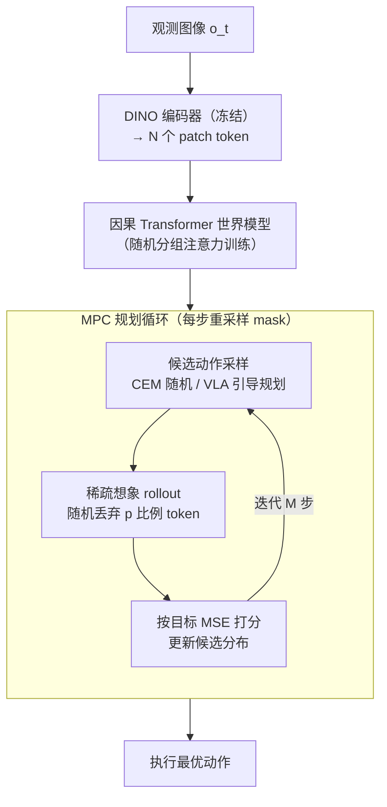

# Sparse Imagination for Efficient Visual World Model Planning

**会议**: ICLR 2026  
**arXiv**: [2506.01392](https://arxiv.org/abs/2506.01392)  
**代码**: 无（基于 DINO-WM 框架）  
**领域**: 机器人  
**关键词**: world model, sparse tokens, MPC, DINO, VLA, token dropout, planning efficiency

## 一句话总结
提出 Sparse Imagination，在基于 ViT patch token 的世界模型规划中通过随机丢弃 token 和随机分组注意力训练实现大幅推理加速（50% 丢弃率可减少约 50% 规划时间），同时保持甚至在某些任务上超越全量 token 的规划性能。关键发现是简单随机丢弃优于复杂的 token 选择方法，原因是静态重要性排序在动态规划场景中存在"盲点问题"。

## 背景与动机

**领域现状**：基于世界模型的规划通过"想象"未来轨迹来做决策，已在复杂控制任务上显著提升表现。其中 DINO-WM（Zhou et al. 2024）这类方法用 ViT patch token（DINO 特征）而非单一 CLS token 或像素来表示视觉状态，保留了精细的空间信息，在精细操作任务上优势明显。

**核心痛点**：模型预测控制（MPC，Model Predictive Control）每个规划步都要对大量候选轨迹反复跑世界模型——开销为 $K \times M \times H$ 次前向传播，且随 token 数量二次增长。全量 patch token 虽然信息丰富，但这种二次开销让实时部署几乎不可能，在机器人这类计算资源严重受限的嵌入式场景尤为致命。

**研究矛盾**：一边是 patch token 带来的空间精度，一边是它带来的高昂算力——既想保留细粒度视觉世界模型的优势，又想把规划算力压下来。所幸 ViT 表示存在已知的冗余性（Raghu et al.、Pan et al.、Kim et al. 等多项工作证明并非所有 patch 对下游任务同等重要），这给"砍 token"留出了空间。

**已有方案的不足**：现有 token 缩减方法（注意力排序、学习式选择、token 合并、训练时 dropout）大多在分类等**静态**任务上验证有效，但在 MPC 这种**迭代动态**的规划场景里从未被检验——而本文恰恰发现静态场景的结论在规划里会失效。

## 方法（框架/设计）

### 整体框架

这篇论文要解决的是「ViT patch token 世界模型规划太慢」的问题。整套流程是：一个权重冻结的预训练 DINO 编码器把每帧图像编成 patch token $z_t \in \mathbb{R}^{H_p \times W_p \times D}$（共 $N=H_p\times W_p$ 个 token），随后一个因果 Transformer 世界模型在 token 空间逐步预测未来状态，训练目标是逐 token 的 MSE 预测损失 $\mathcal{L}_{wm} = \frac{1}{N}\sum_{i=1}^N \|\hat{z}_{t+1,i} - z_{t+1,i}\|^2$。规划阶段用 MPC：每步采一批候选动作序列，让世界模型 rollout 想象未来，再按到目标状态的 MSE 打分择优。本文的核心改造有三处——世界模型训练时用**随机分组注意力**让它适应残缺输入；规划时用 **Sparse Imagination**（每步随机丢掉一部分 token）把想象算力砍半；长时程任务再用 **VLA 引导规划**把候选采样交给预训练策略。

### 关键设计

**1. Sparse Imagination：用随机丢弃直接削掉一半想象开销**

MPC 的计算瓶颈在于每个规划步都要对 $K$ 条候选轨迹、$M$ 轮 CEM 优化、$H$ 步时域反复跑世界模型，而注意力开销随 token 数二次增长。本文不做任何复杂的 token 选择，只是在推理阶段以比例 $p$ 随机生成丢弃掩码，仅保留随机采样的 $(1-p)N$ 个 token 喂进世界模型 rollout，$p=0.5$ 时规划时间几乎对半下降。关键发现是这种朴素随机采样反而优于注意力排序、学习排序等"聪明"方法：静态重要性度量在 MPC 的迭代优化里存在"盲点"——某个 patch 在当前状态看似无关紧要，但在评估某条候选动作序列时却可能变得关键；而每步重新独立采样掩码带来的无偏覆盖，恰好避免了静态排序的系统性遗漏。即使某一步因丢掉关键特征而走偏，下一步重采样也能纠回来，所以 $p$ 在 10–50% 区间几乎不掉点、超过 70% 才明显退化。

**2. 随机分组注意力训练：让模型学会在任意 token 子集上预测**

如果世界模型训练时只见过全量 token，推理时突然抽走一半会严重失配（消融显示 PushT 在 50% 丢弃下从 70% 掉到 35%）。为此训练时把每帧的 patch token 随机切成两组，在 Transformer 各层用注意力掩码限制交互只发生在同组内、同时保持时间维度上的因果对齐，等于让模型反复在残缺视野下学习预测动力学。这样推理阶段无论丢掉哪些 token、丢多少，模型都能稳定外推——分组注意力因此是 Sparse Imagination 能成立的必要前提而非可选项（消融证实「只在推理稀疏、训练不稀疏」会崩）。

**3. VLA 引导规划：把长时程的候选采样交给预训练策略**

对长时程任务（LIBERO、Meta-World、真实机器人），CEM 在动作空间里盲目随机采样既慢又难命中有效轨迹。这里改为从预训练的 VLA（Vision-Language-Action）策略采样 $K$ 条候选动作序列来替代 CEM 的随机采样，再让稀疏世界模型快速评估打分、择优执行。VLA 提供的动作先验把候选集中到合理区域，与稀疏想象的廉价评估叠加后，长时程任务上既提了约 4–7% 成功率又省了约 40% 计算。

## 实验关键数据

### 主实验

| 环境 | Full (p=0) | Drop 30% | Drop 50% | CLS-token | 说明 |
|------|-----------|---------|---------|-----------|------|
| Pointmaze | 98.3% | 98.3% | **100%** | 96.7% | 稀疏反超全量 |
| Wall | 91.7% | 93.3% | 95.0% | 85.0% | 稀疏优于全量 |
| PushT | 75.0% | 61.7% | 70.0% | 43.3% | 50% drop 接近全量 |
| Granular | 75.0% | **85.0%** | 60.0% | 20.0% | 30% drop 反超 |
| Rope | 63.3% | 70.0% | 73.3% | 36.7% | 稀疏显著优于 CLS |
| Block Push | 22.0% | 18.0% | 20.0% | 16.0% | 困难任务差距较小 |

### 消融实验

| 任务 | Full | Drop 50% | VLA-only | 时间(Full→Drop) |
|------|------|---------|---------|----------------|
| PickPlace (真实) | - | **80%** | 60% | 19.1s→10.4s |
| Drawer (真实) | - | **70%** | 60% | 14.0s→10.6s |
| LIBERO-10 | 34% | 33% | 29% | 53.4s→29.7s |
| Meta-World | 48.8% | 47.7% | 42.7% | 3.63s→2.37s |

### 规划时间加速

| 环境 | Full 时间 | Drop 50% 时间 | 加速比 |
|------|----------|-------------|--------|
| PushT | 173s/iter | 82s/iter | **52.6%** |
| Pointmaze | 184s/iter | 102s/iter | **44.6%** |
| Block Push | 297s/iter | 161s/iter | **45.8%** |

## 亮点与洞察
- 极其简洁优雅：仅通过随机 dropout 即实现大幅加速，无需额外模型
- "盲点问题"分析深刻——解释了为何复杂 token 选择不如随机采样
- 通用性强：从简单轨迹优化到 VLA 引导规划到真实机器人均验证有效
- 训练阶段的分组注意力策略可无缝嵌入任何 Transformer 世界模型

## 消融实验与深入分析

| 消融/分析 | 结果 |
|-----------|------|
| 有 vs 无分组注意力训练 | 无分组注意力在 50% drop 时严重退化（PushT 从 70→35%），分组注意力是必要条件 |
| 随机 vs 注意力排序 vs 学习排序 | 随机采样在多数任务上竞争性或更优——"盲点问题"使静态排序失效 |
| Drop ratio 甜蜜点 | 10-50% 为最佳区间，>70% 明显退化 |
| VLA 引导 vs CEM 随机采样 | 长时程任务中 VLA 引导提升 ~4-7%，计算开销降低 ~40% |
| 仅训练阶段稀疏 vs 仅推理阶段稀疏 | 两者都需要：训练稀疏确保模型适应，推理稀疏提供加速 |

### "盲点问题"深入分析
- 静态重要性度量（如注意力权重、CLS token 相关性）在 MPC 的迭代优化过程中会产生系统性盲点
- 具体地：某些 patch 在当前状态下看似不重要，但在对候选动作序列评估时可能变得关键
- 随机采样通过无偏覆盖避免了系统性遗漏——每次迭代重新采样 mask 确保所有区域都有被覆盖的概率
- 这一发现与 token 剪枝文献中"学习选择优于随机"的常见结论相反，说明规划场景有其特殊性

## 局限与展望
- 最佳 drop ratio 需要根据任务手动选择，缺乏自适应机制——一个可能的改进是根据任务复杂度或当前状态动态调整
- 分组数固定为 2，未探索更多分组（如 3-4 组）的效果
- 依赖 DINO 特征的冗余性假设，对信息密集场景（如文本密集界面）可能不成立
- 真实世界验证仅限于两个较简单任务（PickPlace + Drawer），更复杂的操作任务未测试
- 未与 token 合并方法（如 ToMe）结合——稀疏选择+合并可能进一步提升效率

## 相关工作与启发
- **vs Dreamer 系列 (Hafner et al.)**：Dreamer 在低维向量潜在空间想象，本文在高维 patch token 空间想象——保留了更丰富的空间信息但计算更贵，稀疏想象正好弥补这一差距
- **vs DINO-WM (Zhou et al. 2024)**：本文直接构建在 DINO-WM 之上，用 sparse imagination 解决其计算瓶颈
- **vs ToMe (Bolya et al.)**：ToMe 通过 token 合并减少计算，本文通过 token 丢弃——设计更简单且不需要额外的合并逻辑
- **vs SmolVLA (Shukor et al.)**：SmolVLA 提供预训练策略用于引导规划，本文的稀疏想象加速了 VLA 引导的世界模型评估
- **启发**：稀疏想象的思路可推广到其他需要大量前向传播的场景——如 MCTS 搜索中的价值网络评估、多步推理中的 world simulation

## 评分
- 新颖性: ⭐⭐⭐⭐ 简单但有效的洞察，盲点问题分析有独特价值
- 实验充分度: ⭐⭐⭐⭐⭐ 8 个仿真+2 个真实任务，多方法对比，消融充分
- 写作质量: ⭐⭐⭐⭐ 逻辑清晰，图表精美，方法图示直观
- 价值: ⭐⭐⭐⭐ 实用贡献，可直接集成到任何基于 Transformer 的世界模型流水线中

<!-- RELATED:START -->

## 相关论文

- [\[CVPR 2026\] ForeAct: Steering Your VLA with Efficient Visual Foresight Planning](../../CVPR2026/robotics/foreact_steering_your_vla_with_efficient_visual_foresight_planning.md)
- [\[CVPR 2026\] Chain of World: World Model Thinking in Latent Motion (CoWVLA)](../../CVPR2026/robotics/chain_of_world_world_model_thinking_in_latent_motion.md)
- [\[ICLR 2026\] Visual Planning: Let's Think Only with Images](visual_planning_lets_think_only_with_images.md)
- [\[ICML 2026\] Dual-Stream Diffusion for World-Model Augmented Vision-Language-Action Model](../../ICML2026/robotics/dual-stream_diffusion_for_world-model_augmented_vision-language-action_model.md)
- [\[CVPR 2026\] GeniNav: Generative Model Driven Image-Goal Navigation via Imagination-Guided Consistency Flow Matching](../../CVPR2026/robotics/geninav_generative_model_driven_image-goal_navigation_via_imagination-guided_con.md)

<!-- RELATED:END -->
